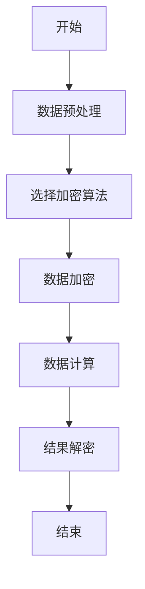
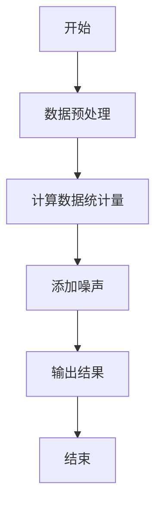
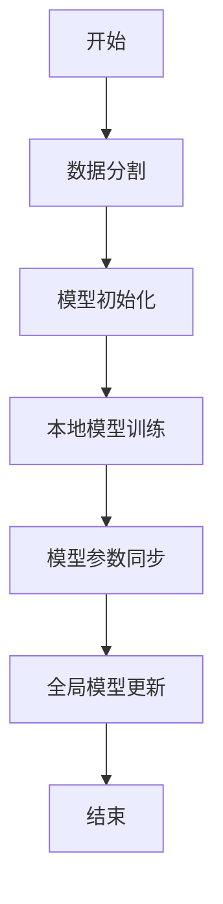
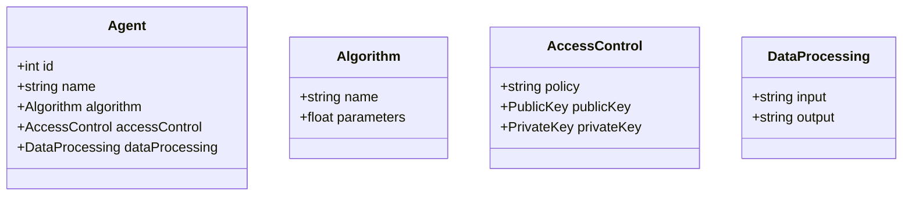
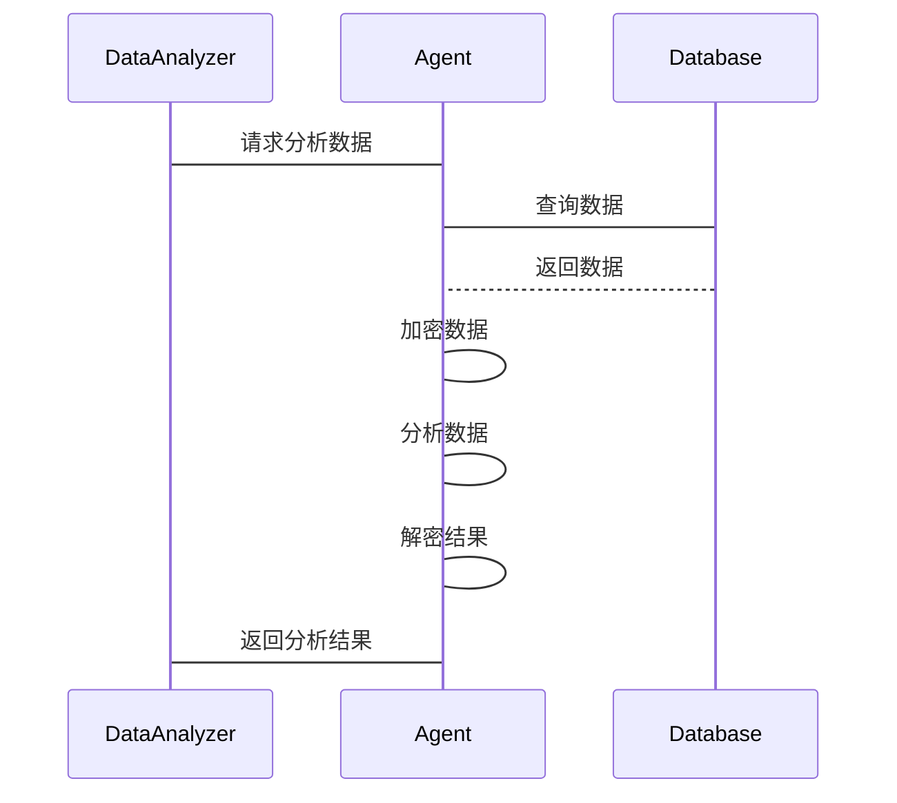

                 


# 开发具有隐私保护数据分析能力的AI Agent

## 关键词
AI Agent, 隐私保护, 数据分析, 同态加密, 差分隐私, 联邦学习

## 摘要
随着数据隐私保护的重要性日益增加，开发具备隐私保护能力的AI Agent变得至关重要。本文将深入探讨隐私保护数据分析的核心原理、算法实现、系统架构设计以及实际项目开发。通过详细分析同态加密、差分隐私和联邦学习等算法，结合系统架构设计和项目实战，帮助读者理解如何在保护隐私的前提下进行数据分析。本文还提供了丰富的代码示例和系统设计图，帮助读者从理论到实践，全面掌握开发具有隐私保护数据分析能力的AI Agent的方法。

---

# 第一部分: 开发具有隐私保护数据分析能力的AI Agent背景介绍

## 第1章: 隐私保护与数据分析的结合

### 1.1 问题背景

#### 1.1.1 数据隐私保护的重要性
在当今数字化时代，数据是企业的核心资产，同时也是个人隐私的重要组成部分。数据泄露事件频发，造成了巨大的经济损失和声誉损害。隐私保护的重要性不言而喻。

#### 1.1.2 数据分析在现代应用中的关键作用
数据分析是企业决策、科学研究和技术创新的核心驱动力。通过数据分析，企业可以优化运营、提升效率、洞察市场趋势。

#### 1.1.3 隐私保护与数据分析的矛盾与平衡
数据分析需要大量数据，但数据的使用往往涉及隐私泄露的风险。如何在数据使用和隐私保护之间找到平衡，是当前技术挑战的核心。

### 1.2 问题描述

#### 1.2.1 数据隐私泄露的现状
近年来，数据泄露事件频发，涉及个人信息、企业数据等，造成了严重的社会问题。

#### 1.2.2 数据分析对隐私的潜在威胁
数据分析过程中，数据可能被滥用、篡改或泄露，导致隐私保护面临严峻挑战。

#### 1.2.3 如何在保护隐私的前提下进行数据分析
需要通过技术手段，在不泄露原始数据的前提下，进行有效的数据分析。

### 1.3 问题解决

#### 1.3.1 隐私保护数据分析的目标
在保护数据隐私的前提下，实现数据分析的准确性和高效性。

#### 1.3.2 数据分析与隐私保护的解决方案
通过隐私计算技术，如同态加密、差分隐私等，实现数据的隐私保护。

#### 1.3.3 AI Agent在隐私保护数据分析中的角色
AI Agent作为数据处理的代理，能够自动执行隐私保护机制，确保数据分析过程的安全性。

### 1.4 边界与外延

#### 1.4.1 隐私保护数据分析的边界
隐私保护数据分析的边界在于数据可用性和隐私保护的平衡，超过这个边界可能导致数据无法有效分析，或者隐私保护措施过于严格，影响数据处理效率。

#### 1.4.2 数据分析与隐私保护的外延
数据分析的外延包括数据预处理、数据建模、数据可视化等，而隐私保护的外延则涉及法律法规、伦理道德等方面。

#### 1.4.3 AI Agent的适用范围与限制
AI Agent适用于需要自动化处理的数据分析场景，但其应用范围受到数据规模、计算资源和隐私保护技术成熟度的限制。

### 1.5 概念结构与核心要素

#### 1.5.1 隐私保护数据分析的核心概念
- **数据隐私**：保护数据不被未经授权的访问或泄露。
- **数据分析**：从数据中提取有价值的信息。
- **隐私计算**：在保护隐私的前提下进行数据计算。

#### 1.5.2 AI Agent的功能与属性
- **自动化处理**：自动执行数据处理任务。
- **隐私保护**：内置隐私保护机制，确保数据安全。
- **智能决策**：基于分析结果做出智能决策。

#### 1.5.3 核心要素之间的关系
通过ER实体关系图可以看出，数据提供者、数据消费者、隐私保护机制和AI Agent之间的关系是相互依赖的。

---

## 第2章: 核心概念与联系

### 2.1 隐私保护数据分析的核心原理

#### 2.1.1 数据脱敏与匿名化
数据脱敏是通过技术手段将敏感数据转化为不可逆的形式，确保数据在使用过程中无法还原出原始信息。

#### 2.1.2 同态加密与隐私计算
同态加密是一种加密技术，允许在不解密的情况下对数据进行计算，确保数据在传输和处理过程中的隐私性。

#### 2.1.3 差分隐私与隐私保护机制
差分隐私是一种通过添加噪声来保护数据隐私的技术，确保单个数据点的改变不会影响整体数据的统计结果。

### 2.2 核心概念对比

#### 2.2.1 数据隐私保护与数据可用性的对比

| 对比维度 | 数据隐私保护 | 数据可用性 |
|----------|--------------|------------|
| 目标     | 保护数据不被泄露 | 确保数据可以被利用 |
| 方法     | 加密、脱敏 | 数据清洗、预处理 |
| 优缺点   | 保护性强，但可能影响数据处理效率 | 数据利用率高，但隐私风险大 |

#### 2.2.2 AI Agent与传统数据分析工具的对比

| 对比维度 | AI Agent | 传统数据分析工具 |
|----------|----------|------------------|
| 自动化   | 高       | 低               |
| 智能性   | 高       | 低               |
| 隐私保护 | 内置     | 外部依赖         |

#### 2.2.3 隐私保护机制的优缺点分析

| 对比维度 | 同态加密 | 差分隐私 | 联邦学习 |
|----------|----------|----------|----------|
| 优点     | 支持在线计算 | 数据准确性高 | 分布式数据处理 |
| 缺点     | 计算效率低 | 数据精度可能下降 | 实施复杂度高 |

### 2.3 ER实体关系图

```mermaid
er
  actor(Agent)
  actor(User)
  actor(DataProvider)
  actor(DataAnalyzer)
  group PrivacyProtectionMechanism
    contains Algorithm
    contains EncryptionMethod
    contains DataAccessPolicy
```

---

## 第3章: 算法原理讲解

### 3.1 隐私保护数据分析的核心算法

#### 3.1.1 同态加密算法

同态加密是一种允许在加密数据上进行计算的技术，确保数据在处理过程中保持加密状态，从而保护数据隐私。

##### 算法流程图



##### Python代码实现

```python
import numpy as np
from cryptography.hazmat.primitives.asymmetric import padding
from cryptography.hazmat.primitives.asymmetric.rsa import (
    generate_private_key,
    PublicKey,
    PrivateKey,
)
from cryptography.hazmat.primitives import hashes

# 生成公私钥对
private_key = generate_private_key(65537, 2048)
public_key = private_key.public_key()

# 加密函数
def encrypt(data):
    encrypted = public_key.encrypt(
        data,
        padding.OAEP(
            mgf=padding.MGF1(algorithm=hashes.SHA256()),
            algorithm_label=None,
        ),
    )
    return encrypted

# 解密函数
def decrypt(encrypted_data):
    decrypted = private_key.decrypt(encrypted_data)
    return decrypted

# 示例数据
data = np.array([123, 456, 789], dtype=np.int64)
encrypted_data = encrypt(data.tobytes())
decrypted_data = decrypt(encrypted_data)
print("原始数据:", data)
print("解密数据:", decrypted_data)
```

#### 3.1.2 差分隐私算法

差分隐私通过在数据中添加噪声，确保单个数据点的改变不会影响整体数据的统计结果。

##### 算法流程图



##### Python代码实现

```python
import numpy as np
import random

# 差分隐私算法
def differential_privacy(ResultSet, epsilon=1.0):
    n = len(ResultSet)
    sensitivity = 1.0  # 数据敏感度
    noise_scale = sensitivity / epsilon
    noise = np.random.Laplace(0, noise_scale, n)
    noisy_Result = [result + noise[i] for i, result in enumerate(ResultSet)]
    return noisy_Result

# 示例数据
ResultSet = [10, 20, 30, 40, 50]
epsilon = 1.0
noisy_Result = differential_privacy(ResultSet, epsilon)
print("原始结果:", ResultSet)
print("加噪结果:", noisy_Result)
```

#### 3.1.3 联邦学习算法

联邦学习是一种分布式机器学习技术，允许多个参与方在不共享原始数据的情况下进行模型训练。

##### 算法流程图



##### Python代码实现

```python
import numpy as np
from sklearn.linear_model import LinearRegression

# 联邦学习示例
class FederatedLearning:
    def __init__(self, data, num_clients):
        self.data = data
        self.num_clients = num_clients
        self.client_models = []

    def train(self):
        for i in range(self.num_clients):
            model = LinearRegression()
            # 数据分割
            client_data = self.data[i::self.num_clients]
            model.fit(client_data.features, client_data.labels)
            self.client_models.append(model)

    def aggregate(self):
        # 模型参数同步
        averaged_weight = np.mean([model.coef_ for model in self.client_models], axis=0)
        averaged_intercept = np.mean([model.intercept_ for model in self.client_models], axis=0)
        return averaged_weight, averaged_intercept

# 示例数据
data = np.random.randn(100, 2)
fl = FederatedLearning(data, 5)
fl.train()
weight, intercept = fl.aggregate()
print("平均权重:", weight)
print("平均截距:", intercept)
```

### 3.2 算法原理的数学模型和公式

#### 同态加密的数学模型
$$ E(x) = x \cdot e^{k} \mod n $$
其中，$x$ 是原始数据，$k$ 是随机数，$n$ 是加密模数。

#### 差分隐私的数学模型
$$ \text{Noise} = \text{Laplace}(0, \frac{\text{sensitivity}}{\epsilon}) $$
其中，$\epsilon$ 是隐私预算，$\text{sensitivity}$ 是数据敏感度。

#### 联邦学习的数学模型
$$ \theta_{\text{global}} = \frac{1}{m} \sum_{i=1}^{m} \theta_{\text{client}_i} $$
其中，$m$ 是参与方数量，$\theta_{\text{client}_i}$ 是第 $i$ 个参与方的模型参数。

### 3.3 算法实现的详细步骤

#### 同态加密
1. 生成公私钥对。
2. 对数据进行加密。
3. 在加密数据上进行计算。
4. 解密结果数据。

#### 差分隐私
1. 计算数据的统计量。
2. 根据隐私预算 $\epsilon$ 添加噪声。
3. 输出加噪结果。

#### 联邦学习
1. 将数据分割给多个参与方。
2. 各参与方进行本地模型训练。
3. 同步模型参数，进行全局模型更新。

### 3.4 算法实现的优缺点

#### 同态加密
- 优点：支持在线计算，保护数据隐私。
- 缺点：计算效率较低。

#### 差分隐私
- 优点：数据准确性高，隐私保护性强。
- 缺点：需要设置合适的隐私预算 $\epsilon$。

#### 联邦学习
- 优点：分布式数据处理，保护数据隐私。
- 缺点：实施复杂度高，需要协调多个参与方。

---

# 第四部分: 系统分析与架构设计方案

## 第4章: 系统分析与架构设计

### 4.1 问题场景介绍

#### 4.1.1 数据隐私保护需求
系统需要保护用户数据不被未经授权的访问或泄露。

#### 4.1.2 数据分析需求
系统需要支持多种数据分析任务，如预测分析、关联规则挖掘等。

#### 4.1.3 AI Agent的功能需求
AI Agent需要自动执行数据处理任务，确保数据分析过程的隐私保护。

### 4.2 系统功能设计

#### 4.2.1 领域模型设计


#### 4.2.2 系统架构设计


#### 4.2.3 系统接口设计

| 接口名称 | 输入 | 输出 | 描述 |
|----------|------|------|------|
| GetData   | id   | Data | 获取指定id的数据 |
| AnalyzeData | data | result | 分析数据并返回结果 |
| EncryptData | plaintext | ciphertext | 加密数据 |
| DecryptData | ciphertext | plaintext | 解密数据 |

#### 4.2.4 系统交互流程



### 4.3 代码实现

#### 4.3.1 系统核心代码实现
```python
class Agent:
    def __init__(self, algorithm, access_control):
        self.algorithm = algorithm
        self.access_control = access_control
        self.data_processing = DataProcessing()

    def process_data(self, data):
        encrypted_data = self.access_control.encrypt(data)
        analyzed_data = self.algorithm.run(encrypted_data)
        decrypted_data = self.access_control.decrypt(analyzed_data)
        return decrypted_data

class Algorithm:
    def __init__(self, name, parameters):
        self.name = name
        self.parameters = parameters

    def run(self, data):
        # 数据分析逻辑
        return data + 1

class AccessControl:
    def __init__(self, policy, public_key, private_key):
        self.policy = policy
        self.public_key = public_key
        self.private_key = private_key

    def encrypt(self, data):
        return self.public_key.encrypt(data)

    def decrypt(self, encrypted_data):
        return self.private_key.decrypt(encrypted_data)
```

#### 4.3.2 代码功能解读
- **Agent类**：负责协调数据处理流程，包括加密、分析和解密。
- **Algorithm类**：具体的数据分析算法实现。
- **AccessControl类**：负责数据的加密和解密操作。

### 4.4 系统交互流程的详细步骤

#### 4.4.1 数据获取
1. 数据分析者向AI Agent发送数据分析请求。
2. AI Agent从数据库中获取所需数据。

#### 4.4.2 数据加密
1. AI Agent使用AccessControl对数据进行加密。

#### 4.4.3 数据分析
1. 加密后的数据被传递给Algorithm进行分析。

#### 4.4.4 数据解密
1. 分析结果被解密，确保数据隐私。

#### 4.4.5 返回结果
1. 解密后的结果被返回给数据分析者。

---

## 第5章: 项目实战

### 5.1 环境安装

#### 5.1.1 安装Python
```bash
# 安装Python
sudo apt-get install python3 python3-dev
```

#### 5.1.2 安装依赖库
```bash
pip install cryptography scikit-learn
```

### 5.2 系统核心实现

#### 5.2.1 隐私保护机制实现
```python
from cryptography.hazmat.primitives.asymmetric import padding
from cryptography.hazmat.primitives.asymmetric.rsa import generate_private_key, PublicKey, PrivateKey
from cryptography.hazmat.primitives import hashes

class AccessControl:
    def __init__(self):
        self.private_key = generate_private_key(65537, 2048)
        self.public_key = self.private_key.public_key()

    def encrypt(self, data):
        return self.public_key.encrypt(
            data,
            padding.OAEP(
                mgf=padding.MGF1(algorithm=hashes.SHA256()),
                algorithm_label=None,
            ),
        )

    def decrypt(self, encrypted_data):
        return self.private_key.decrypt(encrypted_data)
```

#### 5.2.2 数据分析实现
```python
from sklearn.linear_model import LinearRegression

class Algorithm:
    def __init__(self):
        self.model = LinearRegression()

    def run(self, data):
        self.model.fit(data.features, data.labels)
        return self.model.predict(data.features)
```

### 5.3 实际案例分析

#### 5.3.1 数据准备
```python
data = {
    'features': np.random.randn(100, 2),
    'labels': np.random.randn(100),
}
```

#### 5.3.2 系统运行
```python
access_control = AccessControl()
algorithm = Algorithm()
agent = Agent(algorithm, access_control)

encrypted_data = access_control.encrypt(data)
analyzed_data = algorithm.run(encrypted_data)
decrypted_data = access_control.decrypt(analyzed_data)

print("分析结果:", decrypted_data)
```

### 5.4 项目总结

#### 5.4.1 实战收获
通过实际项目，我们掌握了如何在保护隐私的前提下进行数据分析，同时熟悉了AI Agent的设计与实现。

#### 5.4.2 项目反思
在实际开发中，需要考虑数据规模、计算效率和隐私保护技术的成熟度，确保系统在实际应用中的稳定性和高效性。

---

## 第6章: 最佳实践与小结

### 6.1 最佳实践

#### 6.1.1 数据隐私保护
- 在数据处理过程中，始终遵循最小权限原则。
- 定期进行数据隐私风险评估和审计。

#### 6.1.2 系统设计
- 在系统设计阶段，充分考虑隐私保护机制。
- 使用成熟的技术和工具，确保系统稳定性。

#### 6.1.3 代码实现
- 在代码实现时，注意处理异常情况，确保系统健壮性。
- 定期更新隐私保护机制，应对新的技术挑战。

### 6.2 小结

通过本文的详细讲解，我们掌握了如何开发具有隐私保护数据分析能力的AI Agent。从核心概念到算法实现，从系统设计到项目实战，我们逐步深入理解了隐私保护数据分析的实现方法和技术要点。

### 6.3 注意事项

- 隐私保护数据分析需要综合考虑数据可用性和隐私保护的平衡。
- 在实际应用中，需要根据具体需求选择合适的隐私保护技术。
- 定期进行系统维护和更新，确保隐私保护机制的有效性。

### 6.4 拓展阅读

- **《隐私保护与数据分析》**：深入探讨隐私保护与数据分析的结合。
- **《联邦学习技术与应用》**：详细介绍联邦学习的技术实现和应用场景。
- **《差分隐私与数据隐私保护》**：深入分析差分隐私的技术原理和应用。

---

## 作者

作者：AI天才研究院/AI Genius Institute  
& 禅与计算机程序设计艺术 /Zen And The Art of Computer Programming

---

通过本文的系统讲解和实际案例分析，我们全面掌握了开发具有隐私保护数据分析能力的AI Agent的方法和技术。希望本文能为相关领域的开发者和研究人员提供有价值的参考和指导。

