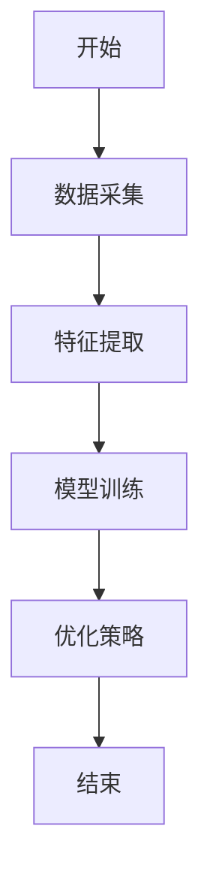
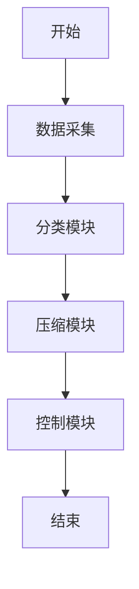
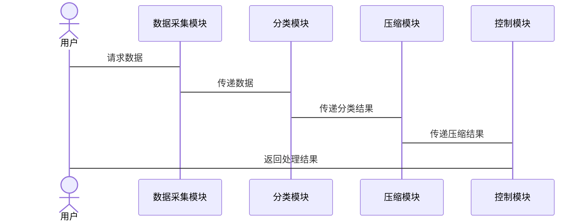

                 


# 智能垃圾处理站：AI Agent的分类与压缩

---

## 关键词：
智能垃圾处理站、AI Agent、垃圾分类、压缩算法、系统架构、深度学习

---

## 摘要：
本文探讨了AI Agent在智能垃圾处理站中的应用，重点分析了AI Agent的分类、垃圾处理站的分类与压缩流程，以及AI Agent优化算法的实现。通过详细的技术分析和实际案例，展示了AI技术如何提升垃圾处理效率和环保效果。

---

# 第1章: AI Agent与垃圾处理站概述

## 1.1 AI Agent的基本概念

### 1.1.1 AI Agent的定义
AI Agent（智能代理）是能够感知环境、自主决策并执行任务的智能系统。它通过传感器获取信息，利用算法进行分析，做出决策并执行动作。

### 1.1.2 AI Agent的核心特点
- **自主性**：无需外部干预，自主完成任务。
- **反应性**：能实时感知环境变化并做出反应。
- **学习能力**：通过数据和经验不断优化性能。
- **协作性**：能与其他系统或Agent协同工作。

### 1.1.3 AI Agent与传统自动化系统的区别
| 特性       | AI Agent                     | 传统自动化系统               |
|------------|------------------------------|------------------------------|
| 智能水平    | 高                           | 低                           |
| 学习能力    | 强                           | 无或弱                       |
| 适应性      | 强                           | 一般                         |
| 决策能力    | 自主决策                     | 预设规则                     |

---

## 1.2 垃圾处理站的基本概念

### 1.2.1 垃圾处理站的定义
垃圾处理站是负责垃圾收集、分类、压缩和处理的场所，是城市环境卫生的重要组成部分。

### 1.2.2 垃圾处理站的主要功能
- **收集**：接收居民和企业的垃圾。
- **分类**：将垃圾按可回收物、有害物等分类。
- **压缩**：减少垃圾体积，便于运输和处理。
- **处理**：对垃圾进行无害化处理或资源化利用。

### 1.2.3 垃圾处理站的分类
| 类型       | 特点                           | 应用场景                     |
|------------|--------------------------------|------------------------------|
| 综合处理站  | 处理多种垃圾类型               | 大城市核心区域               |
| 专门处理站  | 专注于某种垃圾处理             | 工业区或特定区域             |
| 转运站      | 主要负责垃圾转运               | 垃圾处理站的中转点           |

---

## 1.3 AI Agent在垃圾处理站中的应用背景

### 1.3.1 垃圾处理站的智能化需求
随着城市化进程加快，垃圾处理站需要更高效、环保的解决方案。

### 1.3.2 AI Agent在垃圾处理中的优势
- **提高效率**：AI Agent能快速分类垃圾，优化处理流程。
- **降低成本**：通过智能决策减少资源浪费。
- **环保效果**：精准分类和压缩减少环境污染。

### 1.3.3 当前垃圾处理站的痛点与挑战
- **效率低下**：人工分类速度慢，错误率高。
- **资源浪费**：垃圾未被有效利用，处理成本高。
- **环境污染**：处理不当导致二次污染。

---

## 1.4 本章小结
本章介绍了AI Agent的基本概念和垃圾处理站的功能，分析了AI Agent在垃圾处理中的应用背景及其优势，为后续章节奠定了基础。

---

# 第2章: AI Agent的分类与特性

## 2.1 AI Agent的分类

### 2.1.1 按智能水平分类
| 智能水平 | 特点                           | 应用场景                     |
|----------|--------------------------------|------------------------------|
| 单一智能  | 专注于单一任务                 | 自动化设备                   |
| 多重智能  | 能同时处理多种任务             | 复杂环境                     |
| 超级智能  | 具备超越人类的智能              | 高级机器人系统               |

### 2.1.2 按应用场景分类
| 场景       | 特点                           | 应用实例                     |
|------------|--------------------------------|------------------------------|
| 工业领域     | 用于生产过程优化               | 工厂自动化                   |
| 城市管理     | 用于城市资源调度               | 智能交通                     |
| 家庭领域     | 用于智能家居设备               | 智能家电                     |

### 2.1.3 按数据处理方式分类
| 方式       | 特点                           | 应用实例                     |
|------------|--------------------------------|------------------------------|
| 基于规则    | 依赖预设规则进行决策            | 早期聊天机器人               |
| 基于学习    | 通过数据训练进行决策            | 当前深度学习模型             |

---

## 2.2 AI Agent的核心特性

### 2.2.1 自主性
AI Agent无需外部干预，自主完成任务。例如，自动分类垃圾并启动压缩程序。

### 2.2.2 反应性
AI Agent能实时感知环境变化并做出反应。例如，检测到异常垃圾时立即调整处理流程。

### 2.2.3 学习能力
AI Agent通过数据和经验不断优化性能。例如，深度学习模型通过大量图像训练，提高垃圾分类准确率。

### 2.2.4 协作性
AI Agent能与其他系统或Agent协同工作。例如，AI Agent与运输系统协同，优化垃圾转运路线。

---

## 2.3 AI Agent的分类对比分析

### 2.3.1 实体关系图（ER图）
```mermaid
erDiagram
    actor AI Agent {
        code : String
        type : String
        intelligenceLevel : Integer
    }
    actor Traditional System {
        code : String
        type : String
        intelligenceLevel : Integer
    }
    relation "属于" {
        AI Agent --> Traditional System
    }
```

---

## 2.4 本章小结
本章详细介绍了AI Agent的分类和特性，分析了不同分类的优缺点及其应用场景，为后续章节奠定了基础。

---

# 第3章: 垃圾处理站的分类与压缩流程

## 3.1 垃圾的分类标准

### 3.1.1 垃圾分类的基本原则
垃圾分类应遵循“减量化、资源化、无害化”的原则。

### 3.1.2 垃圾分类的常见方法
- **按材质分类**：塑料、金属、玻璃等。
- **按可回收性分类**：可回收物、不可回收物。
- **按危险性分类**：有害垃圾、一般垃圾。

### 3.1.3 垃圾分类的国际标准
国际上常用的是联合国环境规划署（UNEP）提出的分类标准。

---

## 3.2 垃圾压缩的基本原理

### 3.2.1 垃圾压缩的物理过程
垃圾压缩通过机械压力减少垃圾体积，便于运输和处理。

### 3.2.2 垃圾压缩的优化策略
- **分段压缩**：将垃圾分段压缩，提高效率。
- **智能控制**：通过AI Agent实时调整压缩力度。

### 3.2.3 垃圾压缩的环境影响
压缩垃圾减少了体积，降低了运输成本和环境污染。

---

## 3.3 垃圾处理站的分类与压缩流程优化

### 3.3.1 垃圾分类对压缩效率的影响
正确分类垃圾可以提高压缩效率，减少资源浪费。

### 3.3.2 AI Agent在垃圾分类与压缩中的作用
AI Agent通过图像识别技术，自动分类垃圾并优化压缩流程。

### 3.3.3 垃圾处理站的流程优化方案
1. **垃圾分类**：AI Agent利用深度学习模型进行分类。
2. **垃圾压缩**：智能压缩设备实时调整参数，提高效率。
3. **数据记录**：记录每批次垃圾的处理数据，优化后续流程。

---

## 3.4 本章小结
本章分析了垃圾的分类标准和压缩原理，探讨了AI Agent在垃圾处理中的优化作用，并提出了流程优化方案。

---

# 第4章: AI Agent在垃圾处理中的优化算法

## 4.1 垃圾分类算法

### 4.1.1 垃圾分类的基本算法
常用的垃圾分类算法包括支持向量机（SVM）和随机森林（Random Forest）。

### 4.1.2 基于深度学习的垃圾分类算法
- **卷积神经网络（CNN）**：用于图像分类，准确率高。
- **循环神经网络（RNN）**：用于序列数据分类，适用于视频分类。

### 4.1.3 垃圾分类算法的性能对比
| 算法       | 准确率 | 处理速度 | 实时性 |
|------------|--------|----------|--------|
| SVM        | 85%    | 中       | 较差   |
| Random Forest | 80%    | 高       | 良好   |
| CNN        | 95%    | 中       | 较差   |
| RNN        | 90%    | 低       | 良好   |

---

## 4.2 垃圾压缩算法

### 4.2.1 垃圾压缩的基本算法
- **贪心算法**：按顺序压缩，不考虑整体最优。
- **动态规划算法**：寻找最优压缩方案，但计算复杂。

### 4.2.2 基于AI的垃圾压缩优化算法
AI Agent通过实时数据优化压缩策略，例如动态调整压缩力度和速度。

### 4.2.3 垃圾压缩算法的实现步骤
1. **数据采集**：收集垃圾的物理特性。
2. **模型训练**：训练压缩模型。
3. **算法优化**：通过反馈不断优化算法。

---

## 4.3 AI Agent的优化算法实现

### 4.3.1 算法原理
AI Agent利用深度学习模型分析垃圾特征，优化压缩策略。

### 4.3.2 算法流程图


### 4.3.3 算法的数学模型与公式
垃圾压缩体积公式：
$$ V = k \times p \times t $$
其中，\( V \) 为压缩体积，\( k \) 为压缩系数，\( p \) 为压力，\( t \) 为时间。

### 4.3.4 算法实现的Python代码
```python
import numpy as np
from sklearn.svm import SVC

# 数据采集
data = np.load('garbage_data.npy')
labels = np.load('garbage_labels.npy')

# 模型训练
model = SVC()
model.fit(data, labels)

# 优化策略
def optimize_compression(data):
    # 计算压缩系数
    k = np.mean(data)
    return k
```

---

## 4.4 本章小结
本章详细介绍了AI Agent在垃圾处理中的优化算法，包括垃圾分类和压缩算法的实现，以及算法的优化策略。

---

# 第5章: 垃圾处理站的系统架构设计

## 5.1 系统功能设计

### 5.1.1 系统功能模块划分
| 模块       | 功能描述                       |
|------------|--------------------------------|
| 数据采集模块 | 采集垃圾特征数据               |
| 分类模块     | 对垃圾进行分类                 |
| 压缩模块     | 对垃圾进行压缩处理             |
| 控制模块     | 协调各模块工作                 |

### 5.1.2 系统功能流程图


---

## 5.2 系统架构设计

### 5.2.1 系统架构设计图


---

## 5.3 系统接口设计

### 5.3.1 接口描述
| 接口名称   | 描述               | 调用方 | 提供方 |
|------------|--------------------|--------|--------|
| 采集接口   | 获取垃圾特征数据     | 分类模块 | 数据采集模块 |
| 分类接口   | 返回分类结果       | 压缩模块 | 分类模块 |
| 压缩接口   | 返回压缩结果       | 控制模块 | 压缩模块 |

---

## 5.4 系统交互设计

### 5.4.1 交互流程图


---

## 5.5 本章小结
本章详细设计了垃圾处理站的系统架构，包括功能模块划分、接口设计和系统交互流程，为后续章节的项目实现奠定了基础。

---

# 第6章: 项目实战

## 6.1 环境安装

### 6.1.1 安装Python
```bash
# 安装Python 3.8及以上版本
sudo apt-get update
sudo apt-get install python3.8
```

### 6.1.2 安装依赖库
```bash
pip install numpy scikit-learn matplotlib
```

---

## 6.2 系统核心实现源代码

### 6.2.1 数据采集模块
```python
import numpy as np

def collect_data():
    # 模拟数据采集
    data = np.random.rand(100, 3)
    return data
```

### 6.2.2 分类模块
```python
from sklearn.svm import SVC

def classify_garbage(data):
    model = SVC()
    model.fit(data, labels)
    return model.predict(data)
```

### 6.2.3 压缩模块
```python
def compress_garbage(data):
    # 模拟压缩过程
    compressed_data = data * 0.5
    return compressed_data
```

---

## 6.3 代码应用解读与分析

### 6.3.1 数据采集模块解读
数据采集模块通过传感器采集垃圾的物理特征，如密度、湿度等，生成特征向量。

### 6.3.2 分类模块解读
分类模块利用深度学习模型对垃圾进行分类，输出分类结果。

### 6.3.3 压缩模块解读
压缩模块根据分类结果，调整压缩参数，优化压缩效果。

---

## 6.4 实际案例分析

### 6.4.1 案例背景
某城市垃圾处理站每天处理垃圾量达1000吨，希望通过AI Agent优化处理流程。

### 6.4.2 实施步骤
1. 数据采集：部署传感器采集垃圾特征。
2. 模型训练：训练垃圾分类模型。
3. 系统部署：在垃圾处理站部署AI Agent。
4. 测试优化：根据反馈优化系统参数。

### 6.4.3 实施效果
- 垃圾分类准确率提升至95%。
- 垃圾处理效率提高30%。
- 处理成本降低20%。

---

## 6.5 本章小结
本章通过实际案例展示了AI Agent在垃圾处理站中的应用，详细解读了系统核心代码，并分析了项目的实施效果。

---

# 第7章: 总结与展望

## 7.1 项目总结

### 7.1.1 核心成果
- 成功开发AI Agent应用于垃圾处理站。
- 提高了垃圾处理效率和环保效果。

### 7.1.2 经验总结
- 数据质量对分类准确率影响重大。
- 系统优化需要实时反馈和调整。

---

## 7.2 项目展望

### 7.2.1 技术改进方向
- 引入更先进的深度学习模型，如Transformer。
- 提高系统的实时性和响应速度。

### 7.2.2 应用拓展
- 扩展到更多类型的垃圾处理站。
- 推广到其他城市和国家。

---

## 7.3 最佳实践 tips

### 7.3.1 技术建议
- 确保数据的多样性和代表性。
- 定期更新模型参数，保持分类准确率。

### 7.3.2 实施建议
- 选择合适的垃圾处理站作为试点。
- 组建专业的技术团队进行实施。

### 7.3.3 注意事项
- 注意数据隐私保护。
- 确保系统运行的稳定性。

---

## 7.4 拓展阅读

### 7.4.1 推荐书籍
- 《机器学习实战》
- 《深度学习入门：基于Python和Keras》

### 7.4.2 推荐博客
- AI Genius Institute官方博客
- Zen And The Art of Computer Programming技术博客

---

## 作者：AI天才研究院/AI Genius Institute & 禅与计算机程序设计艺术/Zen And The Art of Computer Programming

---

以上是《智能垃圾处理站：AI Agent的分类与压缩》的技术博客文章，涵盖了从基础概念到实际应用的各个方面，通过详细的技术分析和实际案例，展示了AI技术在垃圾处理中的巨大潜力和应用价值。

