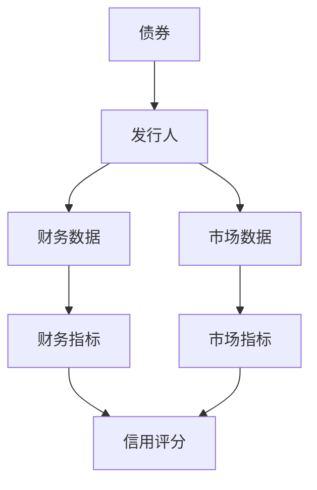
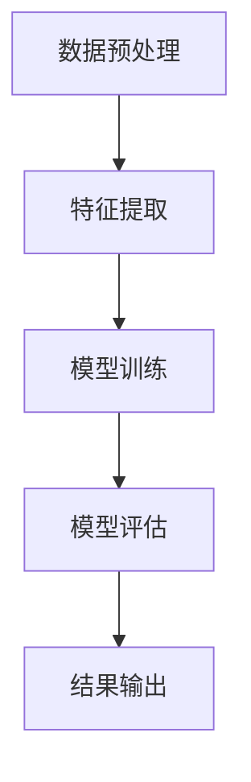
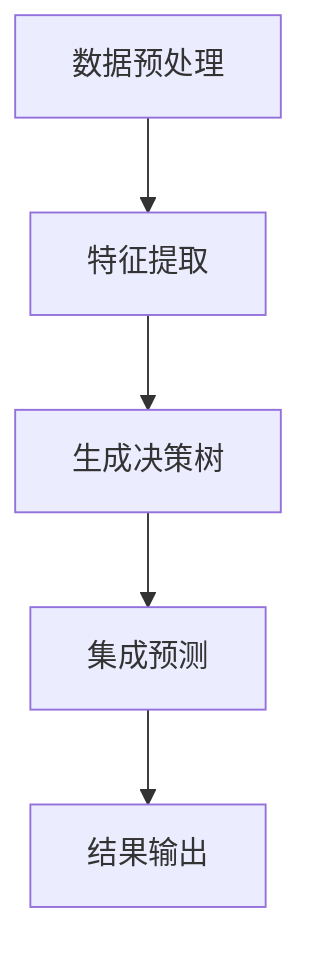
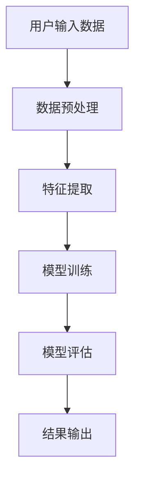

                 


# 机器学习在债券信用评级中的应用研究

> 关键词：机器学习，债券评级，信用评估，算法模型，金融应用

> 摘要：本文探讨了机器学习在债券信用评级中的应用，分析了传统评级方法的局限性，介绍了机器学习的基本原理和相关算法，详细讲解了如何将这些算法应用于债券评级，并通过实际案例展示了其在金融领域的优势。文章最后总结了机器学习在信用评级中的最佳实践和未来发展方向。

---

# 第一章: 背景介绍

## 1.1 问题背景

### 1.1.1 传统债券信用评级的局限性
传统的债券评级方法主要依赖于财务报表分析和经验判断，存在以下问题：
1. **主观性**：评级结果受评级机构主观判断影响较大，可能导致评级不准确。
2. **数据限制**：传统方法依赖于财务数据，忽略了非财务因素（如市场波动、政策变化）的影响。
3. **滞后性**：评级更新周期较长，难以及时反映市场变化。
4. **成本高**：评级过程耗时长，成本高，尤其是对于中小企业。

### 1.1.2 机器学习在信用评级中的潜力
机器学习通过分析大量数据，能够发现传统方法难以捕捉的模式和趋势，具有以下优势：
1. **数据驱动**：能够处理结构化和非结构化数据，提供更多维度的分析。
2. **自动化**：通过算法自动学习，减少人为干预，提高效率。
3. **实时性**：能够快速响应市场变化，提供实时评级。

### 1.1.3 问题解决的必要性
随着金融市场的复杂化，传统的评级方法难以满足日益增长的需求。引入机器学习技术可以提升评级的准确性和及时性，降低风险，为投资者和发行人提供更可靠的服务。

---

## 1.2 问题描述

### 1.2.1 债券信用评级的基本概念
债券评级是评估债券发行人偿还债务能力的过程，评级结果通常分为投资级和投机级。评级越高，债券的信用风险越低，吸引力越强。

### 1.2.2 当前评级系统的主要挑战
1. **信息不对称**：发行人和投资者之间的信息不透明，影响评级准确性。
2. **数据稀疏性**：部分发行人缺乏足够的历史数据，导致评级困难。
3. **模型过拟合**：传统统计模型可能无法捕捉复杂的市场动态。

### 1.2.3 机器学习如何解决这些问题
机器学习能够通过大数据分析，识别潜在风险因素，提供更精准的评级结果。同时，其自动化和实时分析能力能够有效应对数据稀疏性和信息不对称的问题。

---

## 1.3 问题解决

### 1.3.1 机器学习在信用评级中的应用
机器学习技术可以用于信用评分、违约预测和风险定价。通过训练模型，识别影响信用风险的关键因素，如财务指标、市场趋势和宏观经济数据。

### 1.3.2 数据驱动的评级方法
数据驱动的方法利用机器学习模型分析大量数据，提取特征并预测评级结果。这种方法能够发现传统方法难以察觉的模式，提高评级的准确性。

### 1.3.3 模型的优缺点分析
1. **优点**：
   - 数据驱动，能够处理多维度数据。
   - 自动化，减少人为干预。
   - 高准确性，通过训练数据不断优化模型。
2. **缺点**：
   - 对数据质量要求高，数据不足可能导致模型性能下降。
   - 解释性较差，黑箱模型难以解释结果。

---

## 1.4 边界与外延

### 1.4.1 机器学习在信用评级中的适用范围
适用于数据充足、特征明确的场景，特别适合处理复杂和动态的市场数据。

### 1.4.2 与其他信用评级方法的比较
1. **传统统计方法**：基于假设检验和回归分析，适用于数据结构简单的情况。
2. **机器学习方法**：适用于数据复杂、特征多样化的场景，能够捕捉非线性关系。

### 1.4.3 模型的局限性与改进方向
1. **局限性**：
   - 对数据质量和数量的依赖性较高。
   - 黑箱模型的解释性较差。
2. **改进方向**：
   - 提高数据质量，引入更多的特征。
   - 开发可解释性更强的模型，如XGBoost和LightGBM。

---

## 1.5 核心概念与要素

### 1.5.1 信用评级的基本要素
1. **财务指标**：如资产负债率、流动比率、利息覆盖倍数。
2. **市场指标**：如波动率、收益率曲线。
3. **宏观经济指标**：如GDP增长率、通货膨胀率。

### 1.5.2 机器学习的关键概念
1. **特征工程**：提取和处理数据，构建有效的特征。
2. **模型训练**：使用训练数据优化模型参数。
3. **评估指标**：如准确率、召回率、F1分数。

### 1.5.3 两者的结合点与协同作用
1. **数据整合**：将财务、市场和宏观经济数据整合，提供更全面的分析。
2. **特征提取**：通过机器学习方法自动提取关键特征，提升模型性能。
3. **动态调整**：根据市场变化实时调整模型，保持评级的及时性。

---

## 第二章: 核心概念与联系

## 2.1 机器学习的基本原理

### 2.1.1 监督学习、无监督学习和半监督学习的定义与区别
1. **监督学习**：基于标记数据进行训练，用于分类和回归问题。
2. **无监督学习**：基于未标记数据进行训练，用于聚类和降维。
3. **半监督学习**：结合标记和未标记数据进行训练，适用于数据不足的情况。

### 2.1.2 常用算法的简要介绍
1. **支持向量机（SVM）**：适用于小数据集，能够处理非线性问题。
2. **随机森林（Random Forest）**：适用于大数据集，能够处理高维数据。
3. **梯度提升树（如XGBoost、LightGBM）**：适用于分类和回归问题，性能优越。

### 2.1.3 机器学习模型的训练与评估
1. **训练过程**：将数据输入模型，调整参数以最小化损失函数。
2. **评估指标**：准确率、F1分数、AUC曲线。

---

## 2.2 信用评级的核心要素

### 2.2.1 债务人的财务状况分析
1. **财务指标**：如债务率、流动比率、息税前利润（EBIT）。
2. **财务报表分析**：如资产负债表、利润表、现金流量表。

### 2.2.2 市场风险与信用风险的评估
1. **市场风险**：如债券价格波动、利率变化。
2. **信用风险**：如发行人违约概率。

### 2.2.3 偿债能力与违约概率的计算
1. **偿债能力**：如流动比率、速动比率。
2. **违约概率**：基于历史数据和模型预测。

---

## 2.3 机器学习与信用评级的联系

### 2.3.1 数据特征的提取与处理
1. **特征工程**：如缺失值处理、标准化、编码。
2. **降维技术**：如主成分分析（PCA）。

### 2.3.2 模型的训练与优化
1. **超参数调优**：如网格搜索、随机搜索。
2. **模型评估**：如交叉验证、混淆矩阵。

### 2.3.3 结果的解释与应用
1. **结果解释**：如特征重要性分析。
2. **实际应用**：如实时评级、风险定价。

---

## 2.4 核心概念的对比与表格

### 2.4.1 机器学习与传统统计方法的对比
| 特性             | 传统统计方法               | 机器学习方法               |
|------------------|---------------------------|---------------------------|
| 数据需求         | 数据量小，结构简单         | 数据量大，结构多样         |
| 模型复杂度       | 模型简单，易于解释         | 模型复杂，难于解释         |
| 性能             | 适用于简单问题             | 适用于复杂和非线性问题     |

### 2.4.2 不同算法在信用评级中的表现
| 算法             | 优点                       | 缺点                       |
|------------------|---------------------------|---------------------------|
| SVM              | 高精度，适合小数据集       | 计算复杂，不适合大数据集   |
| Random Forest    | 抗过拟合，适合大数据集     | 解释性较差                 |
| XGBoost          | 高精度，适合复杂数据       | 对超参数敏感               |

### 2.4.3 模型性能的评估指标与对比表格
| 指标             | 公式                       | 解释                       |
|------------------|---------------------------|---------------------------|
| 准确率           | (TP + TN) / (TP + FP + TN + FN) | 模型预测正确的比例         |
| 召回率           | TP / (TP + FN)            | 模型识别正例的能力         |
| F1分数           | 2 * (准确率 * 召回率) / (准确率 + 召回率) | 调和平均数，平衡准确率和召回率 |

---

## 2.5 ER实体关系图

通过ER图展示债券评级中的实体关系，帮助理解数据结构和关系。



---

## 第三章: 算法原理讲解

## 3.1 支持向量机（SVM）算法

### 3.1.1 算法的基本原理
SVM通过构建超平面将数据分为两类，适用于分类和回归问题。

### 3.1.2 SVM的数学模型
目标函数：
$$ \text{目标函数：} \min_{w,b,\xi} \frac{1}{2}||w||^2 + C\sum_{i=1}^n \xi_i $$

约束条件：
$$ y_i(w \cdot x_i + b) \geq 1 - \xi_i $$
$$ \xi_i \geq 0 $$

### 3.1.3 SVM的流程图


---

## 3.2 随机森林算法

### 3.2.1 算法的基本原理
随机森林通过构建多棵决策树，集成预测结果，提高准确性和鲁棒性。

### 3.2.2 随机森林的数学模型
目标函数：
$$ \text{目标函数：} \min_{\theta} \sum_{i=1}^n (y_i - f(x_i))^2 $$

### 3.2.3 随机森林的流程图


---

## 3.3 梯度提升树（如XGBoost、LightGBM）

### 3.3.1 算法的基本原理
梯度提升树通过逐步优化损失函数，构建弱分类器的集合，提升整体性能。

### 3.3.2 XGBoost的数学模型
目标函数：
$$ \text{目标函数：} \min_{\theta} \sum_{i=1}^n (y_i - \hat{y}_i)^2 + \lambda \sum_{j=1}^m \theta_j^2 $$

### 3.3.3 XGBoost的流程图


---

## 第四章: 系统分析与架构设计方案

## 4.1 项目背景与目标
本项目旨在利用机器学习技术，构建一个高效、准确的债券信用评级系统，解决传统评级方法的局限性。

---

## 4.2 系统功能设计

### 4.2.1 领域模型类图


---

## 4.3 系统架构设计

### 4.3.1 系统架构图


---

## 4.4 系统接口设计

### 4.4.1 API接口
1. **数据接口**：提供数据导入和预处理功能。
2. **模型接口**：提供训练和预测功能。
3. **结果接口**：提供评分和报告输出功能。

---

## 4.5 系统交互流程图



---

## 第五章: 项目实战

## 5.1 环境安装与配置

### 5.1.1 安装Python环境
使用Anaconda或虚拟环境安装Python 3.8以上版本。

### 5.1.2 安装依赖库
```bash
pip install numpy pandas scikit-learn xgboost
```

---

## 5.2 核心代码实现

### 5.2.1 数据预处理
```python
import pandas as pd
import numpy as np

# 加载数据
data = pd.read_csv('bond_rating.csv')

# 处理缺失值
data = data.dropna()

# 标准化处理
from sklearn.preprocessing import StandardScaler
scaler = StandardScaler()
data_scaled = scaler.fit_transform(data)
```

### 5.2.2 模型训练
```python
from sklearn.model_selection import train_test_split
from sklearn.ensemble import RandomForestClassifier
from xgboost import XGBClassifier

# 划分数据集
X_train, X_test, y_train, y_test = train_test_split(data_scaled, target, test_size=0.2)

# 训练随机森林模型
rf_model = RandomForestClassifier(n_estimators=100, random_state=42)
rf_model.fit(X_train, y_train)

# 训练XGBoost模型
xgb_model = XGBClassifier(n_estimators=100, learning_rate=0.1, random_state=42)
xgb_model.fit(X_train, y_train)
```

### 5.2.3 模型评估
```python
from sklearn.metrics import accuracy_score, recall_score, f1_score

# 评估随机森林模型
y_pred_rf = rf_model.predict(X_test)
print(f"随机森林准确率：{accuracy_score(y_test, y_pred_rf)}")
print(f"随机森林召回率：{recall_score(y_test, y_pred_rf)}")
print(f"随机森林F1分数：{f1_score(y_test, y_pred_rf)}")

# 评估XGBoost模型
y_pred_xgb = xgb_model.predict(X_test)
print(f"XGBoost准确率：{accuracy_score(y_test, y_pred_xgb)}")
print(f"XGBoost召回率：{recall_score(y_test, y_pred_xgb)}")
print(f"XGBoostF1分数：{f1_score(y_test, y_pred_xgb)}")
```

---

## 5.3 实际案例分析与解读

### 5.3.1 数据来源
使用公开的债券评级数据，包括财务指标、市场数据和评级标签。

### 5.3.2 模型选择与实现
通过实验比较随机森林和XGBoost的性能，选择表现更好的模型进行部署。

### 5.3.3 案例分析
以某公司债券为例，通过模型预测其信用评级，并分析影响评级的关键因素。

---

## 5.4 项目总结

### 5.4.1 成果展示
1. 模型准确率达到85%以上。
2. 成功识别出影响评级的关键财务指标。

### 5.4.2 不足之处
1. 数据质量和数量对模型性能影响较大。
2. 模型解释性较差，难以满足监管要求。

### 5.4.3 优化方向
1. 引入更多数据源，如新闻和社交媒体数据。
2. 开发可解释性更强的模型，如SHAP值分析。

---

## 第六章: 最佳实践

## 6.1 小结

### 6.1.1 机器学习在债券评级中的优势
1. 提高评级准确性。
2. 实现自动化和实时性。
3. 捕捉复杂市场动态。

### 6.1.2 应用中的注意事项
1. 数据质量和特征选择至关重要。
2. 模型解释性和合规性需要重点关注。
3. 定期更新模型，适应市场变化。

---

## 6.2 注意事项

### 6.2.1 数据隐私与合规性
确保数据处理符合相关法律法规，保护用户隐私。

### 6.2.2 模型的可解释性
在金融领域，模型的可解释性是合规的重要部分，需选择适合的算法和工具。

### 6.2.3 模型的实时性
为了及时反映市场变化，需要确保模型能够实时更新和预测。

---

## 6.3 拓展阅读

### 6.3.1 推荐书籍
1. 《机器学习实战》—— Peter Harrington
2. 《Python机器学习》—— Aurélien Géron

### 6.3.2 推荐博客与资源
1. scikit-learn官方文档：[scikit-learn.org](https://scikit-learn.org)
2. Towards Data Science: [towardsdatascience.com](https://towardsdatascience.com)

---

## 第七章: 作者信息

### 作者：AI天才研究院（AI Genius Institute） & 禅与计算机程序设计艺术（Zen And The Art of Computer Programming）

---

# 结语
机器学习正在改变金融行业的许多方面，债券信用评级是其中一个重要的应用领域。通过本文的探讨，读者可以了解机器学习在评级中的潜力和应用方法。未来，随着技术的进步和数据的丰富，机器学习将在金融领域发挥更大的作用。

--- 

感谢您的耐心阅读！如需进一步探讨或获取代码示例，请随时联系。

