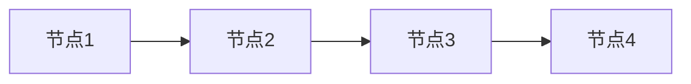
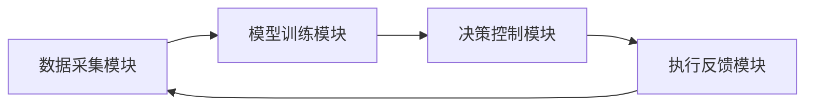

                 


# 构建具有时间序列分析能力的AI Agent

## 关键词：AI Agent、时间序列分析、深度学习、LSTM、Transformer

## 摘要：本文详细探讨如何构建一个具有时间序列分析能力的AI Agent。从基础概念到高级算法，再到系统架构设计和项目实战，全面解析AI Agent如何利用时间序列分析技术实现智能决策和预测。

---

## 第一章：时间序列分析与AI Agent概述

### 1.1 时间序列分析的基本概念

#### 1.1.1 时间序列的定义与特点
时间序列分析是通过统计学和机器学习方法对时间数据进行建模和分析的过程。时间序列数据是指按照时间顺序排列的观测值，例如股票价格、天气数据、传感器读数等。

**时间序列的特点：**
- **有序性**：数据按时间顺序排列。
- **趋势性**：数据可能有长期上升或下降趋势。
- **周期性**：数据可能在固定周期内重复某种模式。
- **随机性**：数据中包含不可预测的随机波动。

#### 1.1.2 时间序列分析的常见应用场景
- **金融领域**：股票价格预测、汇率预测。
- **气象领域**：天气预测、气候分析。
- **工程领域**：设备状态监测、故障预测。
- **医疗领域**：患者健康趋势分析。

#### 1.1.3 时间序列分析的挑战与解决方案
- **挑战**：
  - 数据的非独立性和非均匀分布。
  - 长期依赖关系的捕捉。
  - 数据噪声和缺失值处理。
- **解决方案**：
  - 使用统计方法（如ARIMA）捕捉趋势和周期性。
  - 采用深度学习模型（如LSTM）处理长期依赖。

### 1.2 AI Agent的基本概念

#### 1.2.1 AI Agent的定义与分类
AI Agent是一种智能体，能够感知环境、自主决策并执行任务。根据智能水平，AI Agent可分为：
- **反应式AI Agent**：基于当前感知做出反应。
- **认知式AI Agent**：具备推理、规划和学习能力。

#### 1.2.2 AI Agent的核心功能与特点
- **感知能力**：通过传感器或数据输入获取信息。
- **决策能力**：基于感知信息做出决策。
- **执行能力**：通过执行机构或API实现动作。

#### 1.2.3 AI Agent与时间序列分析的结合
AI Agent可以通过时间序列分析技术，增强其感知和决策能力，例如：
- **环境监控**：实时监控设备状态，预测可能出现的故障。
- **智能推荐**：基于历史行为预测用户需求，提供个性化推荐。

### 1.3 时间序列分析在AI Agent中的应用

#### 1.3.1 时间序列分析在AI Agent中的作用
- **数据处理**：对时间序列数据进行清洗、预处理和特征提取。
- **预测建模**：利用时间序列模型预测未来趋势。
- **实时监控**：实时分析数据，识别异常情况。

#### 1.3.2 AI Agent如何处理时间序列数据
- **数据输入**：AI Agent接收时间序列数据流。
- **模型训练**：基于历史数据训练时间序列模型。
- **实时预测**：根据当前数据实时预测下一步趋势。

#### 1.3.3 应用案例分析
- **股票交易AI Agent**：通过时间序列分析预测股票价格走势，辅助投资决策。
- **智能空调系统**：根据历史温度数据预测未来温度，优化能源消耗。

---

## 第二章：时间序列分析的核心方法

### 2.1 传统统计方法

#### 2.1.1 移动平均法（MA）
移动平均法是一种简单的时间序列预测方法，通过计算过去若干期的平均值来预测未来值。

**公式：**
$$
\hat{y}_{t} = \frac{y_{t-1} + y_{t-2} + \dots + y_{t-n}}{n}
$$

**优缺点：**
- **优点**：计算简单，适合短期预测。
- **缺点**：无法捕捉趋势和周期性。

#### 2.1.2 自回归积分滑动平均模型（ARIMA）
ARIMA模型是一种广泛应用于时间序列预测的统计模型，适用于非平稳序列。

**模型结构：**
$$
ARIMA(p, d, q) = y_t - \text{趋势} - \text{季节性} = \text{白噪声}
$$

**优缺点：**
- **优点**：适合处理趋势性和周期性数据。
- **缺点**：需要手动选择参数，对异常值敏感。

#### 2.1.3 指数平滑法（Exponential Smoothing）
指数平滑法是一种简单的时间序列预测方法，适用于数据中存在趋势或周期性的情况。

**公式：**
$$
\hat{y}_{t+1} = \alpha y_t + (1-\alpha)\hat{y}_t
$$

**优缺点：**
- **优点**：计算简单，适合实时预测。
- **缺点**：对长期预测效果较差。

### 2.2 机器学习方法

#### 2.2.1 支持向量机（SVM）在时间序列预测中的应用
SVM通过构建超平面将数据点分为两类，适用于时间序列分类和回归任务。

**优缺点：**
- **优点**：泛化能力强，适合小规模数据。
- **缺点**：计算复杂度高，不适合大规模数据。

#### 2.2.2 神经网络在时间序列分析中的应用
神经网络通过多层感知机结构捕捉时间序列中的复杂模式。

**优缺点：**
- **优点**：适合处理非线性关系，可扩展性强。
- **缺点**：训练时间长，需要大量数据。

#### 2.2.3 长短期记忆网络（LSTM）的原理与优势
LSTM是一种特殊的循环神经网络，通过门控机制处理长序列数据。

**LSTM结构：**
- **输入门（Input Gate）**：决定哪些信息需要存储。
- **遗忘门（Forget Gate）**：决定哪些信息需要遗忘。
- **输出门（Output Gate）**：决定输出什么内容。

**优缺点：**
- **优点**：适合处理长期依赖关系，记忆能力强。
- **缺点**：训练时可能出现梯度消失问题。

### 2.3 深度学习方法

#### 2.3.1 基于LSTM的时间序列预测模型
LSTM网络在时间序列预测中表现优异，尤其适合捕捉长期依赖关系。

**代码示例：**
```python
import keras
from keras.layers import LSTM, Dense
from keras.models import Sequential

model = Sequential()
model.add(LSTM(64, input_shape=(timesteps, features)))
model.add(Dense(1))
model.compile(loss='mean_squared_error', optimizer='adam')
```

#### 2.3.2 Transformer模型在时间序列分析中的应用
Transformer模型通过自注意力机制捕捉全局依赖关系，适用于时间序列数据的长距离依赖。

**模型结构：**
- **编码器**：将时间序列数据映射到潜在空间。
- **解码器**：根据编码结果生成预测值。

**优缺点：**
- **优点**：并行计算效率高，适合长序列。
- **缺点**：计算资源消耗大。

#### 2.3.3 图神经网络
图神经网络将时间序列数据建模为图结构，适用于多源时间序列数据的融合分析。

**图神经网络示意图（Mermaid）：**


---

## 第三章：AI Agent的核心技术

### 3.1 AI Agent的感知能力

#### 3.1.1 数据采集与预处理
AI Agent通过传感器、数据库等获取时间序列数据，并进行清洗和特征提取。

**数据预处理步骤：**
1. 数据清洗：处理缺失值、异常值。
2. 特征提取：提取时间特征、统计特征等。

#### 3.1.2 感知模型的选择
根据应用场景选择合适的感知模型，例如：
- **统计模型**：适用于简单趋势预测。
- **深度学习模型**：适用于复杂模式识别。

### 3.2 AI Agent的决策能力

#### 3.2.1 决策模型的选择
基于时间序列预测结果，选择合适的决策模型，例如：
- **规则引擎**：根据阈值触发动作。
- **强化学习模型**：通过奖励机制优化决策。

#### 3.2.2 决策逻辑的实现
AI Agent根据预测结果和环境状态，生成决策指令。

**决策流程：**
1. 获取实时数据。
2. 预测未来趋势。
3. 根据预测结果生成决策。
4. 执行决策并反馈结果。

### 3.3 AI Agent的执行能力

#### 3.3.1 执行机制的设计
AI Agent通过API或控制接口执行决策指令。

**执行流程：**
1. 接收决策指令。
2. 调用执行接口。
3. 获取执行结果。

#### 3.3.2 反馈机制的实现
AI Agent通过反馈机制不断优化其行为。

**反馈流程：**
1. 获取执行结果。
2. 更新模型参数。
3. 调整决策策略。

---

## 第四章：时间序列分析的算法原理

### 4.1 LSTM模型的数学推导

#### 4.1.1 LSTM单元的结构
LSTM单元由输入门、遗忘门和输出门组成。

**公式推导：**
$$
i_t = \sigma(W_i x_t + U_i h_{t-1})
$$
$$
f_t = \sigma(W_f x_t + U_f h_{t-1})
$$
$$
o_t = \sigma(W_o x_t + U_o h_{t-1})
$$
$$
h_t = i_t \cdot \tanh(W_c x_t + U_c h_{t-1}) + f_t \cdot h_{t-1}
$$

#### 4.1.2 LSTM模型的训练过程
通过反向传播算法训练LSTM模型，优化权重参数。

**训练流程：**
1. 初始化权重参数。
2. 前向传播计算预测值。
3. 计算损失函数。
4. 反向传播更新权重。

### 4.2 Transformer模型的实现细节

#### 4.2.1 自注意力机制的计算
通过查询、键和值向量计算自注意力权重。

**公式推导：**
$$
\text{Query} = Q = W_q x
$$
$$
\text{Key} = K = W_k x
$$
$$
\text{Value} = V = W_v x
$$
$$
\text{Attention} = \text{softmax}\left(\frac{QK^T}{\sqrt{d_k}}\right)V
$$

#### 4.2.2 Transformer模型的训练优化
使用Adam优化器和学习率衰减策略优化模型性能。

**优化流程：**
1. 初始化模型参数。
2. 前向传播计算预测值。
3. 计算损失函数。
4. 反向传播更新参数。

---

## 第五章：AI Agent的系统架构设计

### 5.1 系统模块划分

#### 5.1.1 数据采集模块
负责获取实时时间序列数据。

**功能：
- 数据采集接口：与传感器或数据库对接。
- 数据预处理：清洗和转换数据。

#### 5.1.2 模型训练模块
负责训练时间序列分析模型。

**功能：
- 数据集准备：划分训练集和测试集。
- 模型训练：使用训练数据优化模型参数。

#### 5.1.3 决策控制模块
负责根据预测结果生成决策指令。

**功能：
- 预测接口：调用模型预测未来趋势。
- 决策逻辑：根据预测结果生成决策指令。

#### 5.1.4 执行反馈模块
负责执行决策指令并收集反馈信息。

**功能：
- 执行接口：调用执行机构执行决策。
- 反馈收集：收集执行结果并更新模型。

### 5.2 系统架构设计

#### 5.2.1 系统模块交互流程
1. 数据采集模块获取实时数据。
2. 模型训练模块训练预测模型。
3. 决策控制模块根据预测结果生成决策。
4. 执行反馈模块执行决策并收集反馈。

**系统流程图（Mermaid）：**


#### 5.2.2 系统接口设计
- **数据接口**：数据采集模块与数据源的接口。
- **预测接口**：决策控制模块与模型训练模块的接口。
- **执行接口**：执行反馈模块与执行机构的接口。

---

## 第六章：项目实战——构建一个股票价格预测AI Agent

### 6.1 项目背景与目标
通过构建股票价格预测AI Agent，实现基于时间序列分析的股票价格预测。

### 6.2 环境搭建与数据准备

#### 6.2.1 环境搭建
安装必要的Python库，例如TensorFlow、Keras、Pandas。

**代码示例：**
```python
import sys
import pandas as pd
import numpy as np
import tensorflow as tf
from tensorflow.keras import layers
```

#### 6.2.2 数据准备
获取股票历史数据并进行预处理。

**数据预处理代码：**
```python
data = pd.read_csv('stock_prices.csv')
data = data[['date', 'price']]
data['date'] = pd.to_datetime(data['date'])
data.set_index('date', inplace=True)
```

### 6.3 模型训练与优化

#### 6.3.1 模型训练
使用LSTM模型训练股票价格预测模型。

**训练代码示例：**
```python
model = tf.keras.Sequential()
model.add(layers.LSTM(64, input_shape=(timesteps, features)))
model.add(layers.Dense(1))
model.compile(optimizer='adam', loss='mean_squared_error')
model.fit(X_train, y_train, epochs=100, batch_size=32)
```

#### 6.3.2 模型优化
通过调整超参数和优化策略提升模型性能。

**优化策略：**
- 交叉验证：评估模型泛化能力。
- 超参数调整：尝试不同的学习率和批次大小。

### 6.4 决策控制与执行反馈

#### 6.4.1 决策逻辑实现
根据模型预测结果生成买入、卖出或持有决策。

**决策逻辑代码示例：**
```python
def make_decision(predicted_price, current_price):
    if predicted_price > current_price * 1.02:
        return '买入'
    elif predicted_price < current_price * 0.98:
        return '卖出'
    else:
        return '持有'
```

#### 6.4.2 执行反馈实现
根据决策结果执行交易操作并收集反馈信息。

**执行反馈代码示例：**
```python
def execute_trade(decision, amount):
    if decision == '买入':
        buy_stock(amount)
    elif decision == '卖出':
        sell_stock(amount)
    else:
        pass
```

### 6.5 项目总结与优化建议

#### 6.5.1 项目总结
通过构建股票价格预测AI Agent，展示了时间序列分析在AI Agent中的应用。

#### 6.5.2 优化建议
- **模型优化**：尝试不同的模型结构，例如Transformer。
- **数据增强**：引入更多特征，如市场情绪指标。
- **实时预测**：优化模型推理速度，适用于实时交易。

---

## 第七章：高级主题与未来展望

### 7.1 多模态时间序列分析
结合其他数据源（如文本、图像）进行多模态时间序列分析。

**应用场景：**
- **金融领域**：结合新闻 sentiment 进行股票预测。
- **医疗领域**：结合患者病历进行健康预测。

### 7.2 在线学习与实时预测
实现在线学习机制，使AI Agent能够实时更新模型。

**在线学习优势：**
- 实时适应数据变化。
- 快速响应实时预测需求。

### 7.3 强化学习在时间序列分析中的应用
通过强化学习优化AI Agent的决策策略。

**强化学习框架：**
- **状态空间**：时间序列数据和环境状态。
- **动作空间**：AI Agent的决策动作。
- **奖励机制**：根据预测准确性和决策收益设计奖励函数。

### 7.4 时间序列模型的可解释性与鲁棒性
提升模型的可解释性和鲁棒性，增强AI Agent的可信度。

**可解释性方法：**
- **可视化**：展示模型注意力权重。
- **分解分析**：分析模型预测的各个组成部分。

---

## 附录

### 附录A：时间序列分析常用工具与库
- **Python库**：Pandas、NumPy、TensorFlow、Keras。
- **可视化工具**：Matplotlib、Seaborn、Plotly。

### 附录B：股票价格预测项目代码
完整的股票价格预测AI Agent代码示例，包括数据处理、模型训练和决策控制模块。

### 附录C：参考文献
- [1] Hyndman, R. J., & Athanasopoulos, G. (2018). Forecasting: principles and practice.
- [2] Hochreiter, S., & Schmidhuber, J. (1997). Long short-term memory.
- [3] Vaswani, A., et al. (2017). Attention is all you need.

---

## 作者：AI天才研究院 & 禅与计算机程序设计艺术

---

通过以上目录结构和内容安排，我们全面解析了构建具有时间序列分析能力的AI Agent的过程，从理论到实践，从基础到高级，帮助读者系统性地掌握相关知识和技术。

