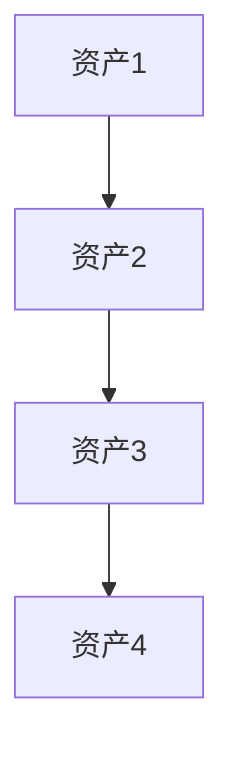
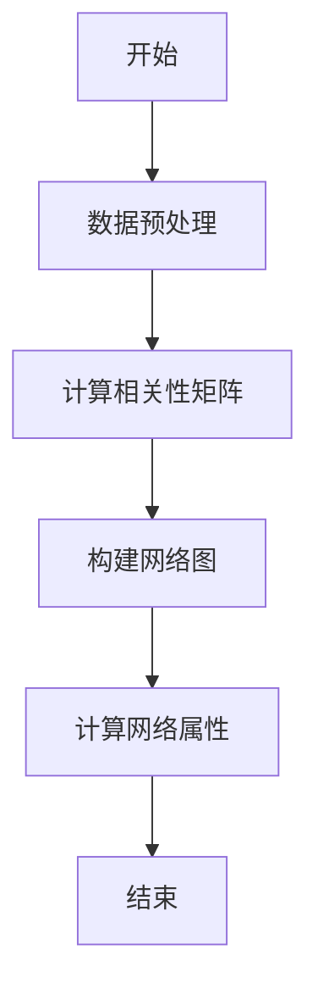
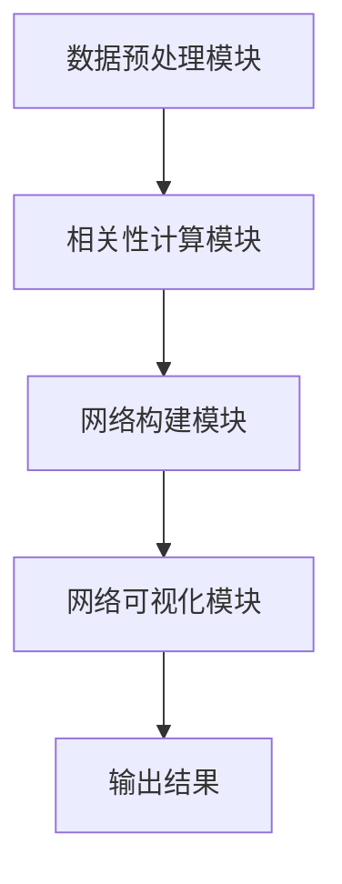
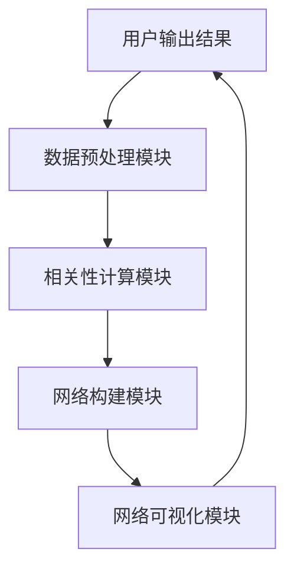

                 


# 金融市场跨资产相关性网络分析工具

## 关键词
金融市场, 跨资产相关性, 网络分析工具, 数据分析, 网络可视化

## 摘要
金融市场跨资产相关性网络分析工具是一种利用网络分析技术来研究不同资产之间相互关联性的工具。通过分析这些相关性，投资者可以更好地理解市场的风险和机会，从而做出更明智的投资决策。本文将详细介绍该工具的核心概念、算法原理、系统架构以及实际应用。

---

# 第一部分: 金融市场跨资产相关性分析的背景与意义

## 第1章: 金融市场跨资产相关性分析的背景与意义

### 1.1 问题背景
#### 1.1.1 金融市场的复杂性与不确定性
金融市场是一个高度复杂的系统，涉及股票、债券、商品等多种资产。这些资产的价格波动相互影响，形成了复杂的网络关系。理解这些关系对于投资者来说至关重要。

#### 1.1.2 跨资产相关性的概念与重要性
跨资产相关性指的是不同资产价格变动之间的关联程度。高相关性意味着这些资产的价格波动趋向于同方向变化，而低相关性则意味着它们相对独立。通过分析跨资产相关性，投资者可以更好地分散投资风险，优化投资组合。

#### 1.1.3 网络分析在金融市场中的应用前景
网络分析是一种强大的工具，可以帮助我们发现数据中的复杂关系。在金融市场中，网络分析可以用于构建资产相关性网络，识别关键资产和风险节点。

### 1.2 问题描述
#### 1.2.1 跨资产相关性分析的基本问题
跨资产相关性分析的核心问题是如何量化和可视化不同资产之间的相关性。这需要收集和处理大量的金融数据，并选择合适的算法进行分析。

#### 1.2.2 网络分析工具的必要性
传统的相关性分析通常只计算资产之间的两两相关性，无法捕捉到更高阶的网络结构。而网络分析工具可以将这些相关性关系化为一个网络图，帮助我们更好地理解市场的整体结构。

#### 1.2.3 当前市场中的挑战与痛点
金融市场中的数据量巨大且复杂，传统的数据分析方法难以处理。此外，市场中的噪声数据和异常值也会影响相关性分析的准确性。

### 1.3 问题解决
#### 1.3.1 跨资产相关性网络分析的解决方案
通过网络分析工具，我们可以将资产相关性数据转化为网络图，利用图论的方法进行分析和可视化。

#### 1.3.2 网络分析工具的核心功能
网络分析工具通常包括数据预处理、相关性计算、网络构建和可视化等功能模块。

#### 1.3.3 工具如何帮助投资者做出决策
投资者可以通过网络分析工具发现资产之间的隐藏关系，识别潜在的风险和机会，从而优化投资组合。

### 1.4 边界与外延
#### 1.4.1 工具的适用范围
该工具适用于多种资产类型，包括股票、债券、商品等，但目前主要针对单一市场的数据。

#### 1.4.2 相关性分析的边界条件
相关性分析受数据质量和样本数量的影响，可能存在一定的局限性。

#### 1.4.3 网络分析的局限性与扩展性
网络分析工具可以帮助我们发现资产之间的关系，但无法直接预测资产价格的变化。未来可以通过引入更多数据源和算法来提升分析的准确性。

### 1.5 概念结构与核心要素
#### 1.5.1 跨资产相关性的核心概念
跨资产相关性是指不同资产价格波动之间的关联程度。

#### 1.5.2 网络分析的关键要素
网络分析的关键要素包括节点（资产）、边（相关性）和网络结构（如社区划分）。

#### 1.5.3 工具的功能模块与组件
工具的功能模块通常包括数据输入、数据处理、相关性计算、网络构建和可视化等。

---

# 第二部分: 跨资产相关性网络分析的核心概念与联系

## 第2章: 跨资产相关性网络分析的核心原理

### 2.1 相关性计算的基本原理
#### 2.1.1 相关性的定义与计算公式
相关性是用来衡量两个变量之间线性关系的统计量。常用的相关性指标包括皮尔逊相关系数和斯皮尔曼相关系数。

皮尔逊相关系数的公式为：
$$ r = \frac{\sum (x_i - \bar{x})(y_i - \bar{y})}{\sqrt{\sum (x_i - \bar{x})^2 \sum (y_i - \bar{y})^2}} $$

斯皮尔曼相关系数则是基于变量的秩次计算的。

#### 2.1.2 皮尔逊相关系数与斯皮尔曼相关系数的比较
皮尔逊相关系数适用于线性关系，而斯皮尔曼相关系数适用于非线性关系。斯皮尔曼相关系数在处理有序数据时更具鲁棒性。

#### 2.1.3 相关性矩阵的构建方法
相关性矩阵是一个对称矩阵，其中对角线上的元素为1，表示资产与自身的相关性。非对角线上的元素表示资产之间的相关性。

### 2.2 网络构建的步骤与方法
#### 2.2.1 数据预处理与标准化
数据预处理包括去除缺失值、标准化数据等步骤。标准化数据可以确保不同资产的波动性在计算相关性时具有可比性。

#### 2.2.2 相关性阈值的设定
为了构建网络图，需要设定一个相关性阈值，将相关性低于该阈值的资产对排除。

#### 2.2.3 网络图的构建与可视化
通过将资产作为节点，相关性作为边的权重，可以构建一个网络图。可视化工具可以帮助我们更好地理解网络结构。

#### 2.2.4 网络图的属性分析
网络图的属性包括度数、中心性、社区划分等。这些属性可以帮助我们识别关键资产和潜在的风险节点。

### 2.3 核心概念与联系
#### 2.3.1 跨资产相关性网络的核心概念
- 节点：资产
- 边：资产之间的相关性
- 网络结构：资产之间的关联关系

#### 2.3.2 跨资产相关性网络的属性特征
- 度数：资产在网络中的连接数量
- 中心性：资产在网络中的重要程度
- 社区划分：资产的分组情况

#### 2.3.3 跨资产相关性网络的ER图实体关系


---

## 第3章: 跨资产相关性网络分析的算法原理

### 3.1 相关性分析算法的原理
#### 3.1.1 皮尔逊相关系数的计算
通过皮尔逊相关系数，我们可以衡量资产之间的线性相关性。

#### 3.1.2 斯皮尔曼相关系数的计算
斯皮尔曼相关系数基于变量的秩次计算，适用于非线性关系。

#### 3.1.3 相关性矩阵的构建
通过计算所有资产对的相关性，可以构建一个相关性矩阵。

### 3.2 网络分析算法的原理
#### 3.2.1 网络图的构建
通过设定相关性阈值，将相关性高于该阈值的资产对连接起来，形成网络图。

#### 3.2.2 网络图的属性计算
- 度数计算：每个节点的度数表示其连接的边数。
- 中心性计算：中心性用于衡量节点在网络中的重要程度。
- 社区划分：通过算法（如Louvain算法）将节点划分为社区。

### 3.3 算法实现的步骤
#### 3.3.1 数据预处理
- 去除缺失值
- 标准化数据

#### 3.3.2 相关性计算
- 计算每对资产的相关性
- 构建相关性矩阵

#### 3.3.3 网络图构建
- 设定相关性阈值
- 构建网络图

#### 3.3.4 网络属性计算
- 计算度数和中心性
- 划分社区

### 3.4 算法实现的代码示例
#### 3.4.1 Python代码实现
```python
import numpy as np
import pandas as pd
import networkx as nx
import matplotlib.pyplot as plt

# 示例数据：假设我们有4个资产，分别为A、B、C、D
data = {
    'A': [1, 2, 3, 4],
    'B': [2, 3, 5, 6],
    'C': [3, 4, 6, 8],
    'D': [4, 5, 7, 9]
}

df = pd.DataFrame(data)

# 计算皮尔逊相关系数
correlation_matrix = df.corr()

# 设定相关性阈值
threshold = 0.8

# 构建网络图
G = nx.Graph()
assets = df.columns
for i in range(len(assets)):
    for j in range(i+1, len(assets)):
        correlation = correlation_matrix.iloc[i, j]
        if abs(correlation) > threshold:
            G.add_edge(assets[i], assets[j])

# 绘制网络图
nx.draw(G, with_labels=True, node_color='red', edge_color='blue')
plt.show()
```

#### 3.4.2 算法流程图


---

## 第4章: 跨资产相关性网络分析的系统架构设计

### 4.1 系统功能设计
#### 4.1.1 数据预处理模块
- 数据清洗：去除缺失值
- 数据标准化：标准化数据

#### 4.1.2 相关性计算模块
- 计算每对资产的相关性
- 构建相关性矩阵

#### 4.1.3 网络构建模块
- 设定相关性阈值
- 构建网络图

#### 4.1.4 网络可视化模块
- 绘制网络图
- 可视化网络属性

### 4.2 系统架构设计
#### 4.2.1 系统模块划分
- 数据预处理模块
- 相关性计算模块
- 网络构建模块
- 网络可视化模块

#### 4.2.2 系统架构图


#### 4.2.3 系统接口设计
- 数据输入接口
- 参数设置接口
- 结果输出接口

#### 4.2.4 系统交互流程图


---

## 第5章: 跨资产相关性网络分析的项目实战

### 5.1 项目环境安装
#### 5.1.1 安装Python
- 下载并安装Python：https://www.python.org/

#### 5.1.2 安装相关库
- 安装numpy、pandas、networkx、matplotlib等库：
  ```bash
  pip install numpy pandas networkx matplotlib
  ```

### 5.2 系统核心实现源代码
#### 5.2.1 数据预处理模块
```python
import pandas as pd
import numpy as np

def data_preprocessing(data):
    # 去除缺失值
    data = data.dropna()
    # 标准化数据
    data_normalized = (data - data.mean()) / data.std()
    return data_normalized
```

#### 5.2.2 相关性计算模块
```python
import pandas as pd

def calculate_correlation(data):
    # 计算皮尔逊相关系数矩阵
    correlation_matrix = data.corr()
    return correlation_matrix
```

#### 5.2.3 网络构建模块
```python
import networkx as nx

def build_network(correlation_matrix, threshold=0.8):
    G = nx.Graph()
    assets = correlation_matrix.columns
    for i in range(len(assets)):
        for j in range(i+1, len(assets)):
            correlation = correlation_matrix.iloc[i, j]
            if abs(correlation) > threshold:
                G.add_edge(assets[i], assets[j])
    return G
```

#### 5.2.4 网络可视化模块
```python
import matplotlib.pyplot as plt
import networkx as nx

def visualize_network(G):
    nx.draw(G, with_labels=True, node_color='red', edge_color='blue')
    plt.show()
```

### 5.3 代码应用解读与分析
#### 5.3.1 数据预处理
- 数据预处理模块首先去除缺失值，然后对数据进行标准化处理。

#### 5.3.2 相关性计算
- 相关性计算模块使用皮尔逊相关系数计算每对资产的相关性，并构建相关性矩阵。

#### 5.3.3 网络构建
- 网络构建模块根据设定的阈值，将相关性高于阈值的资产对连接起来，形成网络图。

#### 5.3.4 网络可视化
- 网络可视化模块使用Matplotlib绘制网络图，帮助我们直观地理解资产之间的相关性关系。

### 5.4 实际案例分析
#### 5.4.1 数据获取与预处理
- 下载股票、债券等资产的历史价格数据。
- 去除缺失值，标准化数据。

#### 5.4.2 相关性矩阵计算
- 使用皮尔逊相关系数计算每对资产的相关性。

#### 5.4.3 网络图构建与可视化
- 根据设定的相关性阈值，构建网络图并可视化。

#### 5.4.4 网络属性分析
- 计算度数和中心性，划分社区。

### 5.5 项目小结
- 通过网络分析工具，我们可以更好地理解资产之间的相关性关系。
- 网络可视化可以帮助我们识别关键资产和潜在的风险节点。

---

## 第6章: 跨资产相关性网络分析的最佳实践

### 6.1 最佳实践
#### 6.1.1 数据质量的重要性
- 确保数据的完整性和准确性。
- 数据清洗是关键步骤。

#### 6.1.2 相关性阈值的设定
- 根据实际需求设定阈值。
- 不同的阈值可能导致不同的网络结构。

#### 6.1.3 网络分析工具的选择
- 根据需求选择合适的工具。
- 开源工具和商业工具各有优缺点。

#### 6.1.4 网络可视化的效果
- 选择合适的可视化工具和图表类型。
- 图表的颜色和布局应清晰易懂。

### 6.2 小结
- 跨资产相关性网络分析是一个复杂但重要的任务。
- 网络分析工具可以帮助我们更好地理解市场结构。

### 6.3 注意事项
- 数据质量直接影响分析结果。
- 相关性分析结果不能直接用于投资决策。
- 网络分析工具的性能受数据规模的影响。

### 6.4 拓展阅读
- 《Network Analysis in Python》
- 《Financial Network Analysis》
- 《Python for Data Analysis》

---

# 结语

金融市场跨资产相关性网络分析工具是一种强大的数据分析工具，可以帮助投资者更好地理解市场的复杂性。通过本文的介绍，读者可以了解该工具的核心概念、算法原理和实际应用。未来，随着技术的进步，网络分析工具将更加智能化和个性化，为投资者提供更有力的支持。

---

# 作者：AI天才研究院 & 禅与计算机程序设计艺术

---

