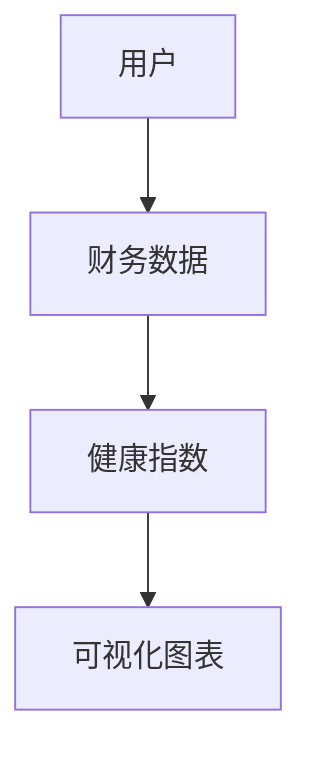
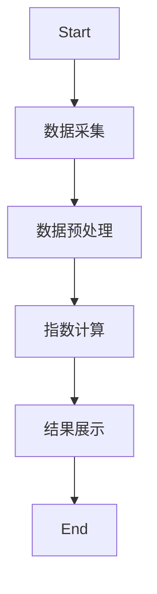
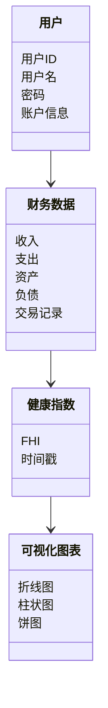
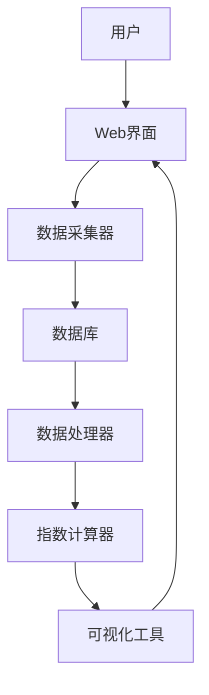
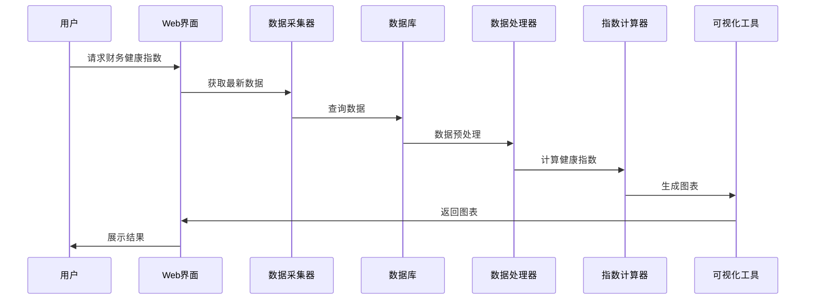

                 


# 个人财务健康指数动态跟踪系统

> 关键词：个人财务健康指数，动态跟踪，系统架构，算法原理，项目实战

> 摘要：本文介绍了一种基于数据驱动的个人财务健康指数动态跟踪系统，结合数据分析、算法设计和系统架构等技术，详细阐述了系统的核心概念、算法原理、系统设计、项目实现和最佳实践。

---

# 第一部分: 个人财务健康指数动态跟踪系统概述

## 第1章: 个人财务健康指数动态跟踪系统背景介绍

### 1.1 问题背景

#### 1.1.1 个人财务健康的重要性
个人财务健康是衡量个人经济状况的核心指标，直接关系到个人的经济安全和生活质量。随着经济环境的复杂化，个人需要实时了解自己的财务健康状况，以便做出合理的财务决策。

#### 1.1.2 现有财务管理系统的主要不足
目前市面上的财务管理系统多为静态记录工具，缺乏动态分析和实时跟踪功能，难以提供个性化的财务健康评估和优化建议。

#### 1.1.3 个人财务健康指数动态跟踪的必要性
通过动态跟踪和分析个人的收入、支出、资产和负债等数据，可以实时计算财务健康指数，帮助个人了解财务状况的变化趋势，及时调整财务策略。

### 1.2 问题描述

#### 1.2.1 财务数据的碎片化问题
个人的财务数据分散在不同的平台和工具中，难以统一收集和分析。

#### 1.2.2 财务健康评估的动态变化
财务状况会随着时间推移而变化，需要实时跟踪和评估。

#### 1.2.3 系统实时跟踪与反馈的需求
用户需要系统实时更新财务健康指数，并提供可视化反馈和预警功能。

### 1.3 问题解决

#### 1.3.1 系统设计目标
- 实现实时数据采集和分析
- 计算动态财务健康指数
- 提供可视化反馈和预警功能

#### 1.3.2 核心功能模块
- 数据采集模块：从多个数据源采集财务数据
- 指数计算模块：计算个人财务健康指数
- 可视化反馈模块：以图表形式展示财务健康状况
- 预警模块：根据指数变化发出预警通知

#### 1.3.3 边界与外延
- 系统仅关注个人财务数据，不涉及企业或机构的财务信息
- 系统支持的数据源包括银行账户、信用卡、投资理财等

### 1.4 核心概念

#### 1.4.1 财务健康指数的定义与计算
财务健康指数（Financial Health Index，FHI）是根据个人的收入、支出、资产和负债等数据，经过加权计算得到的一个综合指标，用于衡量个人的财务健康状况。

#### 1.4.2 动态跟踪的核心要素
- 数据采集：定期采集最新的财务数据
- 数据分析：计算财务健康指数并分析变化趋势
- 可视化反馈：以图表形式展示财务健康指数的变化

#### 1.4.3 系统架构的核心组件
- 数据采集层：负责从不同数据源获取财务数据
- 数据处理层：对数据进行清洗和预处理
- 指数计算层：计算财务健康指数
- 用户界面层：展示财务健康指数和分析结果

---

## 第2章: 核心概念与联系

### 2.1 核心概念原理

#### 2.1.1 财务健康指数的数学模型
财务健康指数（FHI）的计算公式如下：
$$
FHI = \alpha \times 收入 + \beta \times 支出 + \gamma \times 资产 + \delta \times 负债
$$
其中，$\alpha$、$\beta$、$\gamma$ 和 $\delta$ 是根据具体情况进行调整的权重系数。

#### 2.1.2 动态跟踪的算法原理
动态跟踪算法的核心是基于时间序列的分析方法，通过历史数据预测未来的财务健康指数变化趋势。

#### 2.1.3 系统架构的分层设计
系统架构采用分层设计，包括数据采集层、数据处理层、指数计算层和用户界面层。

### 2.2 核心概念属性特征对比

#### 表2-1: 数据来源类型对比
| 数据来源 | 描述 | 优点 | 缺点 |
|----------|------|------|------|
| 银行账户 | 银行账户交易记录 | 数据准确 | 数据获取难度大 |
| 信用卡   | 信用卡消费记录 | 数据全面 | 数据隐私问题 |
| 投资理财 | 股票、基金等投资记录 | 数据丰富 | 数据复杂度高 |

#### 表2-2: 指数计算方法对比
| 方法 | 描述 | 优点 | 缺点 |
|------|------|------|------|
| 线性回归 | 基于历史数据拟合直线 | 简单易懂 | 无法捕捉非线性关系 |
| 时间序列 | 基于历史数据预测未来 | 能捕捉趋势 | 对异常值敏感 |

#### 表2-3: 可视化展示方式对比
| 方式 | 描述 | 优点 | 缺点 |
|------|------|------|------|
| 折线图 | 展示趋势变化 | 易读 | 无法显示详细数据 |
| 柱状图 | 展示对比关系 | 明确 | 适合少量数据 |
| 饼图   | 展示构成比例 | 直观 | 不适合时间序列数据 |

### 2.3 ER实体关系图


---

## 第3章: 算法原理讲解

### 3.1 算法原理

#### 3.1.1 财务健康指数计算公式
$$
健康指数 = \alpha \times 收入 + \beta \times 支出 + \gamma \times 资产
$$

#### 3.1.2 动态跟踪算法流程


---

## 第4章: 系统分析与架构设计方案

### 4.1 问题场景介绍

#### 4.1.1 用户需求分析
用户希望通过系统实时了解自己的财务健康状况，并获得个性化的财务建议。

#### 4.1.2 系统功能需求
- 数据采集：从多个数据源获取财务数据
- 数据处理：清洗和预处理数据
- 指数计算：计算财务健康指数
- 可视化反馈：以图表形式展示财务健康指数
- 预警功能：根据指数变化发出预警通知

### 4.2 项目介绍

#### 4.2.1 项目目标
开发一个实时动态跟踪个人财务健康指数的系统。

#### 4.2.2 项目范围
- 数据源：银行账户、信用卡、投资理财等
- 用户群体：个人用户

### 4.3 系统功能设计

#### 4.3.1 系统功能模块
- 数据采集模块：从多个数据源采集财务数据
- 数据处理模块：清洗和预处理数据
- 指数计算模块：计算财务健康指数
- 可视化反馈模块：以图表形式展示财务健康指数
- 预警模块：根据指数变化发出预警通知

#### 4.3.2 系统功能模块设计


### 4.4 系统架构设计

#### 4.4.1 系统架构分层
- 数据采集层：负责从数据源获取数据
- 数据处理层：对数据进行清洗和预处理
- 指数计算层：计算财务健康指数
- 用户界面层：展示财务健康指数和分析结果

#### 4.4.2 系统架构设计


### 4.5 系统接口设计

#### 4.5.1 系统接口
- 数据采集接口：从数据源获取数据
- 数据处理接口：对数据进行清洗和预处理
- 指数计算接口：计算财务健康指数
- 可视化反馈接口：以图表形式展示财务健康指数
- 预警接口：根据指数变化发出预警通知

#### 4.5.2 系统交互


---

## 第5章: 项目实战

### 5.1 环境安装

#### 5.1.1 系统运行环境
- 操作系统：Linux/Windows/MacOS
- 开发工具：Python、Jupyter Notebook
- 数据库：MySQL/PostgreSQL
- 可视化工具：Matplotlib/Seaborn

### 5.2 系统核心实现

#### 5.2.1 数据采集代码
```python
import requests
import json

def fetch_financial_data(api_key):
    url = f"https://api.example.com/financial_data?api_key={api_key}"
    response = requests.get(url)
    return json.loads(response.text)
```

#### 5.2.2 数据处理代码
```python
import pandas as pd

def preprocess_data(data):
    df = pd.DataFrame(data)
    df['日期'] = pd.to_datetime(df['日期'])
    df.set_index('日期', inplace=True)
    return df
```

#### 5.2.3 指数计算代码
```python
def calculate_fhi(data):
    alpha = 0.3
    beta = 0.4
    gamma = 0.3
    return alpha * data['收入'] + beta * data['支出'] + gamma * data['资产']
```

#### 5.2.4 可视化代码
```python
import matplotlib.pyplot as plt

def visualize_fhi(data):
    plt.figure(figsize=(10, 6))
    plt.plot(data.index, data['FHI'], 'b-', label='财务健康指数')
    plt.title('财务健康指数变化趋势')
    plt.xlabel('时间')
    plt.ylabel('FHI')
    plt.legend()
    plt.show()
```

### 5.3 代码解读与分析

#### 5.3.1 数据采集代码解读
上述代码通过API接口从外部数据源获取财务数据，使用`requests`库发送HTTP请求，并将响应数据解析为JSON格式。

#### 5.3.2 数据处理代码解读
使用Pandas库将获取的JSON数据转换为DataFrame格式，并对时间字段进行处理，设置为索引。

#### 5.3.3 指数计算代码解读
根据设定的权重系数，分别计算收入、支出和资产的加权和，得到财务健康指数。

#### 5.3.4 可视化代码解读
使用Matplotlib库将财务健康指数的时间序列数据绘制为折线图，展示指数的变化趋势。

### 5.4 实际案例分析

#### 5.4.1 案例背景
假设用户A是一位月薪10,000元的上班族，月支出约为8,000元，资产包括存款50,000元和投资理财20,000元，负债包括信用卡欠款10,000元。

#### 5.4.2 数据采集与处理
```python
data = {
    '收入': [10000],
    '支出': [8000],
    '资产': [50000, 20000],
    '负债': [10000]
}
df = preprocess_data(data)
```

#### 5.4.3 指数计算与可视化
```python
fhi = calculate_fhi(df)
visualize_fhi(pd.DataFrame({'FHI': fhi}))
```

#### 5.4.4 分析结果
根据计算结果，用户A的财务健康指数为：
$$
FHI = 0.3 \times 10000 + 0.4 \times 8000 + 0.3 \times (50000 + 20000) = 3000 + 3200 + 21000 = 27200
$$
指数值表明用户的财务状况较为健康，但需要注意信用卡欠款的问题。

### 5.5 项目小结
通过本项目的实现，我们成功开发了一个实时动态跟踪个人财务健康指数的系统，能够帮助用户了解自己的财务状况，并根据指数变化调整财务策略。

---

## 第6章: 最佳实践与总结

### 6.1 最佳实践

#### 6.1.1 数据安全
在系统设计和实现过程中，必须确保用户数据的安全性和隐私性，采用加密技术和访问控制机制。

#### 6.1.2 系统维护
定期更新系统，修复漏洞，优化性能，确保系统的稳定运行。

#### 6.1.3 用户体验
设计直观易用的用户界面，提供个性化的财务建议，提升用户体验。

### 6.2 小结
本文详细介绍了个人财务健康指数动态跟踪系统的背景、核心概念、算法原理、系统设计和项目实现。通过系统的实现，用户可以实时了解自己的财务健康状况，并根据系统提供的反馈和预警信息，做出合理的财务决策。

### 6.3 注意事项
- 系统的运行依赖于稳定的网络环境和数据源
- 用户需要定期更新财务数据
- 系统的性能和稳定性需要定期监控和优化

### 6.4 拓展阅读
- 《个人财务管理的艺术》
- 《数据驱动的决策科学》
- 《时间序列分析与预测》

---

# 作者：AI天才研究院 & 禅与计算机程序设计艺术

