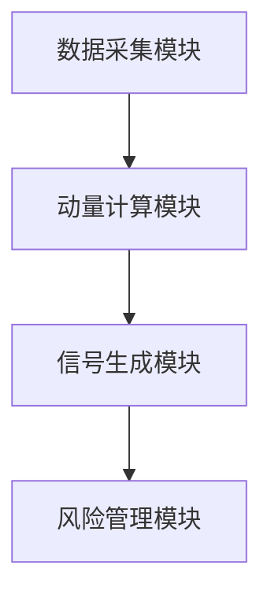

                 


# 动量投资策略：利用价格趋势获取收益

> **关键词**：动量投资策略、价格趋势、动量效应、趋势跟踪、投资收益、风险管理

> **摘要**：动量投资策略是一种基于价格趋势的投资方法，通过利用动量效应来获取收益。本文详细介绍了动量投资策略的核心概念、理论基础、系统设计、实战应用及高级策略，帮助读者全面理解并掌握如何利用价格趋势进行投资。

---

## 第1章 动量投资策略的概述

### 1.1 动量投资策略的基本概念

#### 1.1.1 动量效应的定义
动量效应是指资产价格在过去一段时间内表现出的趋势会在未来一段时间内延续的现象。简单来说，如果一只股票在过去几个月里持续上涨，根据动量效应，它可能会继续保持上涨趋势。

#### 1.1.2 动量投资策略的定义
动量投资策略是一种基于价格趋势的投资策略，通过买入价格趋势向上的资产，卖出价格趋势向下的资产，从而获取超额收益。

#### 1.1.3 动量投资策略的核心思想
动量投资策略的核心思想是“趋势会延续”。投资者通过识别和利用价格趋势，能够在市场中获得超额收益。

### 1.2 动量投资策略的应用场景

#### 1.2.1 股票市场中的动量效应
在股票市场中，动量效应表现得尤为明显。例如，一只股票在过去几个月内持续上涨，投资者可能会继续买入该股票，推动其价格进一步上涨。

#### 1.2.2 商品期货中的动量效应
在商品期货市场中，动量效应也存在。例如，黄金价格在过去一段时间内持续上涨，投资者可能会继续买入黄金，进一步推高价格。

#### 1.2.3 债券市场中的动量效应
在债券市场中，动量效应同样适用。例如，债券收益率在过去一段时间内持续下降，投资者可能会继续买入该债券，推动收益率进一步下降。

### 1.3 动量投资策略的优势与劣势

#### 1.3.1 动量投资策略的优势
- **趋势捕捉能力强**：动量策略能够有效捕捉价格趋势，从而在趋势延续期间获得收益。
- **简单易懂**：动量策略基于价格趋势，易于理解和实施。

#### 1.3.2 动量投资策略的劣势
- **市场波动风险**：动量策略在市场波动剧烈时可能表现不佳。
- **交易成本较高**：频繁交易可能导致较高的交易成本和滑点。

---

## 第2章 动量效应的理论基础

### 2.1 动量效应的定义与特性

#### 2.1.1 动量效应的定义
动量效应是指资产价格在过去一段时间内的趋势会在未来一段时间内延续的现象。

#### 2.1.2 动量效应的特性
- **持续性**：价格趋势一旦形成，往往会持续一段时间。
- **可预测性**：动量效应可以通过技术指标和模型进行预测。

### 2.2 动量因子的定义与计算

#### 2.2.1 动量因子的定义
动量因子是衡量资产价格动量效应的指标，通常使用过去一段时间内的价格变动来计算。

#### 2.2.2 动量因子的计算方法
动量因子可以通过以下公式计算：
$$
Momentum = \frac{P_t - P_{t-n}}{P_{t-n}}
$$
其中，\( P_t \) 是当前价格，\( P_{t-n} \) 是 \( n \) 天前的价格。

#### 2.2.3 动量因子的特性分析
- **正向动量因子**：当动量因子为正时，资产价格处于上升趋势。
- **负向动量因子**：当动量因子为负时，资产价格处于下降趋势。

### 2.3 动量模型的构建与应用

#### 2.3.1 动量模型的构建
动量模型通常包括动量因子的计算、信号生成和风险管理三部分。

#### 2.3.2 动量模型的应用
动量模型可以应用于股票、商品期货等多种资产类别，帮助投资者识别价格趋势并进行交易决策。

---

## 第3章 动量投资策略的核心要素

### 3.1 价格动量的定义与计算

#### 3.1.1 价格动量的定义
价格动量是指资产价格在过去一段时间内的变动情况，通常通过动量因子来衡量。

#### 3.1.2 价格动量的计算方法
价格动量可以通过以下公式计算：
$$
Price\ Momentum = \frac{P_t - P_{t-n}}{P_{t-n}}
$$

#### 3.1.3 价格动量的特性分析
- **上升趋势**：当价格动量为正时，资产价格处于上升趋势。
- **下降趋势**：当价格动量为负时，资产价格处于下降趋势。

### 3.2 成交量动量的定义与计算

#### 3.2.1 成交量动量的定义
成交量动量是指资产交易量在过去一段时间内的变动情况，通常用于辅助判断价格趋势的强度。

#### 3.2.2 成交量动量的计算方法
成交量动量可以通过以下公式计算：
$$
Volume\ Momentum = \frac{V_t - V_{t-n}}{V_{t-n}}
$$

#### 3.2.3 成交量动量的特性分析
- **成交量与价格趋势的关系**：成交量动量与价格动量通常呈正相关关系，即成交量增加时，价格趋势可能更强劲。
- **成交量作为信号**：成交量动量可以作为价格动量的补充信号，帮助投资者更好地判断趋势强度。

### 3.3 市场情绪动量的定义与计算

#### 3.3.1 市场情绪动量的定义
市场情绪动量是指投资者情绪在过去一段时间内的变动情况，通常通过市场情绪指标来衡量。

#### 3.3.2 市场情绪动量的计算方法
市场情绪动量可以通过以下公式计算：
$$
Market\ Sentiment\ Momentum = \frac{S_t - S_{t-n}}{S_{t-n}}
$$
其中，\( S_t \) 是当前市场情绪指数，\( S_{t-n} \) 是 \( n \) 天前的市场情绪指数。

#### 3.3.3 市场情绪动量的特性分析
- **市场情绪与价格趋势的关系**：市场情绪动量可以作为价格动量的补充指标，帮助投资者更好地判断市场趋势。

---

## 第4章 动量投资策略的系统设计

### 4.1 动量因子的计算方法

#### 4.1.1 动量因子的计算步骤
1. 收集历史价格数据。
2. 计算动量因子。
3. 确定动量因子的阈值。

#### 4.1.2 动量因子的计算代码示例
```python
import pandas as pd

# 假设 df 是包含历史价格数据的 DataFrame，'Close' 列为收盘价
n = 10  # 窗口长度
df['Momentum'] = (df['Close'] - df['Close'].shift(n)) / df['Close'].shift(n)
```

### 4.2 动量策略的信号生成

#### 4.2.1 信号生成规则
- 当动量因子大于一定阈值时，生成买入信号。
- 当动量因子小于一定阈值时，生成卖出信号。

#### 4.2.2 信号生成代码示例
```python
# 假设 df 是包含动量因子的 DataFrame
threshold = 0.05  # 阈值
df['Signal'] = 0
df['Signal'][df['Momentum'] > threshold] = 1
df['Signal'][df['Momentum'] < -threshold] = -1
```

### 4.3 风险管理机制

#### 4.3.1 止损策略
- 当价格跌破一定水平时，立即平仓以避免进一步亏损。

#### 4.3.2 头寸规模控制
- 根据账户资金和风险承受能力，确定每笔交易的头寸规模。

#### 4.3.3 风险管理代码示例
```python
# 假设 df 是包含价格和信号的 DataFrame
stop_loss = -0.02  # 止损比例
df['StopLoss'] = df['Close'] * (1 + stop_loss)
```

### 4.4 系统架构设计

#### 4.4.1 系统功能模块
- 数据采集模块：负责采集市场数据。
- 动量计算模块：负责计算动量因子。
- 信号生成模块：负责生成买入和卖出信号。
- 风险管理模块：负责控制交易风险。

#### 4.4.2 系统架构图


---

## 第5章 动量投资策略的实战应用

### 5.1 选择合适的工具和平台

#### 5.1.1 Python量化交易库
- **Pandas**：用于数据处理。
- **NumPy**：用于数值计算。
- **Matplotlib**：用于数据可视化。
- **Backtrader**：用于回测和模拟交易。

#### 5.1.2 选择合适的市场数据源
- **Yahoo Finance**：提供免费的历史价格数据。
- **Quandl**：提供高质量的市场数据。

### 5.2 数据获取与处理

#### 5.2.1 获取数据
```python
import pandas_datareader as pdr

# 下载股票数据
data = pdr.get_data_yahoo('AAPL', start='2020-01-01', end='2023-12-31')
```

#### 5.2.2 处理数据
```python
# 计算动量因子
n = 20
data['Momentum'] = (data['Close'] - data['Close'].shift(n)) / data['Close'].shift(n)
```

### 5.3 策略实现

#### 5.3.1 策略实现代码
```python
# 生成信号
threshold = 0.05
data['Signal'] = 0
data['Signal'][data['Momentum'] > threshold] = 1
data['Signal'][data['Momentum'] < -threshold] = -1
```

#### 5.3.2 策略实现流程
1. 计算动量因子。
2. 生成买入和卖出信号。
3. 执行交易。

### 5.4 回测与分析

#### 5.4.1 回测结果
- **夏普比率**：衡量策略的风险调整后收益。
- **最大回撤**：衡量策略的最大亏损幅度。

#### 5.4.2 回测代码示例
```python
# 计算回测结果
returns = data['Close'].pct_change()
positions = data['Signal'].shift(1)
backtest = pd.DataFrame({
    'Return': returns,
    'Position': positions
})
backtest['Strategy Return'] = backtest['Return'] * backtest['Position']
```

### 5.5 风险管理与优化

#### 5.5.1 风险管理策略
- **止损**：当价格下跌超过一定比例时，立即平仓。
- **头寸规模**：根据账户资金和风险承受能力，确定每笔交易的头寸规模。

#### 5.5.2 策略优化
- **调整动量因子的窗口长度**：通过回测找到最优窗口长度。
- **结合其他因子**：引入其他因子，如价值因子，构建多因子动量策略。

---

## 第6章 动量投资策略的高级应用

### 6.1 多因子动量策略

#### 6.1.1 多因子动量策略的定义
多因子动量策略是指同时考虑多个动量因子的投资策略，旨在提高策略的稳定性和收益能力。

#### 6.1.2 多因子动量策略的优势
- **分散风险**：通过结合多个动量因子，降低单一因子的风险。
- **提高收益**：通过多因子的协同作用，提高整体收益。

### 6.2 跨市场动量策略

#### 6.2.1 跨市场动量策略的定义
跨市场动量策略是指在不同市场之间进行动量投资，利用市场的差异性获取超额收益。

#### 6.2.2 跨市场动量策略的优势
- **市场多样性**：通过在不同市场之间分散投资，降低市场特定风险。
- **趋势一致性**：不同市场之间的动量效应可能不同，通过跨市场投资可以捕捉更多的动量机会。

### 6.3 机器学习在动量策略中的应用

#### 6.3.1 机器学习在动量策略中的应用
- **特征选择**：通过机器学习算法，选择最优的动量因子。
- **模型优化**：通过机器学习算法，优化动量策略的参数和结构。

#### 6.3.2 机器学习在动量策略中的优势
- **自动化**：机器学习能够自动识别和优化动量因子。
- **适应性**：机器学习能够适应市场变化，提高策略的灵活性。

### 6.4 算法交易

#### 6.4.1 算法交易的定义
算法交易是指通过计算机算法自动执行交易指令，通常用于高频交易和复杂策略的执行。

#### 6.4.2 算法交易在动量策略中的应用
- **自动化交易**：通过算法交易，实现动量策略的自动执行。
- **高频交易**：通过高频交易，捕捉短期价格波动，提高交易效率。

---

## 第7章 动量投资策略的最佳实践

### 7.1 策略优化与改进

#### 7.1.1 窗口长度的选择
- **回测分析**：通过回测找到最优的窗口长度。
- **动态调整**：根据市场变化，动态调整窗口长度。

#### 7.1.2 信号生成的优化
- **多因子结合**：结合多个动量因子，优化信号生成。
- **动态阈值**：根据市场环境变化，动态调整信号生成的阈值。

### 7.2 风险管理与控制

#### 7.2.1 止损策略
- **固定比例止损**：根据账户资金比例设置止损。
- **动态止损**：根据价格走势动态调整止损水平。

#### 7.2.2 风险分层
- **风险分层**：根据资产的风险等级，分层管理，降低整体风险。

### 7.3 交易成本与滑点控制

#### 7.3.1 交易成本
- **佣金成本**：不同交易平台的佣金成本不同，选择低佣金平台。
- **滑点成本**：通过优化交易时机和策略，降低滑点成本。

#### 7.3.2 滑点控制
- **最优执行时间**：选择市场流动性较高的时段执行交易，降低滑点。
- **订单类型**：使用市价单和限价单，控制交易成本。

### 7.4 心理因素与纪律性

#### 7.4.1 心理因素
- **贪婪与恐惧**：避免贪婪和恐惧影响决策，严格按照策略执行交易。
- **纪律性**：坚持策略，不因市场波动而随意改变策略。

#### 7.4.2 纪律性
- **严格执行策略**：不因市场环境变化而随意调整策略。
- **定期回顾与优化**：定期回顾策略表现，优化策略。

### 7.5 其他注意事项

#### 7.5.1 税务考虑
- **税务规划**：了解不同市场的税务政策，合理规划税务。

#### 7.5.2 法律合规
- **合规性**：确保策略符合当地法律法规，避免违规操作。

#### 7.5.3 市场环境变化
- **市场变化**：关注市场环境变化，及时调整策略。

#### 7.5.4 持续学习与优化
- **持续学习**：保持对市场和策略的了解，持续优化策略。

---

## 第8章 总结与展望

### 8.1 动量投资策略的总结
动量投资策略是一种简单有效的投资策略，通过捕捉价格趋势获取超额收益。尽管存在一定的风险，但通过合理的风险管理、策略优化和系统设计，可以显著提高策略的表现。

### 8.2 动量投资策略的未来展望
随着技术的进步和市场的变化，动量投资策略将不断发展和创新。未来，动量策略将更加智能化和自动化，通过结合机器学习和大数据分析，进一步提高策略的收益能力和稳定性。

---

## 作者：AI天才研究院 & 禅与计算机程序设计艺术

