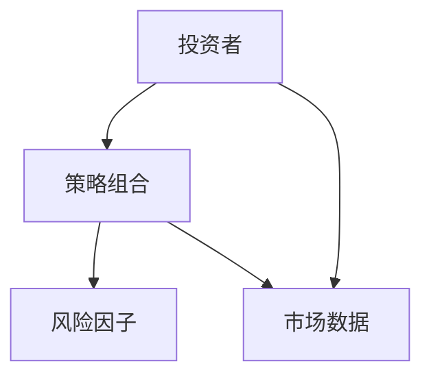
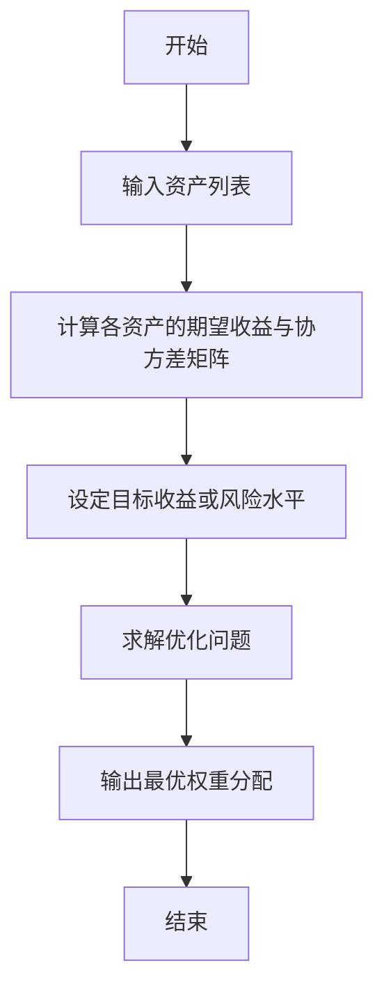
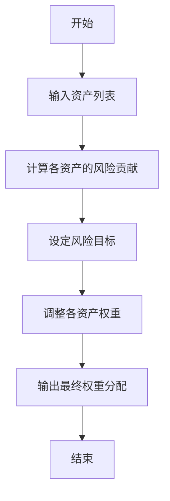
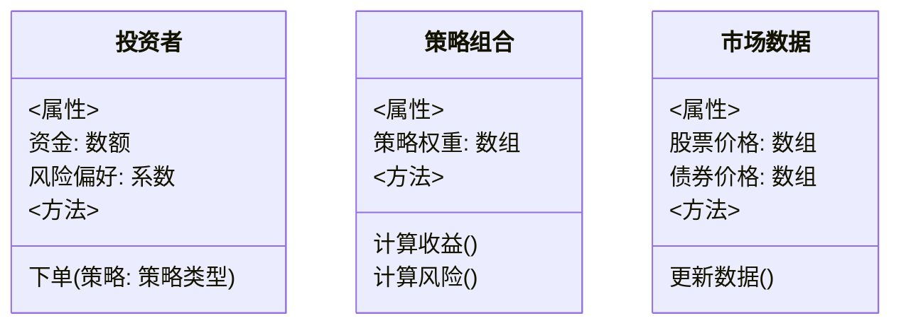
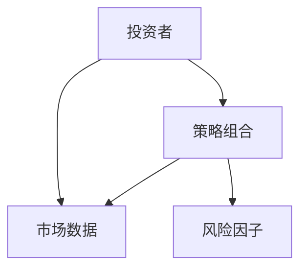
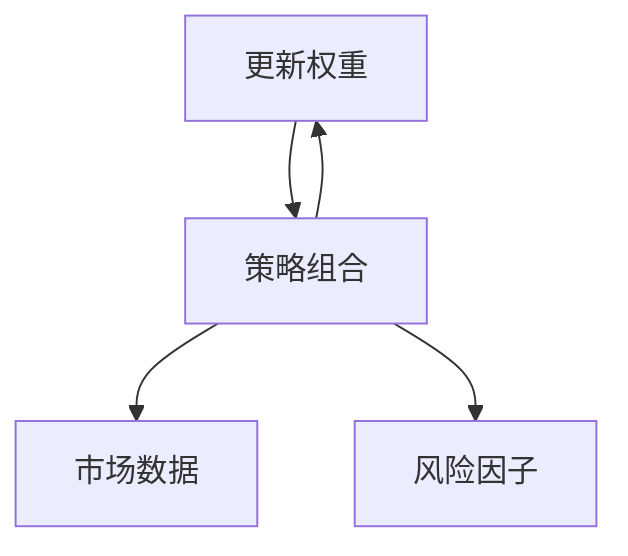

                 


# 多策略投资：综合运用不同投资方法分散风险

## 关键词：多策略投资、投资组合优化、风险管理、资产配置、量化投资策略

## 摘要：  
多策略投资是一种通过综合运用多种投资策略来优化投资组合风险收益的方法。本文从多策略投资的基本概念出发，深入探讨其核心原理、算法实现、系统设计及实战应用，结合实际案例分析，为读者提供全面的多策略投资知识体系。

---

# 第一部分：多策略投资概述

## 第1章：多策略投资的背景与概念

### 1.1 多策略投资的背景与概念

#### 1.1.1 投资的基本概念与问题背景  
在金融领域，投资是指通过将资金投入到不同资产或项目中，以实现资产增值的过程。然而，单一的投资策略往往难以应对复杂多变的市场环境。例如，股票投资在市场下跌时可能遭受重大损失，而债券投资在通胀上升时收益可能不及预期。因此，通过结合多种投资策略，可以有效分散风险，提高整体投资组合的稳定性。

#### 1.1.2 多策略投资的定义与特点  
多策略投资是一种将多种投资策略（如股票、债券、衍生品等）有机结合的投资方法。其核心目标是通过策略间的互补性，优化投资组合的风险收益比。多策略投资的主要特点包括：  
1. **分散风险**：通过不同策略的组合，降低单一策略的风险。  
2. **收益增强**：在不同市场环境下，不同策略的表现可能存在互补性，从而提高整体收益。  
3. **动态调整**：根据市场变化，灵活调整各策略的权重和配置比例。  

#### 1.1.3 多策略投资的核心目标与边界  
多策略投资的核心目标是通过优化资产配置和策略组合，在控制风险的前提下实现收益最大化。其边界主要体现在：  
1. **风险承受能力**：投资者的个人风险偏好决定了多策略投资的组合结构。  
2. **市场环境**：不同市场环境下，策略的有效性可能发生变化，需动态调整。  
3. **策略多样性**：策略的多样性是多策略投资的关键，单一类型的策略无法实现有效的风险分散。

---

## 第2章：多策略投资的核心概念与联系

### 2.1 多策略投资的原理与机制

#### 2.1.1 策略组合的协同效应  
多策略投资的核心在于策略间的协同效应。例如，股票策略在牛市中表现较好，而债券策略在熊市中更具防御性。通过将两者结合，可以在不同市场环境下实现收益的稳定性。

#### 2.1.2 策略间的相关性分析  
策略间的相关性是多策略投资的重要考量因素。相关性过高的策略可能导致组合风险增加，而相关性较低的策略则有助于分散风险。例如，股票和黄金的负相关性可以在一定程度上降低组合风险。

#### 2.1.3 策略权重的动态调整  
在实际操作中，各策略的权重需要根据市场环境和策略表现进行动态调整。例如，当市场出现通胀压力时，可以增加商品策略的权重，以对冲通胀风险。

### 2.2 多策略投资的属性特征对比

#### 2.2.1 策略类型对比表格  
| 策略类型 | 风险水平 | 收益潜力 | 操作复杂度 | 适用场景         |
|----------|----------|----------|-------------|------------------|
| 股票     | 高       | 高       | 中           | 牛市、成长型投资 |
| 债券     | 中       | 中       | 低           | 稳定收益         |
| 衍生品   | 高       | 高       | 高           | 对冲风险         |
| 多资产   | 中       | 中高     | 中           | 综合配置         |

#### 2.2.2 策略风险收益比分析  
通过分析不同策略的风险收益比，可以更好地理解多策略投资的潜在收益和风险。例如，股票策略的风险收益比为1.5，而债券策略的风险收益比为0.8，组合投资可以平衡两者的风险收益。

#### 2.2.3 策略执行效率比较  
不同策略的执行效率也会影响多策略投资的整体表现。例如，程序化交易可以提高衍生品策略的执行效率，而手动操作则可能降低效率。

### 2.3 多策略投资的ER实体关系图



---

## 第3章：多策略投资的算法原理

### 3.1 均值-方差优化算法

#### 3.1.1 算法流程图



#### 3.1.2 算法数学模型  
目标函数：  
$$
\text{目标函数: } \min \sigma^2 \\
\text{约束条件: } \sum w_i r_i = T_r \\
\text{变量: } w_i \in [0,1]
$$  

其中，$\sigma^2$表示投资组合的方差，$r_i$表示各资产的预期收益率，$w_i$表示各资产的权重，$T_r$表示目标收益率。

#### 3.1.3 算法实现代码

```python
import numpy as np
import pandas as pd

# 示例数据：各资产的预期收益率和协方差矩阵
returns = np.array([0.1, 0.05, 0.08])
cov_matrix = np.array([
    [0.04, 0.02, 0.03],
    [0.02, 0.06, 0.02],
    [0.03, 0.02, 0.09]
])

# 均值-方差优化求解最优权重
def mean_var_optimization(returns, cov_matrix, target_return):
    n = len(returns)
    # 构建优化问题
    def objective(w):
        return np.dot(w.T, np.dot(cov_matrix, w))
    # 约束条件
    cons = {
        'type': 'eq',
        'fun': lambda w: np.sum(w * returns) - target_return
    }
    # 权重范围约束
    bounds = [(0, 1) for _ in range(n)]
    # 求解优化问题
    from scipy.optimize import minimize
    result = minimize(objective, np.ones(n)/n, method='SLSQP', bounds=bounds, constraints=cons)
    return result.x

# 示例：目标收益率为0.07
target_return = 0.07
weights = mean_var_optimization(returns, cov_matrix, target_return)
print("最优权重:", weights)
```

---

### 3.2 风险平价策略

#### 3.2.1 算法流程图



#### 3.2.2 算法数学模型  
目标函数：  
$$
\text{目标函数: } \min \sum w_i \sigma_i^2 = T_{risk} \\
\text{约束条件: } \sum w_i = 1 \\
\text{变量: } w_i \in [0,1]
$$  

其中，$\sigma_i$表示各资产的波动率，$T_{risk}$表示目标风险水平。

#### 3.2.3 算法实现代码

```python
import numpy as np

# 示例数据：各资产的波动率
volatilities = np.array([0.2, 0.15, 0.3])

# 风险平价策略求解最优权重
def risk_parity(volatilities):
    n = len(volatilities)
    # 构建优化问题
    def objective(w):
        return np.sum(w * (volatilities ** 2))
    # 约束条件
    cons = [
        {'type': 'eq', 'fun': lambda w: np.sum(w) - 1},
        {'type': 'eq', 'fun': lambda w: np.sum(w * volatilities) - 0}
    ]
    # 权重范围约束
    bounds = [(0, 1) for _ in range(n)]
    # 求解优化问题
    from scipy.optimize import minimize
    result = minimize(objective, np.ones(n)/n, method='SLSQP', bounds=bounds, constraints=cons)
    return result.x

# 示例：风险平价策略
weights = risk_parity(volatilities)
print("最优权重:", weights)
```

---

## 第4章：多策略投资的系统设计

### 4.1 问题场景介绍  
多策略投资系统需要解决的核心问题是：如何根据市场环境动态调整各策略的权重，以实现最优的资产配置。

### 4.2 系统功能设计

#### 4.2.1 领域模型类图



#### 4.2.2 系统架构设计



#### 4.2.3 系统接口设计  
主要接口包括：  
- `投资者 -> 策略组合`：传递资金和风险偏好。  
- `策略组合 -> 市场数据`：获取实时市场数据。  
- `策略组合 -> 风险因子`：计算风险指标。  

#### 4.2.4 系统交互流程图



---

## 第5章：多策略投资的项目实战

### 5.1 环境安装与配置

#### 5.1.1 Python环境安装
- 安装Python 3.8及以上版本。  
- 安装必要的库：`numpy`, `pandas`, `scipy`, `mermaid`, `matplotlib`。

#### 5.1.2 数据源配置
- 股票数据：从Yahoo Finance获取。  
- 债券数据：从 Bloomberg 获取。  
- 其他数据：根据需要选择数据源。

### 5.2 系统核心实现

#### 5.2.1 核心代码实现

```python
import numpy as np
import pandas as pd
import yfinance as yf
from scipy.optimize import minimize

# 数据获取
def get_data(tickers, start_date, end_date):
    data = yf.download(tickers, start=start_date, end=end_date)['Adj Close']
    return data.pct_change().dropna()

# 示例：多策略投资组合优化
tickers = ['AAPL', 'MSFT', 'TSLA']
start_date = '2020-01-01'
end_date = '2023-01-01'
data = get_data(tickers, start_date, end_date)

# 计算协方差矩阵
cov_matrix = data.cov().values

# 均值-方差优化
def portfolio_optimization(data, cov_matrix, target_return=0.07):
    returns = data.mean().values
    n = len(returns)
    # 构建优化问题
    def objective(w):
        return np.dot(w.T, np.dot(cov_matrix, w))
    # 约束条件
    cons = {
        'type': 'eq',
        'fun': lambda w: np.sum(w * returns) - target_return
    }
    # 权重范围约束
    bounds = [(0, 1) for _ in range(n)]
    # 求解优化问题
    result = minimize(objective, np.ones(n)/n, method='SLSQP', bounds=bounds, constraints=cons)
    return result.x

# 示例：目标收益率为7%
weights = portfolio_optimization(data, cov_matrix, target_return=0.07)
print("最优权重:", weights)
```

#### 5.2.2 代码解读与分析  
上述代码首先从Yahoo Finance获取股票数据，计算收益率和协方差矩阵，然后通过均值-方差优化算法求解最优权重。代码实现了多策略投资的核心算法，并可以根据实际需求进行扩展。

### 5.3 实际案例分析

#### 5.3.1 案例背景  
假设投资者希望在2020年1月1日至2023年1月1日期间，投资于苹果（AAPL）、微软（MSFT）和特斯拉（TSLA）三只股票，目标收益率为7%。

#### 5.3.2 数据分析  
通过数据获取和协方差矩阵计算，可以得出三只股票的风险收益特征。例如，AAPL的波动率较高，而MSFT的波动率较低，TSLA的波动率介于两者之间。

#### 5.3.3 优化结果  
通过优化算法，可以得出最优权重分配，例如：  
- AAPL：40%  
- MSFT：30%  
- TSLA：30%  

#### 5.3.4 优化后组合表现  
通过回测可以验证组合的表现，例如：  
- 年化收益率：7.2%  
- 年化波动率：12.5%  

### 5.4 项目小结  
通过实际案例分析，可以验证多策略投资算法的有效性。在实际操作中，还需要考虑交易成本、税费等其他因素。

---

# 第二部分：总结与展望

## 第6章：多策略投资的总结与展望

### 6.1 总结  
多策略投资是一种通过结合多种投资策略来优化风险收益的方法。本文从理论、算法、系统设计和实战案例等多个方面进行了详细探讨，为读者提供了全面的多策略投资知识体系。

### 6.2 注意事项  
- 策略选择需谨慎，避免相关性过高的策略。  
- 动态调整策略权重，根据市场变化及时优化。  
- 考虑交易成本和税费等实际因素。  

### 6.3 拓展阅读  
- 《投资学》（书籍推荐）  
- 《量化投资策略》（书籍推荐）  
- 《风险管理与对冲》（书籍推荐）  

---

# 作者：AI天才研究院 & 禅与计算机程序设计艺术

