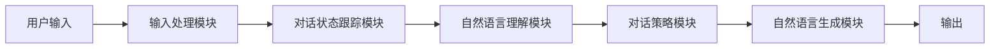
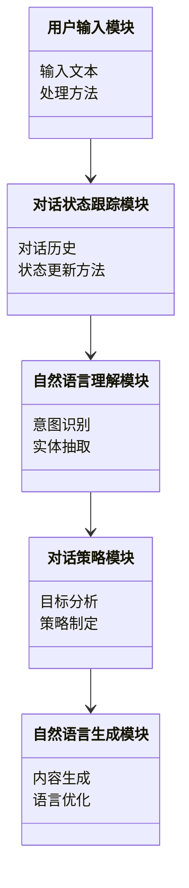
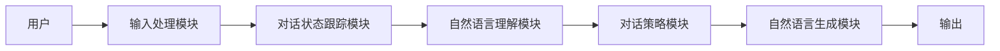
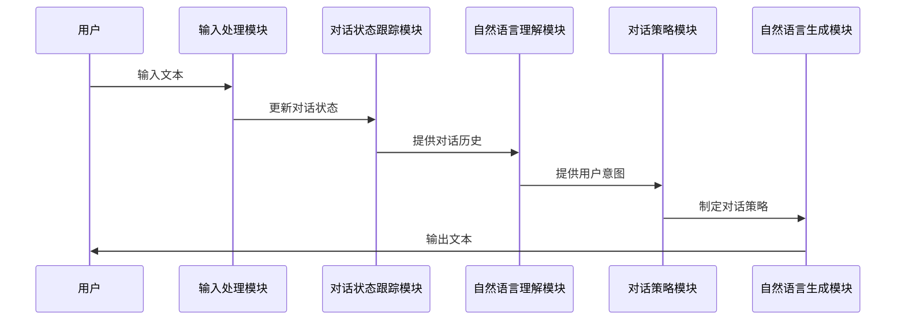

                 


# 多轮对话处理：提高AI Agent的交互质量

## 关键词：多轮对话、AI Agent、交互质量、对话系统、Seq2Seq模型、自然语言处理、对话状态跟踪

## 摘要：  
本文深入探讨了多轮对话处理的核心概念、算法原理、系统架构及实际应用。通过分析对话系统的组件、多轮对话的挑战、Seq2Seq模型的原理、端到端对话模型的设计、对话系统的功能设计、架构设计、接口设计和交互流程，结合实际案例分析，详细讲解了如何提高AI Agent的交互质量。本文旨在为读者提供从理论到实践的全面指导，帮助他们更好地理解和实现高效的多轮对话系统。

---

# 第一部分：多轮对话处理基础

## 第1章：多轮对话处理的背景与概念

### 1.1 多轮对话的定义与特点
#### 1.1.1 多轮对话的定义  
多轮对话是指用户与AI Agent之间通过多轮交互完成任务的过程。与单轮对话相比，多轮对话能够更好地模拟人类自然对话的复杂性，支持上下文理解和持续的交互。

#### 1.1.2 多轮对话的核心特点
- **上下文依赖性**：对话内容依赖于之前的交互历史。
- **动态性**：对话状态随用户的输入动态变化。
- **复杂性**：需要处理歧义、意图变化和潜在的对话目标。

#### 1.1.3 多轮对话与单轮对话的对比
| 特性 | 单轮对话 | 多轮对话 |
|------|----------|----------|
| 交互次数 | 一次 | 多次 |
| 上下文 | 无 | 有 |
| 对话目标 | 单一 | 多样 |

### 1.2 多轮对话处理的背景与应用
#### 1.2.1 多轮对话处理的背景  
随着AI技术的快速发展，用户对AI Agent的需求日益增长。多轮对话能够提供更自然、更高效的交互体验，因此成为AI Agent的核心技术之一。

#### 1.2.2 多轮对话处理的应用场景
- **智能客服**：通过多轮对话帮助用户解决问题。
- **智能助手**：如Siri、Alexa等，支持多轮交互。
- **教育机器人**：通过多轮对话提供个性化的学习支持。
- **社交机器人**：模拟人类对话，增强用户体验。

#### 1.2.3 多轮对话处理的挑战
- **对话状态管理**：如何高效跟踪和更新对话状态。
- **意图识别**：在多轮对话中准确识别用户的意图。
- **上下文理解**：如何处理复杂且变化的上下文。

### 1.3 多轮对话处理的边界与外延
#### 1.3.1 多轮对话处理的边界
- **输入范围**：仅限于文本输入。
- **输出范围**：仅限于文本输出。
- **对话限制**：对话长度和复杂度有限。

#### 1.3.2 多轮对话处理的外延
- **情感分析**：分析用户情绪，优化对话体验。
- **对话策略**：根据对话历史制定下一步交互策略。
- **知识库集成**：结合领域知识提供更准确的响应。

#### 1.3.3 多轮对话处理与其他技术的关系
- **自然语言处理（NLP）**：多轮对话的基础技术。
- **机器学习**：用于对话模型的训练和优化。
- **知识图谱**：提供领域知识支持。

### 1.4 多轮对话处理的概念结构
#### 1.4.1 多轮对话处理的核心要素
- **对话历史**：记录用户和AI Agent的交互记录。
- **对话状态**：当前对话的上下文信息。
- **对话目标**：对话的最终目标或任务。

#### 1.4.2 多轮对话处理的概念模型
多轮对话处理可以看作是一个状态机，通过输入用户的文本，更新对话状态，并生成相应的输出。

#### 1.4.3 多轮对话处理的系统架构


### 1.5 本章小结
本章介绍了多轮对话的定义、特点、应用场景和挑战，并探讨了其边界与外延。通过概念模型和系统架构图，读者可以清晰地理解多轮对话处理的核心要素和整体结构。

---

# 第二部分：多轮对话处理的核心概念与联系

## 第2章：对话系统的组件与核心概念

### 2.1 对话系统的组件分析
#### 2.1.1 输入处理模块
- **功能**：将用户的输入文本进行预处理，提取关键信息。
- **流程**：文本清洗、分词、实体识别。

#### 2.1.2 对话状态跟踪模块
- **功能**：记录对话历史，更新对话状态。
- **流程**：状态初始化、状态更新、状态查询。

#### 2.1.3 自然语言理解模块
- **功能**：理解用户输入的语义，提取意图和实体。
- **流程**：语义解析、意图识别、实体抽取。

#### 2.1.4 对话策略模块
- **功能**：根据对话状态制定下一步交互策略。
- **流程**：目标分析、策略选择、策略执行。

#### 2.1.5 自然语言生成模块
- **功能**：根据对话策略生成自然语言输出。
- **流程**：内容生成、语言优化、输出生成。

### 2.2 对话系统的实体关系图


### 2.3 对话系统的属性特征对比
| 组件 | 输入 | 输出 | 功能 |
|------|------|------|------|
| 输入处理模块 | 用户输入文本 | 结构化输入 | 文本预处理 |
| 对话状态跟踪模块 | 当前对话状态 | 更新后的对话状态 | 状态管理 |
| 自然语言理解模块 | 结构化输入 | 用户意图和实体 | 语义理解 |
| 对话策略模块 | 用户意图和实体 | 对话策略 | 策略制定 |
| 自然语言生成模块 | 对话策略 | 自然语言输出 | 内容生成 |

### 2.4 本章小结
本章详细分析了对话系统的各个组件及其功能，通过实体关系图和属性特征对比，展示了各组件之间的协同工作关系。

---

# 第三部分：多轮对话处理的算法原理

## 第3章：Seq2Seq模型的原理与实现

### 3.1 Seq2Seq模型的基本原理
#### 3.1.1 编码器
- **功能**：将输入序列编码为一个固定长度的向量。
- **流程**：输入嵌入、编码器网络、输出隐藏状态。

#### 3.1.2 解码器
- **功能**：根据编码器输出生成目标序列。
- **流程**：解码器输入、解码器网络、输出目标序列。

#### 3.1.3 注意力机制
- **功能**：增强模型对输入特定部分的聚焦能力。
- **流程**：计算注意力权重、加权求和、生成输出。

### 3.2 Seq2Seq模型的数学表达
#### 3.2.1 编码器
$$
\text{编码器输入} = x_1, x_2, ..., x_n
$$

$$
h_i = \text{编码器网络}(h_{i-1}, x_i)
$$

#### 3.2.2 解码器
$$
y_i = \text{解码器网络}(h_i, s_{i-1})
$$

$$
\text{解码器输出} = y_1, y_2, ..., y_m
$$

### 3.3 Seq2Seq模型的优化
#### 3.3.1 损失函数
$$
\text{损失函数} = -\sum_{i=1}^{m} \log P(y_i | y_{<i}, x)
$$

#### 3.3.2 解码过程
$$
s_0 = \text{初始化向量}
$$

$$
s_i = \text{解码器网络}(s_{i-1}, y_{i-1})
$$

### 3.4 本章小结
本章详细讲解了Seq2Seq模型的基本原理和数学表达，分析了其在多轮对话处理中的应用。

---

## 第4章：端到端对话模型的设计与实现

### 4.1 端到端对话模型的概述
#### 4.1.1 端到端对话模型的特点
- **直接训练**：无需手动设计对话策略。
- **自适应性**：能够根据对话历史自适应地生成响应。

### 4.2 端到端对话模型的数学模型
$$
P(y | x) = \prod_{i=1}^{m} P(y_i | y_{<i}, x)
$$

### 4.3 端到端对话模型的实现
#### 4.3.1 输入处理
- **文本预处理**：分词、去停用词、向量化。

#### 4.3.2 模型训练
- **训练数据**：多轮对话数据。
- **训练目标**：最小化损失函数。

#### 4.3.3 模型推理
- **推理流程**：输入文本，生成响应。

### 4.4 本章小结
本章介绍了端到端对话模型的设计与实现，分析了其在多轮对话处理中的优势。

---

# 第四部分：多轮对话处理的系统分析与架构设计

## 第5章：系统功能设计与实现

### 5.1 系统功能设计
#### 5.1.1 领域模型


### 5.2 系统架构设计
#### 5.2.1 系统架构图


### 5.3 系统接口设计
#### 5.3.1 输入接口
- **输入格式**：文本字符串。
- **输出格式**：结构化数据。

#### 5.3.2 输出接口
- **输出格式**：文本字符串。
- **格式要求**：自然语言表达。

### 5.4 系统交互流程


### 5.5 本章小结
本章详细分析了系统的功能设计、架构设计和交互流程，展示了多轮对话处理的整体架构。

---

## 第6章：项目实战与案例分析

### 6.1 项目背景
- **项目目标**：实现一个简单的多轮对话系统。
- **项目需求**：支持用户与AI Agent的多轮交互。

### 6.2 项目核心代码实现
#### 6.2.1 环境安装
```bash
pip install numpy
pip install tensorflow
pip install matplotlib
```

#### 6.2.2 核心代码
```python
import numpy as np
import tensorflow as tf

# 编码器网络
def encoder(input_shape):
    encoder_input = Input(shape=input_shape)
    encoder_lstm = LSTM(128, return_sequences=True)(encoder_input)
    return encoder_lstm

# 解码器网络
def decoder(output_shape):
    decoder_input = Input(shape=(None, 128))
    decoder_lstm = LSTM(128, return_sequences=True)(decoder_input)
    decoder_dense = Dense(output_shape, activation='softmax')(decoder_lstm)
    return decoder_dense

# 模型训练
def train_model(train_data, val_data):
    encoder_output = encoder((None, input_vocabulary_size))
    decoder_output = decoder(output_vocabulary_size)
    model = Model(inputs=[encoder_input, decoder_input], outputs=decoder_output)
    model.compile(optimizer='adam', loss='categorical_crossentropy', metrics=['accuracy'])
    model.fit([train_data_encoder, train_data_decoder], train_labels, epochs=10, validation_data=(val_data_encoder, val_data_decoder))
```

### 6.3 案例分析与实现解读
#### 6.3.1 案例分析
- **案例背景**：用户与AI Agent的多轮对话。
- **实现解读**：通过编码器和解码器网络实现对话处理。

### 6.4 本章小结
本章通过项目实战，详细讲解了多轮对话系统的实现过程，包括环境安装、核心代码实现和案例分析。

---

# 第五部分：多轮对话处理的最佳实践与优化

## 第7章：多轮对话处理的最佳实践

### 7.1 对话系统的优化策略
#### 7.1.1 对话状态管理
- **优化点**：动态更新对话状态，减少冗余信息。
- **实现建议**：使用高效的存储结构和更新机制。

#### 7.1.2 意图识别
- **优化点**：结合领域知识，提高意图识别的准确率。
- **实现建议**：使用预训练模型和领域知识库。

#### 7.1.3 自然语言生成
- **优化点**：生成更自然、更流畅的对话内容。
- **实现建议**：引入语言模型和领域知识。

### 7.2 对话系统的注意事项
#### 7.2.1 对话历史的长度
- **建议**：保持对话历史在合理范围内，避免过长。

#### 7.2.2 对话策略的多样性
- **建议**：根据对话历史和用户意图，灵活调整对话策略。

#### 7.2.3 对话系统的健壮性
- **建议**：设计健壮的对话系统，能够处理各种异常情况。

### 7.3 本章小结
本章总结了多轮对话处理的最佳实践，提供了优化策略和注意事项，帮助读者提高AI Agent的交互质量。

---

# 第六部分：总结与展望

## 第8章：总结与展望

### 8.1 本文总结
本文系统地探讨了多轮对话处理的核心概念、算法原理、系统架构和实际应用。通过理论与实践的结合，为读者提供了全面的指导。

### 8.2 未来展望
随着AI技术的不断发展，多轮对话处理将更加智能化和个性化。未来的研究方向包括更高效的对话模型、更自然的语言生成和更智能的对话策略。

---

# 作者：AI天才研究院/AI Genius Institute & 禅与计算机程序设计艺术 /Zen And The Art of Computer Programming

---

感谢您的阅读！希望本文对您理解多轮对话处理和提高AI Agent的交互质量有所帮助！

