                 


# 开发具有增强现实能力的AI Agent

> 关键词：增强现实、AI Agent、计算机视觉、自然语言处理、机器学习、AR技术、人机交互

> 摘要：本文探讨了开发具有增强现实能力的AI Agent的关键技术，涵盖了增强现实与AI Agent的核心概念、算法原理、系统架构设计及项目实战。通过详细分析，展示了如何将增强现实技术与AI Agent结合，实现更智能、更自然的交互体验。

---

# 第一部分: 开发具有增强现实能力的AI Agent背景介绍

## 第1章: 增强现实与AI Agent概述

### 1.1 增强现实技术的基本概念

#### 1.1.1 增强现实的定义与特点
- **定义**：增强现实（Augmented Reality，AR）是通过计算机技术将虚拟信息叠加到真实世界中，从而实现对现实世界的增强。
- **特点**：
  - 实时性：AR需要实时处理和叠加虚拟信息。
  - 交互性：用户可以通过手势、语音等方式与AR系统交互。
  - 高精度：AR需要精确的定位和跟踪技术，以确保虚拟信息与真实环境的对齐。

#### 1.1.2 增强现实的核心技术
- **图像处理**：包括图像分割、目标检测等技术，用于识别和定位真实环境中的物体。
- **三维重建**：通过深度传感器和算法，重建真实环境的三维模型。
- **图形渲染**：将虚拟信息渲染到真实环境中，确保视觉上的逼真。

#### 1.1.3 增强现实的应用场景
- **教育培训**：通过AR技术，学生可以在虚拟环境中学习复杂的知识。
- **游戏娱乐**：如《Pokémon GO》等游戏，将虚拟角色叠加到真实环境中。
- **工业应用**：如制造业中的设备维护和操作指南。

### 1.2 AI Agent的基本概念

#### 1.2.1 AI Agent的定义与特点
- **定义**：AI Agent（智能代理）是能够感知环境并采取行动以实现目标的智能实体。
- **特点**：
  - 智能性：AI Agent能够自主决策和学习。
  - 适应性：能够根据环境变化调整行为。
  - 交互性：能够与人类或其他系统进行交互。

#### 1.2.2 AI Agent的核心技术
- **自然语言处理**：使AI Agent能够理解和生成人类语言。
- **机器学习**：通过数据训练，提升AI Agent的决策和预测能力。
- **推理与规划**：基于环境信息，进行逻辑推理和行为规划。

#### 1.2.3 AI Agent的应用场景
- **智能家居**：AI Agent可以控制家中的设备，提供智能化的生活体验。
- **客户服务**：通过对话系统，为用户提供个性化的服务。
- **自动驾驶**：AI Agent作为车辆的决策系统，实现自动驾驶功能。

### 1.3 增强现实与AI Agent的结合

#### 1.3.1 增强现实与AI Agent的结合意义
- **提升交互体验**：通过AR技术，AI Agent可以以更直观的方式与用户交互。
- **增强信息处理能力**：AR提供的视觉增强信息可以帮助AI Agent更好地理解环境。
- **扩展应用场景**：结合AR和AI技术，可以开发出更多创新的应用场景。

#### 1.3.2 增强现实与AI Agent的结合方式
- **视觉增强**：AI Agent通过AR技术，将相关信息叠加到用户视野中。
- **语音交互**：结合语音识别和自然语言处理技术，实现更自然的交互。
- **环境感知**：AI Agent通过AR技术，实时感知和理解周围环境。

#### 1.3.3 增强现实与AI Agent的未来发展
- **更智能的交互**：随着技术进步，AI Agent将能够更准确地理解用户的意图，并通过AR技术提供更个性化的服务。
- **更广泛的应用**：AR和AI技术的结合将扩展到更多领域，如医疗、教育、娱乐等。

### 1.4 本章小结
本章介绍了增强现实和AI Agent的基本概念及其应用场景，并探讨了两者结合的意义和方式。通过这些内容，读者可以理解开发具有增强现实能力的AI Agent的重要性和潜力。

---

## 第2章: 增强现实与AI Agent的核心概念

### 2.1 增强现实的核心概念

#### 2.1.1 增强现实的实现原理
- **图像处理**：通过摄像头采集环境图像，并进行图像分割和目标检测。
- **三维重建**：利用深度传感器和算法，重建环境的三维模型。
- **图形渲染**：将虚拟信息渲染到真实环境中，与实际图像融合。

#### 2.1.2 增强现实的关键技术
- **SLAM（同步定位与地图构建）**：通过摄像头和IMU数据，实现对环境的实时定位和地图构建。
- **AR SDK**：如ARKit、ARCore等，提供了AR应用开发的框架和支持。

#### 2.1.3 增强现实的实体关系图
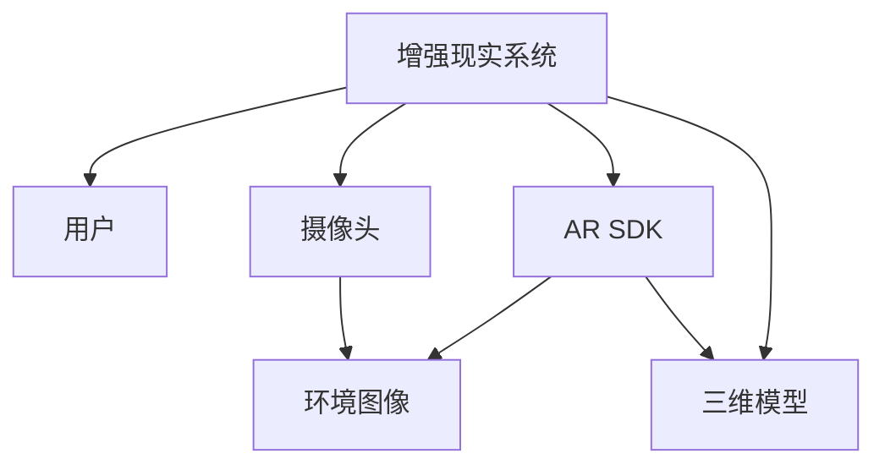

### 2.2 AI Agent的核心概念

#### 2.2.1 AI Agent的实现原理
- **感知**：通过传感器或摄像头获取环境信息。
- **推理**：基于感知信息进行逻辑推理和决策。
- **行动**：根据推理结果，执行相应的动作。

#### 2.2.2 AI Agent的关键技术
- **自然语言处理**：如BERT、GPT等模型，用于处理和生成人类语言。
- **强化学习**：通过与环境的交互，学习最优策略。
- **知识图谱**：构建领域知识，辅助推理和决策。

#### 2.2.3 AI Agent的实体关系图
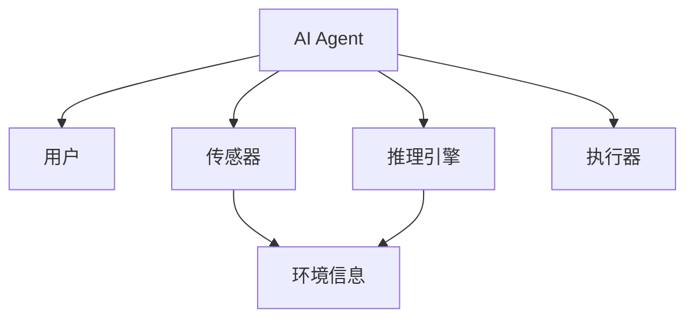

### 2.3 增强现实与AI Agent的联系

#### 2.3.1 增强现实与AI Agent的属性对比
| 属性 | 增强现实 | AI Agent |
|------|----------|----------|
| 核心技术 | 图像处理、三维重建 | 自然语言处理、强化学习 |
| 应用场景 | 教育、游戏、工业 | 智能家居、客户服务、自动驾驶 |
| 交互方式 | 视觉、手势 | 视觉、语音 |

#### 2.3.2 增强现实与AI Agent的关系图
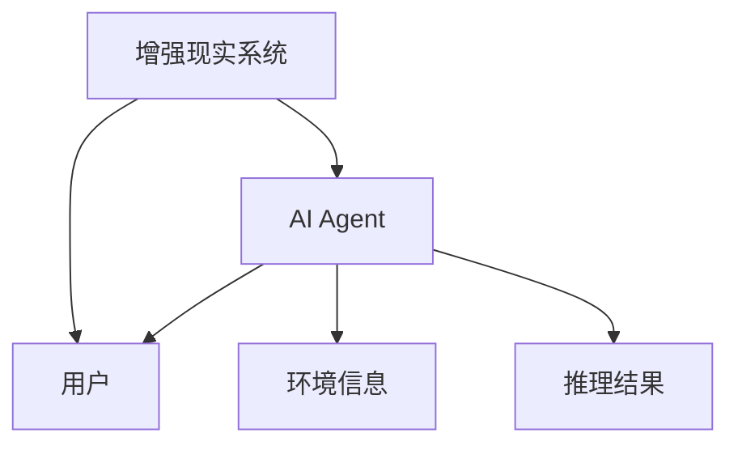

### 2.4 本章小结
本章详细分析了增强现实和AI Agent的核心概念，并通过对比和关系图展示了它们的联系。这为后续的算法设计和系统实现奠定了基础。

---

## 第3章: 开发具有增强现实能力的AI Agent算法原理

### 3.1 增强现实的核心算法

#### 3.1.1 目标检测算法
- **算法原理**：通过YOLO、Faster R-CNN等算法，实现对环境中物体的检测和定位。
- **流程图**：
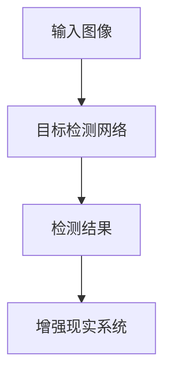

#### 3.1.2 图像识别算法
- **算法原理**：使用ResNet、Inception等模型，实现对图像的分类和识别。
- **流程图**：
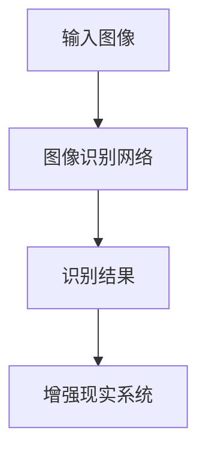

#### 3.1.3 SLAM算法
- **算法原理**：通过摄像头和IMU数据，实现对环境的实时定位和地图构建。
- **流程图**：
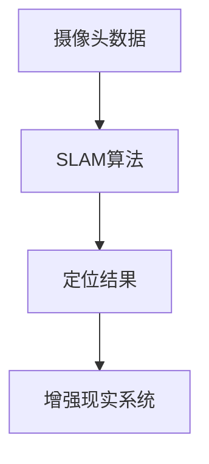

### 3.2 AI Agent的核心算法

#### 3.2.1 自然语言处理算法
- **算法原理**：使用Transformer模型，实现对自然语言的处理和生成。
- **流程图**：
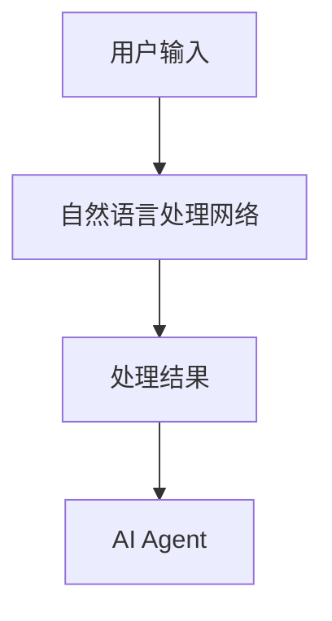

#### 3.2.2 强化学习算法
- **算法原理**：通过与环境的交互，学习最优策略。
- **流程图**：
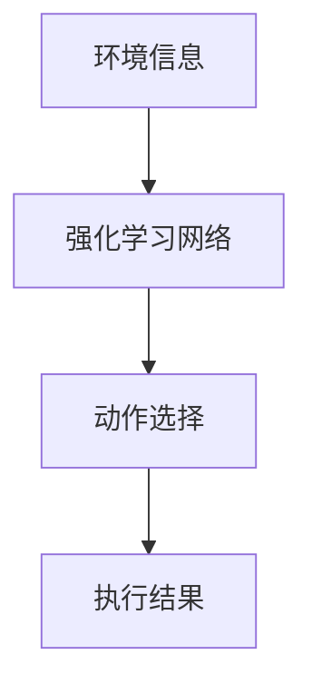

### 3.3 增强现实与AI Agent的结合算法

#### 3.3.1 算法融合
- **算法原理**：将增强现实的图像处理和AI Agent的自然语言处理结合，实现更智能的交互。
- **流程图**：
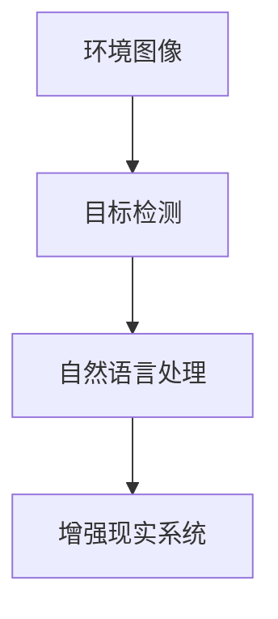

#### 3.3.2 算法实现
- **代码示例**：
```python
import cv2
import numpy as np

# 目标检测
def detect_objects(image):
    # 使用YOLO算法进行目标检测
    # 返回检测结果
    pass

# 图像识别
def recognize_image(image):
    # 使用ResNet算法进行图像分类
    # 返回识别结果
    pass

# 自然语言处理
def process_language(text):
    # 使用Transformer模型进行自然语言处理
    # 返回处理结果
    pass

# 增强现实
def enhance_reality(image):
    # 调用AR SDK进行增强现实处理
    # 返回增强后的图像
    pass

# 组合算法
def main():
    image = cv2.imread('input.jpg')
    objects = detect_objects(image)
    recognition = recognize_image(image)
    text = "Detected objects: " + ", ".join(objects)
    language_result = process_language(text)
    enhanced_image = enhance_reality(image)
    cv2.imshow('Result', enhanced_image)
    cv2.waitKey(0)
```

### 3.4 本章小结
本章详细讲解了增强现实和AI Agent的核心算法，并展示了如何将这些算法结合，实现更智能的交互。通过代码示例，读者可以更好地理解算法的实现和应用。

---

## 第4章: 开发具有增强现实能力的AI Agent系统架构设计

### 4.1 系统功能设计

#### 4.1.1 领域模型
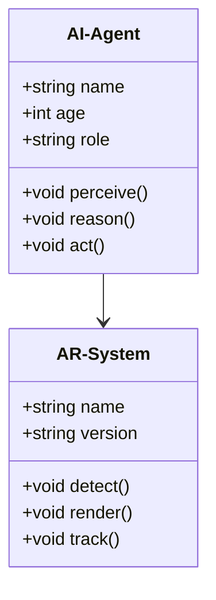

#### 4.1.2 功能模块
- **AR处理模块**：负责增强现实的图像处理和渲染。
- **AI Agent模块**：负责感知、推理和行动。
- **用户交互模块**：负责与用户的交互，如语音识别和语音合成。

### 4.2 系统架构设计

#### 4.2.1 系统架构图
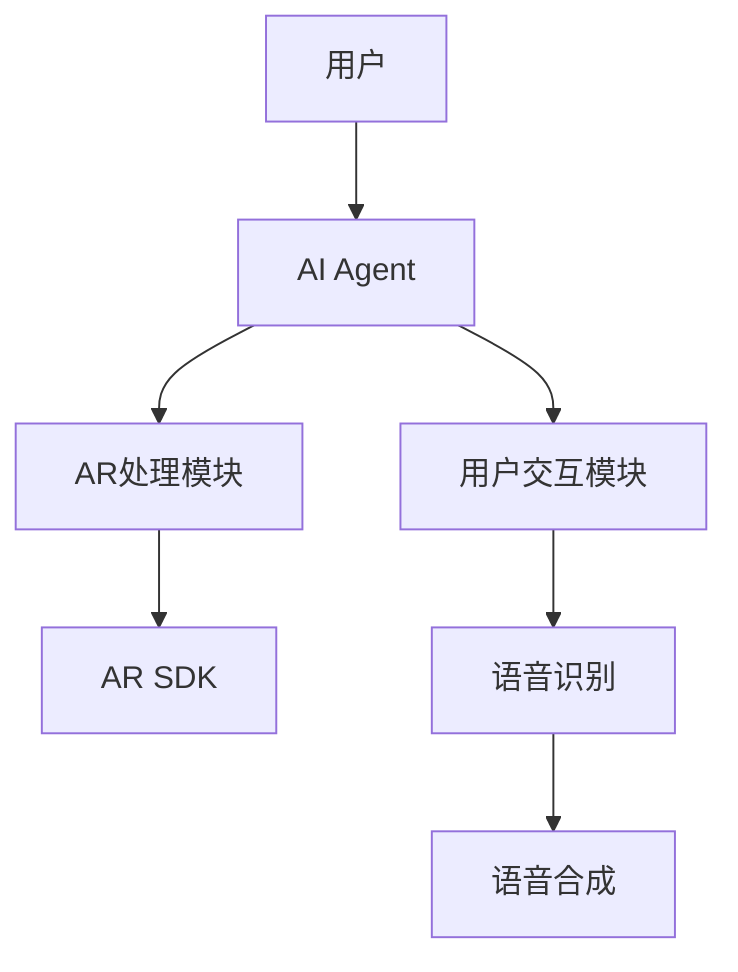

#### 4.2.2 系统接口设计
- **AI Agent接口**：提供感知、推理和行动的API。
- **AR处理接口**：提供图像处理和渲染的API。
- **用户交互接口**：提供语音识别和合成的API。

### 4.3 本章小结
本章通过系统功能设计和架构设计，展示了开发具有增强现实能力的AI Agent的整体结构和模块关系。这为后续的实现提供了清晰的指导。

---

## 第5章: 开发具有增强现实能力的AI Agent项目实战

### 5.1 环境安装

#### 5.1.1 安装Python
```bash
python --version
pip install --upgrade pip
```

#### 5.1.2 安装AR SDK
```bash
pip install arsdk
```

#### 5.1.3 安装机器学习库
```bash
pip install numpy
pip install tensorflow
```

### 5.2 核心代码实现

#### 5.2.1 目标检测代码
```python
import cv2
import numpy as np

def detect_objects(image):
    # 使用YOLO算法进行目标检测
    # 返回检测结果
    pass

def enhance_reality(image):
    # 调用AR SDK进行增强现实处理
    # 返回增强后的图像
    pass

def main():
    image = cv2.imread('input.jpg')
    objects = detect_objects(image)
    enhanced_image = enhance_reality(image)
    cv2.imshow('Result', enhanced_image)
    cv2.waitKey(0)

if __name__ == "__main__":
    main()
```

### 5.3 代码解读与分析

#### 5.3.1 代码结构
- **detect_objects**：实现目标检测功能。
- **enhance_reality**：实现增强现实处理。
- **main**：主函数，调用上述功能并显示结果。

#### 5.3.2 代码实现细节
- 目标检测：使用YOLO算法，实现对图像中物体的检测和定位。
- 增强现实：调用AR SDK，将虚拟信息叠加到图像中。

### 5.4 实际案例分析

#### 5.4.1 案例背景
- **应用场景**：开发一个增强现实的AI客服助手，帮助用户解决问题。

#### 5.4.2 实现步骤
1. **安装环境**：安装Python、AR SDK和机器学习库。
2. **实现目标检测**：使用YOLO算法，检测用户提供的图像中的物体。
3. **增强现实处理**：将检测结果叠加到图像中，生成增强现实效果。
4. **用户交互**：通过语音识别和语音合成，实现与用户的交互。

#### 5.4.3 代码实现
```python
import cv2
import numpy as np
from arsdk import ARSDK

def detect_objects(image):
    # 使用YOLO算法进行目标检测
    # 返回检测结果
    pass

def enhance_reality(image):
    ar = ARSDK()
    enhanced_image = ar.render(image)
    return enhanced_image

def main():
    image = cv2.imread('input.jpg')
    objects = detect_objects(image)
    enhanced_image = enhance_reality(image)
    cv2.imshow('Result', enhanced_image)
    cv2.waitKey(0)

if __name__ == "__main__":
    main()
```

### 5.5 本章小结
本章通过实际案例，展示了开发具有增强现实能力的AI Agent的实现过程。通过代码示例和详细解读，读者可以更好地理解如何将理论应用于实践。

---

## 第6章: 总结与展望

### 6.1 本章小结
本文详细探讨了开发具有增强现实能力的AI Agent的关键技术，包括增强现实和AI Agent的核心概念、算法原理、系统架构设计及项目实战。通过这些内容，读者可以全面了解如何将增强现实技术与AI Agent结合，实现更智能、更自然的交互体验。

### 6.2 最佳实践 tips
- **选择合适的算法**：根据具体需求选择适合的目标检测和图像识别算法。
- **优化系统性能**：通过优化代码和选择高效的算法，提升系统的运行效率。
- **注重用户体验**：在设计交互界面时，注重用户体验，确保用户能够轻松使用系统。

### 6.3 注意事项
- **数据隐私**：在处理用户数据时，确保数据的隐私和安全。
- **系统兼容性**：确保系统在不同设备和环境中能够正常运行。

### 6.4 拓展阅读
- **参考文献**：建议读者阅读相关领域的书籍和论文，以深入理解增强现实和AI Agent的技术细节。
- **技术博客**：推荐一些技术博客和在线资源，供读者进一步学习和研究。

---

## 作者：AI天才研究院/AI Genius Institute & 禅与计算机程序设计艺术 /Zen And The Art of Computer Programming

---

以上是《开发具有增强现实能力的AI Agent》的技术博客文章的详细内容。通过系统化的结构和详细的讲解，希望能够为读者提供有价值的技术指导和启发。

