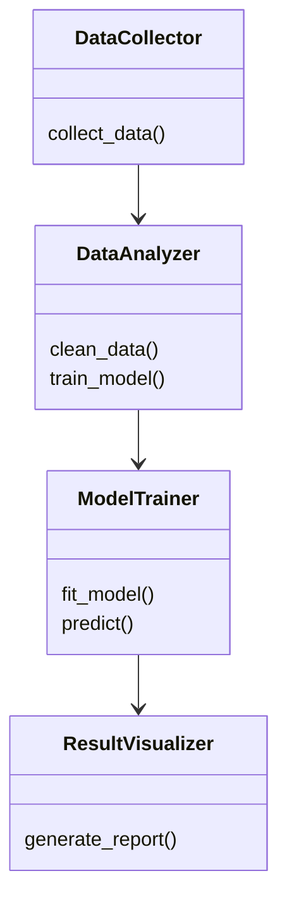
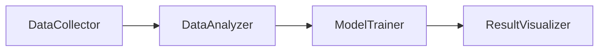
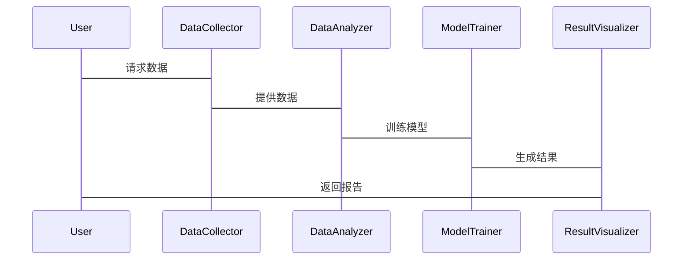

                 


# 《新兴市场股市估值与智慧政务大数据分析的互动》

> 关键词：新兴市场，股市估值，智慧政务，大数据分析，互动机制

> 摘要：本文探讨新兴市场股市估值与智慧政务大数据分析的互动关系，通过理论分析、算法实现和系统设计，详细阐述了如何利用大数据技术优化股市估值，以及智慧政务如何通过数据驱动提升决策效率。文章结合实际案例，深入分析了两者互动的数学模型和系统架构，为数据科学家和政策制定者提供了实用的参考。

---

# 第一部分：新兴市场股市估值与智慧政务大数据分析的背景与概述

## 第1章：新兴市场股市估值概述

### 1.1 新兴市场的定义与特点

#### 1.1.1 新兴市场的定义
新兴市场是指经济快速发展但尚未完全工业化的国家，通常包括中国、印度、巴西等。这些市场的特点是经济增长迅速，但金融市场相对不成熟。

#### 1.1.2 新兴市场的经济特征
- 高经济增长率：新兴市场的GDP增速通常高于发达市场。
- 市场规模小但潜力大：新兴市场的股市规模较小，但具有较大的增长空间。
- 市场波动性高：新兴市场的股市受外部因素影响较大，波动性较高。

#### 1.1.3 新兴市场股市的独特性
- 市场参与者结构单一：新兴市场的股市主要由散户构成，机构投资者占比低。
- 信息不对称严重：新兴市场的企业信息披露不完善，投资者难以获取准确信息。
- 政策影响大：政府政策对股市的影响较大，如汇率管制、资本流动限制等。

---

## 第2章：智慧政务大数据分析概述

### 2.1 智慧政务的概念与目标

#### 2.1.1 智慧政务的定义
智慧政务是指通过大数据、人工智能等技术手段，优化政府决策、提升政务服务效率的新型治理模式。

#### 2.1.2 智慧政务的核心目标
- 提高政府决策的科学性。
- 优化政务服务流程，提升用户体验。
- 降低政府运营成本，提高资源利用效率。

#### 2.1.3 智慧政务的关键技术
- 大数据分析技术：包括数据挖掘、机器学习等。
- 云计算：支持大规模数据存储和计算。
- 人工智能：用于智能决策和预测。

---

## 第3章：股市估值与智慧政务大数据分析的互动关系

### 3.1 股市估值对智慧政务的启示

#### 3.1.1 股市数据在政务决策中的应用
- 政府可以通过分析股市数据，了解经济运行状况，制定相应的政策。
- 例如，股市波动可以反映企业的经营状况和市场信心。

#### 3.1.2 股市波动对政务资源配置的影响
- 股市下跌可能引发政府出台救市政策，影响财政支出和货币政策。
- 政府可以通过股市数据，优化资源配置，促进经济稳定。

#### 3.1.3 股市估值对智慧政务的反馈机制
- 股市估值的变化可以作为政府政策效果的反馈指标。
- 例如，政府出台某项政策后，可以通过股市估值的变化来评估政策效果。

### 3.2 智慧政务对股市估值的影响

#### 3.2.1 政策透明度对股市估值的作用
- 政府政策的透明度越高，投资者对市场的信心越强，股市估值越稳定。
- 例如，政府发布明确的经济刺激政策，可以提振市场信心，推高股市估值。

#### 3.2.2 政府数据开放对股市分析的推动
- 政府开放数据，如经济指标、政策文件等，为投资者提供了更多分析依据。
- 例如，政府开放的财政数据可以帮助投资者更好地预测企业的盈利情况。

#### 3.2.3 智慧政务在股市风险管理中的应用
- 政府可以通过大数据分析，预测股市风险，提前制定应对措施。
- 例如，政府可以通过分析社交媒体情绪，预测市场波动，采取相应的风险管理措施。

---

## 第4章：新兴市场股市估值的核心概念与联系

### 4.1 核心概念原理

#### 4.1.1 股市估值的基本原理
- 股市估值是通过对企业的财务数据、市场环境等进行分析，确定股票的合理价格。
- 常用的估值方法包括市盈率（P/E）、市净率（P/B）等。

#### 4.1.2 大数据分析在股市估值中的应用
- 大数据分析可以帮助投资者发现市场趋势，识别潜在风险。
- 例如，通过分析历史数据，预测未来股票价格走势。

#### 4.1.3 互动机制的数学模型
- 互动机制是指股市估值和智慧政务大数据分析之间的相互作用关系。
- 可以通过构建数学模型，量化两者的互动效应。

### 4.2 核心概念属性特征对比表

| 特性       | 股市估值                  | 智慧政务大数据分析             |
|------------|--------------------------|-----------------------------|
| 数据来源   | 企业财务数据、市场数据    | 政府数据、社会数据             |
| 分析目标   | 确定股票合理价格          | 优化政府决策、提升效率         |
| 技术手段   | 统计分析、机器学习        | 数据挖掘、人工智能             |
| 应用场景   | 投资决策、风险管理        | 政策制定、政务服务             |

### 4.3 实体关系图（ER图）


---

## 第5章：算法原理讲解

### 5.1 股市估值算法

#### 5.1.1 时间序列分析算法

##### 5.1.1.1 ARIMA模型

ARIMA（Autoregressive Integrated Moving Average）模型是一种常用的时间序列分析方法。

公式如下：
$$ ARIMA(p, d, q) $$
其中：
- p：自回归阶数
- d：差分阶数
- q：移动平均阶数

##### 5.1.1.2 示例代码

```python
from statsmodels.tsa.arima_model import ARIMA
import pandas as pd

# 加载数据
data = pd.read_csv('stock_data.csv')

# 拟合ARIMA模型
model = ARIMA(data['price'], order=(5, 1, 2))
model_fit = model.fit()

# 预测未来价格
forecast = model_fit.forecast(steps=5)
print(forecast)
```

#### 5.1.2 随机森林回归

随机森林是一种基于决策树的集成学习算法，常用于回归问题。

公式如下：
$$ y = \sum_{i=1}^{n} w_i \cdot t_i(x) $$
其中：
- \( w_i \)：决策树的重要性权重
- \( t_i(x) \)：决策树的预测值

##### 5.1.2 示例代码

```python
from sklearn.ensemble import RandomForestRegressor
import pandas as pd

# 加载数据
data = pd.read_csv('stock_data.csv')

# 特征和目标
X = data[['volume', 'open', 'high', 'low']]
y = data['close']

# 训练模型
model = RandomForestRegressor(n_estimators=100)
model.fit(X, y)

# 预测
predicted = model.predict(X)
print(predicted)
```

---

### 5.2 智慧政务大数据分析算法

#### 5.2.1 主题模型（LDA）

主题模型是一种用于文本挖掘的算法，常用于分析政府文件、新闻报道等。

公式如下：
$$ \theta \sim Dir(\alpha) $$
$$ \phi \sim Dir(\beta) $$
$$ 文档主题分布：z_i \sim Multinomial(\theta) $$
$$ 文档中的词：w_{i,j} \sim Multinomial(\phi_{z_i}) $$

##### 5.2.1 示例代码

```python
from gensim import corpora, models
import pandas as pd

# 加载数据
data = pd.read_csv('government_reports.csv')

# 文本预处理
documents = data['text'].tolist()
dictionary = corpora.Dictionary(documents)
corpus = [dictionary.doc2bow(doc) for doc in documents]

# 训练LDA模型
lda = models.LdaModel(corpus, num_topics=5, id2word=dictionary)
print(lda.print_topics())
```

#### 5.2.2 协同过滤算法

协同过滤是一种基于用户行为的推荐算法，常用于政务服务中的个性化推荐。

公式如下：
$$ sim(i, j) = \frac{\sum_{k} r_{i,k} r_{j,k}}{\sqrt{\sum_{k} r_{i,k}^2} \cdot \sqrt{\sum_{k} r_{j,k}^2}} $$

##### 5.2.2 示例代码

```python
from sklearn.metrics.pairwise import cosine_similarity
import pandas as pd

# 加载数据
data = pd.read_csv('user_behavior.csv')

# 计算相似度
similarity = cosine_similarity(data)
print(similarity)
```

---

## 第6章：数学模型与公式

### 6.1 ARIMA模型

ARIMA模型的数学公式如下：
$$ ARIMA(p, d, q) $$
其中：
- p：自回归阶数
- d：差分阶数
- q：移动平均阶数

### 6.2 随机森林回归

随机森林回归的数学公式如下：
$$ y = \sum_{i=1}^{n} w_i \cdot t_i(x) $$
其中：
- \( w_i \)：决策树的重要性权重
- \( t_i(x) \)：决策树的预测值

---

## 第7章：系统分析与架构设计

### 7.1 问题场景介绍

本文将设计一个系统，用于分析新兴市场股市估值与智慧政务大数据分析的互动关系。系统将包括数据采集、数据分析、模型训练和结果展示四个模块。

### 7.2 系统功能设计

#### 7.2.1 数据采集模块
- 数据来源：新兴市场股市数据、政府公开数据
- 数据类型：股票价格、经济指标、政策文件

#### 7.2.2 数据分析模块
- 数据清洗：处理缺失值、异常值
- 数据建模：使用ARIMA、随机森林等算法进行分析
- 数据可视化：生成图表展示分析结果

#### 7.2.3 模型训练模块
- 训练ARIMA模型，预测股票价格
- 训练随机森林模型，评估股市估值
- 分析智慧政务大数据，优化政府决策

#### 7.2.4 结果展示模块
- 可视化图表：展示股票价格预测结果、政策影响分析
- 报告生成：输出分析报告，提供决策建议

### 7.3 系统架构设计

#### 7.3.1 类图设计



#### 7.3.2 架构图设计



#### 7.3.3 交互流程图



---

## 第8章：项目实战

### 8.1 环境安装

#### 8.1.1 安装必要的库

```bash
pip install pandas scikit-learn gensim mermaid4j
```

### 8.2 系统核心实现

#### 8.2.1 数据采集与预处理

```python
import pandas as pd
import requests

# 数据采集
def collect_data(api_url):
    response = requests.get(api_url)
    data = response.json()
    return pd.DataFrame(data)

# 数据预处理
def preprocess_data(data):
    data.dropna(inplace=True)
    return data

# 使用示例
data = collect_data('https://example.com/api/stock')
data = preprocess_data(data)
print(data.head())
```

#### 8.2.2 模型训练与预测

```python
from sklearn.ensemble import RandomForestRegressor
import pandas as pd

# 数据加载与处理
data = pd.read_csv('stock_data.csv')
X = data[['volume', 'open', 'high', 'low']]
y = data['close']

# 模型训练
model = RandomForestRegressor(n_estimators=100)
model.fit(X, y)

# 模型预测
predicted = model.predict(X)
print(predicted)
```

### 8.3 代码应用解读

#### 8.3.1 数据采集模块
- 使用`requests`库从API获取数据。
- 将数据转换为DataFrame格式，便于后续处理。

#### 8.3.2 数据分析模块
- 使用`pandas`进行数据清洗，处理缺失值和异常值。
- 使用`scikit-learn`进行模型训练和预测。

### 8.4 实际案例分析

#### 8.4.1 案例背景
假设我们有一个新兴市场的股市数据，包括股票价格、成交量等信息。我们需要通过大数据分析，预测未来股票价格走势，并评估政策对股市的影响。

#### 8.4.2 数据分析与结果展示
- 使用ARIMA模型预测股票价格。
- 使用随机森林模型评估政策对股市的影响。
- 生成可视化图表，展示分析结果。

---

## 第9章：最佳实践、小结与拓展阅读

### 9.1 最佳实践

- 数据隐私保护：在处理政府数据时，需注意数据隐私问题。
- 模型调优：根据实际需求，调整模型参数，提高预测精度。
- 多模型融合：结合多种算法，提升分析结果的准确性。

### 9.2 小结

本文通过理论分析、算法实现和系统设计，详细探讨了新兴市场股市估值与智慧政务大数据分析的互动关系。通过实际案例分析，展示了如何利用大数据技术优化股市估值，以及智慧政务如何通过数据驱动提升决策效率。

### 9.3 注意事项

- 数据来源的可靠性：确保数据的准确性和完整性。
- 模型的适用性：根据实际需求选择合适的算法。
- 结果的可解释性：确保分析结果能够被政府和投资者理解。

### 9.4 拓展阅读

- 《Python机器学习实战》
- 《大数据分析与挖掘》
- 《智慧政务的理论与实践》

---

# 作者

作者：AI天才研究院/AI Genius Institute & 禅与计算机程序设计艺术 /Zen And The Art of Computer Programming

