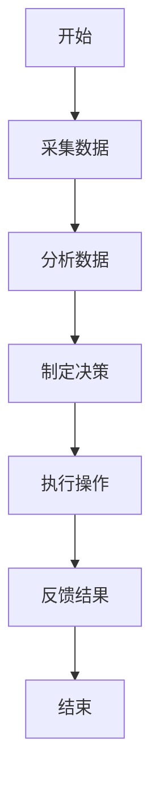
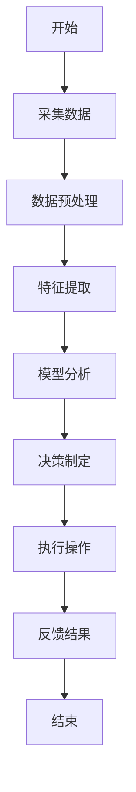
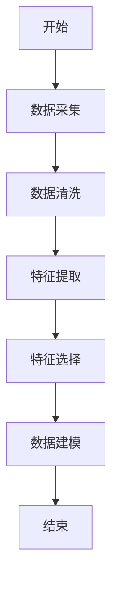
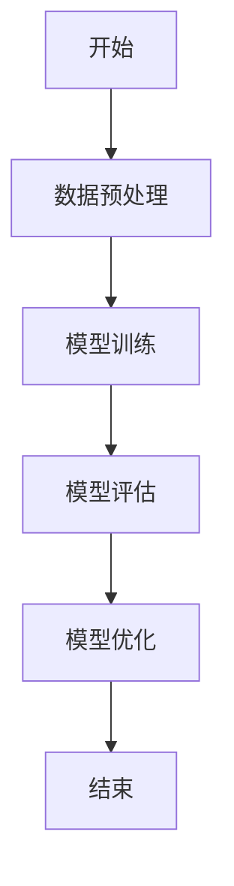
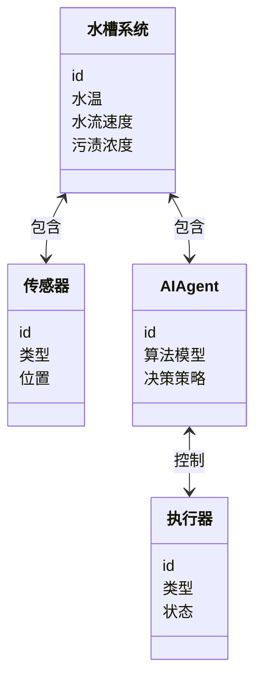
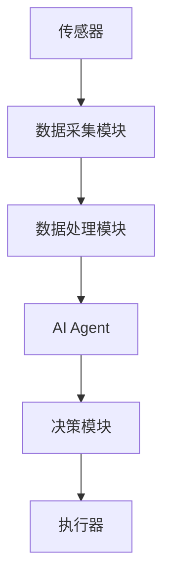
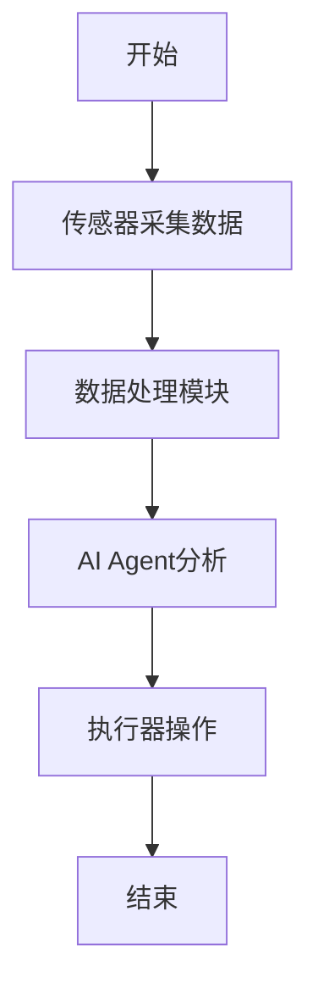

                 


# 智能厨房水槽：AI Agent的节水与清洁指导

> 关键词：智能厨房水槽，AI Agent，节水技术，清洁优化，人工智能算法，物联网技术，智能家居

> 摘要：随着人工智能技术的快速发展，智能厨房水槽逐渐成为现代家庭厨房的重要组成部分。本文通过分析AI Agent在智能厨房水槽中的应用，详细探讨了如何通过AI技术实现节水与清洁效率的优化。文章从背景介绍、核心概念、算法原理、系统设计、项目实战到最佳实践等多个方面展开，深入剖析了AI Agent在智能厨房水槽中的具体应用和实现方法，为读者提供了全面的技术指导和实践参考。

---

## 第一部分: 智能厨房水槽与AI Agent的背景介绍

### 第1章: 智能厨房水槽的发展背景

#### 1.1 智能厨房水槽的概念与现状

##### 1.1.1 厨房水槽的功能与作用
厨房水槽是家庭厨房中不可或缺的设备，主要用于洗涤食材、清洁餐具以及处理厨余垃圾。传统水槽的功能相对单一，主要依赖人工操作，清洁效率低下，且容易浪费水资源。

##### 1.1.2 智能化厨房水槽的发展趋势
随着智能家居概念的普及，智能厨房水槽逐渐成为趋势。通过集成传感器、物联网技术和AI算法，智能水槽能够实现自动清洁、节水优化、智能监控等功能，为用户带来更便捷、更高效的使用体验。

##### 1.1.3 当前市场上的智能水槽产品分析
当前市场上的智能水槽产品主要集中在以下几个方面：
- **智能清洁**：通过AI算法优化清洁效率，减少清洁时间。
- **节水技术**：通过传感器和AI算法实现精准节水。
- **智能监控**：实时监测水槽的运行状态，及时发现异常。

#### 1.2 AI Agent的基本概念与工作原理

##### 1.2.1 AI Agent的定义与特点
AI Agent（人工智能代理）是一种能够感知环境并采取行动以实现目标的智能系统。它通过传感器获取数据，结合预设算法进行分析和决策，并通过执行器完成操作。

##### 1.2.2 AI Agent在智能水槽中的应用场景
AI Agent在智能水槽中的主要应用场景包括：
- **智能清洁**：通过AI算法优化清洁流程，减少清洁时间。
- **节水优化**：通过传感器数据和AI算法实现精准节水。
- **智能监控**：实时监测水槽运行状态，及时发现异常。

##### 1.2.3 AI Agent的核心功能与技术实现
AI Agent的核心功能包括数据采集、分析决策、执行操作和反馈优化。技术实现主要依赖于传感器技术、AI算法和物联网技术。

---

### 第2章: 智能厨房水槽的节水与清洁问题分析

#### 2.1 节水与清洁的重要性

##### 2.1.1 节水的必要性与经济性
水资源的短缺问题日益严重，节水已成为全球关注的焦点。通过AI Agent优化用水效率，可以显著减少水浪费，降低用户的用水成本。

##### 2.1.2 清洁效率对厨房环境的影响
清洁效率直接影响厨房的卫生状况和用户体验。通过AI Agent优化清洁流程，可以显著提高清洁效率，减少人工操作的复杂性。

##### 2.1.3 节水与清洁的平衡优化
节水与清洁之间存在一定的矛盾。AI Agent需要在两者之间找到平衡点，既要保证清洁效率，又要实现节水目标。

#### 2.2 当前节水与清洁技术的局限性

##### 2.2.1 传统水槽的节水问题
传统水槽的节水问题主要体现在以下几个方面：
- **水流量过大**：传统水槽的水流速度和流量无法调节，容易造成水浪费。
- **清洁效率低**：传统水槽的清洁方式效率低下，需要人工干预。

##### 2.2.2 清洁技术的效率瓶颈
清洁技术的效率瓶颈主要体现在以下几个方面：
- **清洁力度不足**：传统清洁方式清洁力度不够，容易残留污渍。
- **清洁时间长**：传统清洁方式需要较长时间，影响用户体验。

##### 2.2.3 用户行为对节水与清洁的影响
用户行为对节水与清洁的影响主要体现在以下几个方面：
- **用水习惯**：用户用水习惯直接影响节水效果。
- **清洁习惯**：用户清洁习惯影响清洁效率。

#### 2.3 AI Agent在节水与清洁中的应用前景

##### 2.3.1 AI Agent如何优化节水策略
AI Agent可以通过传感器数据和AI算法优化节水策略，例如：
- **智能调节水流速度**：根据清洁需求智能调节水流速度。
- **智能启动清洁模式**：根据水槽状态智能启动清洁模式。

##### 2.3.2 AI Agent提升清洁效率的潜力
AI Agent可以通过以下方式提升清洁效率：
- **智能控制清洁时间**：根据水槽负载智能调整清洁时间。
- **智能选择清洁模式**：根据污渍类型智能选择清洁模式。

##### 2.3.3 用户体验的改善与技术结合的可能性
通过AI Agent与智能水槽的结合，可以显著改善用户体验，例如：
- **一键清洁**：用户可以通过手机APP一键启动清洁模式。
- **智能提醒**：AI Agent可以根据水槽状态智能提醒用户进行维护。

---

## 第二部分: 智能厨房水槽AI Agent的核心概念与联系

### 第3章: AI Agent与智能水槽的核心概念

#### 3.1 AI Agent的基本原理

##### 3.1.1 AI Agent的感知与决策机制
AI Agent通过传感器获取环境数据，结合AI算法进行分析和决策，最终通过执行器完成操作。

##### 3.1.2 基于传感器的数据采集与分析
AI Agent需要采集水槽的实时数据，例如水温、水流速度、污渍浓度等，通过数据分析优化节水与清洁策略。

##### 3.1.3 AI Agent在智能水槽中的应用场景
AI Agent在智能水槽中的应用场景包括智能清洁、节水优化和智能监控。

#### 3.2 AI Agent与智能水槽的实体关系分析

##### 3.2.1 实体关系图（ER图）
以下是智能水槽系统中的实体关系图：

```mermaid
erDiagram
    class 水槽系统 {
        id
        水温
        水流速度
        污渍浓度
    }
    class 传感器 {
        id
        类型
        位置
    }
    class AI Agent {
        id
        算法模型
        决策策略
    }
    class 执行器 {
        id
        类型
        状态
    }
    水槽系统 --> 传感器 : 包含
    水槽系统 --> AI Agent : 包含
    AI Agent --> 执行器 : 控制
```

##### 3.2.2 智能水槽系统中的主要实体
智能水槽系统中的主要实体包括：
- **水槽系统**：包括水温、水流速度、污渍浓度等参数。
- **传感器**：用于采集水槽系统的实时数据。
- **AI Agent**：负责数据分析和决策。
- **执行器**：负责执行AI Agent的决策指令。

##### 3.2.3 实体之间的关联与交互
水槽系统通过传感器采集数据，传递给AI Agent进行分析，AI Agent根据分析结果通过执行器完成操作。

#### 3.3 AI Agent的工作流程与逻辑

##### 3.3.1 智能水槽AI Agent的总体流程
以下是AI Agent的工作流程图：



##### 3.3.2 数据采集与处理的详细步骤
以下是AI Agent的数据采集与处理流程：



---

## 第三部分: 智能厨房水槽AI Agent的算法原理

### 第4章: 基于AI Agent的节水算法

#### 4.1 节水算法的核心原理

##### 4.1.1 数据采集与特征提取
AI Agent需要采集水槽的实时数据，例如水温、水流速度、污渍浓度等，通过特征提取优化节水策略。

##### 4.1.2 基于机器学习的节水模型
通过机器学习算法训练节水模型，优化节水策略。

##### 4.1.3 算法的优化与调优
通过不断优化算法参数和模型结构，提高节水效率。

#### 4.2 节水算法的实现流程

##### 4.2.1 数据预处理与特征工程
以下是数据预处理与特征工程的流程图：



##### 4.2.2 模型训练与评估
以下是模型训练与评估的流程图：



##### 4.2.3 模型部署与实时优化
通过模型部署实现节水优化，通过实时数据反馈不断优化模型。

### 第5章: 清洁效率优化的AI算法

#### 5.1 清洁效率优化的核心原理

##### 5.1.1 数据采集与特征提取
AI Agent需要采集水槽的实时数据，例如污渍浓度、水流速度等，通过特征提取优化清洁策略。

##### 5.1.2 基于AI的清洁模型
通过AI算法训练清洁模型，优化清洁策略。

##### 5.1.3 算法的优化与调优
通过不断优化算法参数和模型结构，提高清洁效率。

#### 5.2 清洁算法的实现流程

##### 5.2.1 数据预处理与特征工程
以下是数据预处理与特征工程的流程图：


##### 5.2.2 模型训练与评估
以下是模型训练与评估的流程图：


##### 5.2.3 模型部署与实时优化
通过模型部署实现清洁优化，通过实时数据反馈不断优化模型。

---

## 第四部分: 智能厨房水槽AI Agent的系统分析与架构设计

### 第6章: 智能厨房水槽系统分析

#### 6.1 系统应用场景介绍

##### 6.1.1 智能厨房水槽的应用场景
智能厨房水槽的应用场景包括家庭厨房、酒店厨房、商业厨房等。

##### 6.1.2 不同场景下的系统需求
不同场景下的系统需求包括：
- **家庭厨房**：注重节水与清洁效率。
- **酒店厨房**：注重清洁效率和智能化管理。
- **商业厨房**：注重节水与清洁效率。

#### 6.2 系统功能设计

##### 6.2.1 领域模型设计
以下是智能水槽系统的领域模型图：



#### 6.3 系统架构设计

##### 6.3.1 系统架构设计
以下是智能水槽系统的架构图：



#### 6.4 系统接口设计

##### 6.4.1 系统接口设计
智能水槽系统的接口设计包括：
- **数据采集接口**：传感器数据采集接口。
- **AI Agent接口**：AI Agent与水槽系统的交互接口。
- **执行器接口**：AI Agent与执行器的交互接口。

#### 6.5 系统交互流程图

##### 6.5.1 系统交互流程图
以下是智能水槽系统的交互流程图：



---

## 第五部分: 智能厨房水槽AI Agent的项目实战

### 第7章: 项目实战

#### 7.1 环境安装

##### 7.1.1 系统环境要求
系统环境要求包括：
- **操作系统**：Windows/Mac/Linux
- **Python版本**：Python 3.6+

##### 7.1.2 第三方库安装
以下是需要安装的第三方库：
```bash
pip install numpy
pip install scikit-learn
pip install matplotlib
```

#### 7.2 系统核心实现

##### 7.2.1 数据采集模块实现
以下是数据采集模块的实现代码：

```python
import numpy as np

def collect_data():
    # 采集数据
    data = np.random.rand(100, 4)  # 示例数据
    return data
```

##### 7.2.2 数据处理模块实现
以下是数据处理模块的实现代码：

```python
import pandas as pd

def preprocess_data(data):
    # 数据清洗与特征提取
    df = pd.DataFrame(data)
    df.dropna(inplace=True)
    return df
```

##### 7.2.3 AI Agent实现
以下是AI Agent的实现代码：

```python
from sklearn import linear_model

def ai_agent(data):
    # 训练模型
    model = linear_model.LinearRegression()
    model.fit(data[['水温', '水流速度']], data['污渍浓度'])
    return model
```

#### 7.3 代码应用解读与分析

##### 7.3.1 数据采集模块
数据采集模块通过传感器采集水槽的实时数据，包括水温、水流速度、污渍浓度等参数。

##### 7.3.2 数据处理模块
数据处理模块对采集的数据进行清洗和特征提取，为AI Agent提供高质量的数据输入。

##### 7.3.3 AI Agent实现
AI Agent通过机器学习算法训练节水与清洁模型，优化节水与清洁策略。

#### 7.4 实际案例分析

##### 7.4.1 案例分析
通过实际案例分析，验证AI Agent在智能水槽中的应用效果。

##### 7.4.2 数据分析与结果解读
通过对实验数据进行分析，解读AI Agent在节水与清洁中的优化效果。

#### 7.5 项目小结

##### 7.5.1 项目总结
总结项目实现的主要成果和经验教训。

##### 7.5.2 项目优化建议
提出进一步优化项目的建议和方向。

---

## 第六部分: 最佳实践、小结、注意事项、拓展阅读

### 第8章: 最佳实践

#### 8.1 使用AI Agent的注意事项

##### 8.1.1 数据隐私与安全
AI Agent需要处理用户的隐私数据，需要注意数据隐私与安全。

##### 8.1.2 系统维护与更新
AI Agent需要定期进行系统维护与更新，确保系统的稳定性和优化效果。

#### 8.2 拓展阅读

##### 8.2.1 相关技术文献
推荐相关技术文献，供读者进一步学习和研究。

##### 8.2.2 前沿技术动态
介绍智能厨房水槽和AI Agent领域的前沿技术动态。

### 第9章: 小结

#### 9.1 项目总结

##### 9.1.1 核心成果
总结项目实现的核心成果和创新点。

##### 9.1.2 经验总结
总结项目实施过程中的经验和教训。

### 第10章: 注意事项

#### 10.1 使用注意事项

##### 10.1.1 系统安装与配置
注意事项包括系统安装与配置、数据隐私与安全等。

##### 10.1.2 系统维护与更新
系统维护与更新的注意事项。

### 第11章: 拓展阅读

#### 11.1 相关技术文献

##### 11.1.1 推荐书籍
推荐相关技术书籍，供读者进一步学习和研究。

##### 11.1.2 前沿技术动态
介绍智能厨房水槽和AI Agent领域的前沿技术动态。

---

## 作者：AI天才研究院/AI Genius Institute & 禅与计算机程序设计艺术 /Zen And The Art of Computer Programming

