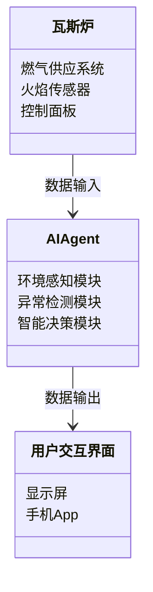
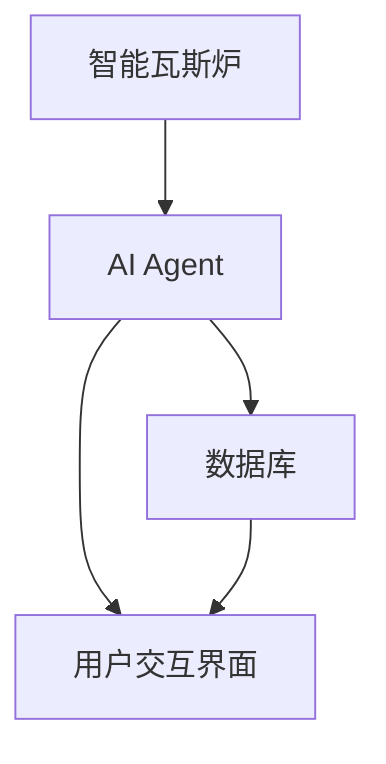
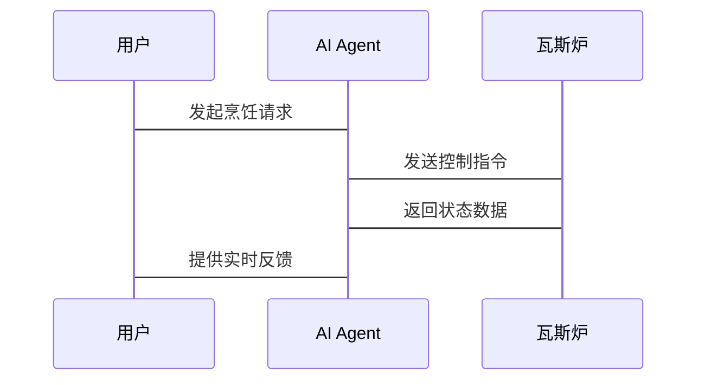

                 


# 智能瓦斯炉：AI Agent的烹饪安全监控

> 关键词：智能瓦斯炉、AI Agent、烹饪安全、异常检测、智能家居

> 摘要：本文探讨了AI Agent在智能瓦斯炉中的应用，分析了其在烹饪安全监控中的核心作用，详细介绍了算法原理、系统架构及实现方案。

---

# 第1章: 背景与问题背景

## 1.1 智能瓦斯炉的发展背景

### 1.1.1 烹饪安全问题的现状
传统瓦斯炉在使用过程中存在诸多安全隐患，如燃气泄漏、火焰异常、意外熄火等。这些问题可能导致严重的安全事故。随着智能家居的普及，用户对烹饪设备的安全性提出了更高的要求。

### 1.1.2 智能化烹饪设备的市场需求
智能家居的兴起推动了烹饪设备的智能化发展。用户期望烹饪设备能够实现自动化监控、智能反馈和主动预警，以确保烹饪过程的安全性。

### 1.1.3 AI技术在智能家居中的应用趋势
人工智能技术的快速发展为智能家居设备的智能化提供了技术支持。AI Agent（智能体）作为一种能够感知环境、自主决策的智能系统，正在广泛应用于智能家居领域。

---

## 1.2 问题描述与解决思路

### 1.2.1 瓦斯炉使用中的安全隐患
瓦斯炉在使用过程中可能出现以下安全隐患：
1. 燃气泄漏未及时发现。
2. 火焰异常可能导致意外熄火或燃烧不充分。
3. 用户操作不当引发的安全风险。

### 1.2.2 AI Agent在烹饪安全监控中的作用
AI Agent可以通过实时感知烹饪环境，分析异常情况，主动采取措施，有效预防安全事故的发生。

### 1.2.3 智能瓦斯炉的设计目标与实现路径
设计目标：
1. 实现实时烹饪环境监控。
2. 提供智能预警和主动干预功能。
3. 确保用户操作的安全性。

实现路径：
1. 利用AI技术实现烹饪过程的智能化监控。
2. 结合物联网技术实现设备的互联互通。

---

## 1.3 边界与外延

### 1.3.1 智能瓦斯炉的功能边界
智能瓦斯炉的功能主要集中在烹饪过程中的安全监控，不涉及其他智能家居设备的功能。

### 1.3.2 AI Agent的应用范围
AI Agent主要用于烹饪环境的实时监控、异常检测和智能反馈。

### 1.3.3 系统与其他智能家居设备的协同关系
智能瓦斯炉可以通过智能家居平台与其他设备（如智能烟雾报警器、智能门锁等）联动，共同构建家庭安全防护体系。

---

## 1.4 核心要素与概念结构

### 1.4.1 瓦斯炉的核心组件
1. 燃气供应系统。
2. 火焰传感器。
3. 控制面板。

### 1.4.2 AI Agent的关键功能模块
1. 环境感知模块。
2. 异常检测模块。
3. 智能决策模块。

### 1.4.3 系统整体架构的核心要素
1. 硬件设备。
2. 软件系统。
3. 通信协议。

---

# 第2章: AI Agent的核心概念与原理

## 2.1 AI Agent的基本原理

### 2.1.1 什么是AI Agent
AI Agent是一种能够感知环境、自主决策的智能系统，能够根据环境反馈采取相应行动。

### 2.1.2 AI Agent的核心特征
| 特征 | 描述 |
|------|------|
| 智能性 | 能够自主决策和学习 |
| 实时性 | 实时感知和响应 |
| 可扩展性 | 支持功能扩展和升级 |

### 2.1.3 AI Agent的分类与应用场景
1. **基于规则的AI Agent**：适用于规则明确的场景。
2. **基于学习的AI Agent**：适用于复杂场景，能够通过学习优化性能。

---

## 2.2 AI Agent在烹饪安全监控中的应用

### 2.2.1 烹饪过程中的关键监控点
1. 燃气泄漏检测。
2. 火焰异常检测。
3. 用户操作行为分析。

### 2.2.2 AI Agent在异常检测中的作用
通过实时分析烹饪环境数据，AI Agent能够快速识别潜在的安全隐患并采取相应措施。

### 2.2.3 AI Agent与用户交互的实现方式
1. **语音交互**：通过语音指令与用户互动。
2. **视觉交互**：通过显示屏或手机App提供实时反馈。

---

## 2.3 AI Agent与智能瓦斯炉的结合

### 2.3.1 智能瓦斯炉的智能化改造
通过集成AI Agent，智能瓦斯炉能够实现烹饪过程的智能化监控。

### 2.3.2 AI Agent在烹饪过程中的实时监控
AI Agent能够实时分析烹饪环境数据，确保烹饪过程的安全性。

### 2.3.3 系统的安全性与可靠性设计
1. 数据加密传输。
2. 系统容错设计。

---

## 2.4 核心概念联系与对比

### 2.4.1 AI Agent与传统传感器的对比
| 对比维度 | AI Agent | 传统传感器 |
|----------|----------|------------|
| 功能     | 自主决策 | 被动检测   |
| 智能性   | 高       | 低         |
| 可扩展性 | 高       | 低         |

### 2.4.2 AI Agent与智能家电的对比
| 对比维度 | AI Agent | 智能家电 |
|----------|----------|----------|
| 核心功能 | 自主决策 | 定制功能 |
| 灵活性   | 高       | 中       |

### 2.4.3 AI Agent在烹饪安全中的独特优势
1. 能够实现复杂场景下的智能决策。
2. 具备自主学习能力，能够不断优化性能。

---

# 第3章: AI Agent的算法原理与实现

## 3.1 状态识别算法

### 3.1.1 烹饪状态的多模态数据输入
AI Agent通过多种传感器（如温度、压力、气体传感器）获取烹饪环境的多模态数据。

### 3.1.2 基于深度学习的状态识别模型
使用深度神经网络模型对烹饪状态进行分类。

### 3.1.3 算法的训练与优化
1. **数据预处理**：对原始数据进行归一化处理。
2. **模型训练**：使用反向传播算法优化模型参数。
3. **模型评估**：通过准确率、召回率等指标评估模型性能。

---

## 3.2 异常检测算法

### 3.2.1 基于时间序列的异常检测
通过分析烹饪过程中的时间序列数据，识别异常模式。

### 3.2.2 基于对比学习的异常检测
使用对比学习方法，将正常状态与异常状态进行对比，识别异常。

### 3.2.3 算法的鲁棒性与实时性
1. **鲁棒性**：通过数据增强技术提高模型的鲁棒性。
2. **实时性**：采用轻量级算法确保实时性。

---

## 3.3 用户行为分析算法

### 3.3.1 用户行为数据的采集与处理
通过传感器和用户交互界面采集用户行为数据。

### 3.3.2 基于强化学习的用户行为分析
通过强化学习模型分析用户行为，优化烹饪过程中的安全监控。

---

## 3.4 算法实现与代码示例

### 3.4.1 异常检测算法实现
```python
import numpy as np
from sklearn.ensemble import IsolationForest

# 示例数据
X = np.random.randn(100, 2)
X[50:] = X[50:] * 2  # 生成异常数据

# 异常检测模型训练
model = IsolationForest(n_estimators=100, random_state=42)
model.fit(X)

# 预测异常点
outliers = model.predict(X)
print("异常点索引：", np.where(outliers == -1)[0])
```

### 3.4.2 算法的数学模型与公式
#### 异常检测的数学模型
$$
\text{异常概率} = P(x|\text{异常}) = \prod_{i=1}^{n} P(x_i|\text{异常})
$$

#### 状态识别的数学模型
$$
y = f(x) = \text{sigmoid}(w^T x + b)
$$

---

# 第4章: 系统分析与架构设计方案

## 4.1 系统场景介绍

### 4.1.1 系统功能概述
智能瓦斯炉通过AI Agent实现烹饪过程的智能化监控，包括实时状态监测、异常预警和主动干预。

### 4.1.2 系统用户角色
1. **普通用户**：使用智能瓦斯炉进行烹饪。
2. **系统管理员**：负责系统维护和参数设置。

---

## 4.2 系统功能设计

### 4.2.1 领域模型设计


### 4.2.2 系统架构设计


### 4.2.3 接口设计
1. **AI Agent接口**：与瓦斯炉和其他设备的通信接口。
2. **用户交互接口**：提供用户操作的界面。

### 4.2.4 交互流程设计


---

## 4.3 系统实现与优化

### 4.3.1 系统实现方案
1. 硬件设备的选型与集成。
2. 软件系统的开发与部署。

### 4.3.2 系统优化策略
1. 优化算法性能。
2. 提高系统可靠性。

---

## 4.4 系统测试与验证

### 4.4.1 测试方案
1. 功能测试：验证系统的核心功能。
2. 性能测试：评估系统的处理能力。
3. 安全测试：确保系统的安全性。

### 4.4.2 测试结果与优化
根据测试结果优化系统设计，提升用户体验。

---

# 第5章: 项目实战

## 5.1 环境安装与配置

### 5.1.1 开发环境配置
1. 安装Python和相关开发工具。
2. 安装AI框架（如TensorFlow、Keras）。

### 5.1.2 依赖库安装
```bash
pip install numpy scikit-learn matplotlib
```

---

## 5.2 系统核心实现

### 5.2.1 AI Agent的核心实现
```python
class AIAssistant:
    def __init__(self):
        self.model = self._build_model()

    def _build_model(self):
        # 简单的神经网络模型
        import tensorflow as tf
        model = tf.keras.Sequential([
            tf.keras.layers.Dense(64, activation='relu'),
            tf.keras.layers.Dense(1, activation='sigmoid')
        ])
        model.compile(optimizer='adam', loss='binary_crossentropy')
        return model

    def predict(self, input_data):
        return self.model.predict(input_data)
```

### 5.2.2 异常检测的实现
```python
import numpy as np
from sklearn.ensemble import IsolationForest

def detect_anomalies(X):
    model = IsolationForest(n_estimators=100, random_state=42)
    model.fit(X)
    outliers = model.predict(X)
    return np.where(outliers == -1)[0]
```

---

## 5.3 案例分析与详细解读

### 5.3.1 实际案例分析
通过实际案例分析AI Agent在智能瓦斯炉中的应用效果。

### 5.3.2 代码实现与解读
详细解读实现AI Agent的核心代码，分析其工作原理。

---

## 5.4 项目总结与经验分享

### 5.4.1 项目成果总结
总结项目的主要成果，分析其对烹饪安全监控的贡献。

### 5.4.2 项目经验与教训
分享项目实施过程中的经验与教训，为后续工作提供参考。

---

# 第6章: 最佳实践与小结

## 6.1 最佳实践 tips

### 6.1.1 数据隐私保护
确保用户数据的安全性，防止数据泄露。

### 6.1.2 系统维护与更新
定期更新系统软件，修复潜在漏洞。

### 6.1.3 用户教育与培训
为用户提供充分的培训，确保其能够正确使用智能瓦斯炉。

---

## 6.2 小结

智能瓦斯炉通过AI Agent实现了烹饪过程的智能化监控，显著提升了烹饪安全水平。本文详细探讨了AI Agent的核心概念、算法原理和系统架构，并通过项目实战验证了其实现方案的可行性。

---

## 6.3 注意事项

### 6.3.1 数据隐私保护
确保用户数据的安全性。

### 6.3.2 系统兼容性
确保系统能够与其他智能家居设备兼容。

### 6.3.3 系统维护
定期更新系统软件，确保系统的安全性和稳定性。

---

## 6.4 拓展阅读

推荐相关领域的书籍和论文，供读者进一步学习。

---

# 作者：AI天才研究院/AI Genius Institute & 禅与计算机程序设计艺术 /Zen And The Art of Computer Programming

