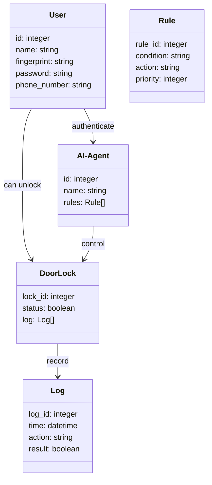
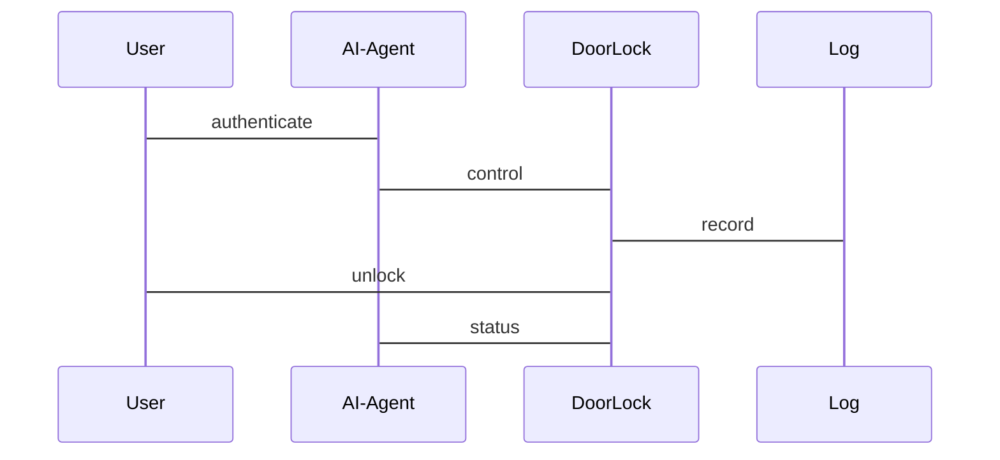

                 


# 智能门锁：AI Agent的多因素安全认证系统

> 关键词：智能门锁，AI Agent，多因素认证，安全系统，算法设计

> 摘要：本文详细探讨了智能门锁结合AI Agent的多因素安全认证系统，从系统背景、核心概念、算法原理、系统架构到项目实战，全面解析了该系统的实现与应用。文章通过详细的理论分析和实际案例，展示了如何利用AI技术提升门锁的安全性，为智能门锁的未来发展提供了新的思路。

---

## 第一部分: 智能门锁与AI Agent的背景介绍

### 第1章: 智能门锁的发展历程

#### 1.1 传统门锁的局限性
##### 1.1.1 机械锁的不足
机械锁虽然坚固耐用，但存在以下问题：
- **钥匙管理复杂**：用户需要随身携带钥匙，容易丢失或被盗。
- **安全性低**：一旦钥匙落入他人手中，门锁的安全性将被完全破坏。
- **功能单一**：无法与其他智能设备联动，无法提供远程监控或报警功能。

##### 1.1.2 传统电子锁的功能限制
传统电子锁虽然在功能上比机械锁有所提升，但仍存在以下不足：
- **安全性不足**：依赖简单的密码或磁卡，容易被破解或复制。
- **用户体验差**：密码容易被遗忘，磁卡容易丢失，用户体验不佳。
- **智能化水平低**：无法与其他智能家居设备联动，无法实现远程控制或智能报警。

##### 1.1.3 智能门锁的定义与特点
智能门锁是一种结合了机械、电子和信息技术的新型门锁系统，具有以下特点：
- **智能化**：支持多种开门方式，如指纹、密码、卡片、手机App等。
- **远程控制**：通过网络实现远程开门和监控。
- **安全性高**：结合AI技术，能够识别异常行为并发出警报。
- **便捷性**：用户可以通过手机或其他智能设备实现无钥匙开门。

#### 1.2 AI Agent在智能门锁中的应用
##### 1.2.1 AI Agent的基本概念
AI Agent（智能代理）是一种能够感知环境、自主决策并执行任务的智能系统。它具备以下核心能力：
- **感知能力**：通过传感器或数据输入感知环境。
- **决策能力**：基于感知到的信息做出决策。
- **执行能力**：通过执行器或接口完成任务。

##### 1.2.2 AI Agent在智能门锁中的角色
在智能门锁中，AI Agent主要负责以下几个方面：
- **身份识别**：通过指纹、面部识别等技术验证用户身份。
- **行为分析**：分析用户的开门行为，识别异常情况。
- **动态调整**：根据用户的习惯和环境变化，动态调整认证策略。

##### 1.2.3 多因素认证的必要性
为了提高门锁的安全性，单纯依靠一种认证方式（如密码或指纹）是不够的。多因素认证通过结合多种认证方式，大大提高了系统的安全性。例如：
- **双因素认证**：结合指纹和密码。
- **三因素认证**：结合指纹、密码和手机App验证。

#### 1.3 多因素安全认证的背景与优势
##### 1.3.1 多因素认证的定义
多因素认证（MFA, Multi-Factor Authentication）是指在身份验证过程中，结合至少两种不同的认证方式。这些方式可以是基于知识的东西（如密码）、基于拥有物的东西（如手机App）或基于生物特征的东西（如指纹）。

##### 1.3.2 多因素认证的核心要素
- **知识因素**：用户知道的东西，如密码、 PIN 码等。
- **拥有物因素**：用户拥有的东西，如手机、智能卡等。
- **生物特征因素**：用户的生物特征，如指纹、面部识别等。

##### 1.3.3 多因素认证的安全优势
- **安全性高**：即使一种认证方式被攻破，其他认证方式仍然能够提供保护。
- **用户体验好**：多种认证方式可以互相补充，提高用户便利性。
- **适应性强**：可以根据不同的场景和用户需求，灵活调整认证策略。

#### 1.4 本章小结
本章介绍了智能门锁的发展历程，重点分析了传统门锁的局限性和AI Agent在智能门锁中的应用。同时，还详细探讨了多因素认证的必要性和优势，为后续章节的深入分析奠定了基础。

---

## 第二部分: AI Agent的多因素安全认证系统核心概念

### 第2章: AI Agent的核心原理

#### 2.1 AI Agent的基本原理
##### 2.1.1 AI Agent的定义与分类
AI Agent可以根据功能和应用场景分为以下几类：
- **简单反射型AI Agent**：基于规则的简单决策，如条件判断。
- **基于模型的AI Agent**：具备知识库和推理能力，能够处理复杂问题。
- **学习型AI Agent**：通过机器学习算法不断优化自身的决策能力。

##### 2.1.2 AI Agent的感知与决策机制
AI Agent的感知与决策机制主要包括以下几个步骤：
1. **感知环境**：通过传感器或接口获取环境信息。
2. **信息处理**：对获取的信息进行分析和理解。
3. **决策制定**：基于分析结果制定行动方案。
4. **执行动作**：通过执行器或接口完成决策动作。

##### 2.1.3 AI Agent的学习与优化过程
AI Agent通过机器学习算法不断优化自身的决策能力。常见的学习算法包括：
- **监督学习**：基于标记数据进行训练。
- **无监督学习**：基于未标记数据进行聚类分析。
- **强化学习**：通过与环境的交互不断优化决策策略。

#### 2.2 多因素安全认证的实现原理
##### 2.2.1 多因素认证的逻辑框架
多因素认证的逻辑框架包括以下几个步骤：
1. **用户发起认证请求**：用户尝试通过某种方式验证身份。
2. **AI Agent识别认证方式**：根据用户的行为和选择的认证方式，AI Agent识别相应的认证因子。
3. **认证因子验证**：对用户提供的认证因子进行验证，如指纹识别、密码验证等。
4. **多因素综合判断**：结合多种认证因子的结果，综合判断用户的身份。
5. **反馈认证结果**：将认证结果反馈给用户或系统。

##### 2.2.2 各种认证因子的整合方式
多因素认证可以通过以下几种方式整合认证因子：
- **并行验证**：同时验证多种认证因子。
- **序列验证**：按顺序验证多种认证因子。
- **混合验证**：根据用户的选择和系统策略动态调整验证方式。

##### 2.2.3 认证因子的权重分配与评估
在多因素认证中，不同认证因子的权重可以根据安全性、便捷性和成本等因素进行动态调整。例如：
- **高权重因子**：如指纹识别，安全性高但成本较高。
- **中权重因子**：如密码验证，安全性中等但成本较低。
- **低权重因子**：如手机App验证，便捷性高但安全性较低。

#### 2.3 AI Agent与多因素认证的结合
##### 2.3.1 AI Agent在认证过程中的作用
AI Agent在多因素认证中的作用包括：
- **智能识别**：通过AI算法识别用户的认证行为。
- **动态调整**：根据用户行为和环境变化动态调整认证策略。
- **异常检测**：识别异常行为并发出警报。

##### 2.3.2 多因素认证的动态调整机制
AI Agent可以通过以下方式实现多因素认证的动态调整：
- **基于时间的动态调整**：根据时间的变化调整认证因子的权重。
- **基于用户行为的动态调整**：根据用户的使用习惯和行为模式调整认证策略。
- **基于环境变化的动态调整**：根据地理位置、网络状态等环境因素调整认证方式。

##### 2.3.3 AI Agent对异常行为的识别与处理
AI Agent可以通过以下方式识别异常行为：
- **行为模式分析**：分析用户的开门行为，识别是否存在异常。
- **关联规则挖掘**：挖掘用户行为中的异常关联规则。
- **实时监控**：通过实时监控用户行为，快速识别异常情况。

#### 2.4 本章小结
本章详细探讨了AI Agent的核心原理及其在多因素认证中的应用。通过分析多因素认证的逻辑框架和动态调整机制，展示了AI Agent在智能门锁中的重要性。

---

## 第三部分: 多因素安全认证系统的核心算法

### 第3章: 基于AI Agent的身份认证算法

#### 3.1 基于决策树的身份认证算法
##### 3.1.1 决策树算法的原理
决策树是一种常用的机器学习算法，通过构建树状结构对数据进行分类或回归。决策树的核心思想是通过特征选择和分割，逐步缩小数据的范围，最终得到分类结果。

##### 3.1.2 决策树在身份认证中的应用
在身份认证中，决策树可以用于分类用户的行为模式，例如：
- **用户身份识别**：通过用户的开门时间、频率、位置等特征，构建决策树进行分类。
- **异常行为检测**：通过分析用户的开门行为，识别是否存在异常。

##### 3.1.3 决策树算法的优缺点分析
- **优点**：
  - 简单易懂，易于解释。
  - 适合处理分类问题。
- **缺点**：
  - 易受噪声数据影响。
  - 对数据分布敏感。

##### 3.1.4 决策树算法的实现代码
以下是基于决策树的身份认证算法的Python实现代码：
```python
from sklearn.tree import DecisionTreeClassifier
from sklearn.model_selection import train_test_split
from sklearn.metrics import accuracy_score

# 示例数据集
X = [[1, 2], [2, 3], [3, 4], [4, 5], [5, 6], [6, 7], [7, 8], [8, 9], [9, 10], [10, 11]]
y = [0, 0, 0, 1, 1, 1, 2, 2, 2, 3]

# 数据分割
X_train, X_test, y_train, y_test = train_test_split(X, y, test_size=0.3)

# 构建决策树分类器
clf = DecisionTreeClassifier()
clf.fit(X_train, y_train)

# 预测结果
y_pred = clf.predict(X_test)

# 计算准确率
print("Accuracy:", accuracy_score(y_test, y_pred))
```

#### 3.2 基于神经网络的身份认证算法
##### 3.2.1 神经网络算法的原理
神经网络是一种模拟人脑神经网络的计算模型，通过多层神经元之间的连接和激活函数，实现数据的非线性分类和回归。

##### 3.2.2 神经网络在身份认证中的应用
神经网络可以用于以下身份认证任务：
- **指纹识别**：通过神经网络对指纹图像进行分类和识别。
- **面部识别**：通过神经网络对面部特征进行分类和识别。
- **语音识别**：通过神经网络对语音特征进行分类和识别。

##### 3.2.3 神经网络算法的优缺点分析
- **优点**：
  - 能够处理复杂的非线性关系。
  - 适合处理高维数据。
- **缺点**：
  - 训练时间较长。
  - 易受过拟合影响。

##### 3.2.4 神经网络算法的实现代码
以下是基于神经网络的身份认证算法的Python实现代码：
```python
from sklearn.neural_network import MLPClassifier
from sklearn.model_selection import train_test_split
from sklearn.metrics import accuracy_score

# 示例数据集
X = [[1, 2], [2, 3], [3, 4], [4, 5], [5, 6], [6, 7], [7, 8], [8, 9], [9, 10], [10, 11]]
y = [0, 0, 0, 1, 1, 1, 2, 2, 2, 3]

# 数据分割
X_train, X_test, y_train, y_test = train_test_split(X, y, test_size=0.3)

# 构建神经网络分类器
clf = MLPClassifier(hidden_layer_sizes=(10, 10), max_iter=1000)
clf.fit(X_train, y_train)

# 预测结果
y_pred = clf.predict(X_test)

# 计算准确率
print("Accuracy:", accuracy_score(y_test, y_pred))
```

#### 3.3 基于AI Agent的多因素认证算法
##### 3.3.1 多因素认证的算法流程
多因素认证的算法流程包括以下几个步骤：
1. **用户发起认证请求**：用户尝试通过某种方式验证身份。
2. **AI Agent识别认证方式**：AI Agent根据用户的行为和选择的认证方式，识别相应的认证因子。
3. **认证因子验证**：对用户提供的认证因子进行验证，如指纹识别、密码验证等。
4. **多因素综合判断**：结合多种认证因子的结果，综合判断用户的身份。
5. **反馈认证结果**：将认证结果反馈给用户或系统。

##### 3.3.2 AI Agent在多因素认证中的算法实现
AI Agent在多因素认证中的算法实现包括以下几个步骤：
1. **特征提取**：提取用户的生物特征或其他特征。
2. **特征匹配**：将提取的特征与预存的特征进行匹配。
3. **决策判断**：基于匹配结果和系统策略，判断用户的身份。
4. **动态调整**：根据用户的使用习惯和环境变化，动态调整认证策略。

##### 3.3.3 算法的性能优化与测试
为了提高算法的性能，可以采取以下优化措施：
- **特征选择**：选择对身份识别最有影响力的特征。
- **算法调优**：通过调整算法参数，优化分类效果。
- **模型融合**：结合多种算法，提高整体性能。

#### 3.4 本章小结
本章详细探讨了基于AI Agent的身份认证算法，包括决策树和神经网络算法的实现与应用。通过分析多因素认证的算法流程和动态调整机制，展示了AI Agent在智能门锁中的重要性。

---

## 第四部分: 系统架构与设计

### 第4章: 智能门锁系统的架构设计

#### 4.1 系统应用场景介绍
智能门锁系统的应用场景包括：
- **家庭使用**：居民通过指纹、密码或手机App开门。
- **办公场所**：员工通过多因素认证进入办公室。
- **公共设施**：通过多因素认证访问共享资源。

#### 4.2 系统功能设计
##### 4.2.1 系统功能概述
智能门锁系统的功能包括：
- **身份识别**：支持指纹、密码、手机App等多种开门方式。
- **多因素认证**：结合多种认证方式，提高安全性。
- **远程控制**：通过手机App实现远程开门和监控。
- **异常报警**：识别异常行为并发出警报。

##### 4.2.2 系统功能的领域模型
以下是智能门锁系统的领域模型：


#### 4.3 系统架构设计
##### 4.3.1 系统架构概述
智能门锁系统的架构包括以下几个层次：
- **用户层**：与用户交互的界面，如手机App、指纹识别器等。
- **应用层**：实现系统的业务逻辑，如身份验证、开门控制等。
- **数据层**：存储用户信息、日志等数据。
- **设备层**：智能门锁的硬件设备，如指纹传感器、电磁锁等。

##### 4.3.2 系统架构的详细设计
以下是智能门锁系统的架构设计图：
```mermaid
graph TD
    A[AI-Agent] --> B[DoorLock]: control
    A --> C[User]: authenticate
    C --> B: unlock
    B --> D[Log]: record
    C --> D: log
```

#### 4.4 系统接口设计
##### 4.4.1 系统接口概述
智能门锁系统的接口包括：
- **AI-Agent接口**：与智能门锁进行交互，实现身份认证和控制。
- **用户接口**：用户通过手机App或指纹识别器与系统交互。
- **日志接口**：记录用户的开门行为和系统日志。

##### 4.4.2 系统接口的详细设计
以下是智能门锁系统的接口设计图：


#### 4.5 系统交互设计
##### 4.5.1 系统交互概述
智能门锁系统的交互流程包括以下几个步骤：
1. **用户发起认证请求**：用户通过指纹、密码或手机App等方式发起认证请求。
2. **AI-Agent验证身份**：AI-Agent根据用户提供的认证因子进行验证。
3. **智能门锁控制**：根据验证结果，智能门锁控制门的开闭。
4. **日志记录**：记录用户的开门行为和系统日志。

##### 4.5.2 系统交互的详细设计
以下是智能门锁系统的交互流程图：


#### 4.6 本章小结
本章详细探讨了智能门锁系统的架构设计，包括系统功能设计、架构设计和交互设计。通过Mermaid图展示了系统的类图和交互流程，为后续章节的项目实现奠定了基础。

---

## 第五部分: 项目实战

### 第5章: 智能门锁系统的项目实战

#### 5.1 项目环境搭建
##### 5.1.1 硬件设备
- 智能门锁硬件：支持指纹识别、电磁锁等。
- 通讯模块：支持Wi-Fi或蓝牙连接。

##### 5.1.2 软件环境
- 开发工具：Python、Jupyter Notebook。
- 框架与库：Scikit-learn、Keras、TensorFlow。

#### 5.2 系统核心实现
##### 5.2.1 AI-Agent的实现
以下是AI-Agent的实现代码：
```python
class AI-Agent:
    def __init__(self):
        self.rules = []
    
    def authenticate(self, user, method):
        # 根据选择的认证方式验证用户身份
        pass
    
    def control_door(self, door_lock, status):
        # 控制门锁的状态
        pass
```

##### 5.2.2 多因素认证的实现
以下是多因素认证的实现代码：
```python
class MFAuthenticator:
    def __init__(self):
        self.methods = []
    
    def add_method(self, method):
        # 添加认证方式
        pass
    
    def authenticate(self, user):
        # 综合验证多种认证方式
        pass
```

##### 5.2.3 系统日志的实现
以下是系统日志的实现代码：
```python
class Log:
    def __init__(self):
        self.log_list = []
    
    def record(self, action, result):
        # 记录日志
        pass
```

#### 5.3 代码实现与解读
##### 5.3.1 AI-Agent的实现代码
```python
class AI-Agent:
    def __init__(self):
        self.rules = []
    
    def authenticate(self, user, method):
        # 根据选择的认证方式验证用户身份
        for rule in self.rules:
            if rule.condition.match(user, method):
                return rule.action.execute(user)
        return False
    
    def control_door(self, door_lock, status):
        # 控制门锁的状态
        door_lock.set_status(status)
```

##### 5.3.2 多因素认证的实现代码
```python
class MFAuthenticator:
    def __init__(self):
        self.methods = []
    
    def add_method(self, method):
        # 添加认证方式
        self.methods.append(method)
    
    def authenticate(self, user):
        # 综合验证多种认证方式
        for method in self.methods:
            if not method.authenticate(user):
                return False
        return True
```

##### 5.3.3 系统日志的实现代码
```python
class Log:
    def __init__(self):
        self.log_list = []
    
    def record(self, action, result):
        # 记录日志
        self.log_list.append({
            'action': action,
            'result': result,
            'time': datetime.now()
        })
```

#### 5.4 实际案例分析
##### 5.4.1 案例背景
某智能家居公司开发了一款智能门锁，结合指纹识别和手机App验证，实现多因素认证。

##### 5.4.2 系统实现
通过AI-Agent实现指纹识别和手机App验证的结合，提高门锁的安全性。

##### 5.4.3 系统测试
通过实际测试验证系统的功能和性能，确保系统的稳定性和安全性。

#### 5.5 项目小结
本章通过实际案例分析，展示了智能门锁系统的实现过程，包括环境搭建、代码实现和系统测试。通过项目实战，读者可以更好地理解AI Agent在多因素认证中的应用。

---

## 第六部分: 最佳实践与总结

### 第6章: 最佳实践与总结

#### 6.1 小结
本文详细探讨了智能门锁结合AI Agent的多因素安全认证系统，从系统背景、核心概念、算法原理、系统架构到项目实战，全面解析了该系统的实现与应用。

#### 6.2 注意事项
- **安全性**：确保系统的安全性，防止认证因子被破解或复制。
- **用户体验**：在提高安全性的同时，注重用户体验，避免操作复杂化。
- **系统维护**：定期更新系统和算法，确保系统的稳定性和安全性。

#### 6.3 拓展阅读
- **AI Agent**：深入学习AI Agent的相关知识，了解其在其他领域的应用。
- **多因素认证**：研究多因素认证的最新技术和应用案例。
- **智能门锁**：关注智能门锁领域的最新发展和技术趋势。

#### 6.4 本章小结
本章总结了智能门锁结合AI Agent的多因素安全认证系统的实现过程，提出了系统的最佳实践和未来发展方向，为读者提供了宝贵的参考。

---

## 作者：AI天才研究院/AI Genius Institute & 禅与计算机程序设计艺术 /Zen And The Art of Computer Programming

