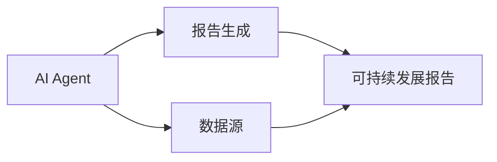
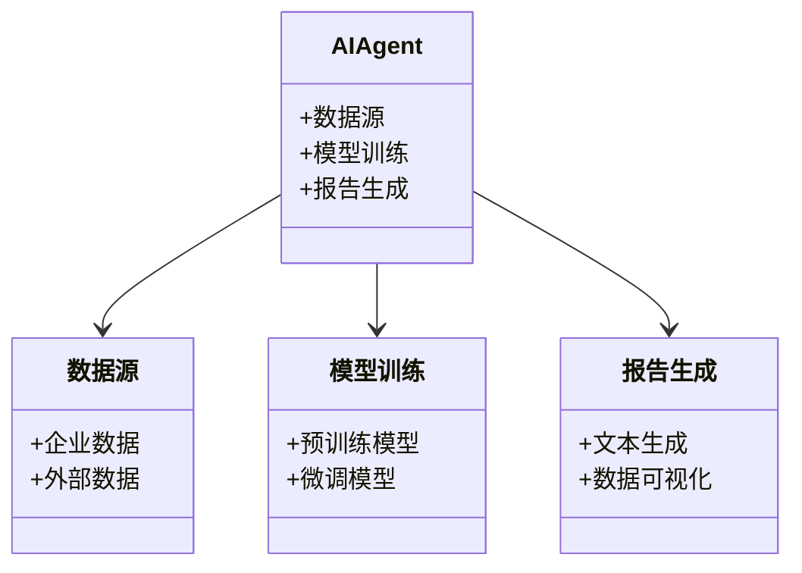
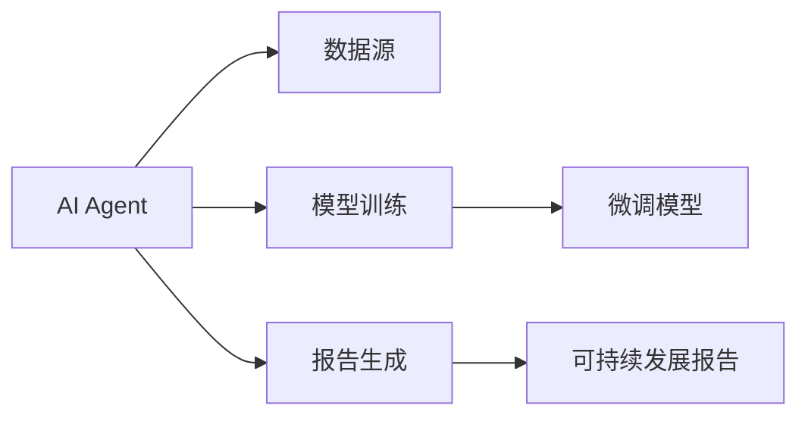
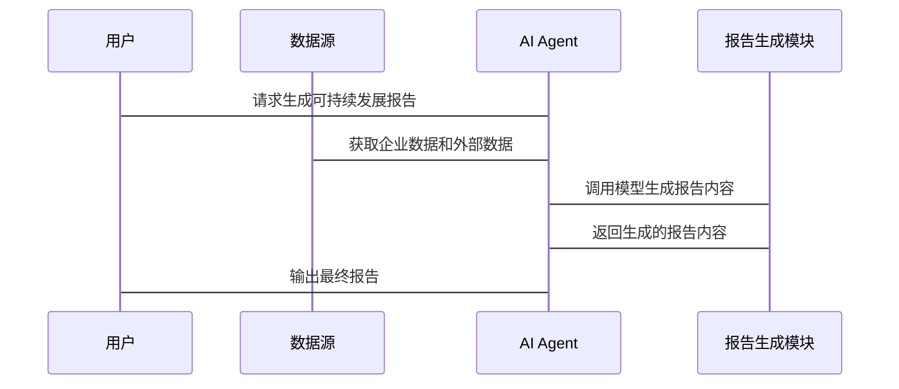

                 


# AI Agent在企业可持续发展报告生成中的应用

## 关键词：AI Agent, 可持续发展报告, 自然语言处理, 机器学习, 数据挖掘

## 摘要：  
随着企业对可持续发展的关注不断增加，生成高质量的可持续发展报告变得至关重要。本文探讨AI Agent如何利用自然语言处理和机器学习技术，自动化和优化可持续发展报告的生成过程，解决企业在数据整合、内容生成和合规性验证等方面的痛点。通过详细的技术分析和实际案例，本文揭示AI Agent在这一领域的潜力和应用前景。

---

# 第一部分: AI Agent与企业可持续发展报告概述

## 第1章: AI Agent与可持续发展报告的背景

### 1.1 AI Agent的基本概念

#### 1.1.1 AI Agent的定义  
AI Agent（人工智能代理）是指能够感知环境、执行任务并做出决策的智能实体。它可以是一个软件程序，也可以是嵌入硬件的智能系统，其核心目标是通过自主学习和推理，帮助用户完成复杂任务。

#### 1.1.2 AI Agent的核心特点  
- **自主性**：AI Agent能够在没有人工干预的情况下独立运行。  
- **反应性**：能够实时感知环境变化并做出响应。  
- **学习能力**：通过数据和反馈不断优化自身的性能。  
- **目标导向**：专注于完成特定目标或任务。  

#### 1.1.3 AI Agent与传统自动化工具的区别  
AI Agent与传统自动化工具的主要区别在于其智能性和适应性。传统工具基于固定的规则执行任务，而AI Agent能够通过学习和推理适应复杂多变的环境，具备更强的灵活性和问题解决能力。

### 1.2 可持续发展报告的基本概念

#### 1.2.1 可持续发展报告的定义  
可持续发展报告（Sustainability Report）是企业对其在经济、环境和社会责任方面的表现进行评估和披露的文件。它不仅包括企业的财务绩效，还包括其在环境保护、社会责任和治理方面的具体行动和成果。

#### 1.2.2 可持续发展报告的核心要素  
- **经济指标**：如收入、利润、研发投入等。  
- **环境指标**：如碳排放量、能源消耗、资源利用效率等。  
- **社会指标**：如员工满意度、社会责任项目、社区贡献等。  
- **治理指标**：如公司治理结构、合规性、风险管理等。  

#### 1.2.3 可持续发展报告的分类与特点  
可持续发展报告可以分为内部报告和外部报告。内部报告用于企业内部管理，而外部报告则用于向利益相关方（如股东、客户、政府等）披露信息。其特点包括数据的全面性、指标的多样性以及报告的合规性。

### 1.3 AI Agent在企业中的应用背景

#### 1.3.1 企业可持续发展的挑战与需求  
企业在实现可持续发展目标时面临以下挑战：  
- 数据分散：企业各部门的数据往往分散在不同的系统中，难以整合和分析。  
- 报告复杂性：可持续发展报告需要涵盖多个方面的指标，生成过程复杂且耗时。  
- 合规性要求：不同地区和行业对可持续发展报告的格式和内容有不同要求，企业需要确保报告的合规性。  

#### 1.3.2 AI Agent在企业中的潜在应用场景  
AI Agent可以通过以下方式帮助企业生成可持续发展报告：  
- **数据整合与分析**：AI Agent可以从企业内部系统中提取数据，并通过自然语言处理技术整合外部数据源。  
- **自动化报告生成**：基于机器学习模型，AI Agent可以自动生成符合企业需求的报告内容。  
- **实时监控与反馈**：AI Agent可以实时监控企业的可持续发展表现，并提供动态反馈和优化建议。  

#### 1.3.3 可持续发展报告生成的痛点与解决方案  
企业的痛点包括：  
- 数据准确性：如何确保数据的准确性和完整性。  
- 内容一致性：如何保证报告内容的逻辑一致性和格式统一性。  
- 时间效率：如何在短时间内生成高质量的报告。  

解决方案：  
- 引入AI Agent进行数据整合和分析，提高数据处理的效率和准确性。  
- 利用自然语言处理技术生成报告内容，降低人工干预，缩短报告生成时间。  

---

## 第2章: AI Agent在企业可持续发展报告生成中的核心概念

### 2.1 AI Agent与可持续发展报告的关系

#### 2.1.1 AI Agent如何辅助可持续发展报告的生成  
AI Agent可以通过以下步骤辅助生成可持续发展报告：  
1. **数据收集**：从企业内部系统（如ERP、CRM）和外部数据库（如行业报告、市场数据）中收集相关数据。  
2. **数据处理**：对收集到的数据进行清洗、转换和整合，确保数据的准确性和一致性。  
3. **内容生成**：基于机器学习模型，生成符合企业需求的报告内容，包括文本、图表和分析结果。  
4. **报告优化**：根据预设的规则或用户的反馈，优化报告的结构和内容，使其更符合阅读习惯和合规要求。  

#### 2.1.2 可持续发展报告生成的关键问题  
- **数据质量问题**：数据来源多样，可能存在不一致、缺失或错误。  
- **内容一致性**：报告内容需要符合企业的品牌和风格，同时满足监管要求。  
- **生成效率**：如何在有限的时间内生成高质量的报告。  

#### 2.1.3 AI Agent在报告生成中的角色与作用  
AI Agent在可持续发展报告生成中的作用包括：  
- **数据整合与分析**：AI Agent能够快速处理大量数据，提取关键指标并生成分析结果。  
- **内容生成**：利用自然语言处理技术，AI Agent可以自动生成报告的文本内容，包括摘要、分析和建议。  
- **实时监控与反馈**：AI Agent可以实时跟踪企业的可持续发展表现，并提供动态反馈和优化建议。  

### 2.2 核心概念与联系

#### 2.2.1 AI Agent的核心原理  
AI Agent的核心原理包括：  
- **感知环境**：通过传感器或数据接口感知外部环境并获取相关信息。  
- **决策与推理**：基于感知到的信息，通过算法进行推理和决策，选择最优行动方案。  
- **执行任务**：根据决策结果执行具体任务，并将结果反馈到系统中。  

#### 2.2.2 可持续发展报告生成的关键技术  
- **自然语言处理（NLP）**：用于文本生成、语义理解等任务。  
- **机器学习**：用于数据预测、模式识别和分类等任务。  
- **数据挖掘**：用于从大量数据中提取有用信息和知识。  

#### 2.2.3 AI Agent与可持续发展报告生成的实体关系图  



### 2.3 核心概念对比分析

#### 2.3.1 AI Agent与传统自动化工具的对比  

| 特性                | AI Agent                          | 传统自动化工具                     |
|---------------------|-----------------------------------|------------------------------------|
| 自主性              | 高                                | 低                                |
| 学习能力            | 高                                | 无或低                            |
| 环境适应性          | 高                                | 低                                |
| 任务处理复杂度      | 高（复杂任务）                   | 低（简单重复任务）                 |

#### 2.3.2 可持续发展报告生成中的关键属性对比  

| 属性                | 数据驱动型报告生成               | AI Agent辅助生成                  |
|---------------------|-----------------------------------|------------------------------------|
| 数据处理能力        | 依赖人工干预                     | 自动化处理                         |
| 内容生成能力        | 依赖人工编写                     | 自动生成内容                       |
| 时间效率            | 较低                             | 较高                               |
| 数据准确性          | 可能存在错误                     | 更高                               |

#### 2.3.3 实体关系图的详细分析  
在上述实体关系图中，AI Agent作为核心实体，与数据源、报告生成和可持续发展报告之间存在直接关系。数据源包括企业内部系统和外部数据库，AI Agent通过数据源获取所需信息，并利用这些信息生成可持续发展报告。报告生成过程中，AI Agent可以调用多种算法和模型，如自然语言处理和机器学习模型，以确保生成的报告内容准确、一致且符合合规要求。

---

## 第3章: AI Agent在企业可持续发展报告生成中的算法原理

### 3.1 AI Agent的核心算法

#### 3.1.1 基于大语言模型的生成算法  
大语言模型（Large Language Model, LLM）是AI Agent实现文本生成的核心算法之一。LLM通过训练大量的文本数据，学习语言的结构和语义，从而能够生成与上下文相关且自然流畅的文本。

- **训练过程**：基于Transformer架构的模型（如BERT、GPT）通过大量的数据进行预训练和微调。  
- **生成过程**：利用贪心算法或采样方法生成文本，如GPT模型通过生成概率最高的下一个词来构建完整的文本。

#### 3.1.2 基于强化学习的优化算法  
强化学习（Reinforcement Learning, RL）是一种通过奖励机制优化模型行为的算法。在可持续发展报告生成中，强化学习可以用于优化报告的结构和内容。

- **训练过程**：模型通过与环境交互，根据获得的奖励调整其策略，以最大化累积奖励。  
- **应用实例**：在生成报告内容时，模型可以根据用户的反馈（如语法正确性、逻辑性）调整生成策略，以提高报告的质量。

#### 3.1.3 基于监督学习的微调算法  
监督学习（Supervised Learning）是一种基于标注数据进行模型训练的算法。在可持续发展报告生成中，监督学习可以用于对大语言模型进行微调，使其更适合特定的任务。

- **训练过程**：使用标注的可持续发展报告数据对模型进行微调，使其能够生成符合特定格式和内容要求的报告。  
- **应用实例**：对GPT模型进行微调，使其能够生成符合企业品牌和风格的报告内容。

### 3.2 可持续发展报告生成的算法流程

#### 3.2.1 数据预处理与特征提取  
- **数据清洗**：去除噪声数据，确保数据的准确性和完整性。  
- **特征提取**：从数据中提取关键特征，如时间戳、关键词、指标值等。  

#### 3.2.2 模型训练与优化  
- **训练数据**：使用标注的可持续发展报告数据对模型进行训练。  
- **优化策略**：通过强化学习或监督学习对模型进行优化，提高生成内容的质量和一致性。  

#### 3.2.3 报告生成与输出  
- **文本生成**：利用训练好的模型生成报告的文本内容。  
- **数据可视化**：将生成的指标数据转化为图表形式，增强报告的可读性。  
- **报告输出**：将生成的文本和图表整合成最终的可持续发展报告。  

### 3.3 算法实现的数学模型

#### 3.3.1 大语言模型的数学表示  
大语言模型的数学表示通常基于Transformer架构，包括编码器和解码器两部分。编码器将输入文本转换为嵌入向量，解码器根据嵌入向量生成输出文本。

$$
\text{编码器：} \quad z = \text{Encoder}(x)
$$  
$$
\text{解码器：} \quad y = \text{Decoder}(z)
$$  

其中，$x$ 是输入文本，$z$ 是编码器输出的嵌入向量，$y$ 是解码器输出的生成文本。

#### 3.3.2 强化学习的奖励函数  
强化学习的奖励函数用于衡量模型生成的报告内容的质量。奖励函数可以基于多种因素，如语法正确性、逻辑性、语义相关性等。

$$
R(s, a) = r_1 \times f_1(s, a) + r_2 \times f_2(s, a)
$$  

其中，$s$ 是状态，$a$ 是动作，$r_1$ 和 $r_2$ 是权重因子，$f_1$ 和 $f_2$ 是评价函数。例如，$f_1$ 可以是语法正确性评分，$f_2$ 可以是逻辑性评分。

---

## 第4章: AI Agent在企业可持续发展报告生成中的系统设计

### 4.1 系统功能设计

#### 4.1.1 领域模型设计  
以下是可持续发展报告生成系统的领域模型：



#### 4.1.2 系统架构设计  



#### 4.1.3 系统接口设计  
系统接口包括：  
- 数据接口：用于与企业内部系统和外部数据库交互。  
- 模型接口：用于与预训练模型和微调模型交互。  
- 报告接口：用于生成和输出可持续发展报告。  

#### 4.1.4 系统交互流程  



### 4.2 项目实战

#### 4.2.1 环境安装  
需要安装以下工具和库：  
- Python 3.8+  
- PyTorch或TensorFlow  
- Hugging Face Transformers库  
- Mermaid CLI（用于生成图表）  

#### 4.2.2 系统核心实现源代码  

```python
from transformers import AutoTokenizer, AutoModelForCausalLM
import torch

# 加载预训练模型
model_name = "gpt2-large"
tokenizer = AutoTokenizer.from_pretrained(model_name)
model = AutoModelForCausalLM.from_pretrained(model_name)

# 微调模型
def fine_tune_model(train_dataset, val_dataset):
    optimizer = torch.optim.AdamW(model.parameters(), lr=1e-5)
    criterion = torch.nn.CrossEntropyLoss()
    model.train()
    for epoch in range(num_epochs):
        for batch in train_loader:
            inputs, labels = batch
            outputs = model(inputs.input_ids, labels=input_ids)
            loss = criterion(outputs.logits, labels)
            loss.backward()
            optimizer.step()
            model.zero_grad()
```

#### 4.2.3 代码应用解读与分析  
上述代码展示了如何使用Hugging Face的Transformers库对GPT-2模型进行微调，以生成符合企业需求的可持续发展报告。通过加载预训练模型、定义微调函数和训练循环，我们可以训练出一个适合特定任务的AI Agent。

---

## 第5章: AI Agent在企业可持续发展报告生成中的最佳实践

### 5.1 实践中的注意事项

#### 5.1.1 数据隐私与安全  
在处理企业数据时，必须确保数据的隐私和安全，避免数据泄露和滥用。可以通过加密技术和访问控制来实现数据的安全管理。

#### 5.1.2 模型泛化能力  
微调后的模型需要具备良好的泛化能力，以适应不同行业和地区的监管要求。可以通过数据增强和多任务学习来提高模型的泛化能力。

#### 5.1.3 用户反馈与模型优化  
定期收集用户的反馈，并根据反馈优化模型的生成策略和报告内容。可以通过强化学习和主动学习等技术实现模型的持续优化。

### 5.2 拓展阅读与学习资源  
- [Hugging Face Transformers文档](https://huggingface.co/transformers/)  
- [Deep Learning Book](http://deeplearningbook.org/)  
- [Mermaid图表工具](https://mermaid-js.github.io/mermaid-live-editor/)  

---

## 第6章: 总结与展望

### 6.1 总结  
本文详细探讨了AI Agent在企业可持续发展报告生成中的应用，从背景、核心概念、算法原理到系统设计和项目实战，全面分析了AI Agent在这一领域的潜力和优势。通过引入自然语言处理和机器学习技术，AI Agent能够显著提高报告生成的效率和质量，帮助企业更好地实现可持续发展目标。

### 6.2 未来展望  
随着AI技术的不断发展，AI Agent在企业可持续发展报告生成中的应用将更加广泛和深入。未来的研究方向包括：  
- 更加智能化的模型设计，以提高报告生成的个性化和动态适应性。  
- 更加高效的数据处理技术，以支持实时监控和动态报告生成。  
- 更加多样化的应用场景，如跨国企业的多语言报告生成和行业的定制化报告生成。  

---

## 作者：AI天才研究院（AI Genius Institute） & 禅与计算机程序设计艺术（Zen And The Art of Computer Programming）

---

这篇文章详细介绍了AI Agent在企业可持续发展报告生成中的应用，涵盖了从理论到实践的各个方面，旨在为企业技术决策者和开发人员提供有价值的参考和指导。

