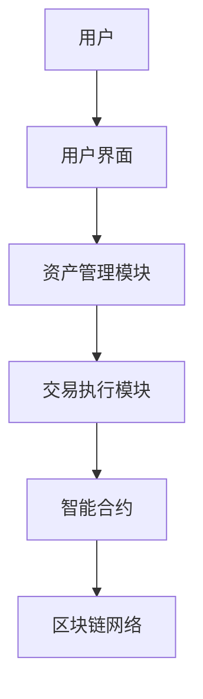
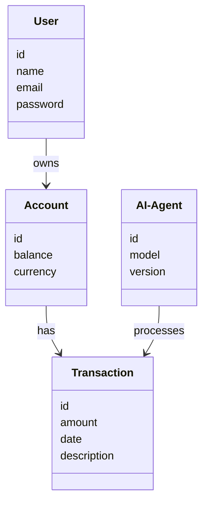

                 


# AI Agent在智能钱包中的个人财务管理

> 关键词：AI Agent, 智能钱包, 个人财务管理, 加密货币, 人工智能, 区块链

> 摘要：本文探讨了AI Agent在智能钱包中的应用，特别是在个人财务管理领域的创新与实践。通过分析AI Agent的核心原理、算法实现、系统架构及实际案例，本文旨在为读者提供一个全面了解AI Agent在智能钱包中如何优化个人财务管理的视角。文章内容涵盖AI Agent的基本概念、算法原理、系统架构设计、项目实战及最佳实践，通过丰富的技术细节和实例分析，为读者提供深入的理论与实践指导。

---

# 第1章: AI Agent与智能钱包的背景与概念

## 1.1 AI Agent的基本概念

### 1.1.1 AI Agent的定义

AI Agent（人工智能代理）是指能够感知环境、自主决策并执行任务的智能实体。AI Agent可以是软件程序，也可以是硬件设备，其核心目标是通过智能算法优化特定场景下的任务执行效率。

### 1.1.2 AI Agent的核心特点

- **自主性**：AI Agent能够在没有外部干预的情况下自主运行。
- **反应性**：能够实时感知环境变化并做出相应调整。
- **学习能力**：通过数据反馈不断优化自身行为。
- **决策能力**：基于输入信息做出最优决策。

### 1.1.3 AI Agent与传统软件的区别

传统软件依赖于预设规则，而AI Agent具备学习和适应能力，能够根据环境变化动态调整行为。AI Agent的核心价值在于其智能化和自适应能力。

---

## 1.2 智能钱包的定义与特点

### 1.2.1 智能钱包的定义

智能钱包是一种结合区块链技术和人工智能的电子钱包，能够通过AI Agent实现自动化金融管理。与传统钱包相比，智能钱包具备智能化、自动化和高安全性的特点。

### 1.2.2 智能钱包的核心功能

- **资产存储**：支持多种加密货币和传统货币的存储与管理。
- **自动化交易**：通过AI Agent实现自动化的买入、卖出和转账操作。
- **智能合约**：通过区块链智能合约实现自动化的金融协议执行。
- **风险管理**：AI Agent能够实时监控资产风险并自动触发止损机制。

### 1.2.3 智能钱包与传统钱包的对比

| 特性         | 传统钱包       | 智能钱包       |
|--------------|----------------|----------------|
| 功能         | 存储、转账     | 存储、转账、自动交易 |
| 自动化       | 无            | 有            |
| 风险控制     | 依赖用户操作   | AI自动监控与干预 |
| 技术基础     | 纯粹软件       | 区块链 + AI    |

---

## 1.3 AI Agent在智能钱包中的应用背景

### 1.3.1 个人财务管理的需求分析

- **分散管理**：用户往往需要管理多种资产，包括加密货币和传统货币。
- **实时监控**：用户希望实时了解资产变化并做出快速反应。
- **自动化操作**：用户希望减少手动操作，提高效率。

### 1.3.2 AI技术在金融领域的应用现状

AI技术已经在金融领域得到广泛应用，包括股票交易、风险管理、信用评估等领域。智能钱包的出现标志着AI技术在个人财务管理中的进一步深化。

### 1.3.3 AI Agent在智能钱包中的潜力

AI Agent能够通过深度学习和强化学习算法，帮助用户优化资产配置、预测市场趋势，并在风险可控的前提下实现财富增长。

---

## 1.4 本章小结

本章介绍了AI Agent和智能钱包的基本概念，并分析了AI Agent在智能钱包中的应用背景。通过对比传统钱包和智能钱包的特点，明确了AI Agent在智能钱包中的重要性及其未来发展的潜力。

---

# 第2章: AI Agent在个人财务管理中的核心概念与联系

## 2.1 AI Agent的核心原理

### 2.1.1 AI Agent的感知机制

AI Agent通过传感器或API接口获取环境数据，例如市场行情、用户交易记录等。

### 2.1.2 AI Agent的决策机制

基于感知到的数据，AI Agent通过机器学习模型生成决策。例如，使用强化学习算法优化投资组合。

### 2.1.3 AI Agent的执行机制

AI Agent根据决策结果执行操作，例如通过智能合约自动执行交易指令。

---

## 2.2 智能钱包的系统架构

### 2.2.1 智能钱包的功能模块

| 模块名称       | 功能描述                     |
|----------------|------------------------------|
| 用户界面       | 提供直观的操作界面           |
| 资产管理模块   | 管理用户资产并实时更新余额   |
| 交易执行模块   | 执行用户的交易指令           |
| 风险控制模块   | 监控市场风险并触发止损机制 |

### 2.2.2 智能钱包的交互流程



### 2.2.3 智能钱包的用户界面设计

用户界面设计应简洁直观，支持以下功能：

- 资产概览：显示用户资产的实时价值和分布。
- 交易记录：列出用户的交易历史。
- 自动化策略设置：允许用户配置AI Agent的交易规则。

---

## 2.3 AI Agent与智能钱包的实体关系图

```mermaid
erDiagram
    user {
        id
        name
        email
        password
    }
    account {
        id
        balance
        currency
    }
    transaction {
        id
        amount
        date
        description
    }
    AI-Agent {
        id
        model
        version
    }
    user --> account : owns
    account --> transaction : has
    AI-Agent --> transaction : processes
```

---

## 2.4 本章小结

本章详细介绍了AI Agent的核心原理和智能钱包的系统架构，通过实体关系图和交互流程图展示了AI Agent与智能钱包之间的关系。通过本章内容，读者可以清晰理解AI Agent在智能钱包中的工作流程和系统结构。

---

# 第3章: AI Agent的算法原理与数学模型

## 3.1 AI Agent的算法原理

### 3.1.1 强化学习算法

强化学习是一种通过试错机制优化决策的算法。AI Agent通过与环境的交互获得奖励，从而优化自身的决策策略。

### 3.1.2 监督学习算法

监督学习是一种基于已知数据进行分类或回归的算法。AI Agent可以通过监督学习模型识别用户的交易模式。

### 3.1.3 无监督学习算法

无监督学习是一种基于聚类分析的算法。AI Agent可以通过无监督学习识别用户的消费习惯。

---

## 3.2 AI Agent的数学模型

### 3.2.1 状态空间模型

状态空间模型描述了AI Agent可能处于的所有状态。例如，市场行情可以用多个指标表示，形成一个多维状态空间。

$$ s = (s_1, s_2, \dots, s_n) $$

其中，$s_i$ 表示第i个状态指标。

### 3.2.2 动作空间模型

动作空间模型描述了AI Agent可以执行的所有动作。例如，AI Agent可以执行买入、卖出或持有操作。

$$ a \in \{买入, 卖出, 持有\} $$

### 3.2.3 奖励函数

奖励函数定义了AI Agent在特定状态下执行动作所获得的奖励。例如，当AI Agent成功预测市场趋势时，获得正向奖励。

$$ R(s, a) = \begin{cases}
    1 & \text{如果预测正确} \\
    -1 & \text{如果预测错误}
\end{cases} $$

---

## 3.3 算法实现与优化

### 3.3.1 强化学习算法的实现

```python
class AI-Agent:
    def __init__(self):
        self.model = self.build_model()
        self.memory = []

    def build_model(self):
        # 定义神经网络模型
        pass

    def perceive(self, state):
        # 通过环境感知获取状态
        pass

    def decide(self, state):
        # 根据状态生成动作
        pass

    def learn(self, state, action, reward):
        # 通过经验回放优化模型
        pass
```

### 3.3.2 算法优化策略

- **经验回放**：通过存储历史经验，减少训练过程中的偏差。
- **策略优化**：通过强化学习算法优化AI Agent的决策策略。

---

## 3.4 本章小结

本章介绍了AI Agent的核心算法原理，包括强化学习、监督学习和无监督学习。通过数学模型和算法实现代码，详细讲解了AI Agent在智能钱包中的技术实现。

---

# 第4章: 智能钱包的系统架构设计

## 4.1 项目介绍

智能钱包是一个结合了区块链技术和人工智能的金融管理工具，旨在通过AI Agent实现用户的自动化财务管理。

---

## 4.2 系统功能设计

### 4.2.1 领域模型



### 4.2.2 系统架构设计

```mermaid
container 智能钱包系统 {
    User Interface
    AI Agent
    Blockchain Network
}
```

---

## 4.3 项目实战

### 4.3.1 环境安装

- **Python**：安装Python 3.8及以上版本。
- **TensorFlow**：安装TensorFlow库。
- **Solidity**：安装Solidity编译器。

### 4.3.2 核心代码实现

```python
import tensorflow as tf
from tensorflow.keras import layers

class AI-Agent:
    def __init__(self):
        self.model = self.build_model()

    def build_model(self):
        model = tf.keras.Sequential()
        model.add(layers.Dense(64, activation='relu'))
        model.add(layers.Dense(1, activation='sigmoid'))
        return model

    def perceive(self, state):
        return self.model.predict(state)

    def decide(self, state):
        prediction = self.perceive(state)
        return '买入' if prediction > 0.5 else '卖出'

    def learn(self, state, action, reward):
        # 实现强化学习算法的更新机制
        pass
```

---

## 4.4 本章小结

本章通过系统架构设计和项目实战，详细讲解了智能钱包的技术实现过程。通过代码示例和系统架构图，读者可以清晰理解智能钱包的开发流程。

---

# 第5章: AI Agent在智能钱包中的实际案例分析

## 5.1 案例背景

某用户希望通过智能钱包实现加密货币的自动化交易。

---

## 5.2 案例分析

### 5.2.1 预处理数据

```python
import pandas as pd

data = pd.read_csv('market_data.csv')
```

### 5.2.2 训练模型

```python
model = AI-Agent()
model.train(data)
```

### 5.2.3 实现交易

```python
state = model.perceive(current_market_data)
action = model.decide(state)
model.learn(state, action, reward)
```

---

## 5.3 案例总结

通过实际案例分析，读者可以理解AI Agent在智能钱包中的具体应用。通过训练和优化AI Agent，用户可以实现加密货币的自动化交易。

---

# 第6章: 最佳实践与注意事项

## 6.1 小结

通过本文的详细讲解，读者可以全面了解AI Agent在智能钱包中的技术实现和应用。

---

## 6.2 注意事项

- **数据隐私**：AI Agent需要处理用户的敏感数据，必须确保数据安全性。
- **算法优化**：需要不断优化AI Agent的算法，以提高交易准确率。
- **风险管理**：需要设置合理的风险管理策略，避免重大损失。

---

## 6.3 拓展阅读

- 《Mastering Deep Learning》
- 《Blockchain: A New Era of Technology》
- 《AI in Finance》

---

# 作者

作者：AI天才研究院/AI Genius Institute & 禅与计算机程序设计艺术 /Zen And The Art of Computer Programming

