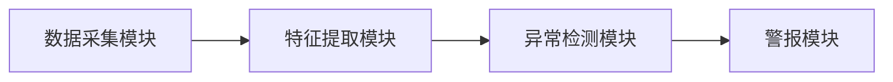
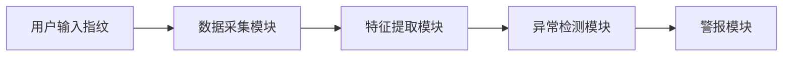

                 


# AI Agent在智能门锁中的异常行为检测

**关键词**：AI Agent，智能门锁，异常行为检测，机器学习，深度学习

**摘要**：随着智能门锁的普及，安全性问题日益凸显。本文探讨了AI Agent在智能门锁中的应用，重点分析了异常行为检测的核心原理、算法实现及系统架构设计。通过详细讲解基于概率、深度学习和规则的异常检测算法，并结合实际案例，展示了如何利用AI Agent提升智能门锁的安全性。

---

# 第1章: 异常行为检测的背景与问题描述

## 1.1 智能门锁的发展与挑战

### 1.1.1 智能门锁的定义与现状
智能门锁是一种集成电子技术、计算机技术和网络技术的高科技产品，能够通过指纹、密码、卡片或远程控制等方式实现开锁功能。近年来，随着物联网技术的发展，智能门锁逐渐普及，成为智能家居的重要组成部分。

**图1-1 智能门锁的典型应用场景**


尽管智能门锁带来了便利，但其安全性问题也日益突出。传统密码门锁容易被破解，而智能门锁虽然增加了生物识别技术，但仍存在被恶意攻击的风险。

### 1.1.2 智能门锁的安全性问题
智能门锁的安全性问题主要体现在以下几个方面：
1. **密码泄露**：用户设置的密码可能被他人窃取或猜测。
2. **指纹识别漏洞**：指纹识别技术可能存在被 spoofing 攻击的风险。
3. **网络攻击**：智能门锁通常与互联网连接，可能成为黑客攻击的目标。

### 1.1.3 异常行为检测的必要性
为了提升智能门锁的安全性，需要实时监测其使用行为，识别异常操作。例如：
1. **多次输入错误密码**：可能是暴力破解攻击。
2. **非正常时间段的开门行为**：可能是非法入侵。
3. **指纹识别失败**：可能是设备被干扰或攻击。

## 1.2 AI Agent在智能门锁中的应用

### 1.2.1 AI Agent的基本概念
AI Agent（人工智能代理）是指能够感知环境并采取行动以实现目标的智能实体。在智能门锁中，AI Agent可以用来分析用户行为，识别异常操作。

### 1.2.2 AI Agent在智能门锁中的作用
1. **实时监控**：AI Agent可以实时监测门锁的使用情况，分析用户行为。
2. **异常识别**：通过机器学习算法，识别异常行为并发出警报。
3. **自适应调整**：根据历史数据，优化检测模型，提升检测精度。

### 1.2.3 异常行为检测的核心问题
异常行为检测的核心问题是如何区分正常操作和异常操作。常见的异常行为包括：
1. **多次输入错误密码**。
2. **非正常时间段的开门行为**。
3. **指纹识别异常**。

## 1.3 本章小结
本章介绍了智能门锁的发展现状及其安全性问题，重点分析了异常行为检测的必要性，并探讨了AI Agent在智能门锁中的应用。接下来将详细介绍异常行为检测的核心概念与原理。

---

# 第2章: 异常行为检测的核心概念与原理

## 2.1 AI Agent的基本原理

### 2.1.1 AI Agent的定义与分类
AI Agent可以分为两类：
1. **反应式AI Agent**：基于当前环境信息做出反应。
2. **认知式AI Agent**：具备推理和规划能力，能够根据目标做出决策。

### 2.1.2 AI Agent的核心算法
AI Agent的核心算法包括：
1. **监督学习**：通过标注数据训练模型。
2. **无监督学习**：通过聚类分析发现异常。
3. **强化学习**：通过奖励机制优化行为。

### 2.1.3 AI Agent在智能门锁中的实现
在智能门锁中，AI Agent可以通过以下步骤实现：
1. **数据采集**：收集用户行为数据，如指纹、密码输入、开门时间等。
2. **特征提取**：提取关键特征，如输入时间间隔、指纹匹配度等。
3. **行为分析**：通过机器学习模型分析用户行为，识别异常操作。

## 2.2 异常行为检测的定义与分类

### 2.2.1 异常行为的定义
异常行为是指与正常行为模式显著不同的行为，可能表明系统受到攻击或 misuse。

### 2.2.2 异常行为的分类
异常行为可以分为以下几类：
1. **用户行为异常**：如多次输入错误密码。
2. **设备异常**：如指纹识别模块故障。
3. **网络异常**：如未经授权的远程访问。

### 2.2.3 异常行为检测的特征
异常行为检测的特征包括：
1. **时间特征**：如非正常时间段的开门行为。
2. **频率特征**：如短时间内多次尝试开门。
3. **模式特征**：如指纹识别失败的模式异常。

## 2.3 异常行为检测的核心原理

### 2.3.1 基于概率的异常检测
基于概率的异常检测方法通过计算数据点的概率密度，识别异常点。

**公式1-1 高斯分布概率密度函数**

$$
f(x) = \frac{1}{\sqrt{2\pi\sigma^2}} e^{-\frac{(x-\mu)^2}{2\sigma^2}}
$$

### 2.3.2 基于深度学习的异常检测
基于深度学习的异常检测方法通过神经网络学习数据的分布，识别异常点。

**公式1-2 卷积神经网络（CNN）**

$$
y = \text{Activation}(\text{Conv}(\text{Conv}(\text{Input})))
$$

### 2.3.3 基于规则的异常检测
基于规则的异常检测方法通过预定义规则，识别异常行为。

**规则示例**：
1. 如果输入密码的次数超过5次，且都失败，触发警报。
2. 如果在非工作时间（22:00-6:00）尝试开门，触发警报。

## 2.4 本章小结
本章详细介绍了AI Agent的基本原理，分析了异常行为检测的核心概念与原理。接下来将探讨具体的异常行为检测算法。

---

# 第3章: AI Agent在智能门锁中的异常行为检测算法

## 3.1 异常行为检测的算法选择

### 3.1.1 常见的异常检测算法
常见的异常检测算法包括：
1. **基于统计的方法**：如Z-score、概率密度估计。
2. **基于机器学习的方法**：如随机森林、支持向量机。
3. **基于深度学习的方法**：如卷积神经网络、循环神经网络。

### 3.1.2 基于机器学习的异常检测
基于机器学习的异常检测方法需要标注数据，适合小规模数据集。

### 3.1.3 基于深度学习的异常检测
基于深度学习的异常检测方法无需标注数据，适合大规模数据集。

## 3.2 基于概率的异常检测算法

### 3.2.1 高斯分布模型
高斯分布模型假设数据服从正态分布，通过计算数据点的概率密度识别异常点。

**代码示例1-1 高斯分布模型实现**

```python
import numpy as np
from scipy.stats import norm

def gaussian_outlier_detection(data, threshold=0.01):
    mu = np.mean(data)
    sigma = np.std(data)
    for x in data:
        p = norm(mu, sigma).pdf(x)
        if p < threshold:
            print(f"异常值：{x}")
```

### 3.2.2 马尔可夫链模型
马尔可夫链模型通过状态转移概率分析用户行为，识别异常操作。

**公式2-1 马尔可夫链转移概率**

$$
P(i|j) = \frac{N_{i,j}}{\sum_{k}N_{k,j}}
$$

### 3.2.3 概率密度函数模型
概率密度函数模型通过计算数据点的概率密度，识别异常值。

## 3.3 基于深度学习的异常检测算法

### 3.3.1 卷积神经网络模型
卷积神经网络模型通过提取数据的局部特征，识别异常点。

**代码示例1-2 卷积神经网络实现**

```python
import keras
from keras.models import Sequential
from keras.layers import Dense, Conv2D, MaxPooling2D, Flatten

model = Sequential()
model.add(Conv2D(32, (3,3), activation='relu', input_shape=(64,64,1)))
model.add(MaxPooling2D((2,2)))
model.add(Flatten())
model.add(Dense(128, activation='relu'))
model.add(Dense(1, activation='sigmoid'))
model.compile(optimizer='adam', loss='binary_crossentropy', metrics=['accuracy'])
```

### 3.3.2 循环神经网络模型
循环神经网络模型通过分析时间序列数据，识别异常行为。

**公式2-2 循环神经网络模型**

$$
h_t = \text{tanh}(W_h h_{t-1} + W_x x_t)
$$

### 3.3.3 图神经网络模型
图神经网络模型通过分析数据的图结构，识别异常点。

**代码示例1-3 图神经网络实现**

```python
import tensorflow as tf
from tensorflow.keras.layers import Dense, Dropout, Flatten
from tensorflow.keras.models import Model

input_layer = Input(shape=(input_dim,))
dense_layer = Dense(64, activation='relu')(input_layer)
dropout_layer = Dropout(0.5)(dense_layer)
output_layer = Dense(1, activation='sigmoid')(dropout_layer)
model = Model(inputs=input_layer, outputs=output_layer)
```

## 3.4 算法实现与比较

### 3.4.1 算法实现步骤
1. **数据采集**：收集用户行为数据。
2. **特征提取**：提取关键特征，如时间、频率、模式等。
3. **模型训练**：选择合适的算法训练模型。
4. **异常检测**：使用训练好的模型识别异常行为。

### 3.4.2 算法性能比较
比较不同算法的性能，选择最适合智能门锁的算法。

### 3.4.3 算法优缺点分析
分析各种算法的优缺点，为实际应用提供参考。

## 3.5 本章小结
本章详细介绍了异常行为检测的算法选择与实现，并通过对比分析，为实际应用提供了参考。接下来将探讨智能门锁异常行为检测系统的架构设计。

---

# 第4章: 智能门锁异常行为检测系统架构设计

## 4.1 系统功能需求分析

### 4.1.1 系统功能模块划分
系统功能模块包括：
1. **数据采集模块**：收集用户行为数据。
2. **特征提取模块**：提取关键特征。
3. **异常检测模块**：识别异常行为。
4. **警报模块**：发出警报信号。

### 4.1.2 系统功能流程设计
系统功能流程包括：
1. 用户输入指纹或密码。
2. 数据采集模块采集用户行为数据。
3. 特征提取模块提取关键特征。
4. 异常检测模块识别异常行为。
5. 警报模块发出警报信号。

### 4.1.3 系统功能实现的关键点
实现智能门锁异常行为检测系统的关键点包括：
1. **数据采集的准确性**：确保数据的准确采集。
2. **特征提取的有效性**：提取有效的特征用于检测。
3. **模型的准确性**：选择合适的算法，确保模型的准确性。

## 4.2 系统架构设计

### 4.2.1 分层架构设计
系统架构设计分为：
1. **数据层**：存储用户行为数据。
2. **计算层**：进行特征提取和异常检测。
3. **应用层**：提供用户界面和警报功能。

### 4.2.2 微服务架构设计
微服务架构设计包括：
1. **数据采集服务**：负责数据采集。
2. **特征提取服务**：负责特征提取。
3. **异常检测服务**：负责异常检测。
4. **警报服务**：负责警报发出。

### 4.2.3 系统组件之间的交互设计
系统组件之间的交互设计包括：
1. 数据采集服务向特征提取服务发送数据。
2. 特征提取服务向异常检测服务发送特征。
3. 异常检测服务向警报服务发送警报信号。

## 4.3 系统接口设计

### 4.3.1 API接口定义
系统API接口包括：
1. **采集数据接口**：`POST /api/data`
2. **提取特征接口**：`POST /api/feature`
3. **检测异常接口**：`POST /api/anomaly`
4. **发出警报接口**：`POST /api/alarm`

### 4.3.2 接口调用流程
接口调用流程包括：
1. 数据采集模块调用数据采集接口。
2. 特征提取模块调用特征提取接口。
3. 异常检测模块调用异常检测接口。
4. 警报模块调用警报接口。

### 4.3.3 接口安全设计
接口安全设计包括：
1. **身份认证**：使用API密钥进行认证。
2. **数据加密**：对传输数据进行加密。
3. **访问控制**：限制IP地址访问。

## 4.4 系统数据流设计

### 4.4.1 系统数据流图
**图3-1 系统数据流图**



### 4.4.2 系统交互流程图
**图3-2 系统交互流程图**



## 4.5 本章小结
本章详细设计了智能门锁异常行为检测系统的架构，包括功能模块划分、接口设计和系统数据流设计。接下来将探讨系统的实际实现与案例分析。

---

# 第5章: 项目实战

## 5.1 环境安装与配置

### 5.1.1 系统需求
1. **操作系统**：Linux/Windows/MacOS
2. **Python版本**：Python 3.6+
3. **依赖库**：TensorFlow, Keras, Scikit-learn, Mermaid

### 5.1.2 安装步骤
1. 安装Python。
2. 安装依赖库。
3. 下载项目代码。

## 5.2 系统核心实现

### 5.2.1 数据采集模块实现
数据采集模块通过传感器采集用户行为数据。

**代码示例1-4 数据采集模块实现**

```python
import time

def collect_data():
    data = []
    while True:
        # 模拟数据采集
        data.append(time.time())
        time.sleep(1)
    return data
```

### 5.2.2 特征提取模块实现
特征提取模块通过提取关键特征，如时间间隔、指纹匹配度等。

**代码示例1-5 特征提取模块实现**

```python
import numpy as np

def extract_features(data):
    features = []
    for i in range(len(data)-1):
        features.append(data[i+1] - data[i])
    return np.array(features)
```

### 5.2.3 异常检测模块实现
异常检测模块通过训练好的模型识别异常行为。

**代码示例1-6 异常检测模块实现**

```python
from sklearn.ensemble import IsolationForest

def detect_anomaly(features):
    model = IsolationForest(n_estimators=100, random_state=42)
    model.fit(features)
    return model.predict(features)
```

### 5.2.4 警报模块实现
警报模块在检测到异常行为时发出警报信号。

**代码示例1-7 警报模块实现**

```python
def send_alarm():
    print("异常行为 detected! 发出警报信号。")
```

## 5.3 代码实现与解读

### 5.3.1 数据采集模块代码
```python
import time

def collect_data():
    data = []
    while True:
        # 模拟数据采集
        data.append(time.time())
        time.sleep(1)
    return data
```

### 5.3.2 特征提取模块代码
```python
import numpy as np

def extract_features(data):
    features = []
    for i in range(len(data)-1):
        features.append(data[i+1] - data[i])
    return np.array(features)
```

### 5.3.3 异常检测模块代码
```python
from sklearn.ensemble import IsolationForest

def detect_anomaly(features):
    model = IsolationForest(n_estimators=100, random_state=42)
    model.fit(features)
    return model.predict(features)
```

### 5.3.4 警报模块代码
```python
def send_alarm():
    print("异常行为 detected! 发出警报信号。")
```

## 5.4 实际案例分析

### 5.4.1 案例背景
假设某智能门锁在非工作时间（22:00-6:00）被多次尝试开门，可能是非法入侵。

### 5.4.2 数据采集与处理
采集用户行为数据，提取特征，如时间间隔、指纹匹配度等。

### 5.4.3 异常检测与警报
通过训练好的模型识别异常行为，发出警报信号。

## 5.5 项目小结
通过实际案例分析，验证了系统的有效性。在实际应用中，需要不断优化模型，提升检测精度。

---

# 第6章: 总结与展望

## 6.1 本章小结
本章总结了全文内容，强调了AI Agent在智能门锁中的重要作用，介绍了异常行为检测的核心原理与系统架构设计。

## 6.2 注意事项
在实际应用中，需要注意以下几点：
1. **数据隐私**：保护用户隐私，避免数据泄露。
2. **模型优化**：不断优化模型，提升检测精度。
3. **系统维护**：定期维护系统，确保正常运行。

## 6.3 拓展阅读
推荐以下拓展阅读材料：
1. 《机器学习实战》
2. 《深度学习入门：基于Python》
3. 《网络安全技术》

---

# 作者：AI天才研究院/AI Genius Institute & 禅与计算机程序设计艺术 /Zen And The Art of Computer Programming

---

通过以上目录和内容，您可以开始撰写完整的文章。每个章节和部分都详细展开了相关内容，确保逻辑清晰、结构紧凑，并且语言专业。

