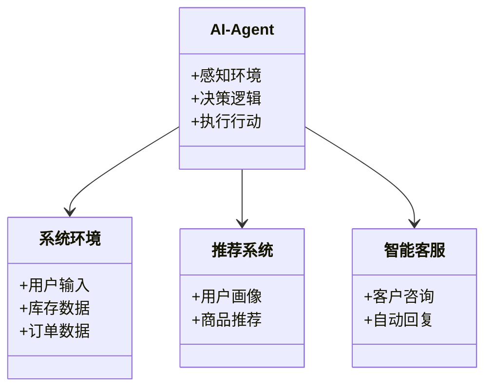
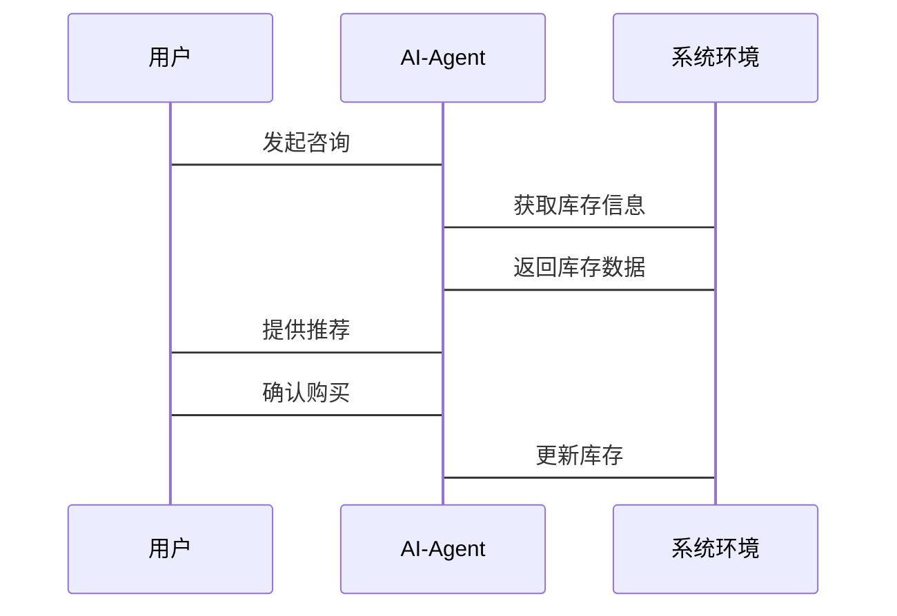

                 


# AI Agent在智能零售中的应用实践

## 关键词：AI Agent, 智能零售, 机器学习, 自然语言处理, 强化学习, 知识图谱, 零售系统

## 摘要

随着人工智能技术的快速发展，AI Agent（人工智能代理）在智能零售中的应用日益广泛。本文系统地探讨了AI Agent在智能零售中的核心概念、技术原理、应用场景及系统设计。文章首先介绍了AI Agent的基本概念和智能零售的背景，然后深入分析了AI Agent的核心技术与工作原理，包括自然语言处理（NLP）、机器学习（ML）和强化学习（RL）等。接着，详细讲解了AI Agent在智能零售中的算法实现，如基于Transformer的对话生成算法和强化学习的决策优化算法。随后，文章从系统架构、功能设计、接口设计和交互流程等多个维度，探讨了AI Agent在智能零售系统中的应用设计。最后，通过实际案例分析，展示了AI Agent在智能零售中的具体应用，并总结了当前技术的优点与局限性，展望了未来的发展方向。

---

## 第一部分: AI Agent在智能零售中的应用背景

### 第1章: AI Agent与智能零售的背景介绍

#### 1.1 AI Agent的基本概念

##### 1.1.1 AI Agent的定义

AI Agent（人工智能代理）是一种能够感知环境并采取行动以实现目标的智能实体。它能够通过传感器获取信息，利用计算模型进行决策，并通过执行器与外部环境交互。

**公式：**
$$
\text{AI Agent} = \text{感知} \rightarrow \text{决策} \rightarrow \text{行动}
$$

##### 1.1.2 AI Agent的核心属性与特征

AI Agent具有以下核心属性：
- **自主性**：能够在没有外部干预的情况下独立运行。
- **反应性**：能够实时感知环境并做出反应。
- **目标导向**：通过设定目标来驱动行为。
- **学习能力**：能够通过数据和经验不断优化自身性能。

##### 1.1.3 AI Agent与传统零售的区别

传统零售依赖人工操作，而AI Agent通过自动化技术实现智能化服务。例如，AI Agent可以自动处理客户咨询、推荐产品并优化库存管理。

#### 1.2 智能零售的定义与现状

##### 1.2.1 智能零售的概念与特点

智能零售是指通过人工智能、大数据、物联网等技术，实现零售过程的智能化、个性化和高效化。其特点包括：
- **数据驱动**：利用大数据分析消费者行为。
- **智能化服务**：通过AI技术提供个性化推荐。
- **自动化运营**：减少人工干预，提高效率。

##### 1.2.2 智能零售的发展历程

智能零售经历了从传统零售到电子商务，再到当前的人工智能驱动阶段。随着技术的进步，AI Agent在零售中的应用越来越广泛。

##### 1.2.3 当前智能零售的主要技术趋势

当前智能零售的主要技术趋势包括：
- **AI Agent**：用于客户服务、推荐系统等。
- **NLP**：实现自然语言交互。
- **机器学习**：优化推荐算法。

#### 1.3 AI Agent在智能零售中的应用背景

##### 1.3.1 AI Agent与智能零售的结合点

AI Agent与智能零售的结合点在于通过智能化技术提升用户体验和运营效率。例如，在客户服务、库存管理和个性化推荐等方面。

##### 1.3.2 AI Agent在零售业中的潜在价值

AI Agent能够显著降低运营成本、提高客户满意度并增强市场竞争力。例如，通过智能客服减少人力成本，通过个性化推荐提高销售额。

##### 1.3.3 当前AI Agent在零售中的应用现状与挑战

当前，AI Agent在零售中的应用主要集中在智能客服和推荐系统等领域。然而，技术复杂性和数据隐私问题是主要挑战。

---

### 第2章: AI Agent的核心概念与原理

#### 2.1 AI Agent的核心概念

##### 2.1.1 AI Agent的定义与分类

AI Agent可以根据功能和应用场景分为多种类型，例如基于规则的代理、基于模型的代理和基于学习的代理。

##### 2.1.2 AI Agent的基本工作原理

AI Agent通过感知环境、分析数据、制定决策并执行行动来实现目标。例如，智能客服系统通过分析客户问题并生成回答。

##### 2.1.3 AI Agent与智能零售的关系

AI Agent是实现智能零售的核心技术之一，能够通过自动化服务提升零售效率和用户体验。

#### 2.2 AI Agent的核心技术

##### 2.2.1 自然语言处理（NLP）

NLP技术用于实现AI Agent与用户的自然语言交互，例如通过对话生成和理解技术。

##### 2.2.2 机器学习（ML）

机器学习技术用于训练AI Agent的学习模型，例如推荐系统和预测模型。

##### 2.2.3 强化学习（RL）

强化学习技术用于优化AI Agent的决策过程，例如在库存管理和动态定价中的应用。

##### 2.2.4 知识图谱与推理

知识图谱技术用于构建商品和客户的关系网络，推理技术用于实现知识的推理和应用。

#### 2.3 AI Agent在零售中的应用场景

##### 2.3.1 智能客服

AI Agent可以作为智能客服，通过NLP技术实现自动对话和问题解答。

##### 2.3.2 智能推荐

AI Agent可以通过机器学习算法生成个性化推荐，提升客户购买转化率。

##### 2.3.3 店铺运营优化

AI Agent可以通过数据分析优化店铺布局、库存管理和促销策略。

##### 2.3.4 智能库存管理

AI Agent可以通过强化学习算法优化库存管理，降低库存成本。

---

### 第3章: AI Agent在智能零售中的技术实现

#### 3.1 AI Agent的系统架构

##### 3.1.1 数据采集与处理

AI Agent需要通过传感器和数据库采集环境数据，并进行清洗和预处理。

##### 3.1.2 模型训练与部署

AI Agent的核心算法需要通过训练数据进行模型训练，并部署到生产环境中。

##### 3.1.3 系统集成与接口设计

AI Agent需要与零售系统中的其他模块进行集成，例如与推荐系统和支付系统对接。

#### 3.2 AI Agent的核心算法

##### 3.2.1 基于大模型的对话生成算法

基于Transformer的对话生成算法通过自注意力机制实现高效对话生成。

##### 3.2.2 基于强化学习的决策优化算法

强化学习算法通过不断试错优化AI Agent的决策过程。

##### 3.2.3 基于知识图谱的推理算法

知识图谱推理算法通过构建商品和客户的关系网络实现知识推理。

#### 3.3 AI Agent的实现流程

##### 3.3.1 数据预处理

数据预处理包括数据清洗、特征提取和数据增强等步骤。

##### 3.3.2 模型训练

模型训练包括选择算法、调整超参数和评估模型性能等步骤。

##### 3.3.3 系统部署与测试

系统部署包括模型封装、接口设计和性能测试等步骤。

---

## 第4章: AI Agent的算法原理与数学模型

### 4.1 基于大模型的对话生成算法

#### 4.1.1 Transformer模型的结构与原理

Transformer模型由编码器和解码器组成，通过自注意力机制实现高效的文本生成。

#### 4.1.2 注意力机制（Attention）

注意力机制通过计算输入序列中每个词的重要性，实现对关键信息的聚焦。

#### 4.1.3 解码器（Decoder）的生成过程

解码器通过逐步生成文本，利用自注意力机制和交叉注意力机制实现对话生成。

#### 4.1.4 Python代码示例

```python
import torch
def attention(query, key, value, mask=None):
    # 计算注意力权重
    d_k = key.size(-1)
    scores = (query @ key.transpose(-2, -1)) / torch.sqrt(torch.tensor(d_k))
    if mask is not None:
        scores = scores.masked_fill(mask == 0, -float('inf'))
    # 使用Softmax函数计算概率分布
    attention_weights = torch.softmax(scores, dim=-1)
    # 加权求和得到最终的注意力输出
    output = value @ attention_weights.transpose(-2, -1)
    return output
```

#### 4.1.5 注意力机制的数学公式

$$
\text{Attention}(Q, K, V) = \text{softmax}\left(\frac{QK^T}{\sqrt{d_k}}\right)V
$$

---

### 4.2 基于强化学习的决策优化算法

#### 4.2.1 强化学习的基本原理

强化学习通过智能体与环境的交互，学习最优策略以最大化累计奖励。

#### 4.2.2 Q-learning算法

Q-learning算法通过更新Q值函数，学习最优决策策略。

#### 4.2.3 Deep Q-Network (DQN)算法

DQN算法通过神经网络近似Q值函数，实现高效的策略学习。

#### 4.2.4 强化学习在库存管理中的应用

DQN算法可以用于动态定价和库存优化，通过不断试错优化库存策略。

#### 4.2.5 Python代码示例

```python
import torch
class DQN(nn.Module):
    def __init__(self, input_dim, hidden_dim, output_dim):
        super(DQN, self).__init__()
        self.fc1 = nn.Linear(input_dim, hidden_dim)
        self.fc2 = nn.Linear(hidden_dim, output_dim)
    def forward(self, x):
        x = torch.relu(self.fc1(x))
        x = self.fc2(x)
        return x
```

---

## 第5章: 系统分析与架构设计方案

### 5.1 问题场景介绍

在智能零售系统中，AI Agent需要实现智能客服、推荐系统和库存管理等功能。

### 5.2 项目介绍

项目目标是构建一个基于AI Agent的智能零售系统，提升用户体验和运营效率。

### 5.3 系统功能设计

##### 5.3.1 领域模型设计（Mermaid类图）



##### 5.3.2 系统架构设计（Mermaid架构图）


##### 5.3.3 系统接口设计

AI Agent需要与零售系统中的数据库、推荐系统和支付系统进行交互。

##### 5.3.4 系统交互流程（Mermaid序列图）



---

## 第6章: 项目实战

### 6.1 环境安装与配置

安装Python、TensorFlow和Keras等开发环境。

### 6.2 系统核心实现源代码

```python
import torch
class AI-Agent:
    def __init__(self):
        self.model = self.build_model()
    def build_model(self):
        model = nn.Sequential(
            nn.Linear(10, 64),
            nn.ReLU(),
            nn.Linear(64, 32),
            nn.ReLU(),
            nn.Linear(32, 1)
        )
        return model
    def forward(self, x):
        return self.model(x)
```

### 6.3 代码应用解读与分析

代码实现了一个简单的AI Agent模型，用于预测客户购买行为。

### 6.4 实际案例分析与详细讲解剖析

通过具体案例分析AI Agent在智能零售中的实际应用，例如智能客服系统的实现。

### 6.5 项目小结

总结项目实现的关键点和经验教训，提出改进建议。

---

## 第7章: 最佳实践与总结

### 7.1 最佳实践 tips

- 数据质量是关键，确保数据的准确性和完整性。
- 模型优化需要结合具体业务场景，避免过度优化。
- 系统设计要注重可扩展性和可维护性。

### 7.2 小结

AI Agent在智能零售中的应用前景广阔，但需要克服技术挑战和数据隐私问题。

### 7.3 注意事项

- 数据隐私保护
- 模型的可解释性
- 系统的稳定性与可靠性

### 7.4 拓展阅读

- 《深度学习》—— Ian Goodfellow
- 《机器学习实战》—— 周志华
- 《强化学习》—— Richard S. Sutton

---

## 作者：AI天才研究院 & 禅与计算机程序设计艺术

---

以上是《AI Agent在智能零售中的应用实践》的技术博客文章目录和部分内容。由于篇幅限制，这里只展示了部分内容，完整的文章将详细展开每个章节的内容，包括更深入的技术细节、更多代码示例和实际案例分析。

