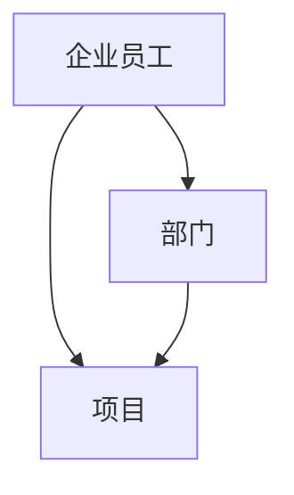
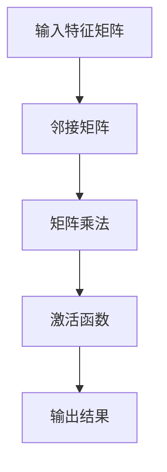
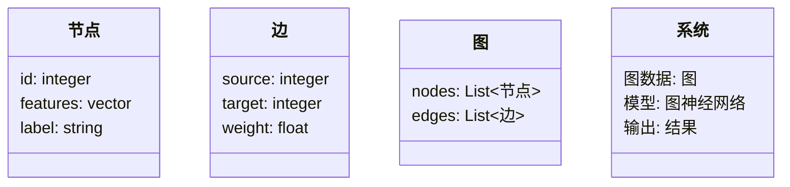
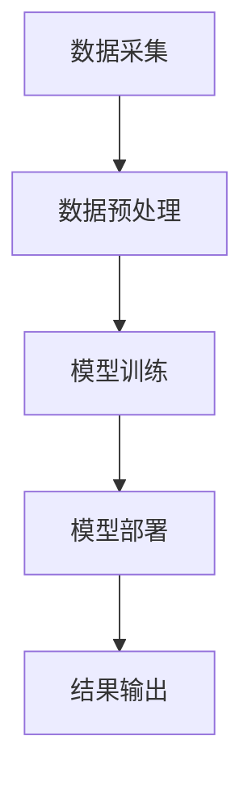
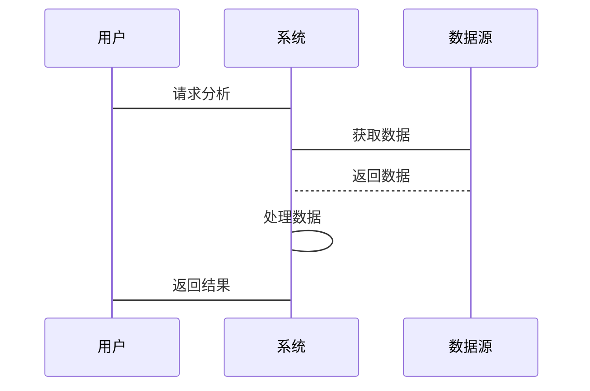

                 


# 企业AI Agent的图神经网络在组织网络分析与优化中的应用

> 关键词：企业AI Agent，图神经网络，组织网络分析，优化应用，算法实现

> 摘要：本文详细探讨了企业AI Agent如何利用图神经网络进行组织网络分析与优化。通过分析图神经网络的核心原理，结合实际案例，展示了其在企业网络分析中的应用潜力和优势。文章还详细介绍了图神经网络的算法实现、系统架构设计以及项目实战，为读者提供了全面的技术指导。

---

# 第一章: 企业AI Agent与图神经网络概述

## 1.1 企业AI Agent的定义与特点

### 1.1.1 企业AI Agent的基本概念

企业AI Agent（Artificial Intelligence Agent）是指在企业环境中，通过感知环境、理解任务目标，并采取自主行动以实现特定目标的智能实体。与传统AI系统不同，AI Agent具备以下特点：

- **自主性**：能够在没有人工干预的情况下独立运行。
- **反应性**：能够实时感知环境变化并做出响应。
- **目标导向**：所有行动均以实现特定目标为导向。
- **学习能力**：通过数据和经验不断优化自身行为。

企业AI Agent的应用场景广泛，包括流程自动化、决策支持、风险管理等领域。

### 1.1.2 图神经网络的核心特点

图神经网络（Graph Neural Networks, GNN）是一种专门用于处理图数据的深度学习模型。其核心特点包括：

- **图结构表示**：能够直接处理图数据，节点之间的关系通过边来表示。
- **局部聚合机制**：通过聚合邻居节点的信息来更新当前节点的表示。
- **全局信息整合**：能够整合图中所有节点的信息，捕捉全局结构特征。

图神经网络在处理复杂关系数据（如社交网络、知识图谱）方面表现出色。

### 1.1.3 企业AI Agent与传统AI的区别

| **特性**       | **传统AI**       | **企业AI Agent**    |
|----------------|------------------|---------------------|
| **自主性**      | 较低             | 高                  |
| **环境感知**    | 有限             | 强大               |
| **目标导向**    | 有               | 极强               |
| **学习能力**    | 有限             | 高                  |

通过对比可以看出，企业AI Agent在自主性、环境感知和目标导向方面具有显著优势。

---

## 1.2 图神经网络的基本原理

### 1.2.1 图的表示与建模

图数据由节点（Node）和边（Edge）组成，节点表示实体，边表示实体之间的关系。图神经网络通过构建图结构来捕捉数据之间的关系。

#### 1.2.1.1 图的表示

图的表示通常采用邻接矩阵（Adjacency Matrix）或邻接表（Adjacency List）。邻接矩阵适用于节点数量较少的情况，而邻接表则适用于节点数量较多的情况。

### 1.2.2 图神经网络的核心算法

图神经网络的核心算法包括图卷积神经网络（GCN）、图注意力机制（GAT）等。

#### 1.2.2.1 图卷积神经网络（GCN）

GCN通过聚合节点及其邻居节点的特征来更新节点的表示。其数学模型如下：

$$ y = \sigma(A X W) $$

其中：
- \( A \) 是邻接矩阵。
- \( X \) 是输入特征矩阵。
- \( W \) 是权重矩阵。
- \( \sigma \) 是激活函数。

#### 1.2.2.2 图注意力机制（GAT）

GAT通过计算节点之间的注意力权重来确定信息的重要性。其数学模型如下：

$$ \alpha_{ij} = \text{softmax}(e^{f(x_i, x_j)}) $$

其中：
- \( \alpha_{ij} \) 是节点i和节点j之间的注意力权重。
- \( f(x_i, x_j) \) 是节点i和节点j的特征函数。

### 1.2.3 图神经网络的优势与挑战

#### 优势

- **关系建模能力强**：能够捕捉数据之间的复杂关系。
- **全局信息整合**：能够整合图中所有节点的信息，捕捉全局结构特征。
- **实时性**：能够实时处理动态变化的图数据。

#### 挑战

- **计算复杂度高**：处理大规模图数据时计算复杂度较高。
- **模型可解释性差**：图神经网络的决策过程较为复杂，可解释性较差。

---

## 1.3 企业组织网络分析与优化的背景

### 1.3.1 企业组织网络的复杂性

企业组织网络由多个部门、项目、员工等组成，节点之间的关系复杂且动态变化。

### 1.3.2 图神经网络在组织网络中的应用潜力

图神经网络能够有效地捕捉组织网络中的复杂关系，为组织网络的优化提供有力支持。

### 1.3.3 当前企业网络分析的痛点与难点

- **数据碎片化**：企业数据分散在不同的系统中，难以整合。
- **关系复杂性**：组织网络中的关系复杂，难以建模。
- **动态变化**：组织网络中的节点和关系动态变化，难以实时处理。

---

# 第二章: 图神经网络的核心概念与联系

## 2.1 图神经网络的核心原理

### 2.1.1 图的表示学习

图的表示学习旨在将图中的节点表示为低维向量，便于后续分析和处理。

#### 2.1.1.1 图嵌入方法

图嵌入方法包括Node2Vec、GraphSAGE等。

### 2.1.2 图卷积神经网络（GCN）

GCN通过聚合节点及其邻居节点的特征来更新节点的表示。

#### 2.1.2.1 GCN的数学模型

$$ y = \sigma(A X W) $$

其中：
- \( A \) 是邻接矩阵。
- \( X \) 是输入特征矩阵。
- \( W \) 是权重矩阵。
- \( \sigma \) 是激活函数。

### 2.1.3 图注意力机制

图注意力机制通过计算节点之间的注意力权重来确定信息的重要性。

#### 2.1.3.1 注意力权重的计算

$$ \alpha_{ij} = \text{softmax}(e^{f(x_i, x_j)}) $$

其中：
- \( \alpha_{ij} \) 是节点i和节点j之间的注意力权重。
- \( f(x_i, x_j) \) 是节点i和节点j的特征函数。

## 2.2 核心概念对比表格

### 2.2.1 图神经网络与传统神经网络的对比

| **特性**       | **传统神经网络** | **图神经网络**    |
|----------------|------------------|-------------------|
| **数据类型**    | 结构化数据        | 图数据            |
| **关系建模**    | 无               | 强               |
| **计算复杂度**  | 低               | 高               |

### 2.2.2 图卷积与传统卷积的对比

| **特性**       | **传统卷积** | **图卷积**    |
|----------------|--------------|---------------|
| **输入数据**    | 图像数据      | 图数据          |
| **操作方式**    | 滑动窗口      | 聚合邻居节点特征 |
| **计算复杂度**  | 低           | 高             |

### 2.2.3 图注意力机制与其他注意力机制的对比

| **特性**       | **传统注意力机制** | **图注意力机制**    |
|----------------|---------------------|---------------------|
| **输入数据**    | 序列数据            | 图数据              |
| **操作方式**    | 计算全局注意力权重  | 计算节点间注意力权重 |
| **应用场景**    | 机器翻译            | 图数据处理          |

## 2.3 ER实体关系图架构



---

# 第三章: 图神经网络算法原理

## 3.1 图卷积神经网络（GCN）算法

### 3.1.1 GCN的基本原理

GCN通过聚合节点及其邻居节点的特征来更新节点的表示。

#### 3.1.1.1 GCN的数学模型

$$ y = \sigma(A X W) $$

其中：
- \( A \) 是邻接矩阵。
- \( X \) 是输入特征矩阵。
- \( W \) 是权重矩阵。
- \( \sigma \) 是激活函数。

#### 3.1.1.2 GCN的实现流程



### 3.1.2 GCN的Python代码实现

```python
import torch
import torch.nn as nn
import torch.nn.functional as F

class GCN(nn.Module):
    def __init__(self, input_dim, hidden_dim, output_dim):
        super(GCN, self).__init__()
        self.W = nn.Parameter(torch.randn(input_dim, hidden_dim))
        self.U = nn.Parameter(torch.randn(hidden_dim, output_dim))
    
    def forward(self, x, A):
        # x: (n, input_dim)
        # A: (n, n)
        h = torch.mm(x, self.W)  # (n, hidden_dim)
        h = torch.mm(A, h)       # (n, hidden_dim)
        h = F.relu(h)            # (n, hidden_dim)
        y = torch.mm(h, self.U)  # (n, output_dim)
        return y
```

### 3.1.3 GCN的应用场景

GCN适用于需要处理图数据的场景，如社交网络分析、推荐系统等。

## 3.2 强化学习在AI Agent中的应用

### 3.2.1 强化学习的基本原理

强化学习通过智能体与环境的交互，学习最优策略。

#### 3.2.1.1 强化学习的数学模型

$$ Q(s, a) = r + \gamma \max_a Q(s', a) $$

其中：
- \( Q(s, a) \) 是状态s动作a的值函数。
- \( r \) 是奖励。
- \( \gamma \) 是折扣因子。
- \( s' \) 是下一个状态。

### 3.2.2 AI Agent的强化学习实现

```python
class Agent:
    def __init__(self, state_dim, action_dim):
        self.model = DQN(state_dim, action_dim)
    
    def act(self, state):
        with torch.no_grad():
            q_values = self.model.forward(state)
        return torch.argmax(q_values).item()
    
    def remember(self, state, action, reward, next_state):
        self.memory.append((state, action, reward, next_state))
    
    def replay(self):
        minibatch = random.sample(self.memory, batch_size)
        states = torch.stack([t[0] for t in minibatch])
        actions = torch.stack([t[1] for t in minibatch])
        rewards = torch.stack([t[2] for t in minibatch])
        next_states = torch.stack([t[3] for t in minibatch])
        # 训练模型
        # ...
```

---

# 第四章: 系统分析与架构设计方案

## 4.1 问题场景介绍

### 4.1.1 企业组织网络的分析需求

企业组织网络的分析需求包括组织结构优化、资源分配、风险预警等。

### 4.1.2 图神经网络的应用场景

图神经网络在企业组织网络中的应用场景包括组织结构分析、资源分配优化、风险预警等。

## 4.2 项目介绍

### 4.2.1 项目目标

项目目标是利用图神经网络对企业组织网络进行分析与优化。

### 4.2.2 项目范围

项目范围包括数据采集、模型训练、模型部署等。

## 4.3 系统功能设计

### 4.3.1 领域模型



### 4.3.2 系统架构设计



## 4.4 系统接口设计

### 4.4.1 系统接口

系统接口包括数据接口、模型接口、结果接口等。

### 4.4.2 系统交互流程



---

# 第五章: 项目实战

## 5.1 环境安装

### 5.1.1 安装依赖

安装必要的Python库，如PyTorch、NetworkX等。

## 5.2 系统核心实现

### 5.2.1 数据预处理

数据预处理包括数据清洗、特征提取、图构建等。

### 5.2.2 模型训练

模型训练包括数据加载、模型定义、损失函数定义、优化器定义等。

## 5.3 案例分析

### 5.3.1 案例背景

案例背景描述企业组织网络的具体情况。

### 5.3.2 数据分析

数据分析包括数据可视化、关系分析等。

### 5.3.3 模型优化

模型优化包括超参数调整、模型结构优化等。

---

# 第六章: 最佳实践与总结

## 6.1 小结

本文详细探讨了企业AI Agent如何利用图神经网络进行组织网络分析与优化，展示了其在企业网络分析中的应用潜力和优势。

## 6.2 注意事项

在实际应用中，需要注意数据隐私、模型可解释性等问题。

## 6.3 拓展阅读

建议读者进一步阅读相关领域的论文和书籍，深入理解图神经网络和企业AI Agent的应用。

---

# 作者

作者：AI天才研究院/AI Genius Institute & 禅与计算机程序设计艺术/Zen And The Art of Computer Programming

