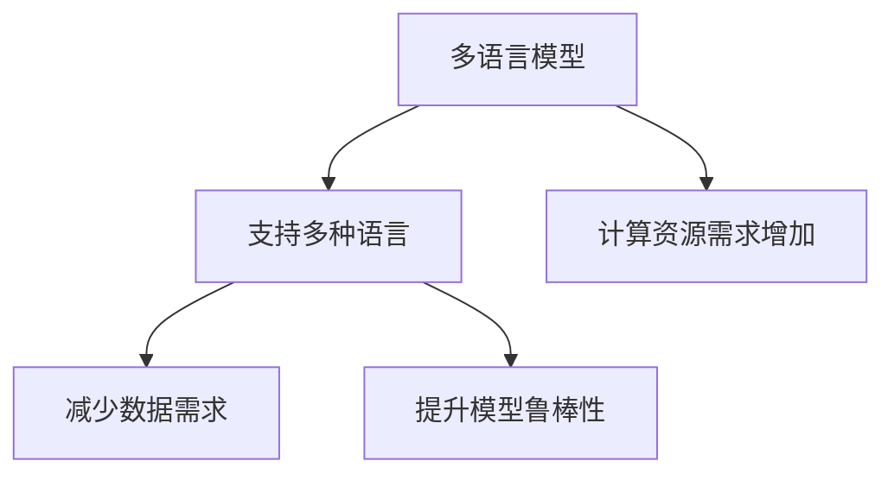
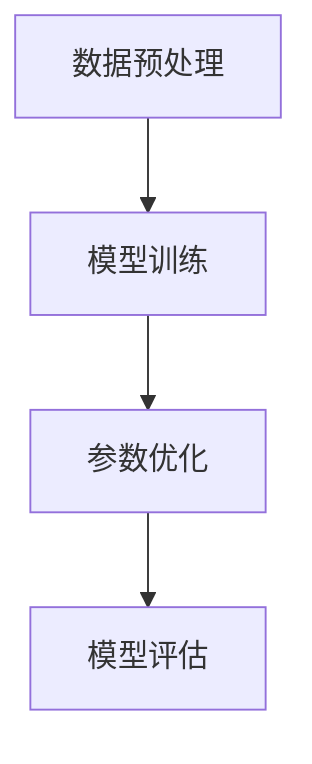
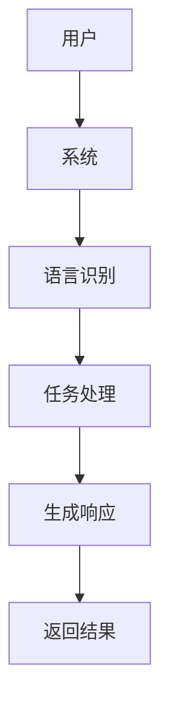

                 


# 企业AI Agent的多语言支持：跨国业务助手

> 关键词：企业AI Agent，多语言支持，跨国业务，自然语言处理，跨语言对话生成，系统架构设计

> 摘要：本文深入探讨了企业AI Agent在跨国业务中的多语言支持技术，从核心概念、算法原理到系统架构设计，再到项目实战，全面解析了如何构建一个高效、可靠的多语言AI Agent系统，助力企业在全球化业务中实现无缝沟通与协作。

---

# 第一部分: 企业AI Agent的多语言支持背景与概念

## 第1章: 企业AI Agent的背景与核心概念

### 1.1 什么是企业AI Agent

企业AI Agent是一种智能助手，通过自然语言处理（NLP）技术，能够理解和生成多种语言的文本，为企业提供跨语言的沟通、信息检索和任务执行能力。它不同于个人助手，更专注于企业级的应用场景，支持复杂的业务逻辑和多语言交互。

#### 1.1.1 AI Agent的基本定义

AI Agent（智能体）是指在计算机系统中，能够感知环境并采取行动以实现目标的实体。企业AI Agent是一种专注于企业场景的智能体，具备以下核心特征：
- **多语言支持**：能够理解和生成多种语言的文本。
- **业务逻辑处理**：能够执行企业级的业务流程和任务。
- **上下文理解**：能够基于上下文理解用户的意图。

#### 1.1.2 企业AI Agent的独特属性

与个人AI Agent相比，企业AI Agent在以下方面具有独特性：
- **安全性**：企业数据的高度敏感性要求AI Agent必须具备严格的安全性保障。
- **可扩展性**：企业AI Agent需要支持多种语言和复杂的业务逻辑。
- **定制化**：能够根据企业的具体需求进行定制化开发。

#### 1.1.3 企业AI Agent的分类与应用场景

企业AI Agent可以根据功能和应用场景分为以下几类：
- **通用型**：适用于多种场景，如客服、销售支持等。
- **垂直型**：专注于特定行业或业务领域，如金融、医疗等。

---

### 1.2 跨国业务中的语言挑战

#### 1.2.1 跨国业务的复杂性

跨国业务的复杂性主要体现在以下几个方面：
- **多语言沟通**：跨国业务需要在不同语言的环境中进行沟通，语言障碍可能导致信息传递不准确。
- **文化差异**：不同国家或地区的文化差异可能影响沟通效果。
- **法律与合规**：跨国业务需要遵守不同国家的法律法规，这对AI Agent提出了更高的要求。

#### 1.2.2 多语言支持的重要性

多语言支持在跨国业务中的重要性体现在以下几点：
- **提升用户体验**：能够为用户提供母语级别的沟通体验。
- **降低沟通成本**：减少因语言障碍导致的误解和重复沟通。
- **增强企业竞争力**：通过提供多语言支持，企业能够更好地拓展国际市场。

#### 1.2.3 AI Agent在跨国业务中的角色

AI Agent在跨国业务中的角色可以总结为以下几点：
- **智能翻译与沟通**：提供实时的多语言翻译和对话生成能力。
- **跨语言信息检索**：能够从多种语言的文档中检索信息。
- **多语言任务执行**：能够理解并执行跨语言的任务指令。

---

### 1.3 本章小结

本章从企业AI Agent的基本概念出发，分析了其独特属性和分类，并重点探讨了跨国业务中的语言挑战以及多语言支持的重要性。通过本章的学习，读者可以清晰地理解企业AI Agent在跨国业务中的核心作用。

---

# 第二部分: 多语言支持的核心技术与原理

## 第2章: 多语言自然语言处理基础

### 2.1 多语言NLP的核心原理

#### 2.1.1 多语言模型的训练方法

多语言模型的训练方法主要分为以下几种：
- **多任务学习**：在同一模型中同时训练多种语言的任务。
- **预训练与微调**：利用多语言预训练模型进行微调，以适应特定任务。

#### 2.1.2 跨语言迁移学习的原理

跨语言迁移学习的核心思想是将一种语言的特征迁移到另一种语言。这种方法在数据不足的情况下尤为重要。

#### 2.1.3 多语言模型的优势与局限性

**优势**：
- **减少数据需求**：通过共享语言特征，可以减少每种语言所需的数据量。
- **提升模型鲁棒性**：多语言模型通常具有更强的泛化能力。

**局限性**：
- **语言间差异**：某些语言之间的差异可能较大，影响模型的性能。
- **计算资源需求**：训练多语言模型通常需要更多的计算资源。

#### 2.1.4 多语言模型的对比分析

以下表格对比了几种常见的多语言模型：

| 模型名称       | 是否支持多种语言 | 是否需要微调 | 优点                               | 缺点                               |
|----------------|-----------------|--------------|------------------------------------|------------------------------------|
| BERT-Multi     | 是              | 是           | 支持多种语言，性能优秀              | 需要大量计算资源                   |
| XLM            | 是              | 是           | 跨语言迁移能力强                   | 对某些语言的支持可能较弱             |
| mBert          | 是              | 是           | 支持大规模多语言训练                | 参数量较大，训练时间较长             |

---

#### 2.1.5 多语言模型的优缺点对比（ER实体关系图）



---

### 2.2 跨语言理解与生成的关键技术

#### 2.2.1 跨语言词嵌入的实现

跨语言词嵌入的实现可以通过以下步骤完成：
1. **跨语言对齐**：找到不同语言中语义相近的词汇。
2. **嵌入训练**：基于对齐的词汇对，训练词嵌入模型。

#### 2.2.2 跨语言句法分析的技术

跨语言句法分析需要处理不同语言的句法结构差异，通常采用以下方法：
1. **跨语言语法转移**：将一种语言的语法结构转移到另一种语言。
2. **共享参数模型**：在模型中共享句法分析的参数，减少语言间的差异影响。

#### 2.2.3 跨语言语义理解的挑战

跨语言语义理解的主要挑战包括：
- **语义差异**：不同语言中某些词汇或短语的语义可能不同。
- **文化差异**：某些表达方式可能与文化背景密切相关。

---

#### 2.2.4 跨语言对话生成的算法实现

跨语言对话生成的算法实现可以分为以下几个步骤：
1. **输入处理**：接收用户的输入，并将其转换为模型可处理的形式。
2. **语言识别**：识别输入语言，并选择合适的语言模型。
3. **对话生成**：基于上下文生成响应，并将其转换为目标语言。

---

### 2.3 本章小结

本章详细介绍了多语言自然语言处理的核心原理，包括多语言模型的训练方法、跨语言迁移学习的原理以及跨语言理解与生成的关键技术。通过本章的学习，读者可以掌握多语言NLP的基本原理和实现方法。

---

# 第三部分: 企业AI Agent的多语言支持实现

## 第3章: 多语言AI Agent的算法原理

### 3.1 多语言模型的训练流程

#### 3.1.1 数据预处理与特征提取

数据预处理包括以下步骤：
1. **清洗数据**：去除噪音数据，如特殊字符、停用词等。
2. **分词处理**：将文本分割为词或短语。
3. **特征提取**：提取文本的特征，如词向量、句向量等。

#### 3.1.2 模型训练与参数优化

模型训练的步骤如下：
1. **选择模型架构**：选择适合多语言任务的模型架构，如BERT、XLM等。
2. **训练数据准备**：将预处理后的数据输入模型进行训练。
3. **参数优化**：通过优化算法（如Adam、SGD）调整模型参数。

#### 3.1.3 模型评估与调优

模型评估通常包括以下指标：
- **准确率**：模型正确预测的比例。
- **召回率**：模型发现所有相关样本的能力。
- **F1分数**：综合准确率和召回率的指标。

---

#### 3.1.4 模型训练流程图



---

### 3.2 跨语言对话生成的算法实现

#### 3.2.1 基于预训练模型的对话生成

基于预训练模型的对话生成通常包括以下步骤：
1. **输入处理**：将用户的输入转换为模型可处理的形式。
2. **上下文理解**：模型基于上下文生成响应。
3. **语言转换**：将生成的响应转换为目标语言。

#### 3.2.2 跨语言对话生成的策略优化

跨语言对话生成的策略优化可以采用以下方法：
1. **语言切换机制**：在生成对话时，动态切换语言以适应用户需求。
2. **上下文记忆机制**：通过记忆上下文信息，提升对话的连贯性。

---

#### 3.2.3 对话历史与上下文的处理

对话历史和上下文的处理可以通过以下方式实现：
1. **历史记录存储**：将对话历史存储为一个列表，供后续生成使用。
2. **上下文嵌入**：将对话历史嵌入为一个向量，用于模型生成响应。

---

### 3.3 本章小结

本章详细讲解了多语言AI Agent的算法原理，包括模型训练流程和对话生成算法的实现。通过本章的学习，读者可以掌握多语言AI Agent的核心算法实现方法。

---

# 第四部分: 系统架构与项目实战

## 第4章: 跨国业务助手的系统架构设计

### 4.1 系统功能模块划分

#### 4.1.1 用户交互模块

用户交互模块的主要功能包括：
- **用户输入接收**：通过多种渠道（如网页、移动端）接收用户的输入。
- **多语言支持**：支持多种语言的输入和输出。

#### 4.1.2 多语言处理模块

多语言处理模块的主要功能包括：
- **语言识别**：自动识别输入语言。
- **跨语言处理**：对输入进行跨语言理解和生成。

#### 4.1.3 业务逻辑处理模块

业务逻辑处理模块的主要功能包括：
- **任务执行**：根据用户的指令执行相应的业务逻辑。
- **信息检索**：从企业知识库中检索相关信息。

---

### 4.2 系统架构设计

#### 4.2.1 分层架构设计

分层架构设计通常包括以下层次：
- **表现层**：负责与用户交互。
- **业务逻辑层**：负责业务逻辑的处理。
- **数据访问层**：负责数据的存储和检索。

---

#### 4.2.2 微服务架构设计

微服务架构设计的主要优势包括：
- **模块化**：每个服务独立运行，便于扩展和维护。
- **可扩展性**：可以根据需求灵活扩展服务。

---

#### 4.2.3 可扩展性设计

可扩展性设计可以通过以下方式实现：
- **负载均衡**：通过负载均衡技术分摊请求流量。
- **容器化部署**：使用容器化技术（如Docker）部署服务，提高部署效率。

---

### 4.3 系统接口设计

#### 4.3.1 API接口定义

API接口定义通常包括以下内容：
- **输入参数**：用户输入的参数。
- **输出参数**：API返回的结果。
- **错误处理**：定义错误码和错误信息。

---

#### 4.3.2 接口调用流程

接口调用流程通常包括以下步骤：
1. **发起请求**：用户发起API请求。
2. **处理请求**：系统处理请求并生成响应。
3. **返回结果**：系统返回处理结果。

---

#### 4.3.3 接口安全设计

接口安全设计可以通过以下措施实现：
- **认证授权**：通过OAuth、JWT等技术实现用户身份认证和权限管理。
- **数据加密**：对敏感数据进行加密处理。

---

### 4.4 系统交互流程设计

#### 4.4.1 用户发起请求

用户发起请求的流程如下：
1. **用户输入**：用户输入指令或问题。
2. **语言识别**：系统识别输入语言。
3. **任务处理**：系统根据识别的语言和指令执行相应任务。

---

#### 4.4.2 系统处理请求

系统处理请求的流程如下：
1. **语言识别**：系统识别输入语言。
2. **任务执行**：系统根据识别的语言和指令执行相应任务。
3. **生成响应**：系统生成响应，并将其转换为目标语言。

---

#### 4.4.3 系统返回结果

系统返回结果的流程如下：
1. **生成响应**：系统生成响应，并将其转换为目标语言。
2. **返回结果**：系统将结果返回给用户。

---

### 4.5 系统交互流程图



---

### 4.6 本章小结

本章详细介绍了跨国业务助手的系统架构设计，包括功能模块划分、架构设计、接口设计和系统交互流程设计。通过本章的学习，读者可以掌握如何设计一个高效的多语言AI Agent系统。

---

## 第5章: 项目实战

### 5.1 环境安装与配置

#### 5.1.1 安装Python环境

安装Python环境的步骤如下：
1. **下载Python**：从官方网站下载并安装Python。
2. **配置环境变量**：将Python的安装路径添加到环境变量中。

---

#### 5.1.2 安装NLP相关库

安装NLP相关库的命令如下：
```bash
pip install transformers
pip install torch
```

---

#### 5.1.3 配置开发环境

配置开发环境的步骤如下：
1. **安装IDE**：安装PyCharm、VS Code等IDE。
2. **配置代码格式化工具**：安装black、flake8等工具。

---

### 5.2 系统核心代码实现

#### 5.2.1 数据预处理代码

数据预处理代码示例如下：
```python
import pandas as pd
from transformers import AutoTokenizer, AutoModel

# 加载预训练模型
tokenizer = AutoTokenizer.from_pretrained('bert-base-multilingual')
model = AutoModel.from_pretrained('bert-base-multilingual')

# 数据预处理
def preprocess(text):
    encoded_input = tokenizer(text, return_tensors='np')
    return encoded_input
```

---

#### 5.2.2 模型训练代码

模型训练代码示例如下：
```python
import torch
from torch.utils.data import Dataset, DataLoader

# 定义数据集
class CustomDataset(Dataset):
    def __init__(self, texts, labels):
        self.texts = texts
        self.labels = labels
    def __len__(self):
        return len(self.texts)
    def __getitem__(self, idx):
        text = self.texts[idx]
        label = self.labels[idx]
        return {'input_ids': text['input_ids'], 'labels': label}

# 定义训练函数
def train_model(model, optimizer, criterion, dataloader, epochs):
    for epoch in range(epochs):
        for batch in dataloader:
            inputs = batch['input_ids']
            labels = batch['labels']
            outputs = model(inputs)
            loss = criterion(outputs, labels)
            loss.backward()
            optimizer.step()
            optimizer.zero_grad()
```

---

#### 5.2.3 对话生成代码

对话生成代码示例如下：
```python
from transformers import AutoTokenizer, AutoModelForSeq2Seq

# 加载预训练模型
tokenizer = AutoTokenizer.from_pretrained('facebook/m2m100')
model = AutoModelForSeq2Seq.from_pretrained('facebook/m2m100')

# 对话生成
def generate_response(input_text, target_language):
    inputs = tokenizer(input_text, return_tensors='np')
    outputs = model.generate(**inputs, max_length=50, forced_bos_token_id=tokenizer.lang_id(target_language))
    return tokenizer.decode(outputs[0], skip_special_tokens=True)
```

---

#### 5.3 代码解读与分析

1. **数据预处理代码**：
   - 使用预训练模型的tokenizer对输入文本进行编码。

2. **模型训练代码**：
   - 定义了自定义数据集和训练函数，使用PyTorch进行模型训练。

3. **对话生成代码**：
   - 使用预训练的对话生成模型，生成目标语言的响应。

---

#### 5.4 项目测试与优化

项目测试与优化的步骤如下：
1. **功能测试**：测试系统的多语言支持功能，确保其正常运行。
2. **性能优化**：通过优化算法和代码，提升系统的运行效率。
3. **错误处理与调试**：处理可能出现的错误，并进行调试。

---

### 5.5 本章小结

本章通过具体的项目实战，详细讲解了企业AI Agent的多语言支持系统的实现过程，包括环境配置、核心代码实现和项目测试与优化。

---

# 第五部分: 最佳实践与总结

## 第6章: 最佳实践与总结

### 6.1 最佳实践

#### 6.1.1 数据质量管理

数据质量管理的注意事项包括：
- **数据清洗**：去除噪音数据，确保数据质量。
- **数据标注**：对数据进行标注，确保模型训练的有效性。

---

#### 6.1.2 模型选择与优化

模型选择与优化的注意事项包括：
- **选择适合任务的模型**：根据任务需求选择合适的模型。
- **模型调优**：通过参数调整和超参数优化提升模型性能。

---

### 6.2 本章小结

本章总结了企业AI Agent的多语言支持系统的最佳实践，包括数据质量管理、模型选择与优化等方面。通过这些最佳实践，可以提升系统的性能和用户体验。

---

# 作者：AI天才研究院/AI Genius Institute & 禅与计算机程序设计艺术 /Zen And The Art of Computer Programming

---

本文通过系统化的分析和实践，详细讲解了企业AI Agent的多语言支持技术，从核心概念到算法实现，再到系统架构设计和项目实战，为读者提供了一套完整的解决方案。通过本文的学习，读者可以掌握企业AI Agent的多语言支持技术，并能够将其应用到实际的跨国业务场景中。

