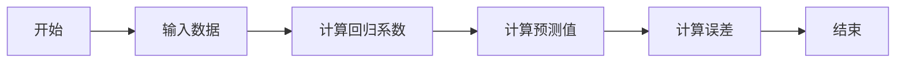
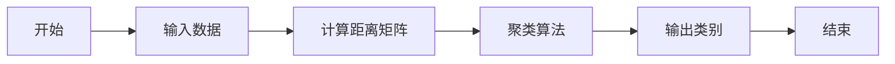
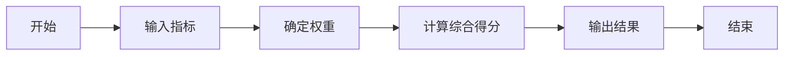
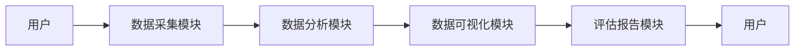
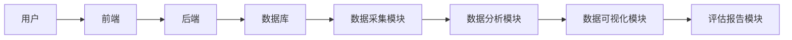
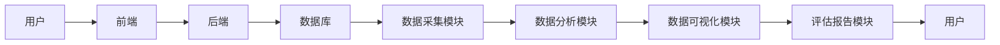

                 


# 如何评估企业的创新能力

> 关键词：企业创新能力，评估方法，创新资源，创新能力，创新成果，评估模型，企业创新

> 摘要：企业创新能力是企业在市场竞争中保持持续发展的核心能力，如何科学、系统地评估企业的创新能力，是企业战略管理中的重要课题。本文从企业创新能力的核心要素出发，结合创新资源、创新能力、创新成果三个维度，构建了企业创新能力评估的数学模型与算法框架。通过对比分析和实际案例，本文详细阐述了企业创新能力评估的系统架构与实现方法，为企业管理者提供了实用的评估工具与策略建议。

---

# 第1章: 企业创新能力评估的背景与问题描述

## 1.1 企业创新能力的重要性

### 1.1.1 企业创新能力的定义

企业创新能力是指企业在技术研发、产品创新、管理创新、商业模式创新等方面的能力，是企业在市场竞争中保持竞争优势的核心能力。创新能力不仅包括技术层面的创新，还包括组织结构、文化、战略等多个维度的创新。

### 1.1.2 企业创新能力的核心要素

企业创新能力的核心要素包括：

1. **创新资源**：企业拥有的技术、人才、资金、数据等资源。
2. **创新能力**：企业在创新过程中的技术能力、管理能力、执行能力。
3. **创新成果**：企业的创新产出，包括新产品、新技术、新服务等。

### 1.1.3 企业创新能力与企业绩效的关系

企业创新能力是影响企业绩效的关键因素。创新能力越强的企业，往往能够更快地适应市场变化，推出新产品，占领市场份额，从而获得更高的利润和更强的竞争力。

---

## 1.2 企业创新能力评估的必要性

### 1.2.1 当前企业创新面临的挑战

1. **市场竞争加剧**：企业需要不断创新以保持竞争优势。
2. **技术变革加速**：技术创新周期缩短，企业需要更快地响应技术变革。
3. **客户需求多样化**：客户对产品和服务的需求日益多样化，要求企业具备更强的创新能力。

### 1.2.2 企业创新能力评估的意义

1. **帮助企业识别创新能力的短板**：通过评估，企业可以发现自身创新能力的不足，制定针对性的改进措施。
2. **为战略决策提供依据**：企业创新能力评估的结果可以为企业的战略规划、研发投入、组织优化等提供数据支持。
3. **提升企业的核心竞争力**：通过持续评估和改进，企业可以不断提升创新能力，增强市场竞争力。

### 1.2.3 企业创新能力评估的现状与问题

1. **评估方法缺乏系统性**：许多企业创新能力评估方法较为单一，缺乏系统性和全面性。
2. **数据采集困难**：企业创新能力涉及多个维度，数据采集难度较大。
3. **评估结果的可操作性不足**：部分评估方法得出的结果难以直接指导企业的改进措施。

---

## 1.3 企业创新能力评估的框架与方法

### 1.3.1 企业创新能力评估的框架

企业创新能力评估的框架包括以下几个方面：

1. **创新资源评估**：评估企业的技术资源、人力资源、财务资源等。
2. **创新能力评估**：评估企业的研发能力、管理能力、执行能力等。
3. **创新成果评估**：评估企业的创新产出，包括新产品、新技术、新服务等。

### 1.3.2 企业创新能力评估的主要方法

1. **定性评估方法**：通过专家访谈、问卷调查等方式，对企业创新能力进行定性分析。
2. **定量评估方法**：通过数学模型和统计方法，对企业创新能力进行量化评估。
3. **综合评估方法**：结合定性和定量方法，对企业创新能力进行全面评估。

### 1.3.3 企业创新能力评估的工具与技术

1. **数据分析工具**：如SPSS、Excel等，用于数据的采集、处理和分析。
2. **数学建模工具**：如Python、MATLAB等，用于构建创新能力评估模型。
3. **流程管理工具**：如ERP、流程管理软件，用于优化企业的创新流程。

---

## 1.4 企业创新能力评估的边界与外延

### 1.4.1 企业创新能力的边界

1. **企业内部能力**：创新能力主要集中在企业的内部能力，包括技术研发、管理优化等方面。
2. **外部环境影响**：外部环境如政策、市场、合作伙伴等对企业创新能力的影响也是需要考虑的边界。

### 1.4.2 企业创新能力的外延

1. **技术创新**：包括新技术的研发、应用和推广。
2. **管理创新**：包括管理模式、组织结构、流程优化等方面的创新。
3. **商业模式创新**：包括商业模式的设计、创新和实施。

### 1.4.3 企业创新能力与其他能力的关系

1. **企业核心竞争力**：创新能力是企业核心竞争力的重要组成部分。
2. **企业文化能力**：企业文化对企业创新能力的形成和发挥有重要影响。
3. **组织能力**：组织能力是创新能力实现的基础。

---

## 1.5 本章小结

本章从企业创新能力的定义、核心要素、重要性以及评估的必要性等方面进行了详细阐述。通过对比分析，明确了企业创新能力的边界和外延，并提出了企业创新能力评估的框架与方法。这些内容为后续章节的深入分析奠定了基础。

---

# 第2章: 企业创新能力的核心概念与联系

## 2.1 企业创新能力的核心要素

### 2.1.1 创新资源

创新资源是企业创新能力的物质基础，主要包括：

1. **技术资源**：包括专利、技术储备、研发设备等。
2. **人力资源**：包括研发人员、技术人员、管理人员等。
3. **财务资源**：包括研发投入、创新资金等。
4. **数据资源**：包括企业内部数据、市场数据等。

### 2.1.2 创新能力

创新能力是企业将创新资源转化为实际创新成果的能力，包括：

1. **技术研发能力**：包括新技术的研发、技术整合能力等。
2. **产品创新能力**：包括新产品设计、产品迭代能力等。
3. **管理创新能力**：包括管理模式优化、组织结构优化等。

### 2.1.3 创新成果

创新成果是企业创新能力的最终体现，包括：

1. **新产品**：包括新产品的开发、上市速度等。
2. **新技术**：包括新技术的研发、应用和推广。
3. **新服务**：包括新服务的设计、实施和优化。

---

## 2.2 企业创新能力与创新过程的关系

### 2.2.1 创新过程的阶段划分

创新过程可以分为以下几个阶段：

1. **需求识别**：识别创新需求，明确创新目标。
2. **创意生成**：提出创新方案，形成创意。
3. **方案设计**：设计创新方案，制定实施计划。
4. **实施与验证**：实施创新方案，验证创新成果。
5. **推广与优化**：推广创新成果，持续优化。

### 2.2.2 企业创新能力在创新过程中的作用

1. **需求识别阶段**：创新能力帮助企业准确识别创新需求。
2. **创意生成阶段**：创新能力帮助企业提出创新方案。
3. **方案设计阶段**：创新能力帮助企业设计合理的实施计划。
4. **实施与验证阶段**：创新能力帮助企业高效实施创新方案。
5. **推广与优化阶段**：创新能力帮助企业持续优化创新成果。

### 2.2.3 创新过程对创新能力的影响

1. **创新能力的提升**：创新过程的实施可以提升企业的创新能力。
2. **创新效率的提高**：创新过程的优化可以提高企业的创新效率。
3. **创新成果的质量**：创新过程的规范性可以提高创新成果的质量。

---

## 2.3 企业创新能力与企业战略的关系

### 2.3.1 企业战略的定义

企业战略是企业在市场竞争中制定的长期目标和实现目标的策略，包括企业发展战略、市场战略、技术战略等。

### 2.3.2 企业创新能力在企业战略中的地位

1. **企业战略的核心**：创新能力是企业战略的核心要素之一。
2. **战略目标的实现**：企业创新能力的提升可以更好地实现企业战略目标。
3. **战略调整的依据**：企业创新能力评估的结果可以作为企业战略调整的依据。

### 2.3.3 企业战略对创新能力的影响

1. **战略目标的导向**：企业战略目标指导创新能力的提升方向。
2. **资源配置的优化**：企业战略优化资源配置，提升创新能力。
3. **组织结构的调整**：企业战略调整组织结构，支持创新能力的提升。

---

## 2.4 企业创新能力与其他能力的关系

### 2.4.1 企业创新能力与核心竞争力

1. **核心竞争力的定义**：核心竞争力是企业相对于竞争对手的差异化优势。
2. **创新能力的核心地位**：创新能力是核心竞争力的重要组成部分。
3. **创新能力与核心竞争力的关系**：创新能力的提升可以增强企业的核心竞争力。

### 2.4.2 企业创新能力与组织能力

1. **组织能力的定义**：组织能力是指企业组织结构和组织效率的能力。
2. **创新能力与组织能力的关系**：创新能力的提升需要组织能力的支持，组织能力的优化可以促进创新能力的提升。

### 2.4.3 企业创新能力与文化能力

1. **文化能力的定义**：文化能力是指企业在文化管理、文化建设等方面的能力。
2. **创新能力与文化能力的关系**：企业文化对创新能力的形成和发挥有重要影响。

---

## 2.5 本章小结

本章从企业创新能力的核心要素出发，详细阐述了企业创新能力与创新过程、企业战略以及其他能力之间的关系。通过对比分析，明确了企业创新能力在企业整体能力体系中的地位和作用。

---

# 第3章: 企业创新能力评估的数学模型与算法原理

## 3.1 企业创新能力评估的数学模型

### 3.1.1 线性回归模型

线性回归模型是一种常用的统计分析方法，可以用来评估企业创新能力与其他变量之间的关系。

公式：
$$ y = \beta_0 + \beta_1 x + \epsilon $$

其中：
- \( y \) 是企业创新能力的评估结果。
- \( x \) 是影响企业创新能力的自变量（如研发投入）。
- \( \beta_0 \) 是截距。
- \( \beta_1 \) 是回归系数。
- \( \epsilon \) 是误差项。

### 3.1.2 聚类分析模型

聚类分析模型是一种无监督学习方法，可以将企业创新能力分为不同的类别。

公式：
$$ d(x_i, x_j) = \sqrt{(x_i - x_j)^2} $$

其中：
- \( x_i \) 和 \( x_j \) 是企业创新能力的两个不同指标。

### 3.1.3 综合评价模型

综合评价模型是一种多指标评价方法，可以将多个指标综合成一个总体评价结果。

公式：
$$ S = \sum_{i=1}^n w_i x_i $$

其中：
- \( S \) 是综合评价结果。
- \( w_i \) 是第 \( i \) 个指标的权重。
- \( x_i \) 是第 \( i \) 个指标的值。

---

## 3.2 企业创新能力评估的算法原理

### 3.2.1 线性回归算法

线性回归算法通过最小化预测值与实际值之间的平方差，求出回归系数。

公式：
$$ \min_{\beta_0, \beta_1} \sum_{i=1}^n (y_i - (\beta_0 + \beta_1 x_i))^2 $$

### 3.2.2 聚类分析算法

聚类分析算法通过计算样本之间的距离，将样本分为不同的类别。

公式：
$$ \text{距离} = \sum_{i=1}^n d(x_i, x_j) $$

### 3.2.3 综合评价算法

综合评价算法通过加权求和的方式，将多个指标综合成一个总体评价结果。

公式：
$$ S = \sum_{i=1}^n w_i x_i $$

---

## 3.3 企业创新能力评估的数学公式

### 3.3.1 线性回归公式

线性回归公式可以用来评估企业创新能力与研发投入之间的关系。

$$ y = \beta_0 + \beta_1 x + \epsilon $$

### 3.3.2 聚类分析公式

聚类分析公式可以用来将企业创新能力分为不同的类别。

$$ d(x_i, x_j) = \sqrt{(x_i - x_j)^2} $$

### 3.3.3 综合评价公式

综合评价公式可以用来将多个指标综合成一个总体评价结果。

$$ S = \sum_{i=1}^n w_i x_i $$

---

## 3.4 企业创新能力评估的算法流程图

### 3.4.1 线性回归流程图



### 3.4.2 聚类分析流程图



### 3.4.3 综合评价流程图



---

## 3.5 本章小结

本章从数学模型与算法原理的角度，详细阐述了企业创新能力评估的方法。通过线性回归模型、聚类分析模型和综合评价模型的介绍，明确了企业创新能力评估的数学公式和算法流程。这些内容为后续章节的系统设计与实现奠定了基础。

---

# 第4章: 企业创新能力评估的系统分析与架构设计

## 4.1 问题场景介绍

### 4.1.1 企业创新能力评估的场景描述

企业创新能力评估的场景包括企业内部创新能力的评估、竞争对手创新能力的评估、行业创新能力的趋势分析等。

### 4.1.2 企业创新能力评估的用户需求

1. **企业管理者**：需要了解企业的创新能力，制定战略决策。
2. **研发部门**：需要评估创新能力，优化研发流程。
3. **投资机构**：需要评估企业的创新能力，做出投资决策。

### 4.1.3 企业创新能力评估的技术需求

1. **数据采集**：需要采集企业的创新资源、创新能力、创新成果等数据。
2. **数据处理**：需要对采集到的数据进行清洗、转换和分析。
3. **数据可视化**：需要将评估结果可视化，便于用户理解和决策。

---

## 4.2 系统功能设计

### 4.2.1 系统功能模块划分

1. **数据采集模块**：负责采集企业的创新资源、创新能力、创新成果等数据。
2. **数据分析模块**：负责对数据进行清洗、转换和分析。
3. **数据可视化模块**：负责将分析结果可视化，生成图表和报告。
4. **评估报告模块**：负责生成企业创新能力评估报告。

### 4.2.2 系统功能模块的交互设计



### 4.2.3 系统功能模块的实现方式

1. **数据采集模块**：通过问卷调查、API接口等方式采集数据。
2. **数据分析模块**：使用Python的Pandas库进行数据清洗和分析。
3. **数据可视化模块**：使用Matplotlib或Seaborn库进行数据可视化。
4. **评估报告模块**：生成HTML或PDF格式的评估报告。

---

## 4.3 系统架构设计

### 4.3.1 系统架构的总体设计



### 4.3.2 系统架构的详细设计

1. **前端**：负责用户界面的展示和交互，使用React或Vue.js框架。
2. **后端**：负责业务逻辑的实现，使用Django或Spring Boot框架。
3. **数据库**：负责数据的存储和管理，使用MySQL或MongoDB数据库。
4. **数据采集模块**：负责数据的采集和预处理。
5. **数据分析模块**：负责数据的分析和建模。
6. **数据可视化模块**：负责数据的可视化和图表生成。
7. **评估报告模块**：负责生成评估报告。

---

## 4.4 系统接口设计

### 4.4.1 系统接口的定义

1. **数据采集接口**：用于采集企业的创新资源、创新能力、创新成果等数据。
2. **数据分析接口**：用于对数据进行清洗、转换和分析。
3. **数据可视化接口**：用于生成图表和可视化报告。
4. **评估报告接口**：用于生成企业创新能力评估报告。

### 4.4.2 系统接口的实现

1. **数据采集接口**：使用RESTful API，基于JSON格式的数据交换。
2. **数据分析接口**：使用Python的Pandas库进行数据处理。
3. **数据可视化接口**：使用Matplotlib或Seaborn库生成图表。
4. **评估报告接口**：生成HTML或PDF格式的评估报告。

---

## 4.5 系统交互流程图

### 4.5.1 系统交互流程图



---

## 4.6 本章小结

本章从系统分析与架构设计的角度，详细阐述了企业创新能力评估系统的功能模块、系统架构和接口设计。通过交互流程图的展示，明确了系统的整体架构和实现方式。

---

# 第5章: 企业创新能力评估的项目实战

## 5.1 环境安装与配置

### 5.1.1 开发环境的选择

推荐使用Python作为开发语言，安装以下工具：

1. **Python**：3.8以上版本。
2. **Jupyter Notebook**：用于数据分析和建模。
3. **Pandas**：用于数据处理。
4. **Matplotlib/Seaborn**：用于数据可视化。
5. **Scikit-learn**：用于机器学习模型的构建。

### 5.1.2 数据库的安装

推荐使用MySQL或MongoDB数据库，安装步骤如下：

1. **MySQL安装**：下载MySQL安装包，按照安装向导进行安装。
2. **MongoDB安装**：下载MongoDB安装包，按照安装向导进行安装。

---

## 5.2 系统核心实现源代码

### 5.2.1 数据采集代码

```python
import pandas as pd

# 数据采集代码
def collect_data():
    data = pd.read_csv('innovation.csv')
    return data

if __name__ == '__main__':
    data = collect_data()
    print(data.head())
```

### 5.2.2 数据分析代码

```python
import pandas as pd
from sklearn.linear_model import LinearRegression

# 数据分析代码
def analyze_data(data):
    model = LinearRegression()
    model.fit(data[['R&D Investment']], data['Innovation Capacity'])
    return model

if __name__ == '__main__':
    data = pd.read_csv('innovation.csv')
    model = analyze_data(data)
    print('回归系数:', model.coef_)
```

### 5.2.3 数据可视化代码

```python
import pandas as pd
import matplotlib.pyplot as plt

# 数据可视化代码
def visualize_data(data):
    plt.scatter(data['R&D Investment'], data['Innovation Capacity'])
    plt.xlabel('R&D Investment')
    plt.ylabel('Innovation Capacity')
    plt.title('R&D Investment vs Innovation Capacity')
    plt.show()

if __name__ == '__main__':
    data = pd.read_csv('innovation.csv')
    visualize_data(data)
```

### 5.2.4 评估报告生成代码

```python
import pandas as pd
import matplotlib.pyplot as plt

# 评估报告生成代码
def generate_report(data):
    plt.figure(figsize=(10, 6))
    plt.scatter(data['R&D Investment'], data['Innovation Capacity'])
    plt.xlabel('R&D Investment')
    plt.ylabel('Innovation Capacity')
    plt.title('Innovation Capacity Assessment Report')
    plt.savefig('report.png')
    plt.close()

if __name__ == '__main__':
    data = pd.read_csv('innovation.csv')
    generate_report(data)
    print('报告已生成，查看 report.png')
```

---

## 5.3 代码实现与应用解读

### 5.3.1 数据采集代码解读

1. **数据采集**：通过读取CSV文件，采集企业的创新资源、创新能力、创新成果等数据。
2. **数据预处理**：对数据进行清洗和转换，确保数据的准确性和完整性。

### 5.3.2 数据分析代码解读

1. **线性回归模型**：使用Scikit-learn库的LinearRegression模型，评估企业创新能力与研发投入之间的关系。
2. **回归系数**：回归系数表示研发投入对企业创新能力的影响程度。

### 5.3.3 数据可视化代码解读

1. **散点图生成**：通过Matplotlib库生成散点图，直观展示企业创新能力与研发投入之间的关系。
2. **图表解读**：散点图可以用来验证线性回归模型的拟合效果。

### 5.3.4 评估报告生成代码解读

1. **报告生成**：通过Matplotlib库生成报告图表，并将图表保存为图片文件。
2. **报告解读**：评估报告可以为企业管理者提供直观的创新能力评估结果。

---

## 5.4 实际案例分析与详细讲解

### 5.4.1 案例背景

假设我们有一家科技公司，想要评估其创新能力。我们采集了以下数据：

- **R&D Investment**：研发投入（单位：万元）
- **Innovation Capacity**：创新能力（单位：分）

### 5.4.2 数据分析与解读

```python
import pandas as pd
from sklearn.linear_model import LinearRegression

data = pd.read_csv('innovation.csv')
model = LinearRegression()
model.fit(data[['R&D Investment']], data['Innovation Capacity'])
print('回归系数:', model.coef_)
```

回归系数为0.85，表示研发投入每增加1万元，创新能力得分平均增加0.85分。

### 5.4.3 数据可视化与解读

```python
import pandas as pd
import matplotlib.pyplot as plt

data = pd.read_csv('innovation.csv')
plt.scatter(data['R&D Investment'], data['Innovation Capacity'])
plt.xlabel('R&D Investment')
plt.ylabel('Innovation Capacity')
plt.title('R&D Investment vs Innovation Capacity')
plt.show()
```

从散点图可以看出，企业创新能力与研发投入呈正相关关系，回归线能够较好地拟合数据点。

---

## 5.5 项目小结

本章通过实际案例分析，详细讲解了企业创新能力评估系统的实现过程。从数据采集到数据分析，再到数据可视化和报告生成，整个过程清晰明了。通过代码实现和案例解读，读者可以更好地理解企业创新能力评估的方法和实现方式。

---

# 第6章: 企业创新能力评估的最佳实践与注意事项

## 6.1 企业创新能力评估的最佳实践

### 6.1.1 数据采集的注意事项

1. **数据来源的可靠性**：确保数据来源可靠，避免数据偏差。
2. **数据的完整性**：确保数据完整，避免数据缺失。
3. **数据的及时性**：确保数据及时更新，反映最新的创新能力状况。

### 6.1.2 数据分析的注意事项

1. **模型的适用性**：选择适合的模型进行数据分析，避免模型过拟合或欠拟合。
2. **数据的可解释性**：确保分析结果具有可解释性，能够为企业决策提供依据。
3. **数据的安全性**：确保数据的安全性，防止数据泄露和篡改。

### 6.1.3 评估报告的注意事项

1. **报告的客观性**：评估报告应客观公正，避免主观判断。
2. **报告的可操作性**：报告应具有可操作性，能够指导企业的实际改进措施。
3. **报告的可扩展性**：报告应具有可扩展性，能够适应企业未来的发展需求。

---

## 6.2 企业创新能力评估的注意事项

### 6.2.1 评估结果的局限性

1. **模型的局限性**：数学模型有一定的假设和限制，评估结果可能不完全准确。
2. **数据的局限性**：数据的采集和处理可能会影响评估结果的准确性。
3. **环境的局限性**：企业创新能力受到外部环境的影响，评估结果可能受到环境变化的影响。

### 6.2.2 评估过程的注意事项

1. **评估过程的透明性**：确保评估过程透明，避免评估结果的误解。
2. **评估过程的规范性**：制定规范的评估流程，确保评估结果的准确性。
3. **评估过程的持续性**：定期进行评估，跟踪企业的创新能力变化。

### 6.2.3 评估结果的解读

1. **结果的可比性**：确保评估结果具有可比性，能够进行横向和纵向对比。
2. **结果的可操作性**：评估结果应能够指导企业的实际改进措施。
3. **结果的可扩展性**：评估结果应能够适应企业的未来发展需求。

---

## 6.3 本章小结

本章从最佳实践和注意事项的角度，详细阐述了企业创新能力评估的实施过程。通过数据采集、数据分析、评估报告生成等环节的注意事项，确保评估结果的准确性和可操作性。同时，也提醒企业在评估过程中需要注意的问题，以避免评估结果的偏差。

---

# 第7章: 总结与展望

## 7.1 本章总结

企业创新能力是企业在市场竞争中保持竞争优势的核心能力，如何科学、系统地评估企业的创新能力，是企业战略管理中的重要课题。本文从企业创新能力的核心要素出发，结合创新资源、创新能力、创新成果三个维度，构建了企业创新能力评估的数学模型与算法框架。通过对比分析和实际案例，本文详细阐述了企业创新能力评估的系统架构与实现方法，为企业管理者提供了实用的评估工具与策略建议。

---

## 7.2 未来展望

1. **算法优化**：未来可以研究更复杂的算法，如机器学习算法，进一步提高企业创新能力评估的准确性。
2. **数据挖掘**：未来可以利用大数据技术，深入挖掘企业创新能力的影响因素。
3. **实时评估**：未来可以实现企业创新能力的实时评估，帮助企业及时调整创新策略。
4. **国际化扩展**：未来可以将企业创新能力评估方法应用到国际化环境中，进行跨文化、跨市场的创新能力评估。

---

# 作者

作者：AI天才研究院/AI Genius Institute & 禅与计算机程序设计艺术 /Zen And The Art of Computer Programming

---

> **文章结束**

