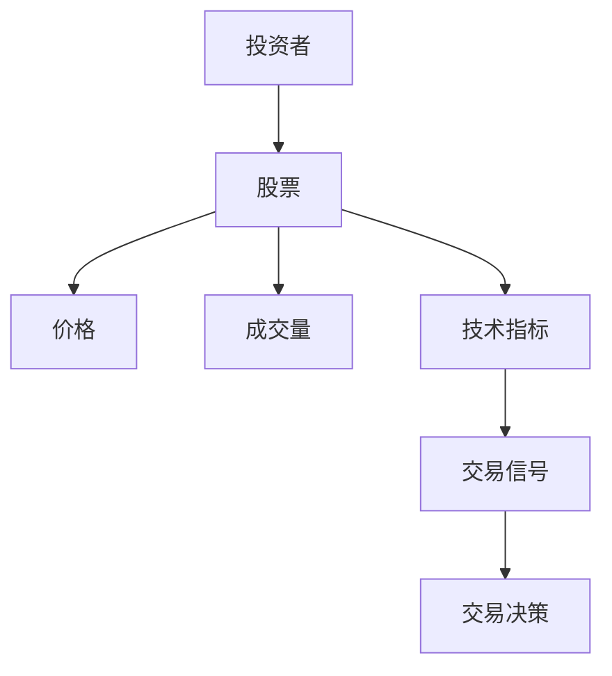
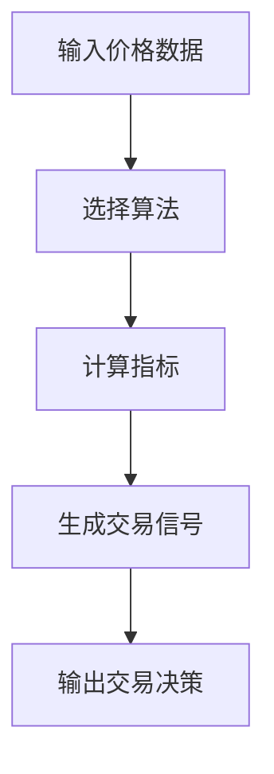
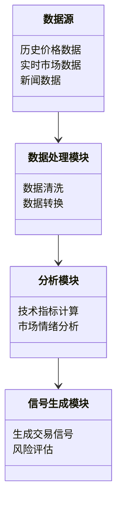
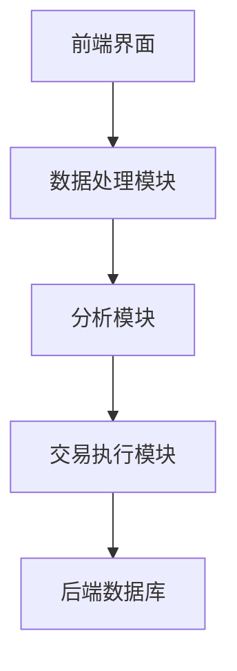
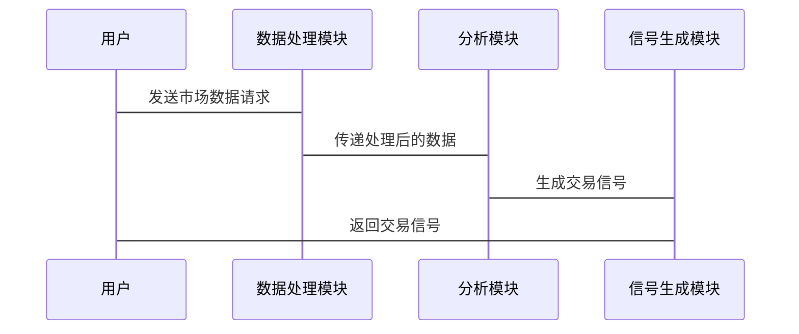

                 


# 如何识别潜在的特价股票机会

> 关键词：特价股票机会识别、股票市场分析、量化投资、算法交易、技术指标分析

> 摘要：本文将详细介绍如何识别潜在的特价股票机会。通过分析股票市场的核心概念、数学模型、算法原理、系统架构以及实战案例，本文将帮助读者掌握识别特价股票机会的方法和技巧。从基础概念到高级算法，从系统设计到实际应用，本文将全面解析如何在股票市场中捕捉潜在的特价股票机会。

---

## 第一部分: 特价股票机会识别基础

### # 第1章: 特价股票机会识别概述

#### 1.1 特价股票机会的背景与重要性

##### 1.1.1 特价股票机会的定义与背景
特价股票机会是指在股票市场上，某些股票在特定时间段内出现价格波动，从而为投资者提供短期获利或套利机会的现象。这种机会通常与市场情绪、突发事件、技术指标变化等因素密切相关。

##### 1.1.2 特价股票机会的市场现状
近年来，随着金融市场的发展和技术的进步，越来越多的投资者开始关注如何利用量化方法和技术分析来捕捉特价股票机会。量化投资和算法交易的兴起，使得识别特价股票机会变得更加高效和精准。

##### 1.1.3 特价股票机会的投资者需求
投资者对特价股票机会的需求主要体现在以下方面：
1. 短期获利：通过快速识别市场机会，投资者可以在短时间内实现资本增值。
2. 套利机会：利用市场价差或信息不对称，投资者可以进行套利操作。
3. 风险控制：通过识别潜在风险信号，投资者可以及时调整投资策略。

#### 1.2 特价股票机会的核心概念

##### 1.2.1 特价股票机会的基本属性
- **时间性**：特价股票机会通常具有时间窗口，需要在特定时间内完成交易。
- **波动性**：价格波动是识别特价股票机会的关键特征。
- **不确定性**：市场波动具有不确定性，投资者需要结合多种因素进行分析。

##### 1.2.2 特价股票机会的关键特征
- **价格异动**：股票价格在短时间内出现大幅波动。
- **成交量变化**：成交量的变化可以反映市场的买卖力量。
- **技术指标**：通过技术指标（如K线图、均线、MACD等）分析市场趋势。

##### 1.2.3 特价股票机会的边界与外延
- **边界**：特价股票机会的识别需要在合法、合规的范围内进行，避免涉及操纵市场等违法行为。
- **外延**：特价股票机会的识别可以结合市场情绪、新闻事件、宏观经济指标等多种因素。

#### 1.3 特价股票机会的分类与应用场景

##### 1.3.1 特价股票机会的分类
1. **短期机会**：如日内交易、短线交易。
2. **中期机会**：如趋势反转、技术形态突破。
3. **长期机会**：如价值投资、基本面分析。

##### 1.3.2 特价股票机会的主要应用场景
1. **量化投资**：通过算法交易快速捕捉市场机会。
2. **技术分析**：通过技术指标和图表分析市场趋势。
3. **套利机会**：利用市场价差进行套利操作。

##### 1.3.3 特价股票机会的市场参与者分析
- **机构投资者**：通过大数据分析和量化模型捕捉市场机会。
- **个人投资者**：通过技术分析和市场情绪分析进行交易。
- **做市商**：通过高频交易和算法交易提供流动性。

### # 第2章: 特价股票机会识别的核心概念与联系

#### 2.1 特价股票机会识别的核心原理

##### 2.1.1 特价股票机会识别的理论基础
- **市场有效性**：市场的有效性和弱有效性的假设对特价股票机会识别的影响。
- **技术分析**：基于价格和成交量的技术分析方法。
- **量化分析**：通过数学模型和算法进行市场预测。

##### 2.1.2 特价股票机会识别的主要方法
1. **技术指标分析**：如均线、MACD、RSI等。
2. **大数据分析**：通过新闻数据、社交媒体数据进行情绪分析。
3. **量化模型**：如移动平均线模型、动量模型等。

##### 2.1.3 特价股票机会识别的关键指标
- **相对强弱指数（RSI）**：衡量股票的超买超卖情况。
- **移动平均线（MA）**：判断股票价格的趋势。
- **成交量（Volume）**：反映市场的买卖力量。

#### 2.2 特价股票机会识别的核心概念对比

##### 2.2.1 特价股票机会与非特价股票机会的对比
| 特性         | 特价股票机会                | 非特价股票机会               |
|--------------|-----------------------------|------------------------------|
| 时间性       | 短期内波动明显              | 稳定性较高                   |
| 价格变化     | 大幅波动                   | 波动较小                    |
| 投资策略     | 高频交易、技术分析          | 长期投资、价值投资            |

##### 2.2.2 不同类型特价股票机会的特征对比
| 类型         | 短期机会                  | 中期机会                   | 长期机会                  |
|--------------|---------------------------|-----------------------------|---------------------------|
| 时间窗口     | 几分钟到几小时             | 几周到几个月                | 几个月到几年              |
| 波动幅度     | 小时内波动较大             | 几周内趋势性变化            | 几年内的趋势性变化        |
| 分析方法     | 技术分析、高频交易         | 技术分析、量化模型          | 基本面分析、价值投资      |

##### 2.2.3 特价股票机会识别的关键指标对比
| 指标         | 均线（MA）                | 相对强弱指数（RSI）         | 成交量（Volume）          |
|--------------|---------------------------|-----------------------------|---------------------------|
| 主要用途     | 判断价格趋势              | 判断超买超卖                | 判断买卖力量              |
| 计算方式     | 简单/加权移动平均          | 基于收盘价的相对强度        | 成交量的统计与分析        |

#### 2.3 特价股票机会识别的ER实体关系图



---

## 第三部分: 特价股票机会识别的数学模型与算法原理

### # 第3章: 特价股票机会识别的数学模型与算法原理

#### 3.1 特价股票机会识别的数学模型

##### 3.1.1 常用数学模型介绍
1. **移动平均线模型（MA）**：基于过去的价格数据，计算一定时间窗口内的平均价格，用于判断价格趋势。
2. **相对强弱指数模型（RSI）**：通过计算一定时间窗口内的平均涨幅和平均跌幅，判断股票的超买超卖情况。
3. **动量模型（Momentum）**：基于价格的动量效应，预测未来的价格走势。

##### 3.1.2 数学模型的选择与优化
- **选择标准**：模型的准确性和稳定性。
- **优化方法**：通过历史数据回测和参数调整，优化模型的性能。

##### 3.1.3 数学模型的验证与评估
- **回测分析**：通过历史数据验证模型的有效性。
- **风险控制**：评估模型的回撤和最大亏损。

#### 3.2 特价股票机会识别的算法原理

##### 3.2.1 常用算法原理分析
1. **简单移动平均线（SMA）**：
   - 算法步骤：
     1. 计算一定时间窗口内的平均价格。
     2. 判断当前价格与平均价格的关系，生成交易信号。
   - 代码示例：
     ```python
     def SMA(price_data, window):
         return price_data.rolling(window).mean()
     ```
2. **相对强弱指数（RSI）**：
   - 算法步骤：
     1. 计算一定时间窗口内的平均上涨幅度和平均下跌幅度。
     2. 计算RSI值，判断超买超卖情况。
   - 代码示例：
     ```python
     def RSI(price_data, window):
         up = price_data['close'] - price_data['close'].shift(1)
         down = price_data['close'].shift(1) - price_data['close']
         up[down > 0] = 0
         down[up > 0] = 0
         rs = (up.rolling(window).mean() / down.rolling(window).mean()).replace(np.nan, 0)
         rsi = 100 - (100 - (rs.rolling(window).mean()))
         return rsi
     ```

##### 3.2.2 算法原理的数学推导
- **移动平均线模型（MA）**：
  $$ \text{SMA}_n(t) = \frac{1}{n} \sum_{i=1}^{n} p(t-i+1) $$
  其中，\( p(t) \) 表示第 \( t \) 时刻的价格，\( n \) 表示时间窗口长度。
  
- **相对强弱指数模型（RSI）**：
  $$ \text{RSI}(t) = 100 - \frac{100}{1 + \frac{\text{Average Up}}{\text{Average Down}}} $$
  其中，\( \text{Average Up} \) 是一定时间窗口内的平均上涨幅度，\( \text{Average Down} \) 是平均下跌幅度。

##### 3.2.3 算法原理的实际应用
- **案例分析**：假设某股票的价格数据如下：
  | 时间（天） | 收盘价 |
  |------------|--------|
  | 1          | 100    |
  | 2          | 105    |
  | 3          | 103    |
  | 4          | 108    |
  | 5          | 110    |
  使用SMA模型计算5天的SMA：
  $$ \text{SMA}_5 = \frac{100 + 105 + 103 + 108 + 110}{5} = 106.2 $$

#### 3.3 特价股票机会识别的算法流程图



---

## 第四部分: 特价股票机会识别的系统分析与架构设计

### # 第4章: 特价股票机会识别的系统分析与架构设计

#### 4.1 特价股票机会识别的系统分析

##### 4.1.1 系统分析的背景与目标
- **背景**：随着金融市场的发展，投资者需要更高效的方法来识别特价股票机会。
- **目标**：设计一个高效的系统，能够实时分析市场数据，生成交易信号。

##### 4.1.2 系统分析的主要内容
1. **数据源分析**：包括历史价格数据、实时市场数据、新闻数据等。
2. **需求分析**：明确系统的功能需求和性能需求。
3. **可行性分析**：评估技术、经济和操作可行性。

##### 4.1.3 系统分析的结果与建议
- **结果**：通过分析得出系统的可行性结论。
- **建议**：提出系统设计和实现的优化建议。

#### 4.2 特价股票机会识别的系统架构设计

##### 4.2.1 项目介绍
- **项目目标**：开发一个能够识别特价股票机会的系统。
- **项目范围**：包括数据采集、分析、信号生成和交易执行模块。

##### 4.2.2 系统功能设计

###### 4.2.2.1 领域模型mermaid类图



##### 4.2.3 系统架构设计mermaid架构图



##### 4.2.4 系统接口设计
- **输入接口**：接收市场数据和用户指令。
- **输出接口**：生成交易信号和交易报告。

##### 4.2.5 系统交互mermaid序列图



---

## 第五部分: 特价股票机会识别的项目实战

### # 第5章: 特价股票机会识别的项目实战

#### 5.1 环境安装与配置

##### 5.1.1 环境要求
- **操作系统**：Windows/Mac/Linux
- **编程语言**：Python 3.8+
- **库依赖**：Pandas, NumPy, Matplotlib, Scikit-learn, AlphaSense API

##### 5.1.2 安装步骤
1. 安装Python环境：
   ```bash
   python -m pip install --upgrade pip
   pip install numpy pandas matplotlib scikit-learn
   ```
2. 安装AlphaSense API：
   ```bash
   pip install alpha-sense
   ```

#### 5.2 系统核心实现源代码

##### 5.2.1 数据采集模块
```python
import pandas as pd
from alphaSense import AlphaSenseClient

def get_stock_data(ticker, start_date, end_date):
    client = AlphaSenseClient()
    data = client.get_historical_data(ticker, start_date, end_date)
    return pd.DataFrame(data)
```

##### 5.2.2 数据分析模块
```python
import numpy as np
import pandas as pd
import matplotlib.pyplot as plt

def calculate_sma(data, window):
    return data['close'].rolling(window).mean()

def calculate_rsi(data, window):
    delta = data['close'].diff()
    up = delta.where(delta > 0, 0)
    down = delta.abs().where(delta < 0, 0)
    rs = up.rolling(window).mean() / down.rolling(window).mean()
    rsi = 100 - (100 - (rs.rolling(window).mean() / rs))
    return rsi
```

##### 5.2.3 信号生成模块
```python
def generate_signals(data, window):
    sma = calculate_sma(data, window)
    rsi = calculate_rsi(data, window)
    signals = []
    for i in range(len(data)):
        if data['close'].iloc[i] > sma.iloc[i] and rsi.iloc[i] > 70:
            signals.append('买入')
        elif data['close'].iloc[i] < sma.iloc[i] and rsi.iloc[i] < 30:
            signals.append('卖出')
        else:
            signals.append('持有')
    return signals
```

##### 5.2.4 交易执行模块
```python
import time

def execute_trades(signals, data, portfolio):
    for i in range(len(signals)):
        if signals[i] == '买入':
            portfolio.buy(data['close'].iloc[i])
        elif signals[i] == '卖出':
            portfolio.sell(data['close'].iloc[i])
        time.sleep(1)
```

#### 5.3 代码应用解读与分析

##### 5.3.1 数据采集模块
- **功能**：从AlphaSense API获取股票的历史数据。
- **输入**：股票代码、起始日期、结束日期。
- **输出**：数据框格式的历史数据。

##### 5.3.2 数据分析模块
- **SMA计算**：通过滑动窗口计算简单移动平均线。
- **RSI计算**：通过动量变化计算相对强弱指数。

##### 5.3.3 信号生成模块
- **逻辑**：结合SMA和RSI指标，生成买入、卖出或持有信号。
- **输入**：价格数据、时间窗口。
- **输出**：交易信号列表。

##### 5.3.4 交易执行模块
- **逻辑**：根据生成的交易信号执行买卖操作。
- **输入**：交易信号、价格数据、投资组合。
- **输出**：投资组合的变动情况。

#### 5.4 实际案例分析和详细讲解

##### 5.4.1 案例分析
假设我们选取某股票的历史数据，使用上述代码进行回测：

1. 数据采集：
   ```python
   data = get_stock_data('AAPL', '2023-01-01', '2023-12-31')
   ```

2. 数据分析：
   ```python
   sma = calculate_sma(data, 20)
   rsi = calculate_rsi(data, 20)
   ```

3. 信号生成：
   ```python
   signals = generate_signals(data, 20)
   ```

4. 交易执行：
   ```python
   portfolio = Portfolio(initial_cash=10000)
   execute_trades(signals, data, portfolio)
   ```

##### 5.4.2 详细讲解
- **数据采集**：确保数据来源可靠，时间范围合理。
- **数据分析**：选择合适的窗口大小，验证模型的有效性。
- **信号生成**：结合多个指标，提高交易信号的准确性。
- **交易执行**：设置合理的回撤机制，控制交易风险。

#### 5.5 项目小结

##### 5.5.1 项目总结
- **项目目标**：成功开发了一个能够识别特价股票机会的系统。
- **项目成果**：实现了数据采集、分析、信号生成和交易执行模块。
- **项目意义**：为投资者提供了一种高效的方法来捕捉市场机会。

##### 5.5.2 经验总结
- **数据质量**：数据的准确性和完整性对模型的性能影响重大。
- **模型优化**：需要不断回测和调整模型参数，提高模型的稳定性。
- **风险控制**：交易系统需要具备完善的回撤机制和风险控制策略。

---

## 第六部分: 总结与展望

### # 第6章: 总结与展望

#### 6.1 项目总结
通过本文的详细讲解，读者可以掌握如何识别潜在的特价股票机会。从理论分析到实际应用，从系统设计到代码实现，本文为投资者提供了一个完整的解决方案。

#### 6.2 未来展望
随着人工智能和大数据技术的不断发展，特价股票机会识别将更加智能化和自动化。未来的研究方向包括：
1. **人工智能的应用**：利用深度学习模型进行市场预测。
2. **高频交易的优化**：通过更复杂的算法提高交易效率。
3. **跨市场分析**：结合多个市场的数据进行综合分析。

#### 6.3 最佳实践 Tips
1. **数据来源**：确保数据的准确性和及时性。
2. **模型优化**：不断回测和调整模型参数。
3. **风险控制**：设置合理的止损和止盈机制。

#### 6.4 小结
识别潜在的特价股票机会是一项复杂但 rewarding 的任务。通过本文的指导，读者可以更好地理解市场规律，掌握识别技巧，并在实际操作中取得更好的投资效果。

---

## 作者信息

作者：AI天才研究院/AI Genius Institute & 禅与计算机程序设计艺术 /Zen And The Art of Computer Programming

