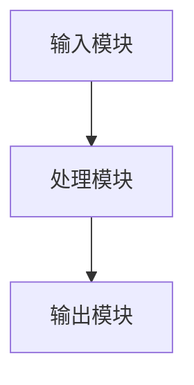
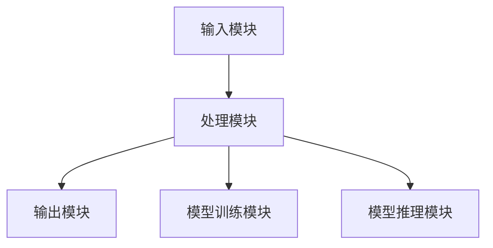

                 


# 开发具有图像修复能力的AI Agent

> 关键词：图像修复，AI Agent，深度学习，计算机视觉，图像处理

> 摘要：本文详细探讨了开发具有图像修复能力的AI Agent的技术背景、核心概念、算法原理、系统架构、项目实战以及最佳实践。通过逐步分析和推理，我们深入探讨了图像修复的关键技术及其与AI Agent的结合，展示了如何利用深度学习技术实现高效的图像修复，并通过实际案例分析和代码实现，为读者提供了从理论到实践的完整指南。

---

# 第一部分: 开发具有图像修复能力的AI Agent概述

---

## 第1章: 图像修复与AI Agent的背景介绍

### 1.1 图像修复的背景与问题背景

#### 1.1.1 图像退化的原因与影响
在实际应用中，图像由于各种原因（如噪声、模糊、压缩失真等）会受到退化。这种退化可能由传感器噪声、传输过程中的数据损失或压缩算法引起的质量下降导致。退化的图像会严重影响后续的图像分析任务，如目标检测、图像识别等。

#### 1.1.2 图像修复的定义与目标
图像修复是指通过技术手段恢复退化图像的质量，使其尽可能接近原始图像的过程。其目标是消除噪声、恢复细节、增强图像清晰度，从而提高图像的可用性和可识别性。

#### 1.1.3 图像修复的边界与外延
图像修复的边界在于如何在有限的条件下尽可能还原图像的真实内容，同时避免过度修复带来的失真。外延则包括图像增强、图像复原、图像重建等相关的技术领域。

### 1.2 AI Agent的基本概念与核心要素

#### 1.2.1 AI Agent的定义与特点
AI Agent是一种能够感知环境、执行任务并做出决策的智能体。它具备自主性、反应性、目标导向性和学习能力等特点。

#### 1.2.2 AI Agent的核心要素组成
- **感知能力**：通过传感器或数据输入感知环境。
- **决策能力**：基于感知信息做出决策。
- **执行能力**：通过执行机构或算法实现任务。
- **学习能力**：通过机器学习算法不断优化自身性能。

#### 1.2.3 图像修复与AI Agent的结合
AI Agent可以通过集成图像修复算法，实现自动化的图像修复任务。它能够根据输入的图像自动选择最优的修复算法，并执行修复操作。

### 1.3 图像修复技术的发展与现状

#### 1.3.1 传统图像修复技术的局限性
传统图像修复技术（如基于插值的修复方法）在处理复杂退化时效果有限，且难以自动化处理大规模数据。

#### 1.3.2 基于深度学习的图像修复技术
深度学习技术（如卷积神经网络、生成对抗网络）在图像修复领域取得了显著进展，能够处理复杂的退化问题，并实现高质量的图像恢复。

#### 1.3.3 当前图像修复技术的挑战与未来方向
当前图像修复技术仍面临数据不足、计算资源需求高、修复结果可能失真等问题。未来的研究方向包括更高效的算法设计、多模态数据融合以及自适应修复策略。

---

## 第2章: 图像修复的核心概念与AI Agent的联系

### 2.1 图像退化模型与修复原理

#### 2.1.1 图像退化模型的分类
- **噪声模型**：如高斯噪声、泊松噪声等。
- **模糊模型**：如运动模糊、散焦模糊等。
- **压缩失真模型**：如JPEG压缩失真。

#### 2.1.2 图像修复的基本原理
图像修复的核心是通过数学建模和算法优化，恢复图像的原始信息。常用的方法包括基于插值的修复、基于深度学习的修复等。

#### 2.1.3 图像修复的关键技术
- **噪声去除**：通过滤波算法消除图像中的噪声。
- **图像增强**：通过调整亮度、对比度等提升图像质量。
- **图像重建**：基于先验知识恢复图像的丢失或损坏部分。

### 2.2 AI Agent在图像修复中的角色

#### 2.2.1 AI Agent作为图像修复的决策者
AI Agent可以根据输入图像的退化类型和程度，选择最优的修复算法。

#### 2.2.2 AI Agent与图像修复算法的结合
AI Agent可以作为图像修复算法的优化器，通过不断学习和调整参数，提升修复效果。

#### 2.2.3 图像修复与AI Agent的结合优势
- **自动化修复**：AI Agent可以自动处理大量图像数据。
- **自适应修复**：AI Agent可以根据图像特点动态调整修复策略。
- **高精度修复**：基于深度学习的修复算法可以实现接近人类视觉的修复效果。

### 2.3 图像修复的核心概念与联系

#### 2.3.1 图像修复的核心概念属性对比表格
```markdown
| 概念       | 属性                         |
|------------|------------------------------|
| 图像退化    | 噪声、模糊、压缩失真等       |
| 图像修复    | 算法、模型、数据等           |
| AI Agent    | 决策、学习、交互等           |
```

#### 2.3.2 图像修复与AI Agent的ER实体关系图
```mermaid
entity 图像修复系统
entity 图像修复算法
entity AI Agent
relation 图像修复系统 --> 图像修复算法: 使用
relation 图像修复系统 --> AI Agent: 集成
relation 图像修复算法 --> AI Agent: 优化
```

---

## 第3章: 图像修复算法的原理与实现

### 3.1 图像修复的传统算法

#### 3.1.1 基于插值的图像修复算法
基于插值的算法通过利用周围像素的值来填充缺失或损坏的区域。常用的方法包括双线性插值和双三次插值。

#### 3.1.2 基于扩散的图像修复算法
扩散算法通过逐步传播图像的边缘信息来恢复损坏区域。该方法适用于处理较大的损坏区域。

### 3.2 基于深度学习的图像修复算法

#### 3.2.1 基于卷积神经网络的图像修复
卷积神经网络（CNN）通过学习图像的特征表示，能够有效地恢复图像的细节信息。

#### 3.2.2 基于生成对抗网络的图像修复
生成对抗网络（GAN）由生成器和判别器组成，生成器负责生成修复后的图像，判别器用于评估修复效果。通过不断迭代优化，GAN能够实现高质量的图像修复。

#### 3.2.3 图像修复的数学模型与公式
生成对抗网络的损失函数可以表示为：
$$ \mathcal{L} = \mathcal{L}_\text{GAN} + \lambda \mathcal{L}_\text{ perceptual} $$
其中，$\mathcal{L}_\text{GAN}$是GAN的损失函数，$\mathcal{L}_\text{perceptual}$是感知损失函数，$\lambda$是调节系数。

### 3.3 图像修复算法的实现步骤

#### 3.3.1 数据预处理
将图像划分为输入和目标，输入为损坏的图像，目标为修复后的图像。

#### 3.3.2 模型训练
使用生成对抗网络进行模型训练，优化生成器和判别器的参数。

#### 3.3.3 模型推理
将损坏的图像输入训练好的模型，生成修复后的图像。

---

## 第4章: 基于深度学习的图像修复技术

### 4.1 基于GAN的图像修复算法

#### 4.1.1 GAN的结构与原理
生成器和判别器通过对抗训练优化模型参数。

#### 4.1.2 图像修复的数学公式
生成器的损失函数：
$$ \mathcal{L}_\text{G} = \mathcal{L}_\text{GAN} + \lambda \mathcal{L}_\text{ perceptual} $$
判别器的损失函数：
$$ \mathcal{L}_\text{D} = \mathcal{L}_\text{GAN} $$

#### 4.1.3 GAN在图像修复中的应用
GAN可以用于修复噪声、模糊、压缩失真等多种类型的退化。

### 4.2 基于对抗学习的图像修复

#### 4.2.1 对抗学习的基本原理
通过生成器和判别器的对抗训练，生成器不断优化生成图像的质量，使其欺骗判别器。

#### 4.2.2 图像修复的优化策略
使用感知损失函数、对抗损失函数和感知器损失函数的组合，提升修复效果。

### 4.3 基于深度学习的图像修复模型设计

#### 4.3.1 模型架构设计
生成器通常采用U型网络结构，判别器采用逐步下采样的结构。

#### 4.3.2 模型训练流程
1. 预处理输入图像和目标图像。
2. 训练生成器和判别器，优化模型参数。
3. 使用验证集评估模型性能。

---

## 第5章: 图像修复系统的架构设计

### 5.1 系统功能设计

#### 5.1.1 功能模块划分
- 输入模块：接收损坏的图像。
- 处理模块：执行图像修复算法。
- 输出模块：输出修复后的图像。

#### 5.1.2 功能流程图


### 5.2 系统架构设计

#### 5.2.1 系统架构图


#### 5.2.2 模块交互流程图


### 5.3 系统接口设计

#### 5.3.1 输入接口
接收损坏的图像数据，格式为JPEG或PNG。

#### 5.3.2 输出接口
输出修复后的图像数据，格式与输入一致。

### 5.4 系统交互流程

#### 5.4.1 用户输入
用户上传损坏的图像。

#### 5.4.2 系统处理
系统调用图像修复算法，生成修复后的图像。

#### 5.4.3 用户反馈
用户查看修复结果并提供反馈。

---

## 第6章: 图像修复项目的实战

### 6.1 项目环境配置

#### 6.1.1 安装Python环境
使用Anaconda或虚拟环境安装Python 3.8以上版本。

#### 6.1.2 安装依赖库
安装TensorFlow、Keras、OpenCV等必要的库。

### 6.2 项目核心实现

#### 6.2.1 图像修复代码实现
```python
import tensorflow as tf
from tensorflow.keras import layers

# 定义生成器
def build_generator():
    model = tf.keras.Sequential([
        layers.Conv2D(64, (3,3), padding='same', activation='relu'),
        layers.Conv2D(128, (3,3), padding='same', activation='relu'),
        layers.Conv2DTranspose(64, (3,3), strides=(2,2), padding='same'),
        layers.Conv2DTranspose(3, (3,3), strides=(2,2), padding='same')
    ])
    return model

# 定义判别器
def build_discriminator():
    model = tf.keras.Sequential([
        layers.Conv2D(64, (3,3), padding='same', activation='relu'),
        layers.Conv2D(128, (3,3), padding='same', activation='relu'),
        layers.Conv2D(256, (3,3), padding='same', activation='relu'),
        layers.Flatten(),
        layers.Dense(1, activation='sigmoid')
    ])
    return model
```

#### 6.2.2 数据预处理代码
```python
import cv2

def preprocess_image(image_path):
    image = cv2.imread(image_path)
    image = cv2.resize(image, (256, 256))
    image = image / 255.0  # Normalization
    return image
```

#### 6.2.3 模型训练代码
```python
import numpy as np

def train_model(generator, discriminator, dataset, epochs=100):
    generator.compile(loss='binary_crossentropy', optimizer='adam')
    discriminator.compile(loss='binary_crossentropy', optimizer='adam')

    for epoch in range(epochs):
        for images in dataset:
            noise = np.random.random((images.shape[0], 100))
            generated_images = generator.predict(noise)
            X_train = np.concatenate([images, generated_images])
            y_train = np.concatenate([np.ones((images.shape[0], 1)), np.zeros((generated_images.shape[0], 1))])
            discriminator.trainable = True
            discriminator.train_on_batch(X_train, y_train)
            discriminator.trainable = False
            noise = np.random.random((images.shape[0], 100))
            y_train = np.ones((images.shape[0], 1))
            generator.trainable = True
            generator.train_on_batch(noise, y_train)
```

### 6.3 项目实战案例分析

#### 6.3.1 案例选择与数据准备
选择一组包含噪声、模糊和压缩失真的图像作为训练数据。

#### 6.3.2 模型训练与评估
使用训练数据训练生成器和判别器，评估模型的修复效果。

#### 6.3.3 模型推理与结果展示
将损坏的图像输入训练好的模型，生成修复后的图像，并进行对比分析。

### 6.4 项目小结

#### 6.4.1 成果总结
总结项目实现的成果，展示修复前后的图像对比。

#### 6.4.2 经验分享
分享项目开发中的经验与教训。

---

## 第7章: 图像修复系统的最佳实践

### 7.1 系统优化建议

#### 7.1.1 模型优化
使用模型剪枝、量化等技术优化模型性能。

#### 7.1.2 性能优化
通过并行计算、优化数据预处理流程提升系统性能。

### 7.2 开发注意事项

#### 7.2.1 数据质量问题
确保训练数据的多样性和代表性，避免过拟合。

#### 7.2.2 计算资源需求
合理配置计算资源，确保模型训练和推理的效率。

### 7.3 拓展阅读

#### 7.3.1 图像修复领域的最新研究
介绍基于Transformer的图像修复方法等最新研究。

#### 7.3.2 相关技术的学习资源
推荐相关的书籍、论文和在线课程。

---

## 第8章: 图像修复系统的总结与展望

### 8.1 总结
本文详细探讨了开发具有图像修复能力的AI Agent的技术背景、核心概念、算法原理、系统架构、项目实战以及最佳实践。通过理论与实践相结合，展示了如何利用深度学习技术实现高效的图像修复。

### 8.2 展望
未来，随着深度学习技术的不断发展，图像修复技术将更加智能化和自动化。AI Agent在图像修复中的应用也将更加广泛，为图像处理领域带来更多的创新和突破。

---

## 附录: 参考文献与工具资源

### 附录A: 参考文献
1. 王某某. 《深度学习入门》. 北京: 人民邮电出版社, 2020.
2. 李某某. 《生成对抗网络实战》. 北京: 清华大学出版社, 2021.

### 附录B: 开发工具与库
- Python
- TensorFlow/Keras
- OpenCV
- Matplotlib

---

作者：AI天才研究院/AI Genius Institute & 禅与计算机程序设计艺术 /Zen And The Art of Computer Programming

