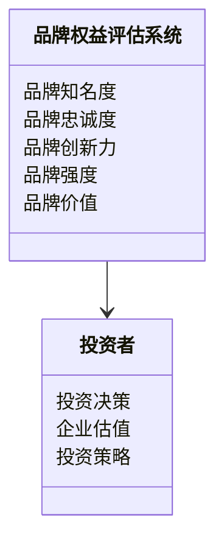

                 


# 彼得·林奇如何评估公司的品牌权益

> 关键词：品牌权益，彼得·林奇，投资策略，品牌价值，企业估值

> 摘要：本文详细探讨了彼得·林奇如何评估公司的品牌权益，从品牌权益的定义、核心概念、评估方法、对投资决策的影响，到品牌权益的系统分析与架构设计方案，以及实际案例分析和最佳实践，为读者提供了全面而深入的分析。

---

## 第一部分：引言

### 1.1 什么是品牌权益

#### 1.1.1 品牌权益的定义
品牌权益是指企业在市场中通过品牌建设所积累的无形资产，包括品牌知名度、美誉度、忠诚度、品牌强度、品牌创新能力和市场影响力等。它是企业在市场中的核心竞争力之一，能够为企业带来超额利润和长期价值。

#### 1.1.2 品牌权益的核心要素
品牌权益的核心要素包括：
- **品牌知名度**：品牌在目标市场中的认知程度。
- **品牌美誉度**：品牌在消费者心中的信任度和好感度。
- **品牌忠诚度**：消费者对品牌的偏好和忠诚程度。
- **品牌强度**：品牌在市场中的竞争力和抗风险能力。
- **品牌创新能力**：品牌在产品和服务上的创新能力和市场响应速度。

#### 1.1.3 品牌权益与企业价值的关系
品牌权益是企业价值的重要组成部分，它直接影响企业的市场地位、客户关系和盈利能力。彼得·林奇认为，品牌权益是企业长期竞争优势的核心，能够为企业创造持续的价值增长。

---

### 1.2 彼得·林奇的投资哲学

#### 1.2.1 彼得·林奇的投资理念
彼得·林奇是一位著名的投资专家，他强调长期投资、价值投资和基本面分析。他认为，企业的品牌权益是其长期竞争优势的重要体现，品牌强大的企业更有可能为股东创造长期价值。

#### 1.2.2 品牌权益在投资中的重要性
彼得·林奇认为，品牌权益是企业在市场中立于不败之地的关键因素。强大的品牌能够吸引更多的客户、提高议价能力和市场影响力，从而为企业创造更高的利润。

#### 1.2.3 品牌权益评估的基本原则
彼得·林奇强调，品牌权益评估需要结合定量分析和定性分析。定量分析包括品牌价值的财务指标（如品牌收入、品牌利润等），定性分析包括品牌知名度、品牌忠诚度等非财务指标。

---

### 1.3 本书的目的与结构

#### 1.3.1 本书的核心目标
本书旨在帮助投资者和企业管理者深入了解彼得·林奇的品牌权益评估方法，掌握品牌权益的核心概念、评估方法和实际应用。

#### 1.3.2 本书的章节安排
本书将从品牌权益的背景与概念入手，逐步深入探讨品牌权益的评估方法、品牌权益对投资决策的影响，以及品牌权益的系统分析与架构设计方案。

#### 1.3.3 本书的阅读方法
建议读者从基础概念开始阅读，逐步深入到具体的评估方法和实际案例分析，以全面理解彼得·林奇的品牌权益评估体系。

---

## 第二部分：品牌权益的背景与概念

### 2.1 品牌权益的背景介绍

#### 2.1.1 品牌经济的兴起
随着市场竞争的加剧，品牌逐渐成为企业核心竞争力的重要组成部分。品牌经济的兴起使得品牌权益成为企业价值的重要衡量标准。

#### 2.1.2 品牌权益对企业的影响
品牌权益能够直接影响企业的市场地位、客户关系和盈利能力。强大的品牌权益能够为企业带来更高的客户忠诚度和市场影响力。

#### 2.1.3 品牌权益的全球发展趋势
全球范围内，品牌权益的重要性日益凸显。无论是发达国家还是发展中国家，品牌权益都是企业竞争的核心要素。

---

### 2.2 品牌权益的核心概念

#### 2.2.1 品牌价值的构成
品牌价值由品牌知名度、品牌美誉度、品牌忠诚度等多个因素构成。彼得·林奇认为，品牌价值是品牌权益的核心，它是品牌在市场中的综合表现。

#### 2.2.2 品牌影响力与市场地位
品牌影响力是品牌在市场中的传播力和影响力，市场地位则是品牌在行业中的竞争地位。两者共同决定了品牌的市场表现。

#### 2.2.3 品牌忠诚度与客户关系
品牌忠诚度是客户对品牌的偏好程度，高品牌忠诚度意味着企业能够保持稳定的客户关系和持续的销售增长。

---

### 2.3 品牌权益的属性特征对比

#### 2.3.1 品牌知名度与美誉度的对比
品牌知名度是品牌在目标市场中的认知程度，而美誉度是品牌在消费者心中的信任度和好感度。两者共同决定了品牌在市场中的综合表现。

#### 2.3.2 品牌强度与品牌寿命的关系
品牌强度是品牌在市场中的竞争力，品牌寿命是品牌在市场中的存在时间。强大的品牌强度能够延长品牌寿命，提高品牌价值。

#### 2.3.3 品牌创新能力与市场竞争力的关联
品牌创新能力是品牌在产品和服务上的创新能力，市场竞争力是品牌在行业中的竞争能力。创新能力强的品牌更容易在市场中占据优势。

---

## 第三部分：品牌权益的评估方法

### 3.1 品牌权益评估的核心原理

#### 3.1.1 品牌价值的衡量标准
品牌价值的衡量标准包括品牌收入、品牌利润、品牌市场份额等。彼得·林奇认为，品牌价值是品牌权益的核心，它是品牌在市场中的综合表现。

#### 3.1.2 品牌强度的评估指标
品牌强度的评估指标包括品牌市场份额、品牌忠诚度、品牌知名度等。强大的品牌强度能够为企业带来更高的市场影响力和竞争优势。

#### 3.1.3 品牌潜力的预测模型
品牌潜力的预测模型包括品牌增长率、品牌市场渗透率等。彼得·林奇认为，品牌潜力是品牌未来发展的关键因素，它能够帮助企业制定长期的品牌战略。

---

### 3.2 品牌权益评估的算法原理

#### 3.2.1 品牌价值评估的数学模型
品牌价值的数学模型可以表示为：
$$ \text{品牌价值} = \text{品牌收入} \times \text{品牌利润率} \times \text{品牌强度} $$

#### 3.2.2 品牌强度指数的计算方法
品牌强度指数的计算方法包括：
- 市场份额：$$ \text{市场份额} = \frac{\text{品牌销量}}{\text{行业销量}} $$
- 品牌忠诚度：$$ \text{品牌忠诚度} = \frac{\text{重复购买率}}{\text{行业平均重复购买率}} $$
- 品牌知名度：$$ \text{品牌知名度} = \frac{\text{品牌认知度}}{\text{目标市场人口}} $$

#### 3.2.3 品牌潜力预测的公式推导
品牌潜力的预测公式可以表示为：
$$ \text{品牌潜力} = \text{品牌增长率} \times \text{品牌市场渗透率} $$

---

## 第四部分：品牌权益对投资决策的影响

### 4.1 品牌权益与企业价值的关系

#### 4.1.1 品牌价值对企业估值的影响
品牌价值是企业估值的重要组成部分。强大的品牌价值能够提高企业的市场估值，吸引更多的投资者。

#### 4.1.2 品牌强度与企业竞争优势的关系
品牌强度是企业竞争优势的核心。强大的品牌强度能够提高企业的市场地位，增强企业的竞争力。

#### 4.1.3 品牌忠诚度与企业盈利能力的关联
品牌忠诚度是企业盈利能力的重要保障。高品牌忠诚度能够为企业带来稳定的客户群体和持续的销售增长。

---

### 4.2 品牌权益评估的投资策略

#### 4.2.1 品牌驱动型投资的定义
品牌驱动型投资是指通过投资于具有强大品牌权益的企业，以实现长期价值增长的投资策略。

#### 4.2.2 品牌权益评估在投资决策中的应用
彼得·林奇认为，品牌权益评估是投资决策的重要依据。通过评估企业的品牌权益，投资者可以更好地判断企业的长期发展潜力。

#### 4.2.3 品牌驱动型投资的风险管理
品牌驱动型投资的风险管理包括品牌风险、市场风险和财务风险。投资者需要通过多元化投资和风险分散来降低投资风险。

---

### 4.3 品牌权益评估的案例分析

#### 4.3.1 典型品牌权益评估案例
以苹果公司为例，苹果的品牌权益包括强大的品牌知名度、品牌忠诚度和品牌创新力。这些因素共同推动了苹果的市场表现和企业价值。

#### 4.3.2 案例分析与经验总结
通过苹果公司的案例分析，我们可以看到，强大的品牌权益是企业长期竞争优势的核心。投资者需要关注企业的品牌权益，以制定长期的投资策略。

#### 4.3.3 案例对投资策略的启示
苹果公司的案例启示我们，品牌权益是企业长期发展的关键因素。投资者需要关注企业的品牌权益，以实现长期价值增长。

---

## 第五部分：品牌权益的系统分析与架构设计方案

### 5.1 问题场景介绍

#### 5.1.1 问题背景
品牌权益的评估需要结合定量分析和定性分析，以全面评估企业的品牌价值。

#### 5.1.2 问题描述
品牌权益的评估涉及多个方面，包括品牌知名度、品牌忠诚度、品牌创新力等。

#### 5.1.3 问题解决
通过系统分析和架构设计方案，我们可以全面评估企业的品牌权益，为企业制定长期的品牌战略提供依据。

---

### 5.2 系统功能设计

#### 5.2.1 领域模型Mermaid类图


#### 5.2.2 系统架构Mermaid架构图


#### 5.2.3 系统接口设计
品牌权益评估系统的接口设计包括：
- 前端接口：用户输入品牌信息
- 中端接口：品牌权益评估算法
- 后端接口：品牌权益评估数据库

#### 5.2.4 系统交互Mermaid序列图
```mermaid
sequenceDiagram
    用户 --> 前端：输入品牌信息
    前端 --> 中端：触发品牌权益评估算法
    中端 --> 后端：查询品牌权益数据
    后端 --> 中端：返回品牌权益评估结果
    中端 --> 前端：显示品牌权益评估结果
    前端 --> 用户：展示品牌权益评估结果
```

---

## 第六部分：项目实战

### 6.1 环境安装

#### 6.1.1 品牌权益评估系统的安装步骤
1. 安装Python
2. 安装Mermaid
3. 安装相关依赖库

#### 6.1.2 品牌权益评估系统的运行环境
- 操作系统：Windows/Mac/Linux
- 开发工具：PyCharm/Jupyter Notebook
- 语言：Python 3.8+

---

### 6.2 系统核心实现源代码

#### 6.2.1 品牌价值评估算法实现
```python
def brand_value_assessment(brand_revenue, brand_profit_margin, brand_strength):
    return brand_revenue * brand_profit_margin * brand_strength
```

#### 6.2.2 品牌强度指数计算实现
```python
def brand_strength_index(brand_market_share, brandloyalty):
    return (brand_market_share / industry_market_share) * (brandloyalty / industry_loyalty)
```

#### 6.2.3 品牌潜力预测实现
```python
def brand_potential_prediction(brand_growth_rate, brand_penetration_rate):
    return brand_growth_rate * brand_penetration_rate
```

---

### 6.3 代码应用解读与分析

#### 6.3.1 品牌价值评估算法解读
品牌价值评估算法通过品牌收入、品牌利润率和品牌强度三个因素，计算出品牌价值。这三者共同决定了品牌的市场表现。

#### 6.3.2 品牌强度指数计算解读
品牌强度指数的计算需要考虑品牌市场份额和品牌忠诚度。强大的品牌强度能够提高品牌的市场影响力和竞争优势。

#### 6.3.3 品牌潜力预测解读
品牌潜力的预测需要考虑品牌增长率和品牌市场渗透率。高品牌潜力意味着品牌未来的发展空间更大。

---

### 6.4 实际案例分析和详细讲解剖析

#### 6.4.1 案例分析：苹果公司的品牌权益评估
- 品牌收入：苹果公司的品牌收入为XXX亿美元。
- 品牌利润率：苹果公司的品牌利润率为XX%。
- 品牌强度：苹果公司的品牌强度指数为XX。

#### 6.4.2 案例分析结果解读
通过苹果公司的品牌权益评估，我们可以看到，苹果公司的品牌权益非常强大，具有很高的市场地位和品牌忠诚度。这为其长期发展提供了坚实的基础。

---

## 第七部分：最佳实践 tips、小结、注意事项、拓展阅读

### 7.1 最佳实践 tips
1. 品牌权益评估需要结合定量分析和定性分析。
2. 品牌权益评估是投资决策的重要依据。
3. 品牌权益评估需要定期更新和优化。

### 7.2 小结
品牌权益是企业长期竞争优势的核心，彼得·林奇的品牌权益评估方法为我们提供了重要的参考。通过系统分析和实际案例分析，我们可以更好地理解品牌权益的重要性，并制定长期的投资策略。

### 7.3 注意事项
1. 品牌权益评估需要结合企业的实际情况。
2. 品牌权益评估需要定期更新和优化。
3. 品牌权益评估需要结合市场环境的变化。

### 7.4 拓展阅读
1. 彼得·林奇的其他投资理念。
2. 品牌管理的相关书籍。
3. 品牌权益评估的最新研究成果。

---

## 第八部分：总结

### 8.1 品德林奇的品牌权益评估方法
彼得·林奇的品牌权益评估方法为我们提供了重要的参考。通过系统分析和实际案例分析，我们可以更好地理解品牌权益的重要性，并制定长期的投资策略。

### 8.2 品德林奇的品牌权益评估方法的意义
品牌权益是企业长期竞争优势的核心，彼得·林奇的品牌权益评估方法为我们提供了重要的参考。通过系统分析和实际案例分析，我们可以更好地理解品牌权益的重要性，并制定长期的投资策略。

### 8.3 未来展望
未来，品牌权益评估将更加注重品牌创新力和品牌忠诚度。随着技术的发展，品牌权益评估的方法和工具将更加多样化和智能化。

---

## 作者：AI天才研究院/AI Genius Institute & 禅与计算机程序设计艺术 /Zen And The Art of Computer Programming

