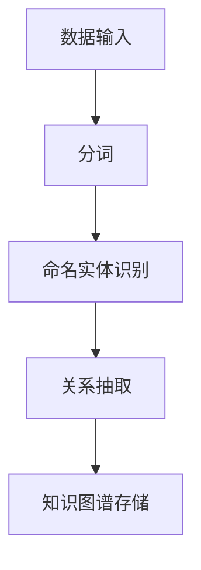
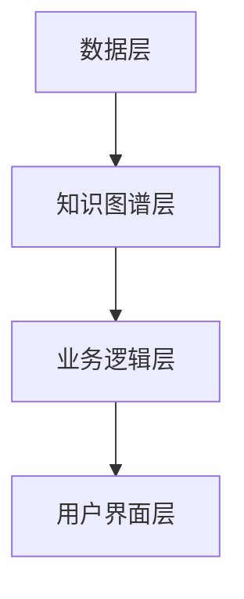
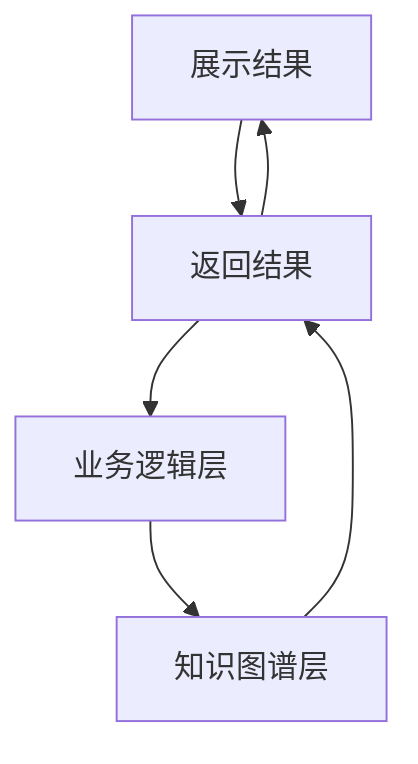

                 


# 构建基于知识图谱的金融产品比较系统

## 关键词：知识图谱，金融产品，比较系统，实体识别，关系抽取，系统架构

## 摘要：  
本文详细探讨了构建基于知识图谱的金融产品比较系统的全过程。从知识图谱的基本概念出发，分析了金融产品比较系统的需求与挑战。详细介绍了知识图谱的构建流程，包括数据采集、实体识别与关系抽取、知识融合与推理等关键步骤。接着，重点阐述了系统设计与架构，包括功能模块设计、系统架构设计、接口设计等。最后，通过项目实战，展示了如何将知识图谱技术应用于实际的金融产品比较系统中，并对系统进行了优化与扩展。本文旨在为读者提供一个全面的视角，帮助他们理解并掌握基于知识图谱的金融产品比较系统的构建方法。

---

# 第一部分: 知识图谱与金融产品比较系统概述

## 第1章: 知识图谱与金融产品比较系统概述

### 1.1 知识图谱的基本概念

#### 1.1.1 知识图谱的定义  
知识图谱是一种以图结构形式表示知识的技术，通过节点（实体）和边（关系）描述实体之间的关联关系。它能够将分散的、异构的数据整合起来，形成一个统一的知识网络。

#### 1.1.2 知识图谱的核心特征  
- **结构化**：通过节点和边的形式，将知识以结构化的形式表示。  
- **语义化**：每个节点和边都具有明确的语义含义，便于计算机理解和推理。  
- **动态性**：知识图谱可以动态更新，以反映实时数据的变化。  

#### 1.1.3 知识图谱在金融领域的应用  
知识图谱在金融领域的应用广泛，包括金融产品推荐、风险评估、市场分析等。本文重点关注金融产品比较系统中的应用。

### 1.2 金融产品比较系统的需求与挑战

#### 1.2.1 金融产品的多样性与复杂性  
金融产品种类繁多，包括基金、股票、债券、保险等，每类产品的特性、风险和收益各不相同，这使得比较系统的构建面临巨大挑战。

#### 1.2.2 传统金融产品比较的局限性  
传统比较方法通常基于单一指标或简单的规则，难以全面反映产品的优劣。此外，数据孤岛问题导致难以整合多源数据。

#### 1.2.3 知识图谱在金融产品比较中的优势  
知识图谱能够整合多源数据，构建产品之间的关联关系，帮助用户从多个维度全面比较产品，提供更智能的决策支持。

### 1.3 系统目标与功能概述

#### 1.3.1 系统目标  
构建一个基于知识图谱的金融产品比较系统，实现对多种金融产品的智能比较，提供个性化的推荐服务。

#### 1.3.2 系统主要功能模块  
- 数据采集模块：负责采集金融产品的基础数据和相关文本信息。  
- 知识图谱构建模块：对采集的数据进行实体识别、关系抽取和知识融合。  
- 产品比较模块：基于知识图谱，提供多维度的产品比较和推荐功能。  
- 用户界面模块：为用户提供友好的交互界面，展示比较结果。

#### 1.3.3 系统预期效果  
通过知识图谱技术，系统能够帮助用户快速理解产品特点，识别潜在风险，做出更明智的投资决策。

### 1.4 本章小结  
本章介绍了知识图谱的基本概念及其在金融领域的应用，分析了金融产品比较系统的需求与挑战，并提出了系统的总体目标和功能模块设计。

---

## 第2章: 知识图谱构建的基本原理

### 2.1 知识图谱构建的流程

#### 2.1.1 数据采集  
数据采集是知识图谱构建的第一步，需要从多种数据源获取金融产品的相关数据，包括文本、表格和数据库等。

#### 2.1.2 数据预处理  
数据预处理包括清洗、去重和标准化等步骤，确保数据的质量和一致性。

#### 2.1.3 实体识别与关系抽取  
实体识别是通过自然语言处理技术，从文本中提取出金融产品的名称、类型等实体信息。关系抽取则是识别实体之间的关联关系，例如“基金A的风险高于基金B”。

#### 2.1.4 知识融合与推理  
知识融合将来自不同数据源的实体和关系进行整合，消除冗余和冲突。知识推理则是通过逻辑推理，推导出新的知识。

#### 2.1.5 知识表示  
知识表示是将实体和关系以图结构的形式表示，通常使用RDF（资源描述框架）或图数据库（如Neo4j）进行存储。

### 2.2 实体识别与关系抽取的算法原理

#### 2.2.1 实体识别的常用算法  
- 基于规则的方法：通过正则表达式匹配特定的实体模式。  
- 基于统计的方法：利用机器学习模型（如CRF）进行序列标注。  
- 基于深度学习的方法：使用BERT等预训练模型进行实体识别。

#### 2.2.2 关系抽取的常用算法  
- 基于规则的方法：通过模板匹配句子中的关系。  
- 基于统计的方法：使用条件随机场（CRF）进行关系抽取。  
- 基于深度学习的方法：使用CNN、RNN等模型进行关系抽取。

#### 2.2.3 算法流程图  


### 2.3 知识融合与推理方法

#### 2.3.1 知识融合的基本原理  
知识融合包括实体对齐和关系合并。实体对齐是将不同数据源中的实体进行匹配，关系合并是将相同的关系进行整合。

#### 2.3.2 知识推理的常用方法  
- 基于规则的推理：通过预定义的规则进行推理。  
- 基于逻辑的推理：使用一阶逻辑进行推理。  
- 基于概率的推理：利用贝叶斯网络进行推理。

#### 2.3.3 知识图谱的可扩展性  
知识图谱的可扩展性是指能够动态添加新的实体和关系，适应不断变化的数据需求。

### 2.4 本章小结  
本章详细介绍了知识图谱构建的基本原理，包括数据采集、实体识别、关系抽取、知识融合与推理等关键步骤，并给出了算法流程图和相关方法的比较。

---

## 第3章: 金融产品知识图谱的构建流程

### 3.1 数据源的选择与整合

#### 3.1.1 金融产品数据的来源  
金融产品数据的来源包括金融网站、新闻媒体、政府公告等。  
- 例如，从证监会网站获取基金产品信息。

#### 3.1.2 数据清洗与预处理  
数据清洗包括去重、格式转换和缺失值处理。  
例如，将不同数据源中的基金产品信息统一到一个标准格式。

#### 3.1.3 数据整合的挑战与解决方案  
数据整合的挑战包括数据格式不一致、数据冲突等。解决方案包括数据标准化和数据融合算法（如基于图的融合方法）。

### 3.2 实体识别与关系抽取

#### 3.2.1 金融产品实体识别的难点  
金融产品实体识别的难点在于金融领域的专业术语较多，且文本数据可能存在歧义。  
例如，如何区分“基金”和“基金公司”。

#### 3.2.2 关系抽取在金融产品中的应用  
关系抽取可以帮助发现产品之间的关联关系，例如“基金A的投资范围包括科技股”。

#### 3.2.3 实体识别与关系抽取的案例分析  
通过案例分析，展示了如何从金融产品文本中提取实体和关系，并构建知识图谱。

### 3.3 知识图谱的构建与优化

#### 3.3.1 知识图谱构建的优化策略  
- 使用高效的图数据库（如Neo4j）进行存储和查询。  
- 采用分布式计算框架（如Spark）进行大规模数据处理。

#### 3.3.2 知识图谱的质量评估  
知识图谱的质量评估包括完整性、准确性、一致性和及时性等指标。  
例如，通过覆盖率和准确率评估知识图谱的质量。

#### 3.3.3 知识图谱的更新与维护  
知识图谱需要定期更新，以反映金融市场的最新动态。更新策略包括定期爬取新数据和实时更新。

### 3.4 本章小结  
本章详细介绍了金融产品知识图谱的构建流程，包括数据源的选择与整合、实体识别与关系抽取、知识图谱的构建与优化等关键步骤。

---

## 第4章: 基于知识图谱的金融产品比较系统设计与实现

### 4.1 系统功能模块设计

#### 4.1.1 数据采集模块  
数据采集模块负责从多种数据源获取金融产品的基础数据和相关文本信息。

#### 4.1.2 知识图谱构建模块  
知识图谱构建模块包括实体识别、关系抽取、知识融合与推理等功能。

#### 4.1.3 产品比较模块  
产品比较模块基于知识图谱，提供多维度的产品比较和推荐功能。  
例如，用户可以比较两只基金的风险、收益和费用等指标。

#### 4.1.4 用户界面模块  
用户界面模块为用户提供友好的交互界面，展示比较结果。  
例如，用户可以通过输入关键词或选择产品类别，快速找到感兴趣的产品。

### 4.2 系统架构设计

#### 4.2.1 分层架构设计  
系统架构采用分层设计，包括数据层、知识图谱层、业务逻辑层和用户界面层。  
- 数据层负责数据的存储和管理。  
- 知识图谱层负责知识图谱的构建和查询。  
- 业务逻辑层负责具体的业务逻辑实现。  
- 用户界面层负责与用户的交互。

#### 4.2.2 模块之间的交互关系  
通过模块化设计，模块之间通过接口进行交互。  
例如，产品比较模块调用知识图谱层的查询接口，获取产品之间的关联关系。

#### 4.2.3 系统架构图  


### 4.3 系统接口设计

#### 4.3.1 数据接口设计  
数据接口包括数据输入接口和数据输出接口。  
- 数据输入接口负责接收外部数据源的数据。  
- 数据输出接口负责将数据输出到其他模块。

#### 4.3.2 用户接口设计  
用户接口包括用户输入接口和用户输出接口。  
- 用户输入接口包括文本框、下拉框等。  
- 用户输出接口包括结果展示页面、图表等。

#### 4.3.3 接口交互流程  
通过接口交互流程图，展示了模块之间的交互流程。  


### 4.4 本章小结  
本章详细介绍了基于知识图谱的金融产品比较系统的整体架构设计，包括功能模块设计、系统架构设计和接口设计等内容。

---

## 第五部分: 项目实战

### 第5章: 项目实战

#### 5.1 环境安装与配置  
- 安装Python编程语言。  
- 安装必要的库，如requests、beautifulsoup4、spacy、neo4j等。  
- 安装图数据库Neo4j，并配置好相关接口。

#### 5.2 核心实现代码

##### 5.2.1 数据采集模块  
```python
import requests
from bs4 import BeautifulSoup

def fetch_data(url):
    response = requests.get(url)
    soup = BeautifulSoup(response.text, 'html.parser')
    data = []
    for item in soup.find_all('div', class_='product-item'):
        product_name = item.find('h2').text
        product_info = item.find('p').text
        data.append({'name': product_name, 'info': product_info})
    return data
```

##### 5.2.2 实体识别与关系抽取  
```python
import spacy

nlp = spacy.load('en_core_web_sm')

def extract_entities(text):
    doc = nlp(text)
    entities = []
    for ent in doc.ents:
        entities.append({'text': ent.text, 'label': ent.label_})
    return entities
```

##### 5.2.3 知识图谱构建与查询  
```python
from neo4j import GraphDatabase

driver = GraphDatabase.driver('bolt://localhost:7687', auth=('neo4j', 'password'))

def create_graph():
    with driver.session() as session:
        session.run("CREATE (a:Product {name: '基金A'})")
        session.run("CREATE (b:Product {name: '基金B'})")
        session.run("MATCH (a:Product {name: '基金A'}), (b:Product {name: '基金B'}) CREATE (a)-[r:RELATED_TO {relation: '收益更高'}]->(b)")
```

##### 5.2.4 产品比较模块  
```python
def compare_products(product1, product2):
    # 获取产品关系
    query = f"MATCH (a:Product {{name: '{product1}'}})-[r:RELATED_TO]->(b:Product {{name: '{product2}'}}) RETURN r.relation"
    with driver.session() as session:
        result = session.run(query)
        return result.single().get('relation') if result else '无直接关系'
```

#### 5.3 项目实战小结  
通过项目实战，我们详细展示了如何将知识图谱技术应用于金融产品比较系统中，包括数据采集、实体识别、知识图谱构建和产品比较等核心功能的实现。

---

## 第六部分: 优化与扩展

### 第6章: 系统优化与扩展

#### 6.1 系统优化策略  
- 数据处理效率优化：通过分布式计算和并行处理提高数据处理速度。  
- 知识图谱存储优化：采用高效的图数据库和索引技术，提升查询效率。

#### 6.2 功能扩展  
- 支持多语言：扩展系统支持多种语言的金融产品数据处理。  
- 支持实时更新：增加实时数据源，提升知识图谱的时效性。  
- 支持用户自定义比较：允许用户自定义比较维度，提高系统的灵活性。

#### 6.3 注意事项  
- 数据隐私与安全：在处理金融数据时，需注意数据隐私保护，遵守相关法律法规。  
- 系统性能监控：通过日志和监控工具，实时监控系统性能，及时发现并解决问题。

### 6.4 本章小结  
本章提出了系统优化策略和功能扩展方向，并强调了数据隐私和系统性能监控的重要性。

---

## 第七部分: 结论

### 7.1 全文总结  
本文详细探讨了构建基于知识图谱的金融产品比较系统的全过程，包括知识图谱的基本概念、构建流程、系统设计与实现、项目实战以及系统优化与扩展。

### 7.2 未来研究方向  
未来的研究方向包括：  
- 更高效的知识图谱构建算法。  
- 更智能的产品比较方法，如基于机器学习的推荐系统。  
- 知识图谱的可视化技术，提升用户体验。

### 7.3 致谢  
感谢所有参与本项目研究的团队成员和提供数据支持的机构。

---

## 作者：AI天才研究院/AI Genius Institute & 禅与计算机程序设计艺术 /Zen And The Art of Computer Programming

---

以上是基于知识图谱的金融产品比较系统的技术博客文章的完整目录大纲和内容框架。

