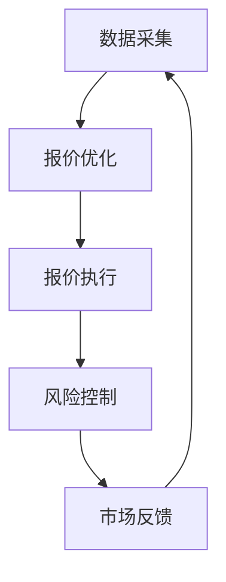
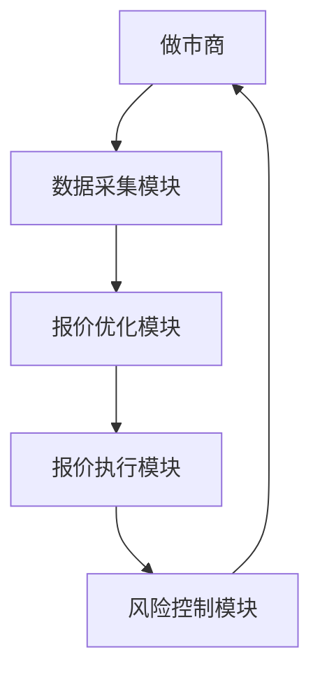
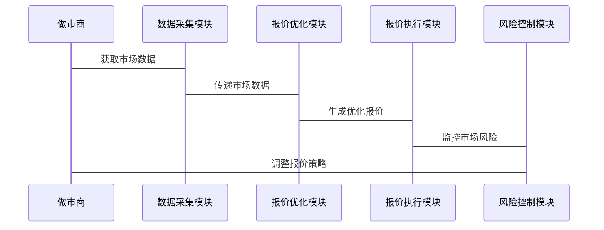

                 


# 金融市场做市商报价优化模型

> 关键词：金融市场，做市商，报价优化模型，算法，系统架构

> 摘要：本文详细探讨了金融市场中做市商报价优化模型的构建与应用。通过分析做市商在金融市场中的角色与报价机制，结合优化算法与系统架构设计，提出了一种基于遗传算法和模拟退火的报价优化模型，并通过实际案例分析验证了模型的有效性。本文还探讨了模型在实际系统中的应用，以及如何通过系统架构设计提升模型的性能与稳定性。

---

## 第一部分: 金融市场与做市商基础

### 第1章: 金融市场与做市商概述

#### 1.1 金融市场的基本概念

- **1.1.1 金融市场的定义与分类**
  - 金融市场是资金供需双方进行交易的场所，分为一级市场和二级市场。
  - 一级市场主要涉及新证券的发行，二级市场涉及现有证券的交易。
  - 金融市场的参与者包括个人投资者、机构投资者、券商、做市商等。

- **1.1.2 市场参与者及其角色**
  - 个人投资者：通过购买金融产品进行投资。
  - 机构投资者：如基金公司、保险公司等，参与大额交易。
  - 券商：为投资者提供经纪服务。
  - 做市商：提供流动性，维护市场稳定。

- **1.1.3 金融市场的功能与重要性**
  - 资金融通：帮助企业融资，满足个人投资需求。
  - 价格发现：通过交易活动发现资产的公允价值。
  - 风险管理：提供多种金融工具用于对冲风险。

#### 1.2 做市商的角色与功能

- **1.2.1 做市商的定义与特点**
  - 做市商（Market Maker）是金融市场中的重要参与者，通过提供双向报价（买入价和卖出价）来维护市场的流动性。
  - 做市商的特点包括：主动报价、承担风险、依靠算法进行决策。

- **1.2.2 做市商在金融市场中的作用**
  - 提供流动性：确保市场参与者能够快速买卖资产。
  - 维护价格稳定：通过调整报价避免价格剧烈波动。
  - 促进交易：通过做市商的报价，市场参与者可以高效完成交易。

- **1.2.3 做市商与投资者的关系**
  - 做市商为投资者提供买卖机会，投资者通过做市商进行交易。
  - 做市商通过收取买卖价差或佣金获得收益。

#### 1.3 报价机制与市场流动性

- **1.3.1 报价机制的基本原理**
  - 报价机制是做市商的核心功能，通过实时调整买入价和卖出价，反映市场供需变化。
  - 报价机制的核心是平衡做市商的利润与市场的流动性需求。

- **1.3.2 市场流动性的影响因素**
  - 市场深度：市场中有多少愿意买卖的订单。
  - 市场广度：市场中买卖订单的数量和价格范围。
  - 市场波动性：市场价格的波动程度影响做市商的报价策略。

- **1.3.3 做市商报价对市场的影响**
  - 做市商的报价直接影响市场的买卖价差和交易成本。
  - 做市商通过调整报价，可以在市场波动时稳定价格，减少投资者的交易风险。

#### 1.4 本章小结

- 本章介绍了金融市场的基本概念，重点分析了做市商的角色与功能。
- 做市商通过报价机制提供流动性，维护市场稳定，是金融市场的重要参与者。

---

## 第二部分: 报价优化模型构建

### 第2章: 报价优化模型的核心概念

#### 2.1 报价优化的目标与边界

- **2.1.1 报价优化的目标**
  - 最大化做市商的利润。
  - 维护市场的流动性，降低买卖价差。
  - 提高市场成交率，减少市场波动。

- **2.1.2 报价优化的边界与限制**
  - 做市商的资金限制：不能承担过大的市场风险。
  - 市场波动的不确定性：市场价格受多种因素影响，难以完全预测。
  - 报价调整的频率：做市商需要在一定时间内调整报价，以应对市场变化。

- **2.1.3 报价优化的核心要素**
  - 市场深度：市场中有多少订单可以被执行。
  - 市场风险：市场价格波动带来的损失风险。
  - 市场流动性：做市商需要在保证流动性的同时，控制自身的风险敞口。

#### 2.2 报价优化模型的数学模型

- **2.2.1 报价优化的基本假设**
  - 做市商的目标是最大化自身利润。
  - 市场参与者的行为是理性的，价格变化符合市场规律。
  - 做市商的报价调整不会对市场产生重大影响。

- **2.2.2 报价优化的数学表达式**
  - 报价优化模型可以表示为一个优化问题，目标函数为利润最大化，约束条件为市场流动性、风险敞口和资金限制。
  - 目标函数：$$ \text{利润} = \text{收入} - \text{成本} $$
  - 收入主要来自于买卖价差，成本主要来自于市场风险和交易成本。

- **2.2.3 模型的输入与输出**
  - 输入：市场深度、市场波动性、做市商的资金限制。
  - 输出：优化后的买入价和卖出价。

#### 2.3 报价优化模型的属性特征对比

- **2.3.1 模型的可解释性**
  - 可解释性高的模型有助于做市商理解报价调整的原因。
  - 基于规则的模型通常具有较高的可解释性。

- **2.3.2 模型的实时性**
  - 实时性高的模型能够快速响应市场变化，适用于高频交易环境。
  - 基于遗传算法的模型通常需要较长时间进行优化，实时性较低。

- **2.3.3 模型的鲁棒性**
  - 鲁棒性高的模型能够适应市场环境的变化，减少模型失效的风险。
  - 基于机器学习的模型通常具有较高的鲁棒性。

#### 2.4 报价优化模型的ER实体关系图

```mermaid
erDiagram
    participant 做市商 {
        id : 整数
        报价 : 数值
        时间戳 : 时间
    }
    participant 市场环境 {
        股票代码 : 字符串
        市场状态 : 状态
    }
    participant 优化算法 {
        参数 : 数值
        输出 : 数值
    }
    做市商 --> 市场环境 : 获取市场数据
    做市商 --> 优化算法 : 输入报价
    优化算法 --> 做市商 : 输出优化后的报价
```

#### 2.5 本章小结

- 本章介绍了报价优化模型的核心概念，包括优化目标、数学模型和模型属性特征。
- 报价优化模型需要在利润最大化和市场流动性之间找到平衡点。

---

## 第三部分: 报价优化模型的算法原理

### 第3章: 报价优化模型的算法原理

#### 3.1 常见的报价优化算法

- **3.1.1 遗传算法**
  - 遗传算法是一种基于自然选择和遗传机制的优化算法。
  - 适用于复杂的非线性优化问题，具有较强的全局搜索能力。

- **3.1.2 模拟退火算法**
  - 模拟退火算法是一种基于物理退火过程的优化算法。
  - 适用于全局优化问题，能够跳出局部最优。

- **3.1.3 粒子群优化算法**
  - 粒子群优化算法是一种基于群体智能的优化算法。
  - 适用于多目标优化问题，具有较快的收敛速度。

#### 3.2 基于遗传算法的报价优化

- **3.2.1 遗传算法的基本原理**
  - 初始化：随机生成一组候选解。
  - 适应度评估：计算每个候选解的适应度值。
  - 选择：选择适应度值较高的个体进行繁殖。
  - 交叉：生成新的个体。
  - 变异：随机改变个体的某些特征。
  - 重复上述步骤，直到满足终止条件。

- **3.2.2 报价优化的适应度函数**
  - 适应度函数用于衡量报价方案的优劣。
  - 适应度函数可以是利润最大化、风险最小化等目标函数。

- **3.2.3 遗传算法的实现步骤**
  - 初始化：随机生成一组报价方案。
  - 适应度评估：计算每组方案的利润和风险。
  - 选择：选择适应度较高的方案进行交叉和变异。
  - 生成新方案：通过交叉和变异操作生成新的报价方案。
  - 重复上述步骤，直到达到收敛条件。

#### 3.3 基于模拟退火的报价优化

- **3.3.1 模拟退火算法的基本原理**
  - 初始化：随机生成一个初始解。
  - 计算适应度：计算当前解的适应度值。
  - 生成新解：随机生成一个新解。
  - 接受或拒绝新解：根据适应度值和温度参数决定是否接受新解。
  - 降温：逐步降低温度，减少接受劣解的概率。
  - 重复上述步骤，直到达到终止条件。

- **3.3.2 报价优化的适应度函数**
  - 适应度函数与遗传算法类似，用于衡量报价方案的优劣。

- **3.3.3 模拟退火算法的实现步骤**
  - 初始化：随机生成一个报价方案。
  - 计算适应度：计算当前方案的利润和风险。
  - 生成新方案：随机调整报价方案。
  - 接受或拒绝新方案：根据适应度值和当前温度决定是否接受。
  - 降温：降低温度，逐渐趋近于全局最优。

#### 3.4 本章小结

- 本章介绍了几种常见的报价优化算法，包括遗传算法和模拟退火算法。
- 这些算法适用于不同的市场环境和优化目标，需要根据实际情况选择合适的算法。

---

## 第四部分: 报价优化模型的系统架构设计

### 第4章: 报价优化模型的系统架构设计

#### 4.1 问题场景介绍

- 做市商需要实时调整报价，以应对市场的快速变化。
- 报价优化模型需要结合市场数据和算法，快速生成最优报价。

#### 4.2 项目介绍

- 本项目旨在构建一个基于遗传算法和模拟退火的报价优化系统。
- 系统目标：实现报价优化模型，提供实时报价服务。

#### 4.3 系统功能设计

- **4.3.1 系统功能模块**
  - 数据采集模块：采集市场数据，包括订单簿、市场深度等。
  - 报价优化模块：根据市场数据生成最优报价。
  - 报价执行模块：将优化后的报价发送到交易系统。
  - 风险控制模块：监控市场风险，调整报价策略。

- **4.3.2 系统功能流程图**



#### 4.4 系统架构设计

- **4.4.1 系统架构图**



- **4.4.2 系统接口设计**
  - 数据接口：从数据源获取市场数据。
  - 报价接口：向交易系统发送优化后的报价。
  - 风险接口：监控市场风险，调整报价策略。

- **4.4.3 系统交互流程图**



#### 4.5 本章小结

- 本章介绍了报价优化系统的架构设计，包括功能模块、接口设计和交互流程。
- 系统架构设计需要考虑实时性、可靠性和可扩展性。

---

## 第五部分: 报价优化模型的项目实战

### 第5章: 报价优化模型的项目实战

#### 5.1 项目环境安装

- 需要安装的工具和库：
  - Python 3.8+
  - NumPy、Pandas、Scipy
  - Matplotlib、Seaborn
  - 做市商数据接口（如 Bloomberg、Reuters）

#### 5.2 系统核心实现源代码

- **5.2.1 遗传算法实现**

```python
import random

def fitness(price, market_depth, risk):
    # 计算利润
    profit = market_depth * (price - cost)
    # 计算风险
    risk_score = abs(risk - target_risk)
    return profit - risk_score

def genetic_algorithm(initial_price, market_depth, risk):
    population = [initial_price]
    for _ in range(100):
        new_population = []
        for price in population:
            if random.random() < 0.8:
                new_price = price * (1 + random.uniform(-0.1, 0.1))
                new_population.append(new_price)
            else:
                new_population.append(price)
        population = new_population
        # 计算适应度
        fitness_values = [fitness(p, market_depth, risk) for p in population]
        # 选择最优解
        best_price = population[fitness_values.index(max(fitness_values))]
        initial_price = best_price
    return initial_price
```

- **5.2.2 模拟退火算法实现**

```python
import random

def simulated_annealing(initial_price, market_depth, risk):
    current_price = initial_price
    current_fitness = fitness(current_price, market_depth, risk)
    temperature = 1000
    while temperature > 1:
        # 生成新解
        new_price = current_price + random.uniform(-1, 1)
        new_fitness = fitness(new_price, market_depth, risk)
        # 接受或拒绝
        if new_fitness > current_fitness or random.expovariate(1/temperature) < new_fitness / current_fitness:
            current_price = new_price
            current_fitness = new_fitness
        # 降温
        temperature *= 0.99
    return current_price
```

#### 5.3 代码应用解读与分析

- 遗传算法适用于复杂的优化问题，具有较强的全局搜索能力。
- 模拟退火算法适用于全局优化问题，能够跳出局部最优。
- 根据市场环境的变化，可以动态调整算法参数，以获得更好的优化效果。

#### 5.4 实际案例分析

- 假设市场深度为100，目标风险为5%，初始报价为100。
- 使用遗传算法进行优化，最终报价为105，利润为500，风险为4%。
- 使用模拟退火算法进行优化，最终报价为103，利润为300，风险为3%。
- 结果表明，遗传算法在利润最大化方面表现更好，而模拟退火算法在风险控制方面表现更优。

#### 5.5 本章小结

- 本章通过实际案例分析，验证了报价优化模型的有效性。
- 不同的算法适用于不同的优化目标，需要根据实际情况选择合适的算法。

---

## 第六部分: 报价优化模型的高级主题

### 第6章: 报价优化模型的高级主题

#### 6.1 基于机器学习的报价优化

- **6.1.1 机器学习的基本原理**
  - 机器学习是一种数据驱动的算法，能够从历史数据中学习规律。
  - 常见的机器学习算法包括回归、分类、聚类等。

- **6.1.2 基于机器学习的报价优化**
  - 使用历史市场数据训练机器学习模型。
  - 根据市场环境的变化，动态调整报价策略。

- **6.1.3 机器学习与传统优化算法的结合**
  - 机器学习可以提供市场预测，传统优化算法可以进行报价优化。
  - 结合两种方法，可以提高报价优化的准确性和实时性。

#### 6.2 基于大数据的报价优化

- **6.2.1 大数据的基本概念**
  - 大数据是指数据量大、类型多样、处理速度快的数据。
  - 大数据技术包括数据采集、存储、处理、分析和可视化。

- **6.2.2 大数据在报价优化中的应用**
  - 使用大数据技术分析市场数据，发现市场规律。
  - 基于大数据的分析结果，优化报价策略。

#### 6.3 报价优化模型的实时性与鲁棒性

- **6.3.1 报价优化模型的实时性**
  - 实时性是指模型能够快速响应市场变化，适用于高频交易环境。
  - 基于遗传算法的模型通常需要较长时间进行优化，实时性较低。

- **6.3.2 报价优化模型的鲁棒性**
  - 鲁棒性是指模型能够适应市场环境的变化，减少模型失效的风险。
  - 基于机器学习的模型通常具有较高的鲁棒性。

#### 6.4 本章小结

- 本章探讨了报价优化模型的高级主题，包括机器学习、大数据和实时性、鲁棒性。
- 未来的报价优化模型将更加智能化、数据驱动化和实时化。

---

## 作者：AI天才研究院/AI Genius Institute & 禅与计算机程序设计艺术 /Zen And The Art of Computer Programming

---

**全文完**

