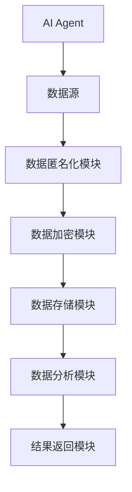

                 


# AI Agent的隐私保护：数据匿名化与加密

> 关键词：AI Agent, 数据隐私保护, 数据匿名化, 数据加密, 同态加密, 多方计算, 隐私保护

> 摘要：本文系统地探讨了AI Agent在数据隐私保护中的关键技术和方法，重点分析了数据匿名化与加密技术在AI Agent中的应用，通过理论与实践相结合的方式，详细阐述了数据隐私保护的核心原理、实现方法及实际应用案例。本文适合AI开发人员、数据隐私保护研究人员及相关领域的从业者阅读。

---

# 第一部分: AI Agent的隐私保护概述

# 第1章: AI Agent与隐私保护概述

## 1.1 AI Agent的基本概念

### 1.1.1 AI Agent的定义与特点

AI Agent（人工智能代理）是一种能够感知环境并采取行动以实现目标的智能实体。AI Agent可以是软件程序、机器人或其他智能系统，其核心特征包括：

- **自主性**：能够自主决策和行动。
- **反应性**：能够感知环境并实时响应。
- **目标导向性**：所有行动均以实现特定目标为导向。
- **社交能力**：能够与其他系统或人类进行交互。

### 1.1.2 AI Agent的分类与应用场景

AI Agent可以根据功能和应用场景分为以下几类：

1. **简单反射型AI Agent**：基于预设规则对外界刺激做出反应，例如自动回复机器人。
2. **基于模型的反应型AI Agent**：利用内部模型分析环境并做出决策，例如自动驾驶系统。
3. **目标驱动型AI Agent**：以特定目标为导向，主动规划和执行任务，例如智能助手。
4. **实用驱动型AI Agent**：通过优化目标函数实现最优决策，例如推荐系统。

### 1.1.3 AI Agent与隐私保护的关系

AI Agent在处理数据时，需要与环境和其他系统进行交互，这使得数据隐私保护成为其设计中的重要组成部分。AI Agent可能收集、处理和存储大量敏感数据，例如用户行为数据、个人身份信息等。因此，如何在AI Agent的设计和实现中保护这些数据的隐私，是确保系统安全性和用户信任的关键。

---

## 1.2 隐私保护的重要性

### 1.2.1 数据隐私的定义与范围

数据隐私是指对个人或组织数据的访问权和使用权限的控制。数据隐私保护的目标是确保数据在收集、存储、处理和共享等过程中的安全性，防止未经授权的访问和泄露。

### 1.2.2 隐私泄露的潜在风险

隐私泄露可能导致以下风险：

- **身份盗窃**：攻击者利用泄露的个人信息进行身份盗窃。
- **金融损失**：通过伪造交易或诈骗活动造成经济损失。
- **声誉损害**：个人或企业的隐私泄露可能导致公众信任的丧失。
- **法律风险**：隐私泄露可能违反相关法律法规，导致企业面临罚款和法律责任。

### 1.2.3 隐私保护的法律与伦理要求

随着数据隐私的重要性日益凸显，全球范围内出台了多项法律法规，例如欧盟的《通用数据保护条例》（GDPR）和美国的《加州消费者隐私法案》（CCPA）。这些法规要求企业在处理个人数据时，必须采取技术手段确保数据的安全性和隐私性。

---

## 1.3 数据匿名化与加密的基本原理

### 1.3.1 数据匿名化的定义

数据匿名化是指通过技术手段将数据中的个人身份信息或其他敏感信息进行处理，使得数据在不被恢复的情况下，仍能保持数据的可用性和分析价值。

### 1.3.2 数据匿名化的分类

数据匿名化技术可以分为以下几类：

1. **数据扰动**：通过对数据进行加噪声、随机化等操作，使得原始数据无法被直接识别。
2. **数据置换**：通过重新排列数据或替换数据值，使得数据无法被关联到具体个体。
3. **数据摘要**：通过哈希函数等技术生成数据的摘要，使得数据无法被逆向还原。

### 1.3.3 数据加密的基本原理

数据加密是通过数学算法将原始数据转化为不可读的密文，只有通过合法的密钥才能将密文解密为明文。加密技术可以分为对称加密和非对称加密两种类型。

---

## 1.4 本章小结

本章介绍了AI Agent的基本概念、分类及其在隐私保护中的重要性。同时，阐述了数据匿名化与加密技术的基本原理，为后续章节的深入探讨奠定了基础。

---

# 第二部分: 数据匿名化技术

# 第2章: 数据匿名化技术概述

## 2.1 数据匿名化的定义与分类

### 2.1.1 数据匿名化的定义

数据匿名化是指通过技术手段将数据中的个人身份信息或其他敏感信息进行处理，使得数据在不被恢复的情况下，仍能保持数据的可用性和分析价值。

### 2.1.2 数据匿名化的分类

数据匿名化技术可以分为以下几类：

1. **数据扰动**：通过对数据进行加噪声、随机化等操作，使得原始数据无法被直接识别。
2. **数据置换**：通过重新排列数据或替换数据值，使得数据无法被关联到具体个体。
3. **数据摘要**：通过哈希函数等技术生成数据的摘要，使得数据无法被逆向还原。

---

## 2.2 数据匿名化的实现方法

### 2.2.1 数据扰动技术

数据扰动技术通过向数据中添加噪声或随机扰动，使得原始数据无法被直接识别。例如，对年龄数据进行随机加减1岁，可以有效保护个体的年龄隐私。

### 2.2.2 数据置换技术

数据置换技术通过重新排列数据或替换数据值，使得数据无法被关联到具体个体。例如，通过置换列的顺序或替换值，使得数据无法被直接关联到具体个体。

### 2.2.3 数据摘要技术

数据摘要技术通过哈希函数等技术生成数据的摘要，使得数据无法被逆向还原。例如，使用SHA-256算法对数据进行哈希，生成固定长度的摘要。

---

## 2.3 数据匿名化中的挑战与解决方案

### 2.3.1 数据匿名化的挑战

数据匿名化面临的主要挑战包括：

- **数据可用性**：匿名化处理可能导致数据的分析价值降低。
- **数据关联性**：匿名化处理可能无法完全消除数据之间的关联性。
- **攻击者能力**：随着技术的发展，攻击者可能通过侧信道攻击或其他手段恢复原始数据。

### 2.3.2 数据匿名化的解决方案

为应对上述挑战，可以采取以下措施：

- **组合匿名化技术**：结合多种匿名化技术，提高数据的匿名化程度。
- **动态匿名化**：根据数据使用场景动态调整匿名化策略。
- **法律合规**：确保数据处理符合相关法律法规要求。

---

## 2.4 本章小结

本章详细介绍了数据匿名化的定义、分类及实现方法，并分析了匿名化技术面临的挑战与解决方案，为后续章节的应用提供了理论基础。

---

# 第三部分: 数据加密技术

# 第3章: 数据加密技术概述

## 3.1 数据加密的基本原理

### 3.1.1 加密算法的基本概念

加密算法通过数学变换将明文转换为密文，密文需要通过合法的密钥才能恢复为明文。加密算法的核心是密钥和加密函数。

### 3.1.2 加密算法的分类

加密算法主要分为以下两类：

1. **对称加密**：使用相同的密钥进行加密和解密，例如AES算法。
2. **非对称加密**：使用公钥和私钥进行加密和解密，例如RSA算法。

### 3.1.3 加密算法的安全性评估

加密算法的安全性主要取决于密钥长度和算法复杂度。常见的安全性评估指标包括破译时间、计算复杂度等。

---

## 3.2 对称加密与非对称加密

### 3.2.1 对称加密算法

对称加密算法使用相同的密钥进行加密和解密，具有加密速度快、计算资源消耗低的特点。常见的对称加密算法包括AES、DES等。

### 3.2.2 非对称加密算法

非对称加密算法使用公钥和私钥进行加密和解密，公钥用于加密，私钥用于解密。非对称加密算法的安全性较高，但计算资源消耗较大。常见的非对称加密算法包括RSA、椭圆曲线加密等。

### 3.2.3 加密算法的优缺点对比

| 特性         | 对称加密          | 非对称加密          |
|--------------|-------------------|---------------------|
| 密钥管理     | 需要保护密钥      | 需要保护私钥        |
| 加密速度     | 快                | 较慢                |
| 适用场景     | 适合大量数据加密  | 适合数字签名、认证  |

---

## 3.3 同态加密与多方计算

### 3.3.1 同态加密的定义与特点

同态加密是一种特殊的加密技术，允许在密文上进行计算，而无需解密。同态加密可以支持加法、乘法等基本运算，使得数据在加密状态下仍能进行分析和计算。

### 3.3.2 多方计算的基本原理

多方计算是一种加密协议，允许多个参与方在不泄露各自数据的情况下，共同计算一个结果。多方计算的核心思想是通过秘密共享和加密技术，确保数据的安全性。

### 3.3.3 同态加密与多方计算的应用场景

同态加密适用于需要在加密数据上进行计算的场景，例如隐私计算、医疗数据分析等。多方计算适用于需要多个参与方共同计算的场景，例如金融交易、联合数据分析等。

---

## 3.4 本章小结

本章详细介绍了数据加密的基本原理、对称加密与非对称加密的区别与联系，并探讨了同态加密与多方计算的应用场景，为后续章节的实现提供了理论支持。

---

# 第四部分: AI Agent中的数据隐私保护

# 第4章: AI Agent中的数据隐私保护需求

## 4.1 AI Agent中的数据类型

### 4.1.1 结构化数据

结构化数据是指具有固定格式的数据，例如数据库中的记录、表格数据等。结构化数据通常需要较高的隐私保护，因为其包含敏感信息。

### 4.1.2 非结构化数据

非结构化数据是指没有固定格式的数据，例如文本、图像、音频等。非结构化数据的隐私保护通常较为复杂，因为其内容难以直接处理。

### 4.1.3 图数据

图数据是指通过图结构表示的数据，例如社交网络中的用户关系图。图数据的隐私保护需要考虑节点之间的关联性。

---

## 4.2 AI Agent中的隐私保护需求

### 4.2.1 数据收集阶段

在数据收集阶段，AI Agent需要确保收集的数据经过匿名化处理，避免泄露个人身份信息。

### 4.2.2 数据存储阶段

在数据存储阶段，AI Agent需要对敏感数据进行加密存储，确保数据在存储过程中不被 unauthorized访问。

### 4.2.3 数据处理阶段

在数据处理阶段，AI Agent需要通过同态加密等技术，在不泄露原始数据的情况下进行数据分析和计算。

---

## 4.3 数据匿名化与加密技术在AI Agent中的应用

### 4.3.1 数据匿名化技术的应用

在AI Agent中，数据匿名化技术可以用于保护用户数据的隐私，例如在推荐系统中匿名化处理用户行为数据。

### 4.3.2 数据加密技术的应用

在AI Agent中，数据加密技术可以用于保护敏感数据的安全，例如在医疗AI Agent中加密处理患者的医疗数据。

---

## 4.4 本章小结

本章分析了AI Agent中的数据类型及其隐私保护需求，并探讨了数据匿名化与加密技术在AI Agent中的具体应用，为后续章节的实现提供了理论基础。

---

# 第五部分: 系统架构设计

# 第5章: AI Agent隐私保护系统的架构设计

## 5.1 系统设计原则

### 5.1.1 可扩展性

系统设计需要考虑未来的扩展性，确保能够适应数据量和用户需求的增长。

### 5.1.2 安全性

系统设计需要确保数据的安全性，防止未经授权的访问和泄露。

### 5.1.3 系统交互性

系统设计需要考虑与外部系统的交互，确保数据在传输过程中的安全性。

---

## 5.2 系统架构图



---

## 5.3 系统接口设计

系统接口设计需要考虑以下几个方面：

1. **数据匿名化接口**：提供数据匿名化处理的功能，支持多种数据格式和匿名化技术。
2. **数据加密接口**：提供数据加密和解密的功能，支持多种加密算法。
3. **数据存储接口**：提供数据存储和检索的功能，支持加密存储和匿名化存储。

---

## 5.4 系统交互设计

系统交互设计需要考虑以下几个方面：

1. **用户交互**：用户可以通过图形界面或API与系统进行交互。
2. **数据流**：数据从数据源经过匿名化和加密处理后，存储在数据库中，并通过数据分析模块进行处理，最后返回结果。

---

## 5.5 本章小结

本章详细介绍了AI Agent隐私保护系统的架构设计，包括系统设计原则、架构图、接口设计和交互设计，为后续章节的实现提供了理论支持。

---

# 第六部分: 项目实战

# 第6章: AI Agent隐私保护项目实战

## 6.1 项目背景

随着AI技术的快速发展，数据隐私保护已成为AI Agent设计中的重要组成部分。本项目旨在通过实现一个AI Agent隐私保护系统，展示数据匿名化与加密技术在实际应用中的具体实现。

---

## 6.2 项目环境搭建

### 6.2.1 开发工具安装

需要安装以下开发工具：

1. **Python**：用于编写代码。
2. **Scikit-learn**：用于数据处理和机器学习。
3. **Cryptography**：用于数据加密。

### 6.2.2 项目代码结构

项目代码结构如下：

```
project/
├── data/
│   └── input.csv
├── src/
│   ├── anonymization.py
│   ├── encryption.py
│   └── main.py
└── output/
    └── result.csv
```

---

## 6.3 项目核心代码实现

### 6.3.1 数据匿名化实现

```python
import pandas as pd
import numpy as np

def data_anonymization(dataframe, columns_to_anonymize):
    for col in columns_to_anonymize:
        dataframe[col] = dataframe[col].apply(lambda x: x + np.random.randint(-5, 5))
    return dataframe
```

### 6.3.2 数据加密实现

```python
from cryptography.fernet import Fernet

def generate_key():
    key = Fernet.generate_key()
    return key

def encrypt_data(data, key):
    cipher = Fernet(key)
    encrypted_data = cipher.encrypt(data.encode())
    return encrypted_data

def decrypt_data(encrypted_data, key):
    cipher = Fernet(key)
    decrypted_data = cipher.decrypt(encrypted_data).decode()
    return decrypted_data
```

---

## 6.4 项目案例分析与解读

### 6.4.1 案例分析

假设我们有一个用户行为数据集，包含用户的年龄、性别和地理位置信息。我们需要对这些数据进行匿名化处理，以保护用户的隐私。

### 6.4.2 代码实现

```python
# 生成密钥
key = generate_key()
print("密钥:", key)

# 加密数据
data = "年龄: 25, 性别: 男, 地理位置: 北京"
encrypted_data = encrypt_data(data, key)
print("加密数据:", encrypted_data)

# 解密数据
decrypted_data = decrypt_data(encrypted_data, key)
print("解密数据:", decrypted_data)
```

---

## 6.5 项目小结

本章通过一个具体的AI Agent隐私保护项目，展示了数据匿名化与加密技术的实现过程，包括项目背景、环境搭建、代码实现和案例分析。通过本章的学习，读者可以掌握数据匿名化与加密技术的实际应用。

---

# 第七部分: 总结与展望

# 第7章: 总结与展望

## 7.1 本章总结

本文系统地探讨了AI Agent在数据隐私保护中的关键技术和方法，重点分析了数据匿名化与加密技术在AI Agent中的应用。通过理论与实践相结合的方式，详细阐述了数据隐私保护的核心原理、实现方法及实际应用案例。

## 7.2 未来展望

随着AI技术的快速发展，数据隐私保护将成为AI Agent设计中的重要组成部分。未来的研究方向包括：

1. **新型匿名化技术**：研究更高效、更安全的匿名化技术。
2. **智能加密算法**：开发适用于AI Agent的智能加密算法。
3. **隐私保护框架**：构建统一的隐私保护框架，支持多种数据类型和应用场景。

---

# 作者

作者：AI天才研究院/AI Genius Institute & 禅与计算机程序设计艺术/Zen And The Art of Computer Programming

--- 

以上是《AI Agent的隐私保护：数据匿名化与加密》的技术博客文章的完整目录结构和内容。

