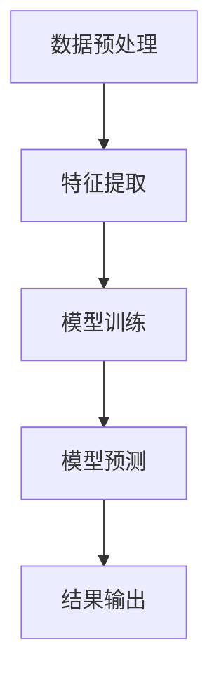
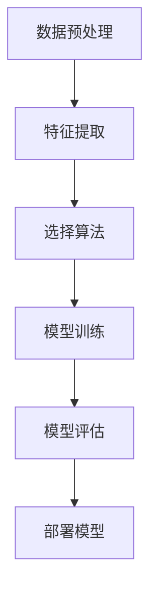
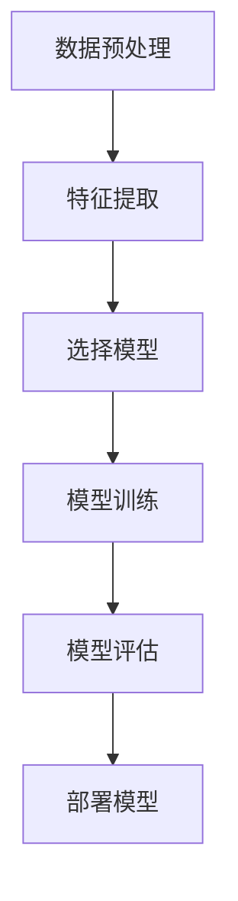
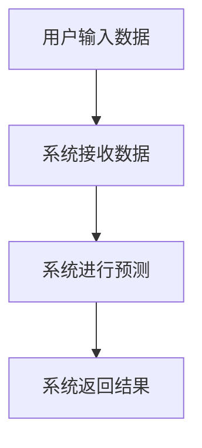
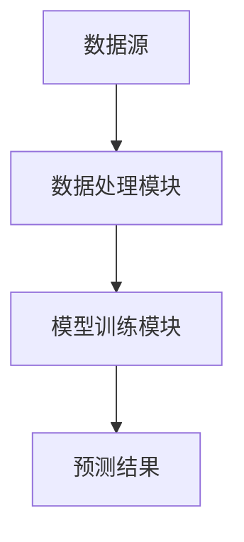

                 


# AI在保险产品需求预测中的创新应用

> 关键词：AI技术，保险产品，需求预测，机器学习，深度学习

> 摘要：本文探讨了AI技术在保险产品需求预测中的创新应用。通过分析保险行业的现状与挑战，介绍了AI技术的基本概念与优势，深入讲解了保险需求预测的核心概念、算法原理、系统架构与设计，以及项目实战案例。文章结合理论与实践，展示了AI技术在保险产品需求预测中的巨大潜力和实际应用价值。

---

## 第一章: 保险行业的现状与挑战

### 1.1 保险行业的现状分析

#### 1.1.1 保险行业的定义与分类
保险行业是通过分散风险来提供经济保障的行业，主要包括人寿保险、财产保险、健康保险、责任保险等类型。随着社会的发展，保险需求日益多样化，保险产品的复杂性和个性化要求不断提高。

#### 1.1.2 当前保险行业的痛点与挑战
保险行业面临以下主要痛点：
- 数据不足：传统保险产品需求预测依赖经验数据，难以覆盖全场景。
- 需求波动大：保险需求受市场、政策、经济环境等多因素影响，波动性大。
- 预测精度低：传统统计方法难以捕捉复杂场景下的需求变化。
- 个性化不足：客户需求多样化，传统模型难以实现精准预测。

#### 1.1.3 保险产品需求预测的重要性
需求预测是保险产品设计和销售的核心环节，直接影响产品定价、市场推广和风险管理。准确的需求预测可以帮助保险公司优化产品结构，降低经营风险。

### 1.2 AI技术在保险行业的应用现状

#### 1.2.1 AI技术的基本概念与特点
AI技术通过模拟人类学习、推理和决策能力，利用大数据、机器学习、深度学习等技术实现智能化应用。其特点包括数据驱动、智能优化、实时反馈等。

#### 1.2.2 AI在保险行业的主要应用领域
AI技术在保险行业的应用包括：
- 风险评估：利用AI技术分析客户风险，优化保险定价。
- 理赔处理：通过自然语言处理和图像识别技术快速处理理赔申请。
- 客户服务：利用智能客服机器人提供24小时在线服务。

#### 1.2.3 AI在保险产品需求预测中的潜力
AI技术可以通过分析海量数据，构建复杂的预测模型，帮助保险公司更精准地预测产品需求，优化产品设计。

### 1.3 本章小结
本章分析了保险行业的现状与挑战，介绍了AI技术的基本概念与特点，并重点探讨了AI技术在保险产品需求预测中的潜力。

---

## 第二章: AI在保险产品需求预测中的创新应用概述

### 2.1 保险产品需求预测的核心概念

#### 2.1.1 需求预测的定义与目标
需求预测是指通过分析历史数据和市场信息，预测未来某一时间段内某种保险产品的市场需求量。其目标是帮助保险公司优化产品设计和市场推广策略。

#### 2.1.2 保险产品的特点与需求预测的复杂性
保险产品的复杂性主要体现在：
- 需求受多种因素影响：包括经济环境、政策变化、客户需求等。
- 数据稀疏性：某些保险产品的历史数据较少，难以训练准确的预测模型。
- 需求波动性：保险需求受突发事件影响较大，具有不确定性。

#### 2.1.3 AI在需求预测中的作用与优势
AI技术通过以下方式在需求预测中发挥作用：
- 数据处理能力：能够处理海量异构数据，提取有效特征。
- 模型优化能力：可以构建复杂模型，捕捉数据中的非线性关系。
- 实时反馈能力：能够根据实时数据动态调整预测结果。

### 2.2 AI技术在保险需求预测中的创新点

#### 2.2.1 数据驱动的预测方法
AI技术通过数据驱动的方式，利用机器学习模型对历史数据进行建模，预测未来的保险需求。

#### 2.2.2 智能化模型的应用
AI技术可以构建基于深度学习的需求预测模型，捕捉数据中的深层特征，提高预测精度。

#### 2.2.3 实时反馈与动态调整
AI技术可以通过实时数据反馈，动态调整预测模型，确保预测结果的准确性。

### 2.3 本章小结
本章介绍了保险产品需求预测的核心概念，分析了AI技术在需求预测中的作用与优势，并总结了AI技术在需求预测中的创新点。

---

## 第三章: 保险需求预测的核心概念与联系

### 3.1 核心概念与原理

#### 3.1.1 需求预测的基本原理
需求预测的基本原理是通过分析历史数据和市场信息，构建数学模型，预测未来的保险需求。

#### 3.1.2 AI模型在需求预测中的工作原理
AI模型通过以下步骤实现需求预测：
1. 数据预处理：清洗数据，提取特征。
2. 模型训练：利用训练数据训练预测模型。
3. 模型预测：利用测试数据进行预测。
4. 模型优化：通过调整模型参数提高预测精度。

#### 3.1.3 数据预处理与特征提取
数据预处理包括数据清洗、数据标准化等。特征提取是通过选择重要的特征，提高模型的预测精度。

### 3.2 核心概念的属性对比

#### 3.2.1 不同AI模型的对比分析
以下是比较不同AI模型的表格：

| 模型类型 | 优点 | 缺点 |
|---------|------|------|
| 线性回归 | 简单易实现 | 无法捕捉非线性关系 |
| 支持向量机 | 适合小样本数据 | 对高维数据处理能力有限 |
| 随机森林 | 抗噪声能力强 | 对参数敏感 |
| 神经网络 | 能捕捉复杂模式 | 训练时间长 |

#### 3.2.2 数据特征与预测结果的关系
数据特征直接影响预测结果的准确性。重要特征包括客户年龄、收入水平、历史购买记录等。

#### 3.2.3 不同场景下的模型性能对比
以下是不同场景下模型性能对比的表格：

| 场景 | 线性回归 | 支持向量机 | 随机森林 | 神经网络 |
|------|---------|-----------|-----------|----------|
| 保险需求预测 | 低精度 | 中等精度 | 高精度 | 最高精度 |

### 3.3 ER实体关系图与流程图

#### 3.3.1 实体关系图（ER图）
以下是一个简单的ER图示例：

```mermaid
er
  insurance_demand
  customer
  policy
  feature
```

#### 3.3.2 数据流流程图（Mermaid）
以下是一个数据流流程图的示例：



### 3.4 本章小结
本章分析了保险需求预测的核心概念，比较了不同AI模型的优缺点，并通过ER图和数据流流程图展示了需求预测的系统架构。

---

## 第四章: 保险需求预测的算法原理与实现

### 4.1 算法原理概述

#### 4.1.1 机器学习的基本原理
机器学习通过数据训练模型，实现对新数据的预测。常用算法包括线性回归、支持向量机、随机森林等。

#### 4.1.2 深度学习的基本原理
深度学习通过构建多层神经网络，捕捉数据中的深层特征。常用模型包括卷积神经网络（CNN）、循环神经网络（RNN）等。

#### 4.1.3 时间序列预测的基本原理
时间序列预测是通过分析历史数据，预测未来趋势。常用方法包括ARIMA、LSTM等。

### 4.2 算法实现流程

#### 4.2.1 数据预处理与特征工程
数据预处理包括数据清洗、缺失值处理、数据标准化等。特征工程是通过选择和创建特征，提高模型的预测精度。

#### 4.2.2 模型训练与优化
模型训练包括选择合适的算法、调整模型参数、训练模型等。模型优化包括交叉验证、超参数调优等。

#### 4.2.3 模型评估与部署
模型评估包括计算准确率、召回率、F1分数等指标。模型部署包括将模型集成到系统中，实现实时预测。

### 4.3 算法流程图

#### 4.3.1 机器学习流程图（Mermaid）
以下是一个机器学习流程图的示例：



#### 4.3.2 深度学习流程图（Mermaid）
以下是一个深度学习流程图的示例：



### 4.4 本章小结
本章详细介绍了保险需求预测的算法原理与实现流程，展示了机器学习和深度学习在需求预测中的应用。

---

## 第五章: 保险需求预测的系统架构与设计

### 5.1 系统分析与需求分析

#### 5.1.1 保险需求预测系统的功能需求
保险需求预测系统需要具备以下功能：
- 数据采集与处理
- 模型训练与预测
- 结果展示与分析

#### 5.1.2 系统的输入输出分析
系统的输入包括历史销售数据、客户信息、市场数据等。系统的输出包括预测结果、预测报告等。

#### 5.1.3 系统的性能需求
系统需要具备高并发处理能力、高准确率和良好的可扩展性。

### 5.2 系统架构设计

#### 5.2.1 分层架构设计
分层架构包括数据层、业务逻辑层和表现层。数据层负责数据存储与管理，业务逻辑层负责业务逻辑实现，表现层负责用户交互。

#### 5.2.2 微服务架构设计
微服务架构包括数据服务、模型服务、预测服务等。每个服务独立运行，便于扩展和维护。

#### 5.2.3 数据存储与管理架构
数据存储与管理架构包括数据库、数据仓库、数据湖等。数据库用于存储结构化数据，数据仓库用于存储历史数据，数据湖用于存储非结构化数据。

### 5.3 系统接口设计

#### 5.3.1 API接口设计
API接口包括数据接口、预测接口和结果接口。数据接口用于获取数据，预测接口用于进行预测，结果接口用于返回预测结果。

#### 5.3.2 数据接口设计
数据接口包括数据上传接口、数据查询接口等。

#### 5.3.3 用户接口设计
用户接口包括数据输入界面、预测结果展示界面等。

### 5.4 系统交互流程图

#### 5.4.1 用户交互流程图（Mermaid）
以下是一个用户交互流程图的示例：



#### 5.4.2 数据流交互流程图（Mermaid）
以下是一个数据流交互流程图的示例：



### 5.5 本章小结
本章详细介绍了保险需求预测系统的架构设计与接口设计，并展示了系统交互流程图。

---

## 第六章: 保险需求预测的项目实战

### 6.1 项目环境与工具安装

#### 6.1.1 开发环境配置
开发环境包括操作系统、编程语言、开发工具等。推荐使用Python作为开发语言，安装Jupyter Notebook作为开发工具。

#### 6.1.2 数据库安装与配置
数据库推荐使用MySQL或MongoDB。安装步骤包括下载、配置、启动等。

#### 6.1.3 开发工具安装
开发工具包括Python库（如NumPy、Pandas、Scikit-learn、TensorFlow等）的安装。

### 6.2 系统核心实现源代码

#### 6.2.1 数据预处理代码
以下是一个数据预处理的代码示例：

```python
import pandas as pd
import numpy as np

# 读取数据
data = pd.read_csv('insurance_data.csv')

# 删除缺失值
data = data.dropna()

# 标准化处理
from sklearn.preprocessing import StandardScaler
scaler = StandardScaler()
scaled_data = scaler.fit_transform(data)
```

#### 6.2.2 模型训练代码
以下是一个模型训练的代码示例：

```python
from sklearn.model_selection import train_test_split
from sklearn.ensemble import RandomForestRegressor

# 划分数据集
X_train, X_test, y_train, y_test = train_test_split(scaled_data, data['demand'], test_size=0.2)

# 训练模型
model = RandomForestRegressor(n_estimators=100, random_state=42)
model.fit(X_train, y_train)

# 预测结果
y_pred = model.predict(X_test)
```

#### 6.2.3 模型评估代码
以下是一个模型评估的代码示例：

```python
from sklearn.metrics import mean_absolute_error, mean_squared_error, r2_score

# 计算评估指标
mae = mean_absolute_error(y_test, y_pred)
mse = mean_squared_error(y_test, y_pred)
r2 = r2_score(y_test, y_pred)

print(f'MAE: {mae}')
print(f'MSE: {mse}')
print(f'R2: {r2}')
```

### 6.3 代码应用解读与分析
通过上述代码，我们可以实现保险产品需求预测的模型训练与评估。数据预处理部分清洗了数据，特征工程部分进行了标准化处理。模型训练部分使用了随机森林回归模型，训练完成后进行了预测和评估。

### 6.4 实际案例分析和详细讲解剖析
以某保险公司健康保险产品需求预测为例，通过实际数据训练模型，并分析预测结果。通过对比实际需求与预测需求，评估模型的准确性，并根据结果调整模型参数，优化预测效果。

### 6.5 项目小结
本章通过实际项目案例，展示了保险需求预测系统的开发流程，包括环境配置、数据预处理、模型训练与评估等。

---

## 第七章: 总结与展望

### 7.1 最佳实践 tips
- 数据质量是需求预测的核心，确保数据的完整性和准确性。
- 选择合适的模型和算法，根据具体场景调整模型参数。
- 定期更新模型，确保预测结果的实时性。

### 7.2 小结
AI技术在保险产品需求预测中的应用具有重要意义，能够帮助保险公司优化产品设计，降低经营风险。

### 7.3 注意事项
- 数据隐私保护：在处理客户数据时，需遵守相关法律法规，保护客户隐私。
- 模型解释性：在实际应用中，需确保模型的可解释性，便于业务人员理解和使用。

### 7.4 拓展阅读
建议读者进一步学习机器学习和深度学习的相关知识，了解最新的AI技术在保险行业的应用。

---

## 作者：AI天才研究院/AI Genius Institute & 禅与计算机程序设计艺术 /Zen And The Art of Computer Programming

