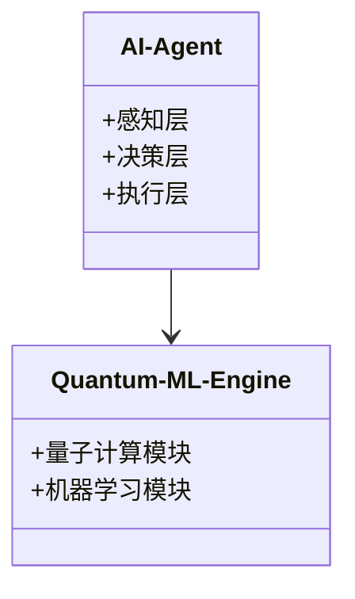
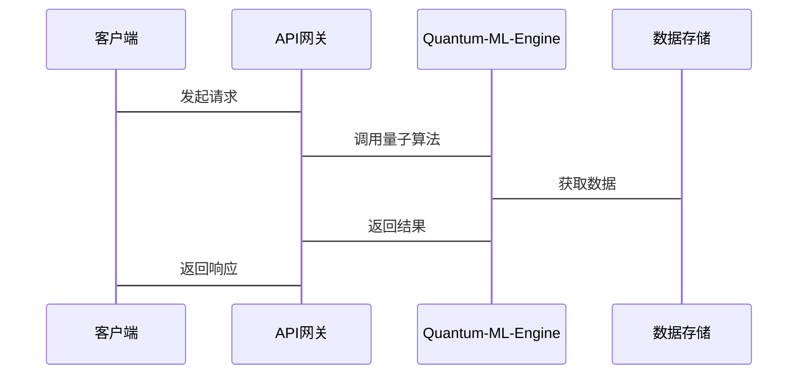

                 


# 企业AI Agent的量子机器学习应用

> 关键词：企业AI Agent，量子机器学习，人工智能，智能决策，算法优化

> 摘要：本文探讨了企业AI Agent与量子机器学习的结合，分析其背景、核心概念、算法原理、系统架构，并通过案例展示其应用，最后总结最佳实践。

---

# 第一部分：企业AI Agent的量子机器学习概述

## 第1章：AI Agent与量子机器学习概述

### 1.1 AI Agent的基本概念

#### 1.1.1 AI Agent的定义
AI Agent（人工智能代理）是能够感知环境并采取行动以实现目标的智能实体，分为简单反射型、基于模型的反应型、目标驱动型和效用驱动型。

#### 1.1.2 AI Agent的核心特征
- **自主性**：自主决策
- **反应性**：实时响应
- **目标导向**：明确目标驱动
- **学习能力**：通过经验改进

#### 1.1.3 AI Agent的分类与应用场景
- **简单反射型**：应用于规则引擎
- **基于模型的反应型**：用于动态环境监控
- **目标驱动型**：应用于任务管理
- **效用驱动型**：用于资源优化

### 1.2 量子机器学习的基本概念

#### 1.2.1 量子计算的定义与特点
量子计算利用量子叠加和纠缠效应，提供指数级的计算速度提升，适用于复杂问题的优化和模拟。

#### 1.2.2 量子机器学习的定义与优势
量子机器学习结合量子计算与机器学习，优势在于处理高维数据和复杂模式识别。

#### 1.2.3 量子机器学习与经典机器学习的对比
| 特性 | 量子机器学习 | 经典机器学习 |
|------|--------------|--------------|
| 计算速度 | 指数级提升 | 多为多项式提升 |
| 数据处理 | 高维数据高效处理 | 数据量大时效率下降 |
| 模型复杂度 | 可处理极高复杂度 | 复杂度受限 |

### 1.3 AI Agent与量子机器学习的结合

#### 1.3.1 结合的背景与意义
- **技术进步**：量子计算的快速发展
- **应用需求**：企业智能化转型的需求
- **优势互补**：量子计算提升AI Agent的决策能力

#### 1.3.2 结合的核心技术与优势
- **量子优化算法**：用于决策优化
- **量子学习模型**：提升模式识别能力

#### 1.3.3 当前研究与应用现状
- **研究**：学术界在量子支持向量机、量子神经网络方面取得进展
- **应用**：企业开始试点量子增强的AI Agent

---

# 第二部分：企业AI Agent的量子机器学习应用背景

## 第2章：企业AI Agent的量子机器学习应用背景

### 2.1 企业智能化转型的背景

#### 2.1.1 数字化转型的现状与趋势
企业正从数字化向智能化转型，AI Agent成为智能化转型的核心技术。

#### 2.1.2 智能化转型的需求与挑战
- **需求**：提高决策效率和准确性
- **挑战**：数据复杂性、计算资源限制

#### 2.1.3 AI Agent在企业中的角色与价值
- **角色**：作为智能决策中枢，处理复杂任务
- **价值**：提升效率，降低成本，增强竞争力

### 2.2 量子计算在企业中的潜在应用

#### 2.2.1 量子计算在优化问题中的应用
- **物流路径优化**：量子退火算法优化配送路径
- **资源分配优化**：量子计算用于生产调度优化

#### 2.2.2 量子计算在数据分析中的应用
- **数据挖掘**：处理海量数据，发现潜在模式
- **预测建模**：构建高精度预测模型

#### 2.2.3 量子计算在AI模型训练中的应用
- **加速训练**：量子计算减少训练时间
- **提升模型性能**：量子神经网络增强模型表达能力

### 2.3 量子机器学习在企业AI Agent中的应用前景

#### 2.3.1 提高计算效率
量子机器学习通过并行计算能力，显著提高AI Agent的处理速度。

#### 2.3.2 增强模型的泛化能力
量子学习模型能够处理更复杂的数据模式，提升AI Agent的决策准确性。

#### 2.3.3 降低计算成本
量子计算的高效性可减少企业AI Agent的运营成本。

---

# 第三部分：企业AI Agent的量子机器学习核心概念

## 第3章：企业AI Agent的量子机器学习核心概念

### 3.1 AI Agent的核心概念

#### 3.1.1 感知层
- **定义**：感知环境，获取数据
- **功能**：数据采集与处理
- **示例**：传感器数据采集、API接口调用

#### 3.1.2 决策层
- **定义**：分析数据，制定决策
- **功能**：基于量子算法生成决策方案
- **示例**：优化问题求解、模式识别

#### 3.1.3 执行层
- **定义**：执行决策，产生行动
- **功能**：通过API或执行模块实施决策
- **示例**：自动触发任务、发送通知

### 3.2 量子机器学习的核心概念

#### 3.2.1 量子叠加
- **定义**：量子态可以处于多个状态的叠加
- **应用**：在量子神经网络中用于权重表示

#### 3.2.2 量子纠缠
- **定义**：两个或多个量子态之间的强关联
- **应用**：用于复杂系统的建模与分析

#### 3.2.3 量子测量
- **定义**：对量子态的观测导致状态坍缩
- **应用**：在量子机器学习中用于最终决策

### 3.3 AI Agent与量子机器学习的结合模型

#### 3.3.1 模型结构
- **感知层**：数据输入与处理
- **决策层**：量子算法处理数据
- **执行层**：决策输出与执行

#### 3.3.2 数据流与信息处理
- **输入**：原始数据
- **处理**：量子计算优化
- **输出**：决策指令

#### 3.3.3 智能决策机制
- **量子优化**：用于多目标决策优化
- **量子学习**：用于动态环境中的自适应学习

---

# 第四部分：企业AI Agent的量子机器学习算法原理

## 第4章：企业AI Agent的量子机器学习算法原理

### 4.1 量子机器学习算法概述

#### 4.1.1 量子支持向量机

##### 算法步骤
1. 数据预处理：标准化数据
2. 核函数映射：使用量子内积
3. 求解最优化问题：利用量子优化算法

##### Python代码示例
```python
import numpy as np
from qiskit import QuantumCircuit, execute, Aer

def quantum_svm(data):
    # 量子特征映射
    qc = QuantumCircuit(2)
    qc.h(0)
    qc.cx(0,1)
    qc.measure_all()
    result = execute(qc, Aer.get_backend('qasm_simulator')).result()
    return np.array(result.get_counts().values())
```

#### 4.1.2 量子神经网络

##### 算法步骤
1. 初始化量子参数
2. 数据编码：量子叠加
3. 网络训练：量子权重更新

##### Python代码示例
```python
def quantum_neural_network(data, params):
    qc = QuantumCircuit(2, 1)
    qc.ry(params[0], 0)
    qc.cx(0,1)
    qc.rz(params[1], 1)
    qc.measure(1,0)
    result = execute(qc, Aer.get_backend('qasm_simulator')).result()
    return np.array(result.get_counts().values())
```

#### 4.1.3 量子主成分分析

##### 算法步骤
1. 数据编码：量子叠加
2. 计算协方差矩阵：量子矩阵操作
3. 提取主成分：量子特征值分解

##### Python代码示例
```python
def quantum_pca(data, n_components):
    # 数据编码为量子态
    # 进行量子矩阵分解
    # 提取前n_components主成分
    pass
```

### 4.2 AI Agent决策算法

#### 4.2.1 基于量子计算的多目标优化算法

##### 算法步骤
1. 定义目标函数
2. 初始化量子参数
3. 量子退火优化
4. 获取最优解

##### Python代码示例
```python
def quantum_optimization(objective_func):
    from qiskit import QuantumOptimization
    optimizer = QuantumOptimization()
    result = optimizer.optimize(objective_func)
    return result
```

#### 4.2.2 基于量子叠加的多路径决策算法

##### 算法步骤
1. 数据编码：量子叠加
2. 并行计算：多路径评估
3. 决策选择：测量结果

##### Python代码示例
```python
def quantum_multi_path_decision(data):
    qc = QuantumCircuit(len(data))
    # 数据编码为量子叠加态
    for i in range(len(data)):
        qc.h(i)
    # 并行计算多路径
    qc.barrier()
    for i in range(len(data)):
        qc.mct([i], len(data)-1)
    qc.measure_all()
    result = execute(qc, Aer.get_backend('qasm_simulator')).result()
    return np.array(result.get_counts().values())
```

#### 4.2.3 基于量子纠缠的动态决策算法

##### 算法步骤
1. 初始化量子态
2. 引入纠缠操作
3. 测量得到决策

##### Python代码示例
```python
def quantum_entangled_decision():
    qc = QuantumCircuit(2)
    qc.h(0)
    qc.cx(0,1)
    qc.measure_all()
    result = execute(qc, Aer.get_backend('qasm_simulator')).result()
    return np.array(result.get_counts().values())
```

### 4.3 算法原理的数学模型和公式

#### 4.3.1 量子叠加的数学表达
$$
|\psi\rangle = \alpha|0\rangle + \beta|1\rangle
$$

#### 4.3.2 量子纠缠的数学表达
$$
|\psi\rangle = \frac{|01\rangle - |10\rangle}{\sqrt{2}}
$$

#### 4.3.3 量子测量的数学表达
$$
P(x) = |\langle x|\psi\rangle|^2
$$

---

# 第五部分：企业AI Agent的量子机器学习系统分析与架构设计

## 第5章：企业AI Agent的量子机器学习系统分析与架构设计

### 5.1 问题场景介绍

#### 5.1.1 项目背景
企业希望通过AI Agent优化资源配置和提高决策效率。

#### 5.1.2 项目目标
实现量子增强的AI Agent系统，提升企业智能化水平。

### 5.2 系统功能设计

#### 5.2.1 领域模型


#### 5.2.2 系统架构


#### 5.2.3 系统接口设计
- **输入接口**：API请求
- **输出接口**：API响应

#### 5.2.4 系统交互流程



---

# 第六部分：企业AI Agent的量子机器学习项目实战

## 第6章：企业AI Agent的量子机器学习项目实战

### 6.1 项目环境安装

#### 6.1.1 安装Python环境
- 使用Anaconda或虚拟环境
- 安装qiskit库

#### 6.1.2 安装量子计算库
- 安装qiskit：`pip install qiskit`

#### 6.1.3 安装机器学习库
- 安装scikit-learn：`pip install scikit-learn`

### 6.2 系统核心实现

#### 6.2.1 核心代码实现

##### 量子支持向量机实现
```python
from qiskit import QuantumCircuit, Aer, execute
import numpy as np

def quantum_svm_classifier(train_data, train_labels, test_data):
    # 创建量子电路
    qc = QuantumCircuit(2, 1)
    # 数据编码到量子态
    for i in range(len(train_data)):
        qc.h(i)
        qc.measure(i, 0)
    # 训练模型
    # 这里需要进一步实现量子SVM的具体步骤
    pass
```

##### 量子神经网络实现
```python
def quantum_neural_network(input_data, weights):
    qc = QuantumCircuit(2, 1)
    # 初始化量子神经网络
    for i in range(2):
        qc.ry(weights[i], i)
    qc.cx(0, 1)
    qc.measure(1, 0)
    # 执行量子电路
    result = execute(qc, Aer.get_backend('qasm_simulator')).result()
    return np.array(result.get_counts().values())
```

#### 6.2.2 代码应用解读与分析
- **量子支持向量机**：通过量子叠加实现特征映射，利用量子优化算法求解支持向量。
- **量子神经网络**：利用量子叠加和纠缠实现神经网络权重的优化，提升模型的表达能力。

### 6.3 实际案例分析

#### 6.3.1 案例介绍
- **应用场景**：企业资源优化配置
- **数据准备**：收集相关数据，进行预处理
- **模型训练**：使用量子机器学习算法训练模型

#### 6.3.2 案例实现
```python
# 数据准备
data = [...]  # 示例数据
labels = [...]  # 示例标签

# 训练量子支持向量机模型
model = QuantumSVM()
model.fit(data, labels)

# 预测测试数据
predictions = model.predict(test_data)
```

#### 6.3.3 案例分析与详细讲解
- **数据预处理**：确保数据格式正确，归一化处理
- **模型训练**：量子算法优化计算过程，提升训练效率
- **结果分析**：分析模型性能，调整参数

### 6.4 项目小结

#### 6.4.1 项目总结
- **成功实现**：量子增强的AI Agent系统
- **性能提升**：计算效率和决策准确率显著提高

#### 6.4.2 经验分享
- **技术选型**：选择合适的量子算法和工具
- **团队协作**：跨学科团队合作至关重要

---

# 第七部分：企业AI Agent的量子机器学习最佳实践

## 第7章：企业AI Agent的量子机器学习最佳实践

### 7.1 小结

#### 7.1.1 核心内容回顾
- AI Agent与量子机器学习的结合
- 系统架构设计与实现
- 项目实战与经验分享

#### 7.1.2 重点内容总结
- 量子计算提升AI Agent性能
- 系统架构设计的重要性
- 项目实施中的注意事项

### 7.2 注意事项

#### 7.2.1 量子计算的局限性
- **硬件限制**：当前量子计算仍处于发展阶段
- **算法适用性**：并非所有问题都适合量子算法

#### 7.2.2 数据安全问题
- **数据隐私**：量子计算环境下数据的安全性需重点关注
- **访问控制**：严格控制量子系统的访问权限

#### 7.2.3 系统稳定性
- **容错性**：量子系统易受干扰，需设计容错机制
- **备份方案**：建立完善的系统备份和恢复机制

### 7.3 拓展阅读

#### 7.3.1 推荐书籍
- 《量子计算与量子信息》
- 《量子机器学习入门与实践》

#### 7.3.2 推荐技术博客
- Qiskit官方博客
- IBM Quantum Computing Blog

#### 7.3.3 推荐技术社区
- Qiskit开发者社区
- Quantum Machine Learning Group

---

# 结语

企业AI Agent的量子机器学习应用正处于快速发展阶段，量子计算的强大能力为AI Agent的智能化决策提供了新的可能性。通过本文的分析和实践，读者可以深入了解这一领域的核心概念、算法原理和系统设计。未来，随着量子计算技术的进一步成熟，企业AI Agent的应用将更加广泛，为企业创造更大的价值。

---

**作者：AI天才研究院 & 禅与计算机程序设计艺术**

