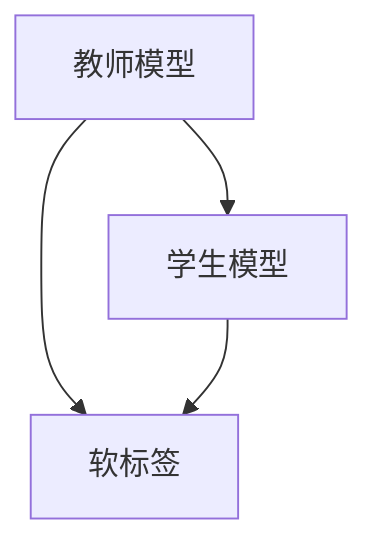
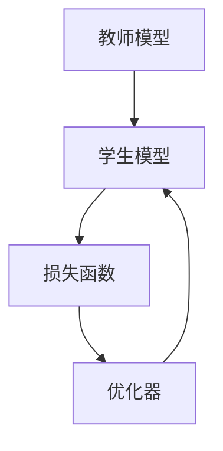
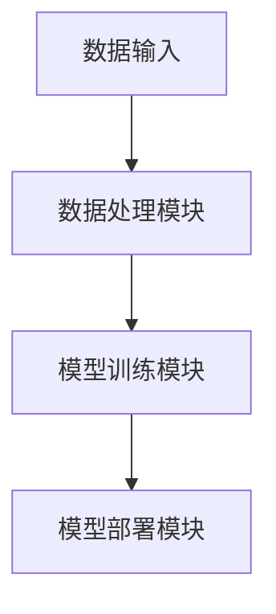
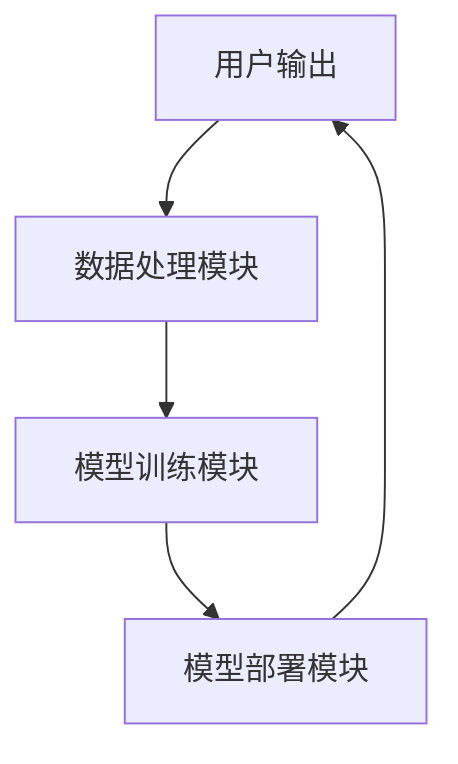

                 


# 基于知识蒸馏的轻量级AI Agent

> 关键词：知识蒸馏, 轻量级AI Agent, 模型压缩, 教师模型, 学生模型, 算法优化

> 摘要：本文系统地探讨了基于知识蒸馏的轻量级AI Agent的设计与实现。从知识蒸馏的基本概念出发，分析了其在AI Agent轻量化中的应用价值，详细阐述了知识蒸馏的核心原理、算法实现、系统架构设计以及实际项目中的应用案例。通过对比传统模型压缩技术，提出了基于知识蒸馏的优化方案，并给出了具体的代码实现和性能分析。本文旨在为AI Agent的轻量化设计提供理论支持与实践指导。

---

# 第一部分: 知识蒸馏与轻量级AI Agent基础

# 第1章: 知识蒸馏与轻量级AI Agent概述

## 1.1 知识蒸馏的基本概念

### 1.1.1 什么是知识蒸馏
知识蒸馏是一种模型压缩技术，通过将大模型（教师模型）的知识迁移到小模型（学生模型）中，实现模型的轻量化。其核心思想是将教师模型的预测概率分布作为软标签，指导学生模型的学习。

### 1.1.2 知识蒸馏的核心思想
知识蒸馏通过损失函数的设计，将教师模型的特征提取能力迁移到学生模型中，从而在保持性能的同时减少模型的计算和存储成本。

### 1.1.3 轻量级AI Agent的定义与特点
轻量级AI Agent是一种资源占用低、计算效率高的智能代理系统，适用于边缘计算、移动设备等资源受限的场景。其特点包括：低计算成本、快速响应、轻量化部署。

## 1.2 知识蒸馏的背景与问题背景

### 1.2.1 模型压缩的必要性
随着AI技术的广泛应用，模型规模的不断扩大带来了计算成本和存储成本的增加，特别是在边缘计算和移动设备中，对轻量化模型的需求日益迫切。

### 1.2.2 资源受限环境下的AI需求
在物联网、嵌入式系统等场景中，资源受限的环境要求AI模型必须轻量化，以满足实时性和高效性。

### 1.2.3 轻量级AI Agent的应用场景
轻量级AI Agent广泛应用于智能音箱、智能家居、自动驾驶等场景，要求模型在有限的资源下完成高效的推理任务。

## 1.3 知识蒸馏与传统模型压缩技术的对比

### 1.3.1 传统模型压缩技术的优缺点
传统模型压缩技术包括剪枝、量化等方法，但存在以下缺点：
- 剪枝：可能破坏模型的准确性。
- 量化：可能导致精度损失。

### 1.3.2 知识蒸馏的独特优势
知识蒸馏的优势在于：
- 保留了教师模型的特征提取能力。
- 适用于多种模型结构，灵活性高。
- 可以通过软标签实现更细粒度的知识迁移。

### 1.3.3 知识蒸馏的适用范围与边界
知识蒸馏适用于以下场景：
- 当教师模型已经训练完成且性能优秀时。
- 当需要将大模型的知识迁移到小模型时。

## 1.4 知识蒸馏的核心要素与概念结构

### 1.4.1 教师模型与学生模型的关系
教师模型负责生成软标签，学生模型通过模仿教师模型的预测结果进行学习。

### 1.4.2 知识蒸馏的关键步骤
1. 训练教师模型。
2. 使用教师模型生成软标签。
3. 训练学生模型，使其预测结果与软标签一致。

### 1.4.3 知识蒸馏的数学模型概述
知识蒸馏的损失函数通常由交叉熵损失和KL散度损失组成。

## 1.5 本章小结
本章从知识蒸馏的基本概念出发，分析了其在轻量级AI Agent中的应用价值，并对比了传统模型压缩技术，提出了知识蒸馏的独特优势。

---

# 第二部分: 知识蒸馏的核心概念与原理

# 第2章: 知识蒸馏的核心概念与联系

## 2.1 知识蒸馏的原理与流程

### 2.1.1 知识蒸馏的基本流程
1. 训练教师模型。
2. 使用教师模型生成软标签。
3. 训练学生模型，使其预测结果与软标签一致。

### 2.1.2 教师模型与学生模型的选择
- 教师模型：通常是预训练的大模型。
- 学生模型：通常是轻量级的小模型。

### 2.1.3 知识蒸馏的关键参数与配置
- 温度系数：控制软标签的分布宽度。
- 知识蒸馏的损失权重：平衡交叉熵损失和KL散度损失。

## 2.2 知识蒸馏的核心概念对比

### 2.2.1 知识蒸馏与其他模型压缩技术的对比

| 技术 | 优点 | 缺点 |
|------|------|------|
| 剪枝 | 简单有效 | 可能破坏模型的准确性 |
| 量化 | 降低存储需求 | 可能导致精度损失 |
| 知识蒸馏 | 保留教师模型的特征 | 需要训练教师模型 |

### 2.2.2 知识蒸馏与模型蒸馏的异同
知识蒸馏与模型蒸馏的核心思想相似，但侧重点不同：
- 模型蒸馏：更关注模型结构的简化。
- 知识蒸馏：更关注知识的迁移。

### 2.2.3 知识蒸馏与迁移学习的联系
知识蒸馏可以看作是一种特殊的迁移学习技术，通过软标签实现知识的迁移。

## 2.3 知识蒸馏的实体关系图



---

# 第三部分: 知识蒸馏的算法原理

# 第3章: 知识蒸馏的数学模型与算法实现

## 3.1 知识蒸馏的数学模型

### 3.1.1 知识蒸馏的损失函数
$$
L_{\text{distill}} = \alpha L_{\text{CE}} + (1-\alpha) L_{\text{KL}}
$$
其中：
- $L_{\text{CE}}$ 是交叉熵损失。
- $L_{\text{KL}}$ 是KL散度。
- $\alpha$ 是平衡参数。

### 3.1.2 温度系数的作用
通过调整温度系数，可以控制软标签的分布宽度。

### 3.1.3 交叉熵损失与KL散度的计算
交叉熵损失：
$$
L_{\text{CE}}(y, \hat{y}) = -\frac{1}{N}\sum_{i=1}^N \sum_{j=1}^C y_{ij} \log \hat{y}_{ij}
$$

KL散度：
$$
D_{\text{KL}}(P \parallel Q) = \sum_{i} P(i) \log \frac{P(i)}{Q(i)}
$$

## 3.2 知识蒸馏的算法流程

### 3.2.1 算法步骤
1. 训练教师模型，生成软标签。
2. 初始化学生模型。
3. 训练学生模型，优化损失函数。

### 3.2.2 算法流程图



### 3.2.3 代码实现

```python
import torch
import torch.nn as nn

# 定义教师模型和学生模型
class TeacherModel(torch.nn.Module):
    def __init__(self):
        super(TeacherModel, self).__init__()
        self.fc = nn.Linear(784, 10)

class StudentModel(torch.nn.Module):
    def __init__(self):
        super(StudentModel, self).__init__()
        self.fc = nn.Linear(784, 10)

# 定义损失函数
class DistillLoss(nn.Module):
    def __init__(self, T=1.0):
        super(DistillLoss, self).__init__()
        self.T = T
        self.criterion = nn.KLDivLoss()

    def forward(self, inputs, outputs, labels):
        # 计算软标签
        soft_labels = torch.nn.functional.softmax(inputs / self.T, dim=1)
        # 计算KL散度
        kl_loss = self.criterion(torch.log_softmax(outputs, dim=1), soft_labels)
        # 计算交叉熵损失
        ce_loss = nn.CrossEntropyLoss()(outputs, labels)
        # 综合损失
        total_loss = kl_loss + ce_loss
        return total_loss

# 初始化模型和优化器
teacher_model = TeacherModel()
student_model = StudentModel()
optimizer = torch.optim.Adam(student_model.parameters(), lr=0.001)
criterion = DistillLoss(T=2.0)

# 训练过程
for epoch in range(num_epochs):
    for batch_idx, (data, labels) in enumerate(train_loader):
        # 前向传播
        teacher_outputs = teacher_model(data)
        student_outputs = student_model(data)
        # 计算损失
        loss = criterion(student_outputs, teacher_outputs, labels)
        # 反向传播和优化
        optimizer.zero_grad()
        loss.backward()
        optimizer.step()
```

---

# 第四部分: 系统分析与架构设计

# 第4章: 轻量级AI Agent的系统架构设计

## 4.1 系统功能设计

### 4.1.1 系统功能模块
1. 数据处理模块。
2. 模型训练模块。
3. 模型部署模块。

### 4.1.2 系统功能流程
1. 数据预处理。
2. 模型训练。
3. 模型部署。

## 4.2 系统架构设计

### 4.2.1 系统架构图



### 4.2.2 系统接口设计
- 数据处理模块接口：
  - 输入：原始数据。
  - 输出：预处理数据。
- 模型训练模块接口：
  - 输入：预处理数据。
  - 输出：训练好的学生模型。
- 模型部署模块接口：
  - 输入：训练好的学生模型。
  - 输出：部署好的AI Agent。

## 4.3 系统交互流程图



---

# 第五部分: 项目实战

# 第5章: 基于知识蒸馏的轻量级AI Agent实现

## 5.1 环境安装

### 5.1.1 安装依赖
- PyTorch
- numpy
- matplotlib

## 5.2 系统核心实现

### 5.2.1 数据加载与预处理

```python
import torch
from torchvision import datasets, transforms

# 定义数据预处理
transform = transforms.Compose([
    transforms.ToTensor(),
    transforms.Normalize((0.1307, 0.1307, 0.1307), (0.3086, 0.3086, 0.3086)),
])

# 加载数据集
train_set = datasets.MNIST(root='./data', train=True, download=True, transform=transform)
train_loader = torch.utils.data.DataLoader(train_set, batch_size=64, shuffle=True)
```

### 5.2.2 教师模型与学生模型的定义

```python
class TeacherModel(torch.nn.Module):
    def __init__(self):
        super(TeacherModel, self).__init__()
        self.fc = nn.Linear(784, 10)

class StudentModel(torch.nn.Module):
    def __init__(self):
        super(StudentModel, self).__init__()
        self.fc = nn.Linear(784, 10)
```

### 5.2.3 损失函数与优化器

```python
class DistillLoss(nn.Module):
    def __init__(self, T=1.0):
        super(DistillLoss, self).__init__()
        self.T = T
        self.criterion = nn.KLDivLoss()

    def forward(self, inputs, outputs):
        soft_labels = torch.nn.functional.softmax(inputs / self.T, dim=1)
        kl_loss = self.criterion(torch.log_softmax(outputs, dim=1), soft_labels)
        return kl_loss

# 初始化优化器
optimizer = torch.optim.Adam(student_model.parameters(), lr=0.001)
criterion = DistillLoss(T=2.0)
```

### 5.2.4 训练过程

```python
num_epochs = 10
for epoch in range(num_epochs):
    for batch_idx, (data, labels) in enumerate(train_loader):
        # 前向传播
        teacher_outputs = teacher_model(data)
        student_outputs = student_model(data)
        # 计算损失
        loss = criterion(student_outputs, teacher_outputs)
        # 反向传播和优化
        optimizer.zero_grad()
        loss.backward()
        optimizer.step()
```

## 5.3 代码实现与解读

### 5.3.1 知识蒸馏的核心代码
```python
soft_labels = torch.nn.functional.softmax(teacher_outputs / T, dim=1)
student_outputs = student_model(data)
kl_loss = criterion(torch.log_softmax(student_outputs, dim=1), soft_labels)
```

### 5.3.2 模型性能分析
- 训练过程中的损失曲线。
- 模型在测试集上的准确率。

## 5.4 实际案例分析

### 5.4.1 知识蒸馏的应用场景
- 图像分类任务。
- 自然语言处理任务。

### 5.4.2 实验结果对比
- 知识蒸馏后的模型在性能上的提升。
- 模型大小的减少。

## 5.5 项目小结
本章通过实际案例，详细讲解了知识蒸馏在轻量级AI Agent中的实现过程，并分析了实验结果。

---

# 第六部分: 总结与展望

# 第6章: 总结与展望

## 6.1 知识蒸馏的优势与不足

### 6.1.1 知识蒸馏的优势
- 保留了教师模型的特征提取能力。
- 模型轻量化效果显著。

### 6.1.2 知识蒸馏的不足
- 需要训练教师模型。
- 温度系数的选择可能影响性能。

## 6.2 未来研究方向

### 6.2.1 更优的知识蒸馏方法
- 多教师蒸馏。
- 动态蒸馏。

### 6.2.2 知识蒸馏的扩展应用
- 多模态知识蒸馏。
- 跨任务知识蒸馏。

## 6.3 本章小结
本章总结了知识蒸馏的优势与不足，并展望了未来的研究方向。

---

# 作者：AI天才研究院/AI Genius Institute & 禅与计算机程序设计艺术 /Zen And The Art of Computer Programming

