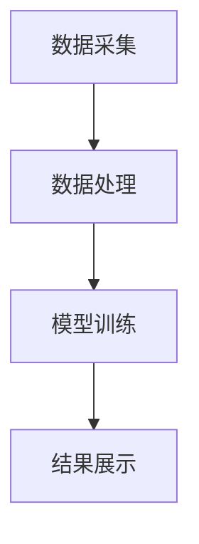
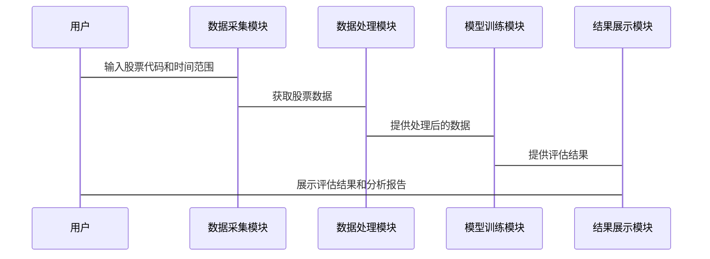

                 


# 如何评估特价股票的内在价值

> 关键词：股票分析、内在价值、特价股票、财务指标、技术分析、投资策略

> 摘要：本文将详细探讨如何评估特价股票的内在价值。首先介绍特价股票的基本概念和评估内在价值的重要性，然后分析内在价值的核心概念，包括基本分析方法、财务指标分析和行业分析。接着，介绍技术分析与市场情绪在评估中的应用。最后，通过构建数学模型和实际案例分析，提供一个完整的评估框架，帮助投资者更好地理解如何评估特价股票的内在价值。

---

# 第一部分: 特价股票的内在价值评估背景

---

# 第1章: 特价股票与内在价值概述

## 1.1 特价股票的基本概念

### 1.1.1 特价股票的定义与特点

特价股票是指价格相对较低的股票，通常具有较高的上涨潜力。这类股票可能因市场波动、公司基本面改善或行业趋势而被低估。以下是特价股票的主要特点：

- **低估值**：通常市盈率（P/E）或市净率（P/B）低于行业平均水平。
- **高潜力**：可能因市场反弹或公司业绩改善而迅速上涨。
- **风险较高**：价格波动较大，投资风险较高。

### 1.1.2 特价股票的分类与应用场景

特价股票可以根据市场、行业、公司规模等因素进行分类。常见的分类方式包括：

- **市场分类**：根据股票所在的市场（如主板、创业板）进行分类。
- **行业分类**：根据股票所属的行业（如科技、金融、消费）进行分类。
- **公司规模**：根据公司的市值规模（如小盘股、中盘股、大盘股）进行分类。

### 1.1.3 特价股票的市场现状与发展趋势

近年来，随着市场的波动加剧，特价股票越来越受到投资者的关注。尤其是在经济低迷或市场调整期间，许多投资者倾向于寻找具有高成长潜力的特价股票。然而，由于信息不对称和市场波动，评估特价股票的内在价值变得尤为重要。

---

## 1.2 内在价值评估的重要性

### 1.2.1 什么是内在价值

内在价值是指股票本身的价值，不考虑市场波动，主要基于公司的财务状况、行业地位、盈利能力等因素。它是股票的“真实价值”，与市场价可能不同。

### 1.2.2 内在价值与市场价值的关系

- **市场价值**：即股票的市场价格，受市场情绪、投资者心理等因素影响。
- **内在价值**：股票的真正价值，基于公司的基本面。

### 1.2.3 为什么需要评估特价股票的内在价值

评估特价股票的内在价值可以帮助投资者避免盲目跟风，找到真正具有投资价值的股票。以下是主要原因：

- **避免低买高卖**：通过内在价值评估，投资者可以确定股票是否被低估，从而做出更明智的投资决策。
- **降低风险**：通过分析公司的基本面，投资者可以避免因市场波动而盲目投资高风险股票。
- **长期收益**：内在价值稳定的股票通常具有较高的长期收益潜力。

---

## 1.3 特价股票评估的核心问题

### 1.3.1 问题背景与问题描述

在当前市场环境下，许多投资者希望找到具有高成长潜力的特价股票，但由于信息不对称和市场波动，评估特价股票的内在价值变得复杂。以下是主要问题：

- **如何确定股票的内在价值？**
- **如何评估公司的财务状况？**
- **如何结合市场情绪和技术分析进行综合判断？**

### 1.3.2 问题解决的思路与方法

- **基本分析**：通过分析公司的财务报表、行业地位和竞争优势，评估股票的内在价值。
- **技术分析**：通过分析股票的价格和成交量，判断股票的短期趋势。
- **综合分析**：结合基本分析和技术分析，制定投资策略。

### 1.3.3 问题的边界与外延

- **边界**：主要关注具有高成长潜力的特价股票，不涉及其他类型的股票。
- **外延**：内在价值评估不仅适用于特价股票，还可以扩展到其他类型的股票。

### 1.3.4 核心概念与要素组成

- **核心概念**：内在价值、财务指标、技术分析、市场情绪。
- **要素组成**：公司财务状况、行业趋势、市场环境、公司治理。

---

# 第二部分: 内在价值评估的核心概念与联系

---

# 第2章: 特价股票内在价值评估的核心概念

## 2.1 基本分析方法

### 2.1.1 市盈率（P/E）分析

市盈率是衡量股票价值的重要指标，计算公式为：

$$ \text{市盈率} = \frac{\text{股价}}{\text{每股收益}} $$

市盈率越低，通常表示股票的估值越低。以下是市盈率的优缺点：

- **优点**：简单易懂，能够反映股票的相对价值。
- **缺点**：受行业和公司规模的影响较大，不适合跨行业比较。

### 2.1.2 市净率（P/B）分析

市净率是衡量股票价值的另一个重要指标，计算公式为：

$$ \text{市净率} = \frac{\text{股价}}{\text{每股净资产}} $$

市净率越低，通常表示股票的估值越低。以下是市净率的优缺点：

- **优点**：适用于净资产为正的公司，能够反映股票的资产价值。
- **缺点**：受行业和公司规模的影响较大，不适合跨行业比较。

### 2.1.3 股息率分析

股息率是衡量股票收益能力的重要指标，计算公式为：

$$ \text{股息率} = \frac{\text{每股股息}}{\text{股价}} $$

股息率越高，通常表示股票的收益能力越强。以下是股息率的优缺点：

- **优点**：适合长期投资者，能够提供稳定的现金流。
- **缺点**：高股息率的公司可能面临增长潜力不足的问题。

---

## 2.2 财务指标分析

### 2.2.1 收入与利润分析

- **收入分析**：通过分析公司的收入情况，判断公司的盈利能力。
- **利润分析**：通过分析公司的净利润，判断公司的盈利能力。

### 2.2.2 资产负债表分析

- **资产分析**：分析公司的资产结构，判断公司的资产质量。
- **负债分析**：分析公司的负债情况，判断公司的财务健康状况。

### 2.2.3 现金流量表分析

- **经营活动现金流**：分析公司经营活动的现金流，判断公司的经营能力。
- **投资活动现金流**：分析公司投资活动的现金流，判断公司的投资能力。

---

## 2.3 行业分析与竞争优势分析

### 2.3.1 行业分析的基本方法

- **行业生命周期分析**：判断行业所处的生命周期阶段，如幼稚期、成长期、成熟期、衰退期。
- **行业竞争分析**：分析行业的竞争格局，判断公司的市场地位。

### 2.3.2 企业竞争优势分析

- **核心竞争力分析**：分析公司的核心竞争力，如技术创新、成本优势、品牌优势等。
- **竞争优势比较**：将公司与行业内的其他公司进行比较，判断公司的竞争优势。

---

## 2.4 技术分析与市场情绪分析

### 2.4.1 技术分析的基本原理

技术分析是通过分析股票的价格和成交量，判断股票的短期趋势。以下是技术分析的主要方法：

- **K线图分析**：通过分析K线图，判断股票的价格走势。
- **均线分析**：通过分析股价的均线，判断股票的支撑位和阻力位。
- **技术指标分析**：通过分析技术指标（如RSI、MACD等），判断股票的买卖信号。

### 2.4.2 市场情绪分析

市场情绪分析是通过分析投资者的心理和行为，判断市场的整体情绪。以下是市场情绪分析的主要方法：

- **市场情绪指标**：通过分析市场情绪指标（如VIX指数），判断市场的波动性。
- **投资者行为分析**：通过分析投资者的行为，判断市场的买卖力量。

---

# 第三部分: 内在价值评估的数学模型与算法

---

# 第3章: 特价股票内在价值评估的数学模型

## 3.1 数据预处理与特征选择

### 3.1.1 数据预处理

- **数据清洗**：去除异常值和缺失值。
- **数据标准化**：对数据进行标准化处理，确保不同特征的可比性。

### 3.1.2 特征选择

- **特征筛选**：通过统计方法或机器学习方法，筛选出重要的特征。
- **特征工程**：通过特征组合或特征变换，提高模型的预测能力。

---

## 3.2 内在价值评估模型的构建

### 3.2.1 模型选择

- **线性回归模型**：适用于线性关系的预测。
- **决策树模型**：适用于非线性关系的预测。

### 3.2.2 模型训练

- **训练数据集**：使用历史数据进行模型训练。
- **验证数据集**：使用验证数据进行模型验证。

### 3.2.3 模型优化

- **参数调整**：通过调整模型参数，提高模型的预测能力。
- **模型评估**：通过评估指标（如准确率、召回率等），判断模型的性能。

---

## 3.3 内在价值评估的数学公式

### 3.3.1 线性回归模型

$$ y = \beta_0 + \beta_1 x_1 + \beta_2 x_2 + \dots + \beta_n x_n + \epsilon $$

其中，$y$ 是目标变量，$x_i$ 是特征变量，$\beta_i$ 是回归系数，$\epsilon$ 是误差项。

### 3.3.2 决策树模型

决策树模型通过构建树状结构，对数据进行分类或回归。以下是决策树模型的构建步骤：

1. **特征选择**：选择最重要的特征作为根节点。
2. **数据分割**：根据特征值分割数据，形成子节点。
3. **模型训练**：通过递归分割，构建完整的决策树。
4. **模型剪枝**：通过剪枝技术，避免过拟合。

---

# 第四部分: 内在价值评估的系统分析

---

# 第4章: 特价股票内在价值评估系统

## 4.1 系统功能设计

### 4.1.1 系统模块划分

- **数据采集模块**：负责采集股票数据。
- **数据处理模块**：负责处理和清洗数据。
- **模型训练模块**：负责构建和训练评估模型。
- **结果展示模块**：负责展示评估结果。

### 4.1.2 系统功能流程

1. **数据采集**：从数据源获取股票数据。
2. **数据处理**：对数据进行清洗和标准化处理。
3. **模型训练**：构建和训练内在价值评估模型。
4. **结果展示**：展示模型的预测结果和分析报告。

---

## 4.2 系统架构设计

### 4.2.1 系统架构图



### 4.2.2 系统接口设计

- **数据接口**：与数据源对接，获取股票数据。
- **模型接口**：与模型训练模块对接，获取评估结果。
- **展示接口**：与结果展示模块对接，展示评估结果。

---

## 4.3 系统交互设计

### 4.3.1 交互流程

1. **用户输入**：用户输入股票代码和时间范围。
2. **数据采集**：系统从数据源获取股票数据。
3. **数据处理**：系统对数据进行清洗和标准化处理。
4. **模型训练**：系统构建和训练内在价值评估模型。
5. **结果展示**：系统展示评估结果和分析报告。

### 4.3.2 交互序列图



---

# 第五部分: 内在价值评估的项目实战

---

# 第5章: 特价股票内在价值评估项目

## 5.1 项目环境与工具安装

### 5.1.1 项目环境

- **操作系统**：Windows 10 或更高版本。
- **编程语言**：Python 3.8 或更高版本。
- **开发工具**：Jupyter Notebook 或 VS Code。

### 5.1.2 工具安装

- **数据采集工具**：使用Yahoo Finance API或东方财富网API。
- **数据处理工具**：使用Pandas和NumPy。
- **模型训练工具**：使用Scikit-learn或XGBoost。

---

## 5.2 项目核心实现

### 5.2.1 数据预处理

```python
import pandas as pd
import numpy as np

# 数据加载
df = pd.read_csv('stock_data.csv')

# 数据清洗
df = df.dropna()
df = df.drop_duplicates()

# 数据标准化
from sklearn.preprocessing import StandardScaler

scaler = StandardScaler()
df_scaled = scaler.fit_transform(df)
```

### 5.2.2 模型训练

```python
from sklearn.tree import DecisionTreeRegressor
from sklearn.model_selection import train_test_split

# 数据分割
X = df_scaled.drop(columns=[target_column])
y = df_scaled[target_column]

X_train, X_test, y_train, y_test = train_test_split(X, y, test_size=0.2, random_state=42)

# 模型训练
model = DecisionTreeRegressor(max_depth=5)
model.fit(X_train, y_train)

# 模型预测
y_pred = model.predict(X_test)
```

---

## 5.3 项目实战分析

### 5.3.1 案例分析

假设我们有一个特价股票，股票代码为“XYZ”，以下是具体分析步骤：

1. **数据采集**：从数据源获取“XYZ”的历史数据。
2. **数据处理**：对数据进行清洗和标准化处理。
3. **模型训练**：构建和训练内在价值评估模型。
4. **结果展示**：展示模型的预测结果和分析报告。

### 5.3.2 分析结果解读

通过模型预测，我们得出“XYZ”的内在价值为$100，而当前市场价格为$80。这意味着“XYZ”股票目前被市场低估，具有较高的投资价值。

---

# 第六部分: 内在价值评估的总结与展望

---

# 第6章: 总结与展望

## 6.1 总结

本文详细探讨了如何评估特价股票的内在价值，主要从背景介绍、核心概念、数学模型和系统分析四个方面进行了深入分析。通过本文的分析，读者可以更好地理解特价股票的内在价值评估方法，并能够结合实际情况制定投资策略。

## 6.2 展望

未来的研究方向可以包括以下方面：

- **多因素模型**：结合多个因素进行内在价值评估，提高模型的预测能力。
- **机器学习算法**：引入更复杂的机器学习算法，如深度学习，提高模型的预测精度。
- **实时分析**：开发实时分析系统，及时捕捉市场波动，提高投资决策的实时性。

---

# 作者：AI天才研究院/AI Genius Institute & 禅与计算机程序设计艺术 /Zen And The Art of Computer Programming

