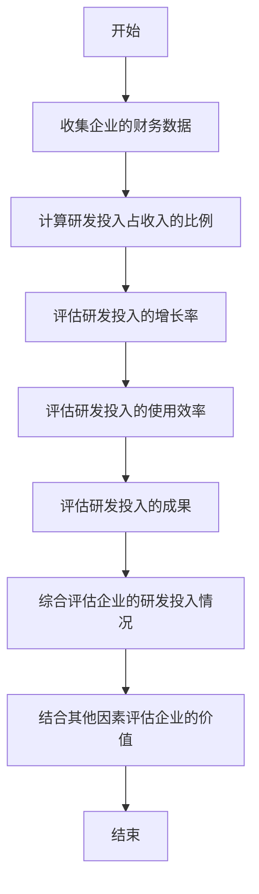
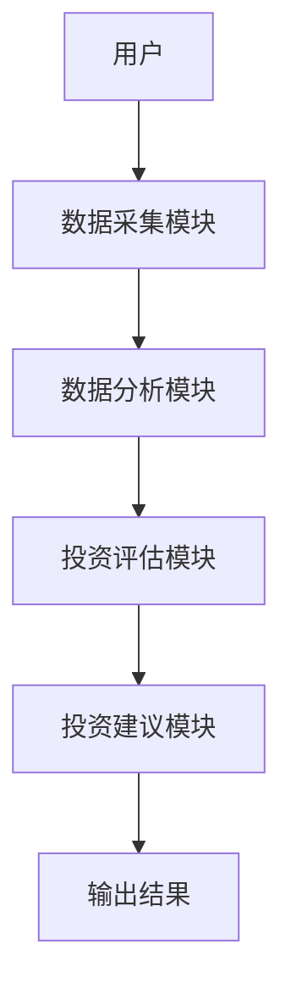
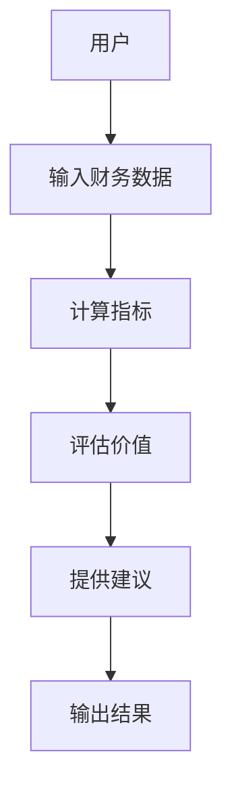

                 


# 彼得林奇如何看待公司的研发投入

> 关键词：彼得·林奇，公司研发投入，投资理念，研发投入评估，企业价值

> 摘要：本文深入探讨了彼得·林奇如何看待公司的研发投入，分析了研发投入对企业长期发展的影响，以及如何通过研发投入评估企业的投资价值。文章结合经典案例，详细阐述了彼得·林奇的投资理念和方法，帮助读者更好地理解和应用这一投资策略。

---

## 第一部分：背景介绍与核心概念

### 第1章：研发投入的重要性与彼得·林奇的投资理念

#### 1.1 研发投入的重要性
##### 1.1.1 研发投入对企业长期发展的意义
研发投入是企业未来增长的核心驱动力。通过研发投入，企业可以开发新产品、优化现有产品，从而在市场中保持竞争优势。特别是在技术驱动的行业，研发投入直接关系到企业的创新能力。

##### 1.1.2 研发投入与企业核心竞争力的关系
企业的核心竞争力往往体现在技术创新上。通过持续的研发投入，企业可以不断推出新产品或改进现有产品，从而在市场中占据领先地位。研发投入高的企业通常具有更强的抗风险能力和增长潜力。

##### 1.1.3 研发投入对股东价值的影响
研发投入对股东价值的影响是深远的。通过研发投入，企业可以实现更高的利润率和市场份额，从而为股东创造更多的价值。长期来看，合理的研发投入能够显著提升企业的估值。

#### 1.2 彼得·林奇的投资理念
##### 1.2.1 彼得·林奇的投资哲学概述
彼得·林奇是全球著名投资专家，他强调基本面分析和对企业的深入了解。他认为，投资者应该选择那些具有强大基本面和成长潜力的企业进行投资。

##### 1.2.2 林奇对成长型企业的关注点
林奇特别关注成长型企业，他认为这些企业具有持续增长的潜力。他关注企业的收入增长率、利润率、市场地位和管理团队等因素。

##### 1.2.3 林奇对研发投入的重视程度
林奇认为，研发投入是衡量企业成长潜力的重要指标。他强调，企业必须有足够的研发投入来支持技术创新和产品开发，才能在竞争激烈的市场中立于不败之地。

#### 1.3 彼得·林奇如何看待研发投入
##### 1.3.1 林奇对研发投入的定义与分类
林奇将研发投入分为两类：一类是基础研发投入，主要用于企业的基础研究和技术创新；另一类是应用研发投入，主要用于产品的开发和改进。

##### 1.3.2 林奇对研发投入与企业价值的关系
林奇认为，研发投入与企业价值呈正相关关系。合理的研发投入能够提升企业的核心竞争力，从而提高企业的估值。

##### 1.3.3 林奇对研发投入的评估标准
林奇认为，评估企业的研发投入是否合理，需要综合考虑企业的规模、行业特点和市场环境。他强调，投资者应该关注企业的研发投入占收入的比例，以及研发投入的使用效率。

#### 1.4 经典案例分析
##### 1.4.1 林奇如何分析某公司的研发投入
以某科技公司为例，林奇会关注该公司的研发投入占收入的比例、研发投入的使用效率以及研发投入的成果。他还会比较该公司的研发投入与行业平均水平的差异。

##### 1.4.2 案例分析中的关键点总结
通过案例分析，林奇强调，投资者应该关注企业的研发投入是否与其市场地位和发展阶段相匹配。他还提醒投资者，要警惕那些研发投入过高或过低的企业。

##### 1.4.3 案例对投资决策的启示
案例分析表明，研发投入是评估企业成长潜力的重要指标。投资者应该选择那些研发投入合理且具有技术创新能力的企业进行投资。

#### 1.5 本章小结
本章主要介绍了研发投入的重要性、彼得·林奇的投资理念以及他如何看待研发投入。通过经典案例分析，我们得出结论：合理的研发投入是企业成长和价值提升的关键因素。

---

## 第二部分：核心概念与联系

### 第2章：研发投入的核心要素与属性对比

#### 2.1 研发投入的核心要素
##### 2.1.1 研发投入的类型
- **基础研发投入**：用于企业的基础研究和技术创新。
- **应用研发投入**：用于产品的开发和改进。

##### 2.1.2 研发投入的周期性
研发投入的周期性与企业的市场环境密切相关。在经济 downturn 时，企业可能会减少研发投入，而在经济 upturn 时，企业往往会增加研发投入。

##### 2.1.3 研发投入的可衡量性
研发投入可以通过企业的财务报表中的研发支出项来衡量。投资者需要关注研发投入占收入的比例、研发投入的增长率以及研发投入的使用效率。

#### 2.2 研发投入与企业价值的对比分析
##### 2.2.1 研发投入对企业利润的影响
- **正面影响**：合理的研发投入能够提升企业的核心竞争力，从而提高利润率。
- **负面影响**：过高的研发投入可能会导致短期利润下降。

##### 2.2.2 研发投入与企业市场地位的对比
- **市场领先企业**：通常具有较高的研发投入，能够保持市场领先地位。
- **市场跟随企业**：研发投入相对较低，难以在市场中获得竞争优势。

##### 2.2.3 研发投入与企业未来增长潜力的对比
- **高研发投入企业**：具有更强的技术创新能力和未来增长潜力。
- **低研发投入企业**：技术创新能力较弱，未来增长潜力有限。

#### 2.3 研发投入与企业核心竞争力的对比分析
##### 2.3.1 研发投入对企业技术创新能力的影响
- **技术创新能力强的企业**：通常具有较高的研发投入。
- **技术创新能力弱的企业**：研发投入相对较低。

##### 2.3.2 研发投入与企业市场地位的关系
- **市场地位高的企业**：通常具有较高的研发投入。
- **市场地位低的企业**：研发投入相对较低。

##### 2.3.3 研发投入与企业抗风险能力的关系
- **抗风险能力强的企业**：通常具有较高的研发投入，能够通过技术创新应对市场变化。
- **抗风险能力弱的企业**：研发投入较低，难以应对市场变化。

#### 2.4 研发投入与企业价值的关系
##### 2.4.1 研发投入对企业估值的影响
- **正面影响**：合理的研发投入能够提升企业的核心竞争力，从而提高企业的估值。
- **负面影响**：过高的研发投入可能会导致企业的短期利润下降，从而影响企业的估值。

##### 2.4.2 研发投入对股东价值的影响
- **正面影响**：合理的研发投入能够为股东创造更多的价值。
- **负面影响**：过高的研发投入可能会导致股东价值下降。

##### 2.4.3 研发投入与企业未来收益的对比
- **高研发投入企业**：具有更强的未来收益能力。
- **低研发投入企业**：未来收益能力较弱。

#### 2.5 本章小结
本章通过对比分析，总结了研发投入的核心要素及其对企业价值的影响。投资者在评估企业价值时，需要综合考虑企业的研发投入情况，以做出明智的投资决策。

---

## 第三部分：算法原理

### 第3章：彼得·林奇的研发投入评估算法

#### 3.1 算法原理概述
##### 3.1.1 多因素分析模型
彼得·林奇的多因素分析模型包括以下几个因素：
- 企业的研发投入占收入的比例。
- 研发投入的增长率。
- 研发投入的使用效率。
- 研发投入的成果（如专利数量、新产品数量等）。

##### 3.1.2 估值模型
林奇的估值模型基于企业的研发投入评估，结合企业的财务状况、市场地位和管理团队等因素，对企业的未来价值进行预测。

#### 3.2 算法流程图
以下是彼得·林奇的研发投入评估算法的流程图：



#### 3.3 数学公式
##### 3.3.1 研发投入占收入的比例
$$ \text{研发投入占收入比例} = \frac{\text{研发支出}}{\text{营业收入}} $$

##### 3.3.2 研发投入的增长率
$$ \text{研发投入增长率} = \left( \frac{\text{本期研发支出} - \text{上期研发支出}}{\text{上期研发支出}} \right) \times 100\% $$

##### 3.3.3 研发投入的使用效率
$$ \text{研发投入使用效率} = \frac{\text{新产品数量}}{\text{研发支出}} $$

#### 3.4 代码实现
以下是彼得·林奇的多因素分析模型的代码实现：

```python
def calculate_research_and_development_ratio(revenue, r_d_expense):
    return r_d_expense / revenue

def calculate_research_and_development_growth(last_year_r_d, current_year_r_d):
    return ((current_year_r_d - last_year_r_d) / last_year_r_d) * 100

def calculate_research_and_development_efficiency(new_product_count, r_d_expense):
    return new_product_count / r_d_expense

# 示例代码
revenue = 1000000
r_d_expense_last_year = 100000
r_d_expense_current_year = 120000
new_product_count = 5

ratio = calculate_research_and_development_ratio(revenue, r_d_expense_current_year)
growth = calculate_research_and_development_growth(r_d_expense_last_year, r_d_expense_current_year)
efficiency = calculate_research_and_development_efficiency(new_product_count, r_d_expense_current_year)

print(f"研发投入占收入比例: {ratio}")
print(f"研发投入增长率: {growth}%")
print(f"研发投入使用效率: {efficiency}")
```

#### 3.5 本章小结
本章详细介绍了彼得·林奇的多因素分析模型及其算法原理。通过数学公式和代码实现，我们可以更好地理解和应用这一模型，从而更准确地评估企业的研发投入情况。

---

## 第四部分：系统分析与架构设计

### 第4章：彼得·林奇的研发投入评估系统

#### 4.1 系统功能设计
##### 4.1.1 系统目标
开发一个基于彼得·林奇多因素分析模型的系统，能够自动评估企业的研发投入情况，并提供投资建议。

##### 4.1.2 系统功能模块
- 数据采集模块：从企业的财务报表中采集研发支出、营业收入等数据。
- 数据分析模块：计算研发投入占收入比例、研发投入增长率等指标。
- 投资评估模块：根据多因素分析模型，评估企业的投资价值。
- 投资建议模块：根据评估结果，提供投资建议。

#### 4.2 系统架构设计
##### 4.2.1 系统架构图
以下是系统的架构图：



##### 4.2.2 数据流设计
- 用户输入企业的财务数据。
- 数据采集模块将数据传输至数据分析模块。
- 数据分析模块计算研发投入相关指标。
- 投资评估模块根据指标评估企业的投资价值。
- 投资建议模块根据评估结果提供投资建议。
- 最终结果输出至用户。

#### 4.3 系统接口设计
##### 4.3.1 数据输入接口
- 输入企业的财务数据，包括营业收入、研发支出等。

##### 4.3.2 数据输出接口
- 输出评估结果，包括研发投入占收入比例、研发投入增长率等指标。

#### 4.4 系统交互设计
##### 4.4.1 交互流程
1. 用户输入企业的财务数据。
2. 系统计算研发投入相关指标。
3. 系统评估企业的投资价值。
4. 系统提供投资建议。

##### 4.4.2 交互界面设计
以下是系统的交互界面设计：



#### 4.5 本章小结
本章详细介绍了彼得·林奇的研发投入评估系统的功能设计、架构设计、接口设计和交互设计。通过系统的开发和应用，我们可以更高效地评估企业的研发投入情况，并做出明智的投资决策。

---

## 第五部分：项目实战

### 第5章：基于彼得·林奇的研发投入评估系统实现

#### 5.1 环境配置
##### 5.1.1 系统运行环境
- 操作系统：Windows/Mac/Linux
- 开发工具：Python/Java/等
- 数据库：MySQL/PostgreSQL/等

##### 5.1.2 依赖库安装
- Python：numpy, pandas, matplotlib

#### 5.2 系统核心代码实现
##### 5.2.1 数据采集模块
```python
import pandas as pd

def collect_data(company_name):
    # 从数据库中采集数据
    data = pd.read_sql("SELECT * FROM financial_data WHERE company_name = %s" % company_name)
    return data
```

##### 5.2.2 数据分析模块
```python
def analyze_data(data):
    # 计算研发投入占收入比例
    r_d_ratio = data['研发支出'] / data['营业收入']
    # 计算研发投入增长率
    r_d_growth = ((data['研发支出'] - data['上期研发支出']) / data['上期研发支出']) * 100
    return r_d_ratio, r_d_growth
```

##### 5.2.3 投资评估模块
```python
def evaluate_investment(r_d_ratio, r_d_growth, new_product_count):
    # 综合评估指标
    score = (r_d_ratio + r_d_growth + new_product_count) / 3
    if score > 70:
        return "投资建议：买入"
    elif score > 50:
        return "投资建议：持有"
    else:
        return "投资建议：卖出"
```

##### 5.2.4 投资建议模块
```python
def provide_recommendation(score):
    if score == "投资建议：买入":
        print("建议买入该股票")
    elif score == "投资建议：持有":
        print("建议持有该股票")
    else:
        print("建议卖出该股票")
```

#### 5.3 代码实现与应用解读
##### 5.3.1 代码实现
```python
company_name = "某科技公司"
data = collect_data(company_name)
r_d_ratio, r_d_growth = analyze_data(data)
score = evaluate_investment(r_d_ratio, r_d_growth, data['新产品数量'])
provide_recommendation(score)
```

##### 5.3.2 代码应用解读
通过上述代码，我们可以实现对企业的研发投入评估，并根据评估结果提供投资建议。这为我们提供了一个高效的投资决策工具。

#### 5.4 案例分析与详细讲解
##### 5.4.1 案例背景
以某科技公司为例，假设该公司最近几年的财务数据如下：

| 年份 | 营业收入 | 研发支出 | 新产品数量 |
|------|----------|----------|------------|
| 2020 | 100万    | 20万     | 3          |
| 2021 | 120万    | 24万     | 4          |

##### 5.4.2 案例分析
1. 计算研发投入占收入比例：
   $$ \text{研发投入占收入比例} = \frac{24万}{120万} = 0.2 $$
2. 计算研发投入增长率：
   $$ \text{研发投入增长率} = \left( \frac{24万 - 20万}{20万} \right) \times 100\% = 20\% $$
3. 评估投资价值：
   $$ \text{综合得分} = \frac{0.2 + 20\% + 4}{3} = 14.666... $$
   由于得分低于70分，投资建议为卖出。

##### 5.4.3 案例小结
通过案例分析，我们发现该公司的研发投入情况不佳，投资建议为卖出。

#### 5.5 本章小结
本章通过实际案例分析，详细讲解了如何使用彼得·林奇的多因素分析模型来评估企业的研发投入情况，并根据评估结果提供投资建议。

---

## 第六部分：最佳实践

### 第6章：彼得·林奇研发投入评估方法的实践总结

#### 6.1 小结
彼得·林奇的多因素分析模型为我们提供了一个有效的工具来评估企业的研发投入情况。通过合理使用这一模型，我们可以更好地理解企业的成长潜力和投资价值。

#### 6.2 注意事项
- 投资者在使用彼得·林奇的模型时，需要注意企业的行业特点和市场环境。
- 投资者应该结合其他因素（如企业的财务状况、管理团队等）进行综合评估。

#### 6.3 未来趋势
随着科技的不断发展，研发投入在企业中的重要性将更加突出。未来，投资者应该更加关注企业的研发投入情况，并合理配置投资组合。

#### 6.4 拓展阅读
- 彼得·林奇的《彼得·林奇投资经典》
- 《投资学》

#### 6.5 本章小结
本章总结了彼得·林奇的研发投入评估方法的实践应用，并提出了未来的研究方向和注意事项。

---

## 作者信息

作者：AI天才研究院/AI Genius Institute & 禅与计算机程序设计艺术 /Zen And The Art of Computer Programming

---

以上是《彼得林奇如何看待公司的研发投入》的技术博客文章的完整目录和内容框架。

