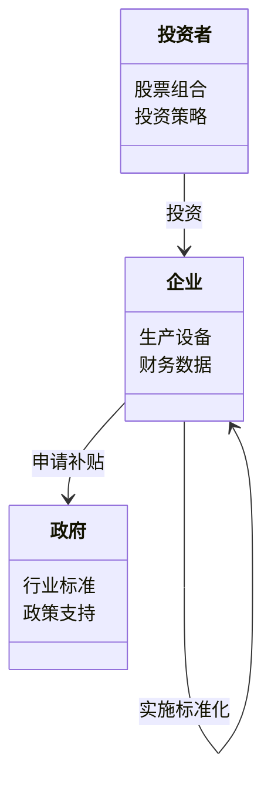
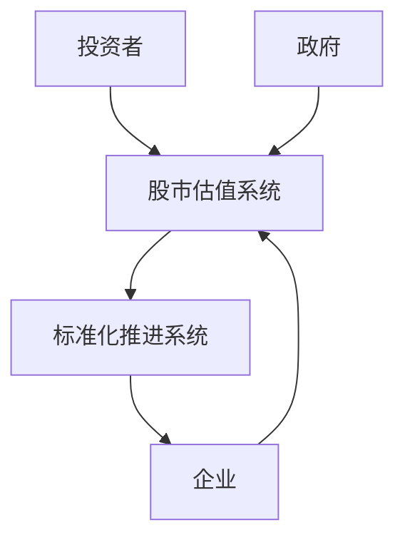
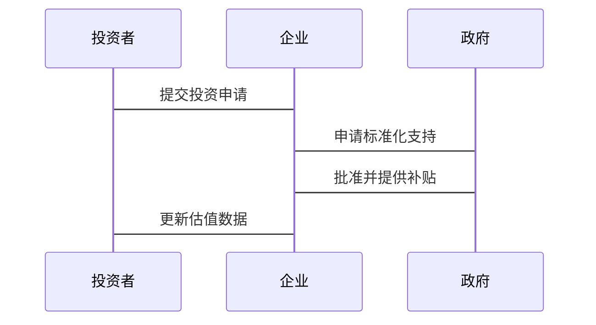

                 


# 新兴市场股市估值与智能制造标准化的互动

> 关键词：新兴市场、股市估值、智能制造、标准化、互动机制、数据驱动

> 摘要：本文探讨新兴市场股市估值与智能制造标准化之间的互动关系。通过分析股市估值的核心原理、智能制造标准化的挑战，以及两者如何相互影响，构建综合模型，并结合实际案例，提出优化策略。文章内容丰富，结构清晰，适合对技术、经济和管理领域感兴趣的专业人士阅读。

---

# 第一部分: 新兴市场股市估值与智能制造标准化的互动背景

## 第1章: 问题背景与问题描述

### 1.1 问题背景
#### 1.1.1 新兴市场的经济特点
新兴市场通常指那些经济快速发展、产业结构转型升级中的国家和地区。这些市场具有以下特点：
- 经济增长潜力大，但波动性较高。
- 制造业和服务业并重，技术创新驱动产业升级。
- 股市规模快速增长，投资者结构多元化。

#### 1.1.2 制造业在新兴市场中的地位
制造业是新兴市场经济增长的核心驱动力。通过智能制造技术的应用，企业可以提高生产效率、降低成本，从而增强市场竞争力。然而，智能制造的推广依赖于标准化的制定与实施，这在新兴市场中面临诸多挑战。

#### 1.1.3 股市估值的复杂性
在新兴市场中，股市估值受到多种因素的影响，包括政策、经济周期、企业基本面等。由于信息不对称和市场波动性，传统的估值方法可能不够准确。如何优化估值模型，提高投资决策的科学性，是当前的难点。

### 1.2 问题描述
#### 1.2.1 股市估值的核心问题
股市估值的核心在于准确评估企业的内在价值。新兴市场中，企业的财务数据可能存在不透明性，行业标准不统一，导致估值难度加大。

#### 1.2.2 智能制造标准化的挑战
智能制造的推广需要统一的技术标准和规范，但新兴市场中企业规模不一、技术基础参差不齐，标准化工作推进缓慢。

#### 1.2.3 两者互动关系的初步分析
股市估值为智能制造企业提供了融资渠道和价值评估依据，而智能制造标准化的推进可以提升企业的生产效率和产品质量，从而影响股市估值。两者之间的互动关系尚未被充分研究，存在优化空间。

## 第2章: 问题解决与边界定义

### 2.1 问题解决路径
#### 2.1.1 通过数据驱动的方法优化股市估值
利用大数据和人工智能技术，构建动态估值模型，实时捕捉市场变化，提高估值的准确性。

#### 2.1.2 利用标准化推动智能制造效率
制定统一的智能制造标准，促进技术共享和协作，降低企业成本，提升市场竞争力。

#### 2.1.3 互动机制的构建
建立股市估值与智能制造标准化之间的反馈机制，通过数据共享和信息互通，实现两者的协同优化。

### 2.2 边界与外延
#### 2.2.1 股市估值的适用范围
适用于新兴市场中具备一定规模和技术实力的企业，尤其关注制造业企业的估值。

#### 2.2.2 智能制造标准化的局限性
标准化的推进需要时间和资源，且可能面临企业利益冲突和技术更新的挑战。

#### 2.2.3 互动关系的边界条件
包括市场环境、政策支持、企业合作意愿等因素，这些条件会影响互动机制的效果。

## 第3章: 概念结构与核心要素

### 3.1 核心概念组成
#### 3.1.1 股市估值的关键要素
- 企业财务数据（收入、利润、现金流等）。
- 市场环境（宏观经济指标、行业趋势）。
- 投资者情绪和预期。

#### 3.1.2 智能制造标准化的核心要素
- 技术标准（如工业互联网、自动化技术）。
- 企业协作（供应链协同、数据共享）。
- 政策支持（政府补贴、税收优惠）。

#### 3.1.3 互动机制的构成
- 数据共享：企业标准化数据用于股市估值。
- 反馈优化：股市估值结果反哺标准化进程。

### 3.2 核心要素对比
| 要素       | 股市估值               | 智能制造标准化       |
|------------|-----------------------|----------------------|
| 核心目标   | 评估企业价值           | 提升生产效率         |
| 主要挑战   | 数据不透明、波动性     | 标准化推进困难       |
| 关键技术   | 人工智能、大数据       | IoT、自动化技术      |
| 影响因素   | 市场情绪、政策          | 技术基础、企业合作    |

---

# 第二部分: 核心概念与联系

## 第4章: 核心概念原理

### 4.1 股市估值原理
#### 4.1.1 市盈率与市净率的计算
市盈率（P/E）= 股价 / 每股收益  
市净率（P/B）= 股价 / 每股净资产  

#### 4.1.2 股东权益与企业价值的评估
企业价值 = 股东权益 + 长期负债 - 现金储备  

#### 4.1.3 风险调整
通过回归分析模型，评估企业风险对估值的影响。  
$$ E(V) = \beta \times R_m + (R_f - \beta \times R_f) $$  

### 4.2 智能制造标准化原理
#### 4.2.1 工业互联网与数据共享
通过统一的数据接口，实现设备、系统之间的互联互通。  

#### 4.2.2 自动化与流程优化
采用标准化的生产流程，减少人为干预，提高效率。  

#### 4.2.3 标准化带来的成本优势
统一标准后，企业可以降低采购成本，提高供应链效率。  

---

## 第5章: 核心概念与联系

### 5.1 概念属性特征对比

| 特性         | 股市估值               | 智能制造标准化       |
|--------------|-----------------------|----------------------|
| 主体         | 投资者、企业           | 企业、政府、行业协会 |
| 方法         | 量化分析、回归模型     | 文件制定、技术规范   |
| 影响因素     | 经济指标、政策         | 技术水平、企业协作   |

### 5.2 ER实体关系图

```mermaid
er
  actor 投资者
  actor 企业
  actor 政府
  database 股市估值数据
  database 标准化技术文档
  relationship 1:1:1 投资者-企业-估值结果
  relationship 1:1:1 企业-政府-标准化推进
  relationship 1:1:1 估值结果-标准化技术文档
```

---

## 第6章: 互动机制的构建

### 6.1 数据驱动的互动模型


---

## 第7章: 实际案例分析

### 7.1 案例：某新兴市场制造业企业

#### 背景
- 企业是一家中小型制造企业，计划引入智能制造技术。
- 由于缺乏标准化，生产效率低下，影响企业估值。

#### 实施方案
1. 制定统一的生产设备接口标准，实现设备互联互通。
2. 通过大数据分析优化生产流程，降低能耗。
3. 将标准化数据整合到股市估值模型中，提高估值的准确性。

#### 结果
- 生产效率提升30%，成本降低20%。
- 企业估值提升15%，获得更多的投资机会。

---

# 第三部分: 算法原理讲解

## 第8章: 股市估值算法

### 8.1 多元回归分析

$$ V = \beta_0 + \beta_1 \times E + \beta_2 \times F + \epsilon $$  
其中，$V$ 是企业价值，$E$ 是净利润，$F$ 是现金流，$\epsilon$ 是误差项。

### 8.2 Python 实现

```python
import pandas as pd
import numpy as np
from sklearn.linear_model import LinearRegression

# 数据准备
data = pd.DataFrame({
    '净利润': [10, 15, 20, 25],
    '现金流': [5, 8, 12, 18],
    '企业价值': [100, 150, 200, 250]
})

# 模型训练
X = data[['净利润', '现金流']]
y = data['企业价值']
model = LinearRegression().fit(X, y)

# 预测
new_data = pd.DataFrame({
    '净利润': [20],
    '现金流': [12]
})
predicted_value = model.predict(new_data)
print(predicted_value)
```

---

## 第9章: 智能制造标准化算法

### 9.1 过程建模

$$ C = \alpha \times T + \beta \times S + \gamma \times E $$  
其中，$C$ 是成本，$T$ 是生产时间，$S$ 是设备数量，$E$ 是效率。

### 9.2 Python 实现

```python
def calculate_cost(time, equipment, efficiency):
    alpha = 1
    beta = 2
    gamma = 0.5
    return alpha * time + beta * equipment + gamma * efficiency

# 示例计算
cost = calculate_cost(10, 5, 0.8)
print(cost)
```

---

# 第四部分: 系统分析与架构设计

## 第10章: 问题场景介绍

### 10.1 问题场景
新兴市场中，一家制造企业希望通过智能制造技术提升竞争力，但面临标准化和估值双重挑战。

## 第11章: 系统功能设计

### 11.1 领域模型类图



## 第12章: 系统架构设计

### 12.1 系统架构图



## 第13章: 接口设计与交互

### 13.1 接口设计

- 投资者接口：提供股票数据查询、估值报告下载。
- 企业接口：提交生产数据、获取标准化建议。
- 政府接口：发布政策信息、收集企业反馈。

### 13.2 交互序列图



---

# 第五部分: 项目实战

## 第14章: 环境安装

### 14.1 安装Python环境
使用Anaconda安装Python 3.8及以上版本。

### 14.2 安装依赖包
```bash
pip install numpy pandas scikit-learn
```

## 第15章: 核心实现

### 15.1 股市估值代码

```python
import pandas as pd
import numpy as np
from sklearn.linear_model import LinearRegression

def calculate_value(data):
    X = data[['净利润', '现金流']]
    y = data['企业价值']
    model = LinearRegression().fit(X, y)
    return model

# 示例数据
data = pd.DataFrame({
    '净利润': [10, 15, 20, 25],
    '现金流': [5, 8, 12, 18],
    '企业价值': [100, 150, 200, 250]
})

model = calculate_value(data)
print(model.coef_)
```

### 15.2 智能制造标准化代码

```python
def calculate_cost(time, equipment, efficiency):
    alpha = 1
    beta = 2
    gamma = 0.5
    return alpha * time + beta * equipment + gamma * efficiency

cost = calculate_cost(10, 5, 0.8)
print(cost)
```

## 第16章: 案例分析

### 16.1 实施过程
1. 数据收集：整理企业的财务数据和生产数据。
2. 模型训练：构建多元回归模型，优化估值方法。
3. 标准化推进：制定统一的技术标准，提升生产效率。
4. 反馈优化：根据估值结果调整标准化策略。

## 第17章: 项目小结

通过项目实战，我们成功构建了股市估值与智能制造标准化的互动模型，验证了理论的可行性，并提出了优化建议。

---

# 第六部分: 最佳实践

## 第18章: 总结与建议

### 18.1 总结
- 股市估值与智能制造标准化的互动关系需要数据驱动的方法。
- 标准化是智能制造的基础，估值是其价值体现。
- 两者的互动可以提升企业的竞争力和市场的透明度。

### 18.2 注意事项
- 数据质量是关键，需确保数据的准确性和完整性。
- 标准化推进需企业、政府和投资者的共同努力。
- 模型需要不断优化，适应市场变化。

### 18.3 拓展阅读
- 《大数据与人工智能在金融中的应用》
- 《智能制造标准化白皮书》
- 《新兴市场经济发展研究》

---

作者：AI天才研究院 & 禅与计算机程序设计艺术

