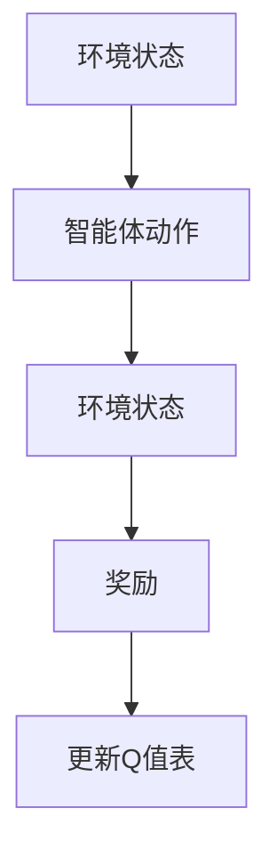
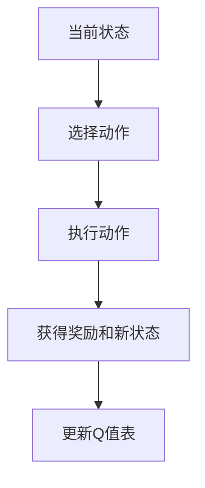
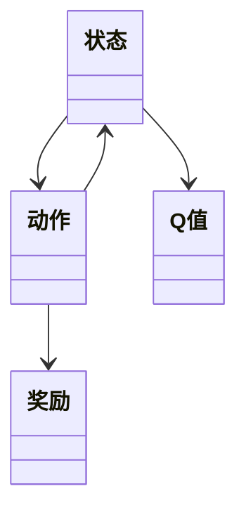
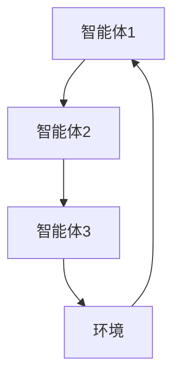
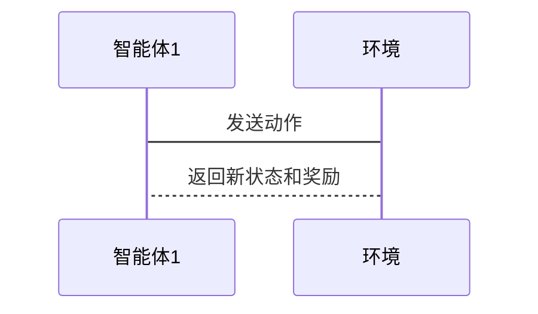

                 


# 深度强化学习在AI Agent协作决策中的应用

## 关键词：
- 深度强化学习
- AI Agent
- 协作决策
- 多智能体系统
- 算法原理

## 摘要：
深度强化学习在AI Agent协作决策中的应用是当前人工智能领域的研究热点。本文系统地介绍了深度强化学习的基本概念、核心算法及其在协作决策中的应用。通过对协作决策的数学模型、系统架构、算法实现等方面进行详细分析，探讨了深度强化学习在多智能体系统中的优势与挑战。文章最后通过实际案例分析，展示了深度强化学习在协作决策中的实际应用，并展望了未来的研究方向。

---

# 第1章: 深度强化学习与AI Agent协作决策基础

## 1.1 深度强化学习的基本概念

### 1.1.1 强化学习的定义与特点
强化学习（Reinforcement Learning, RL）是一种机器学习范式，通过智能体与环境的交互，学习最优策略以最大化累积奖励。其特点包括：
- **延迟反馈**：智能体通过环境的奖励信号调整行为。
- **探索与利用**：在未知环境中，智能体需要在探索新状态和利用已知信息之间找到平衡。
- **在线学习**：通过与环境的实时交互进行学习。

### 1.1.2 深度强化学习的核心思想
深度强化学习（Deep Reinforcement Learning）结合了深度学习的强大表示能力和强化学习的策略优化能力，通过神经网络逼近复杂的策略或值函数。其核心思想包括：
- 使用深度神经网络替代传统的值函数或策略函数。
- 利用经验回放机制（Experience Replay）提高样本利用率。

### 1.1.3 AI Agent的基本概念
AI Agent（智能体）是指在环境中能够感知并自主决策的实体。AI Agent可以是软件程序或物理机器人，通过与环境交互实现目标。AI Agent的核心特征包括：
- **自主性**：能够在没有外部干预的情况下运行。
- **反应性**：能够实时感知环境并做出反应。
- **目标导向性**：基于目标函数进行决策。

## 1.2 AI Agent的协作决策问题

### 1.2.1 协作决策的定义与特点
协作决策（Collaborative Decision Making）是指多个智能体通过协作，共同完成复杂任务的过程。其特点包括：
- **分布式决策**：每个智能体独立决策，但通过协作实现全局目标。
- **信息共享**：智能体之间可以共享信息，提高决策效率。
- **动态性**：环境动态变化，协作策略需要实时调整。

### 1.2.2 多智能体系统中的协作问题
多智能体系统（Multi-Agent System, MAS）由多个智能体组成，每个智能体负责特定任务。协作问题包括：
- **通信机制**：如何高效地共享信息。
- **协调策略**：如何避免冲突，实现协作。
- **动态协调**：如何应对环境的动态变化。

### 1.2.3 深度强化学习在协作决策中的应用
深度强化学习在协作决策中的应用主要体现在：
- **多智能体强化学习**：通过深度神经网络建模多智能体协作。
- **分布式决策**：利用深度强化学习算法实现智能体之间的协作。

## 1.3 本章小结
本章介绍了深度强化学习和AI Agent的基本概念，并探讨了协作决策的问题和挑战。通过理解这些基础概念，为后续章节的深入分析奠定了基础。

---

# 第2章: 深度强化学习的核心概念与联系

## 2.1 深度强化学习的原理

### 2.1.1 Q-learning算法
Q-learning是一种经典的强化学习算法，通过更新Q值表来学习最优策略。其算法流程如下：



Q值更新公式为：
$$ Q(s, a) = Q(s, a) + \alpha (r + \gamma \max Q(s', a')) $$

### 2.1.2 DQN算法的改进与优化
DQN（Deep Q-Network）通过神经网络逼近Q值函数，引入经验回放机制。其改进包括：
- **经验回放**：将经验存储在记忆库中，随机抽取样本训练。
- **目标网络**：使用目标网络稳定值函数的更新。

### 2.1.3 多智能体强化学习的挑战
多智能体强化学习（MARL）面临以下挑战：
- **通信开销**：智能体之间的通信需要额外的计算资源。
- **协调困难**：多个智能体需要协调一致，避免冲突。
- **动态环境**：环境的动态变化增加了协作的难度。

## 2.2 AI Agent协作决策的数学模型

### 2.2.1 单智能体决策模型
单智能体决策模型可以表示为马尔可夫决策过程（MDP）：
$$ \text{最大化} \quad \sum_{t=1}^\infty \gamma^{t-1} r_t $$
其中，$\gamma$ 是折扣因子，$r_t$ 是奖励。

### 2.2.2 多智能体协作模型
多智能体协作模型可以表示为：
$$ \max_{\theta} \sum_{i=1}^n Q_i(s_i, a_i) $$
其中，$n$ 是智能体数量，$Q_i$ 是智能体$i$的Q值函数。

### 2.2.3 协作决策的数学表达式
协作决策的数学表达式可以表示为：
$$ \max_{a_1, a_2, \ldots, a_n} \sum_{i=1}^n r_i(a_i, s_i) $$
其中，$a_i$ 是智能体$i$的动作，$s_i$ 是智能体$i$的状态。

## 2.3 深度强化学习与协作决策的关系

### 2.3.1 深度强化学习在协作决策中的优势
深度强化学习在协作决策中的优势包括：
- **强大的表示能力**：深度神经网络能够处理复杂的环境状态。
- **端到端学习**：可以直接从原始数据中学习策略，无需手动设计特征。

### 2.3.2 协作决策对深度强化学习的挑战
协作决策对深度强化学习的挑战包括：
- **通信复杂性**：多智能体之间的通信增加了系统的复杂性。
- **动态协调**：协作策略需要实时调整以应对环境的变化。

### 2.3.3 两者结合的未来发展方向
未来发展方向包括：
- **分布式深度强化学习**：探索分布式算法在多智能体系统中的应用。
- **跨领域协作**：将深度强化学习应用于更多领域，如机器人协作、自动驾驶等。

## 2.4 本章小结
本章详细介绍了深度强化学习的核心概念，并探讨了其在协作决策中的应用。通过数学模型和算法分析，为后续章节的深入研究奠定了基础。

---

# 第3章: 深度强化学习的算法原理

## 3.1 Q-learning算法

### 3.1.1 算法流程
Q-learning算法的流程如下：



Q值更新公式为：
$$ Q(s, a) = Q(s, a) + \alpha (r + \gamma \max Q(s', a')) $$

### 3.1.2 Q值更新公式
Q值更新公式展示了如何通过奖励和未来状态的价值来更新当前状态的动作价值。

### 3.1.3 算法优缺点
- **优点**：简单易实现，适用于离线环境。
- **缺点**：在动态环境中表现不佳，需要频繁更新Q值表。

## 3.2 DQN算法

### 3.2.1 算法改进思路
DQN通过引入经验回放机制和目标网络，提高了算法的稳定性和收敛性。

### 3.2.2 网络结构设计
DQN的网络结构通常包括输入层、隐藏层和输出层，用于逼近Q值函数。

### 3.2.3 经验回放机制
经验回放机制通过存储和重放经验，减少了样本之间的相关性，提高了学习效率。

## 3.3 多智能体强化学习算法

### 3.3.1 MAPO算法
MAPO（Multi-Agent Policy Optimization）是一种基于策略优化的多智能体算法，通过优化联合策略来实现协作。

### 3.3.2 COMA算法
COMA（Coordination and Competition）算法通过引入竞争机制，优化每个智能体的策略，实现协作。

### 3.3.3 QMIX算法
QMIX算法通过将多智能体的Q值函数混合，形成一个全局Q值函数，实现协作决策。

## 3.4 本章小结
本章详细介绍了深度强化学习的核心算法，包括Q-learning、DQN和多智能体强化学习算法。通过这些算法的分析，读者可以理解深度强化学习在协作决策中的实现方法。

---

# 第4章: 深度强化学习的数学模型与公式

## 4.1 Q-learning的数学模型

### 4.1.1 Q值更新公式
Q值更新公式为：
$$ Q(s, a) = Q(s, a) + \alpha (r + \gamma \max Q(s', a')) $$

### 4.1.2 状态转移概率
状态转移概率可以表示为：
$$ P(s' | s, a) $$

### 4.1.3 奖励函数设计
奖励函数设计需要根据具体任务定义，例如：
$$ r(s, a, s') = \text{奖励值} $$

## 4.2 DQN的数学模型

### 4.2.1 神经网络结构
DQN的神经网络结构包括输入层、隐藏层和输出层，用于逼近Q值函数。

### 4.2.2 损失函数计算
DQN的损失函数为：
$$ L = \mathbb{E}[(r + \gamma Q(s', a')) - Q(s, a)]^2 $$

### 4.2.3 经验回放机制
经验回放机制通过存储和重放经验，减少了样本之间的相关性，提高了学习效率。

## 4.3 多智能体协作的数学模型

### 4.3.1 单智能体价值函数
单智能体价值函数可以表示为：
$$ V(s) = \max_a Q(s, a) $$

### 4.3.2 多智能体协作策略
多智能体协作策略可以表示为：
$$ \pi(a | s) = \arg \max_a Q(s, a) $$

### 4.3.3 协作决策的数学表达式
协作决策的数学表达式可以表示为：
$$ \max_{a_1, a_2, \ldots, a_n} \sum_{i=1}^n Q(s_i, a_i) $$

## 4.4 本章小结
本章通过数学模型和公式，详细介绍了深度强化学习的实现方法。这些模型和公式为后续章节的系统分析和项目实战奠定了理论基础。

---

# 第5章: 深度强化学习的系统分析与架构设计

## 5.1 协作决策系统的需求分析

### 5.1.1 系统功能需求
协作决策系统需要实现以下功能：
- **环境感知**：感知环境状态。
- **决策制定**：基于环境状态制定决策。
- **协作通信**：智能体之间进行通信和协作。

### 5.1.2 系统性能需求
系统性能需求包括：
- **实时性**：决策需要快速响应。
- **可靠性**：系统需要稳定运行。
- **可扩展性**：支持多个智能体协作。

### 5.1.3 系统安全需求
系统安全需求包括：
- **数据安全**：防止数据泄露。
- **系统防护**：防止恶意攻击。

## 5.2 系统功能设计

### 5.2.1 领域模型
领域模型可以表示为：



### 5.2.2 系统架构设计
系统架构设计可以表示为：



### 5.2.3 系统接口设计
系统接口设计包括：
- **输入接口**：接收环境状态和智能体动作。
- **输出接口**：输出奖励和新状态。

### 5.2.4 系统交互设计
系统交互设计可以表示为：



## 5.3 本章小结
本章通过系统分析和架构设计，详细介绍了协作决策系统的实现方法。通过领域模型和架构图，读者可以清晰理解系统的设计思路。

---

# 第6章: 深度强化学习的项目实战

## 6.1 环境安装

### 6.1.1 安装Python
安装Python：
```bash
# 在终端中运行
sudo apt-get install python3
```

### 6.1.2 安装深度强化学习库
安装TensorFlow和Keras：
```bash
pip install tensorflow keras
```

### 6.1.3 安装其他依赖
安装其他依赖：
```bash
pip install gym matplotlib numpy
```

## 6.2 系统核心实现源代码

### 6.2.1 Q-learning算法实现
Q-learning算法实现：

```python
import numpy as np

class QLearning:
    def __init__(self, state_space, action_space, gamma=0.99, alpha=0.1):
        self.state_space = state_space
        self.action_space = action_space
        self.gamma = gamma
        self.alpha = alpha
        self.q_table = np.zeros((state_space, action_space))
    
    def choose_action(self, state):
        return np.argmax(self.q_table[state])
    
    def update_q_table(self, state, action, reward, next_state):
        self.q_table[state, action] += self.alpha * (reward + self.gamma * np.max(self.q_table[next_state]) - self.q_table[state, action])
```

### 6.2.2 DQN算法实现
DQN算法实现：

```python
import numpy as np
import tensorflow as tf

class DQN:
    def __init__(self, input_dim, output_dim, gamma=0.99, epsilon=0.1):
        self.input_dim = input_dim
        self.output_dim = output_dim
        self.gamma = gamma
        self.epsilon = epsilon
        self.model = self.build_model()
        self.target_model = self.build_model()
        self.update_target_weights()
    
    def build_model(self):
        model = tf.keras.Sequential([
            tf.keras.layers.Dense(64, activation='relu', input_dim=self.input_dim),
            tf.keras.layers.Dense(64, activation='relu'),
            tf.keras.layers.Dense(self.output_dim, activation='linear')
        ])
        return model
    
    def update_target_weights(self):
        self.target_model.set_weights(self.model.get_weights())
    
    def choose_action(self, state):
        if np.random.random() < self.epsilon:
            return np.random.randint(self.output_dim)
        state = np.array([state])
        predictions = self.model.predict(state)
        return np.argmax(predictions[0])
    
    def remember(self, state, action, reward, next_state):
        self.memory.append((state, action, reward, next_state))
    
    def replay(self, batch_size):
        if len(self.memory) < batch_size:
            return
        minibatch = random.sample(self.memory, batch_size)
        x = []
        y = []
        for state, action, reward, next_state in minibatch:
            state = np.array([state])
            next_state = np.array([next_state])
            target = self.target_model.predict(state)
            target[0][action] = reward + self.gamma * np.max(self.target_model.predict(next_state)[0])
            x.append(state)
            y.append(target)
        self.model.fit(np.array(x), np.array(y), batch_size=batch_size, epochs=1, verbose=0)
```

## 6.3 代码应用解读与分析

### 6.3.1 Q-learning算法解读
Q-learning算法通过更新Q值表实现策略优化。选择动作时，算法会根据当前状态选择最大的Q值动作。

### 6.3.2 DQN算法解读
DQN算法通过神经网络逼近Q值函数，引入经验回放机制和目标网络，提高了算法的稳定性和收敛性。

## 6.4 实际案例分析

### 6.4.1 环境描述
以OpenAI Gym中的CartPole环境为例，智能体需要通过控制杆的位置，保持杆子不倒。

### 6.4.2 训练过程
训练过程如下：

```python
# 初始化环境和智能体
env = gym.make('CartPole-v0')
agent = DQN(4, 2)

for episode in range(1000):
    state = env.reset()
    for _ in range(200):
        action = agent.choose_action(state)
        next_state, reward, done, _ = env.step(action)
        agent.remember(state, action, reward, next_state)
        agent.replay(32)
        state = next_state
        if done:
            break
```

### 6.4.3 训练结果
通过训练，智能体能够掌握控制杆子不倒的策略。

## 6.5 项目小结
本章通过实际案例分析，展示了深度强化学习在协作决策中的应用。通过代码实现和训练过程，读者可以理解深度强化学习的实现方法。

---

# 第7章: 最佳实践与未来展望

## 7.1 最佳实践 tips

### 7.1.1 算法选择
根据具体任务选择合适的算法，如Q-learning适用于简单任务，DQN适用于复杂任务。

### 7.1.2 网络结构设计
网络结构设计需要考虑任务需求和数据特征，选择合适的层数和神经元数量。

### 7.1.3 超参数调优
超参数调优是关键，可以通过网格搜索或随机搜索找到最优参数。

## 7.2 小结
通过最佳实践，读者可以提高深度强化学习算法的性能和效果。

## 7.3 注意事项

### 7.3.1 环境设置
确保环境设置正确，避免因环境问题导致算法失败。

### 7.3.2 数据预处理
数据预处理是关键，需要根据具体任务选择合适的方法。

### 7.3.3 算法优化
算法优化是提高性能的重要手段，可以通过并行计算和分布式训练加速训练过程。

## 7.4 拓展阅读
推荐读者阅读以下书籍和论文：
- 《Deep Reinforcement Learning》
- 《Multi-Agent Reinforcement Learning》

---

# 作者：AI天才研究院/AI Genius Institute & 禅与计算机程序设计艺术 /Zen And The Art of Computer Programming

