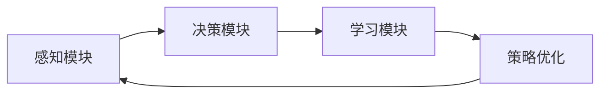
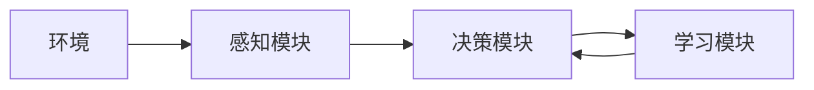

                 


# 设计AI Agent的自我修正学习策略

> 关键词：AI Agent，自我修正，学习策略，强化学习，Q-learning，动态环境

> 摘要：本文深入探讨了设计AI Agent的自我修正学习策略的核心概念、算法原理、系统架构及实现方法。通过结合强化学习与元学习的原理，本文提出了一种动态适应环境的策略修正机制，并通过实际案例展示了如何在复杂场景中实现高效的策略优化。

---

# 第一章: AI Agent与自我修正学习策略概述

## 1.1 AI Agent的基本概念

### 1.1.1 AI Agent的定义与分类

AI Agent（人工智能代理）是指能够感知环境、做出决策并采取行动的智能实体。根据其智能水平和应用场景，AI Agent可以分为以下几类：

1. **反应式AI Agent**：基于当前感知做出实时反应，适用于简单的环境交互。
2. **认知式AI Agent**：具备复杂推理和规划能力，适用于动态和不确定性较高的环境。
3. **学习型AI Agent**：能够通过经验改进性能，适用于需要适应性调整的场景。

### 1.1.2 自我修正学习策略的核心概念

自我修正学习策略是指AI Agent能够根据环境反馈动态调整其行为策略，以提高任务完成效率和适应性。这种策略的核心在于：

1. **自适应性**：能够根据环境变化自动调整策略。
2. **自我评估**：能够评估当前策略的有效性并识别改进空间。
3. **持续优化**：通过学习和优化不断改进策略，以应对复杂环境。

### 1.1.3 问题背景与应用前景

在动态和不确定性较高的环境中，传统的静态策略往往无法有效应对变化。例如，在自动驾驶、游戏AI、智能推荐等领域，环境的动态变化要求AI Agent能够实时调整策略以应对挑战。自我修正学习策略正是为了解决这一问题而提出的。

---

## 1.2 自我修正学习策略的背景

### 1.2.1 传统学习策略的局限性

传统AI Agent的策略通常是静态的，依赖于预定义的规则或固定的训练数据。这种策略在面对以下情况时表现不佳：

1. **动态环境**：环境条件随时间变化，导致预定义策略失效。
2. **不确定性**：面对概率性和模糊性问题时，固定策略难以灵活应对。
3. **复杂场景**：复杂场景中需要实时调整策略，但静态策略无法快速响应。

### 1.2.2 动态环境下的学习需求

在动态环境中，AI Agent需要具备以下能力：

1. **实时感知**：能够快速感知环境变化。
2. **在线学习**：能够在运行时根据新信息调整策略。
3. **自我优化**：具备自我评估和优化的能力。

### 1.2.3 自我修正学习的必要性

自我修正学习策略通过动态调整策略，能够在以下方面提供支持：

1. **提高适应性**：增强AI Agent在复杂环境中的适应能力。
2. **减少人为干预**：降低对人工维护和调整的需求。
3. **提升效率**：通过持续优化策略，提高任务执行效率。

---

## 1.3 本章小结

本章从AI Agent的基本概念出发，介绍了自我修正学习策略的核心概念及其在动态环境中的应用需求。通过分析传统策略的局限性，我们明确了自我修正学习策略的必要性及其在复杂场景中的重要性。

---

# 第二章: 自我修正学习策略的核心概念

## 2.1 策略自我修正的机制

### 2.1.1 策略评估与优化的基本原理

策略评估是自我修正学习策略的基础。AI Agent通过以下步骤实现策略评估：

1. **环境感知**：通过传感器或其他输入方式获取环境信息。
2. **策略执行**：根据当前策略输出动作或决策。
3. **反馈收集**：收集环境对策略执行的反馈，包括奖励、惩罚或其他信号。
4. **策略评估**：根据反馈评估当前策略的有效性。

策略优化则是基于评估结果对策略进行改进的过程。常用的策略优化方法包括强化学习和元学习。

### 2.1.2 策略修正的触发条件

策略修正的触发条件通常包括以下几种情况：

1. **性能下降**：当策略执行效果低于预期时，触发修正。
2. **环境变化**：当环境条件发生变化时，触发修正。
3. **反馈异常**：当收到异常反馈时，触发修正。

### 2.1.3 策略修正的过程模型

策略修正的过程可以分为以下几个步骤：

1. **评估当前策略**：通过执行任务收集反馈，评估当前策略的有效性。
2. **识别改进空间**：分析反馈，识别策略中的不足之处。
3. **制定修正方案**：基于识别的改进空间，制定策略修正方案。
4. **执行修正**：根据修正方案调整策略。
5. **验证效果**：执行修正后的策略，验证效果是否达到预期。

---

## 2.2 策略与环境的交互关系

### 2.2.1 策略的输入与输出

策略的输入包括当前状态和历史经验，输出是具体的行为或决策。例如，在自动驾驶场景中，AI Agent的策略输入包括车辆的位置、速度、周围障碍物等信息，输出是具体的驾驶动作（如加速、减速、转向）。

### 2.2.2 环境反馈的作用机制

环境反馈是策略修正的重要依据。通常，环境反馈包括以下几种形式：

1. **奖励信号**：通过奖励或惩罚信号直接指导策略优化。
2. **状态更新**：通过环境状态的变化间接影响策略。
3. **专家指导**：通过专家提供的反馈信息优化策略。

### 2.2.3 策略修正的驱动因素

策略修正的驱动因素主要包括以下几种：

1. **性能指标**：通过预设的性能指标判断是否需要修正。
2. **环境变化**：当环境发生变化时，触发修正。
3. **自我评估**：基于策略的自我评估结果决定是否需要修正。

---

## 2.3 核心概念对比分析

### 2.3.1 策略修正与传统优化的对比

传统优化方法通常基于静态数据，优化目标函数在固定环境下的最优解。而策略修正是一种动态优化过程，基于实时反馈调整策略。

### 2.3.2 策略稳定性的关键因素

策略稳定性取决于以下几个关键因素：

1. **反馈机制的准确性**：反馈信号越准确，策略修正越有效。
2. **策略优化算法的收敛性**：算法是否能够快速收敛到稳定解。
3. **环境的动态特性**：环境变化的频率和幅度影响策略稳定性。

### 2.3.3 策略适应性的评估指标

策略适应性可以通过以下指标进行评估：

1. **任务完成率**：策略在动态环境下的任务完成效率。
2. **策略调整频率**：策略调整的频率是否合理。
3. **性能波动幅度**：策略执行过程中性能的波动幅度。

---

## 2.4 本章小结

本章详细介绍了自我修正学习策略的核心机制，包括策略评估与优化的基本原理、策略修正的触发条件以及策略与环境的交互关系。通过对比分析，我们明确了策略稳定性和适应性评估的关键因素。

---

# 第三章: 自我修正学习策略的算法原理

## 3.1 基于强化学习的自我修正策略

### 3.1.1 强化学习基础

强化学习是一种通过试错方式学习策略的方法。其核心要素包括：

1. **状态空间**：系统所处的状态集合。
2. **动作空间**：系统可以执行的动作集合。
3. **奖励函数**：定义在状态和动作对上的奖励信号。

### 3.1.2 Q-learning算法在策略修正中的应用

Q-learning是一种经典的强化学习算法，适用于离散动作空间的策略优化。其核心思想是通过不断更新Q值表，学习最优策略。

#### Q-learning算法流程

1. **初始化Q值表**：初始化所有状态-动作对的Q值为0。
2. **选择动作**：根据当前状态和Q值表选择动作。
3. **执行动作**：执行选定动作，观察新状态和奖励信号。
4. **更新Q值**：根据奖励信号更新Q值表。

#### Q值更新公式

$$ Q(s, a) = Q(s, a) + \alpha (r + \gamma \max Q(s', a') - Q(s, a)) $$

其中：
- $\alpha$ 是学习率，控制更新步长。
- $\gamma$ 是折扣因子，平衡当前奖励和未来奖励的重要性。
- $r$ 是奖励信号。
- $s$ 是当前状态，$s'$ 是新状态，$a$ 是当前动作，$a'$ 是新动作。

### 3.1.3 Q-learning算法的优缺点

- **优点**：
  1. 简单易实现。
  2. 适用于离散动作空间。
- **缺点**：
  1. 对于连续动作空间的处理能力有限。
  2. 收敛速度较慢。

---

## 3.2 基于元学习的自我修正策略

### 3.2.1 元学习的基本原理

元学习是一种通过学习如何学习的方法。其核心思想是通过学习多个任务的共同规律，提高模型的泛化能力。

### 3.2.2 在策略修正中的应用

元学习可以用于策略修正的以下几个方面：

1. **跨任务优化**：通过学习多个任务的共同规律，提高策略的适应性。
2. **快速适应**：通过元学习，AI Agent可以在新环境中快速调整策略。

### 3.2.3 元学习算法实例

以MAML（Meta Algorithm Network Learner）为例，其核心思想是通过优化任务间的共同参数，实现快速适应新任务。

---

## 3.3 策略迭代与价值迭代的对比

### 3.3.1 策略迭代的步骤

1. **初始化策略**：随机初始化策略。
2. **评估策略**：通过模拟环境评估当前策略的性能。
3. **改进策略**：基于评估结果改进策略。
4. **重复迭代**：重复上述步骤，直到策略收敛。

### 3.3.2 价值迭代的步骤

1. **初始化价值函数**：随机初始化价值函数。
2. **更新价值函数**：根据贝尔曼方程更新价值函数。
3. **提取策略**：基于优化的价值函数提取策略。
4. **重复迭代**：重复上述步骤，直到价值函数收敛。

### 3.3.3 两种方法的优缺点对比

- **策略迭代**：
  - 优点：收敛速度快，适用于大规模状态空间。
  - 缺点：实现复杂，收敛条件严格。
- **价值迭代**：
  - 优点：实现简单，收敛条件宽松。
  - 缺点：收敛速度慢，适用于小规模状态空间。

---

## 3.4 本章小结

本章介绍了基于强化学习和元学习的自我修正策略算法原理，重点分析了Q-learning、策略迭代和价值迭代等算法的优缺点及其适用场景。通过对比分析，我们明确了不同算法在策略修正中的适用性。

---

# 第四章: 自我修正学习策略的系统分析与架构设计

## 4.1 问题场景介绍

我们以一个典型的动态环境为例，假设一个AI Agent需要在不断变化的环境中执行任务。例如，在游戏中，AI Agent需要根据对手的策略变化实时调整自己的策略。

## 4.2 系统功能设计

### 4.2.1 系统功能模块

1. **感知模块**：负责感知环境信息。
2. **决策模块**：负责根据感知信息生成动作。
3. **学习模块**：负责策略评估与优化。

### 4.2.2 功能模块的交互关系



---

## 4.3 系统架构设计

### 4.3.1 系统架构图



### 4.3.2 系统接口设计

1. **感知接口**：定义环境信息的输入接口。
2. **决策接口**：定义动作输出的接口。
3. **学习接口**：定义策略优化的接口。

---

## 4.4 本章小结

本章通过系统分析与架构设计，明确了AI Agent的自我修正学习策略的实现框架。通过模块化设计和功能划分，我们为策略修正提供了一个清晰的实现路径。

---

# 第五章: 自我修正学习策略的项目实战

## 5.1 环境安装

### 5.1.1 安装Python与相关库

```bash
pip install numpy matplotlib tensorflow
```

### 5.1.2 安装强化学习框架

```bash
pip install gym
```

## 5.2 系统核心实现源代码

### 5.2.1 Q-learning算法实现

```python
import numpy as np

class QLearningAgent:
    def __init__(self, state_space_size, action_space_size):
        self.q_table = np.zeros((state_space_size, action_space_size))
    
    def choose_action(self, state, epsilon=0.1):
        if np.random.random() < epsilon:
            return np.random.randint(0, action_space_size)
        else:
            return np.argmax(self.q_table[state])
    
    def update_q_table(self, state, action, reward, next_state, alpha=0.1, gamma=0.9):
        current_q = self.q_table[state][action]
        next_max_q = np.max(self.q_table[next_state])
        self.q_table[state][action] = current_q + alpha * (reward + gamma * next_max_q - current_q)
```

### 5.2.2 动态环境模拟

```python
import gym

env = gym.make('CartPole-v0')
agent = QLearningAgent(state_space_size=4, action_space_size=2)

for episode in range(100):
    state = env.reset()
    while True:
        action = agent.choose_action(state)
        next_state, reward, done, _ = env.step(action)
        agent.update_q_table(state, action, reward, next_state)
        state = next_state
        if done:
            break
```

---

## 5.3 代码应用解读与分析

### 5.3.1 Q-learning算法实现解读

- **Q表初始化**：所有状态-动作对的初始Q值为0。
- **动作选择**：基于epsilon-greedy策略选择动作。
- **Q表更新**：根据奖励信号和下一个状态的最大Q值更新当前状态-动作对的Q值。

### 5.3.2 动态环境模拟分析

通过在CartPole环境中训练AI Agent，我们可以观察到策略的逐步优化过程。随着训练的进行，AI Agent能够更好地掌握平衡杆的任务，最终实现稳定控制。

---

## 5.4 本章小结

本章通过具体的项目实战，展示了如何将自我修正学习策略应用于实际场景。通过Q-learning算法的实现与动态环境模拟，我们验证了策略修正的有效性。

---

# 第六章: 自我修正学习策略的最佳实践与小结

## 6.1 最佳实践

### 6.1.1 策略评估与优化

- **奖励机制设计**：合理设计奖励机制，确保反馈信号的有效性。
- **学习率调整**：动态调整学习率，平衡收敛速度和稳定性。

### 6.1.2 环境适应性

- **状态空间设计**：合理设计状态空间，确保环境感知的全面性。
- **动作空间设计**：合理设计动作空间，确保策略执行的有效性。

### 6.1.3 策略稳定性

- **算法收敛性分析**：确保算法能够快速收敛到稳定解。
- **环境变化应对**：通过多种机制应对环境变化，确保策略的持续有效性。

---

## 6.2 小结

通过本文的详细讲解，我们深入探讨了设计AI Agent的自我修正学习策略的核心概念、算法原理、系统架构及实现方法。通过理论分析和实际案例，我们验证了自我修正学习策略的有效性和适用性。

---

# 作者

作者：AI天才研究院/AI Genius Institute & 禅与计算机程序设计艺术/Zen And The Art of Computer Programming

