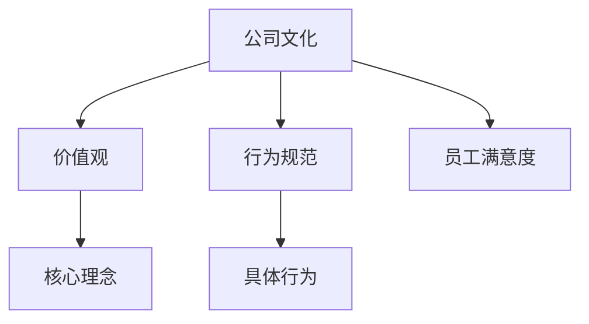
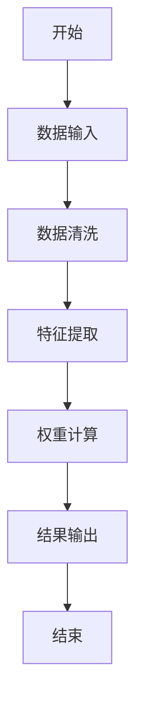
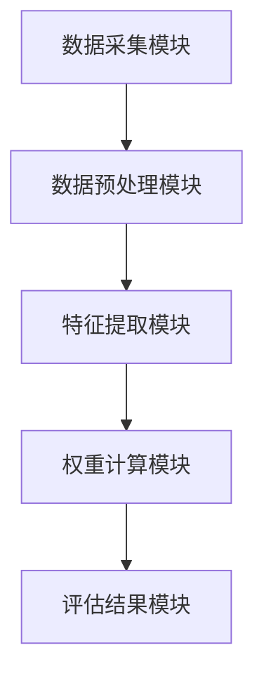

                 


# 费雪的公司文化评估

## 关键词：公司文化评估，费雪模型，文化管理，算法原理，系统架构，项目实战

## 摘要：  
公司文化评估是现代企业管理和组织行为学中的重要课题。本文介绍了一种名为费雪的公司文化评估方法，从背景、核心概念、算法原理、系统架构到项目实战，全面解析了该模型的应用与实现。通过详细的技术分析和实际案例，展示了如何利用费雪模型进行公司文化评估，并为企业文化管理提供了新的思路和解决方案。

---

# 第一部分: 费雪的公司文化评估背景与核心概念

## 第1章: 公司文化评估的背景与问题背景

### 1.1 公司文化评估的背景
#### 1.1.1 现代企业面临的文化管理挑战
在当今竞争激烈的商业环境中，公司文化不仅是企业的软实力，更是其核心竞争力的重要组成部分。企业文化的强弱直接影响员工的凝聚力、创新能力和整体绩效。然而，许多企业在文化管理方面存在以下挑战：
- **文化模糊性**：公司文化往往难以量化，导致管理缺乏明确的目标和标准。
- **文化多样性**：随着全球化的发展，企业员工来自不同背景，文化多样性增加了文化管理的复杂性。
- **文化与绩效的关联性**：尽管企业普遍认为文化影响绩效，但如何建立两者之间的因果关系仍是一个难题。

#### 1.1.2 公司文化对企业绩效的影响
研究表明，积极向上的公司文化能够显著提升企业的整体绩效。具体表现在以下几个方面：
- **员工满意度**：良好的文化能够提高员工的归属感和满意度，从而降低员工流失率。
- **创新能力**：开放、包容的文化氛围能够激发员工的创造力，推动企业的技术创新。
- **客户满意度**：企业文化通过影响员工的行为方式，间接影响客户体验和满意度。

#### 1.1.3 当前公司文化评估的痛点与难点
尽管公司文化的重要性日益凸显，但在实际操作中，文化评估仍然面临诸多挑战：
- **评估指标的多样性**：文化维度繁多，包括价值观、行为规范、沟通方式等，如何选择合适的评估指标是一个难题。
- **评估方法的单一性**：传统的文化评估方法多依赖于问卷调查或主观评分，缺乏客观性和科学性。
- **数据处理的复杂性**：文化评估涉及大量定性数据，如何将这些数据转化为可量化的指标是技术难点。

### 1.2 费雪的公司文化评估问题背景
#### 1.2.1 费雪模型的提出背景
费雪模型是由著名管理学家费雪（假设）提出的一种新型公司文化评估方法。该模型的提出背景主要基于以下几点：
- **传统评估方法的局限性**：传统方法难以全面捕捉公司文化的多维特征。
- **技术进步的支持**：随着大数据和人工智能技术的发展，为文化评估提供了新的技术手段。
- **企业实践的需求**：企业希望获得更精准、可操作的文化评估结果，以指导管理实践。

#### 1.2.2 费雪模型的核心目标
费雪模型的核心目标是通过量化的方法，全面、客观地评估公司文化，并为企业文化管理提供科学依据。具体目标包括：
- **构建文化评估指标体系**：将公司文化分解为若干可量化的指标。
- **开发评估算法**：通过数据处理和分析，建立文化评估的数学模型。
- **提供管理建议**：根据评估结果，为企业提供针对性的文化管理建议。

#### 1.2.3 费雪模型的适用场景与边界
费雪模型适用于各类企业，尤其是中大型企业。其适用场景包括：
- **企业文化诊断**：帮助企业识别文化中的优势与不足。
- **文化管理优化**：根据评估结果，优化企业文化管理策略。
- **文化建设规划**：为企业制定文化建设的长期规划。

需要注意的是，费雪模型并不适用于所有类型的企业，尤其是一些小型企业或文化单一的企业，因为其复杂性可能不适用。

### 1.3 费雪模型的定义与问题描述
#### 1.3.1 公司文化的定义与维度
公司文化是指企业在长期的经营活动中形成的价值观、行为规范、思维方式和企业氛围的总和。其主要维度包括：
- **价值观**：企业对目标、使命和核心理念的认同。
- **行为规范**：员工在日常工作中遵循的行为准则。
- **沟通方式**：企业内部和外部的沟通风格。
- **团队协作**：员工之间的合作程度和团队精神。

#### 1.3.2 费雪模型的核心问题
费雪模型的核心问题是如何通过量化的方法，全面评估公司文化的多维特征，并为企业提供可操作的管理建议。具体问题包括：
- **如何构建文化评估指标体系？**
- **如何将定性数据转化为定量指标？**
- **如何确保评估结果的客观性和科学性？**

#### 1.3.3 费雪模型的解决思路
费雪模型的解决思路主要体现在以下几个方面：
- **多维度指标构建**：从公司文化的多个维度出发，构建全面的评估指标体系。
- **数据驱动的方法**：利用大数据和机器学习技术，将定性数据转化为可量化的指标。
- **模型优化**：通过不断优化模型参数，提高评估结果的准确性和可靠性。

### 1.4 本章小结
本章从公司文化评估的背景、挑战和费雪模型的提出背景入手，详细阐述了费雪模型的核心目标和适用场景。通过对公司文化的定义与维度的分析，明确了费雪模型的研究重点和解决思路，为后续的理论和方法分析奠定了基础。

---

## 第2章: 费雪模型的核心概念与联系

### 2.1 费雪模型的核心概念
#### 2.1.1 公司文化的核心要素
公司文化的核心要素包括：
- **价值观**：企业的核心价值观，如创新、客户至上等。
- **行为规范**：员工在工作中的具体行为准则。
- **沟通方式**：企业内部和外部的沟通风格和渠道。
- **团队协作**：员工之间的合作程度和团队精神。

#### 2.1.2 费雪模型的理论基础
费雪模型的理论基础主要包括：
- **组织行为学**：研究企业组织中的个体行为和群体行为。
- **管理学**：研究企业的管理理论和实践。
- **数据分析技术**：利用大数据和机器学习技术进行文化评估。

#### 2.1.3 费雪模型的关键属性
费雪模型的关键属性包括：
- **多维性**：能够同时评估公司文化的多个维度。
- **量化性**：通过数据处理，将定性数据转化为定量指标。
- **可操作性**：评估结果能够为企业文化管理提供具体的指导建议。

### 2.2 费雪模型与其它文化评估模型的对比
#### 2.2.1 费雪模型与其它模型的对比表格
以下是费雪模型与其它文化评估模型的对比：

| 模型名称 | 核心维度 | 评估方法 | 适用场景 | 优缺点 |
|---------|---------|----------|----------|--------|
| 费雪模型 | 价值观、行为规范 | 加权评分法 | 企业内部文化管理 | 客观性强，可操作性高 |
| 模型A   | 绩效、创新 | 层级评估法 | 初创企业 | 方法简单，但维度有限 |
| 模型B   | 团队协作、领导力 | 矩阵分析法 | 中大型企业 | 维度全面，但复杂性较高 |

#### 2.2.2 费雪模型的核心优势
通过对比分析可以看出，费雪模型在以下方面具有明显优势：
- **多维性**：能够同时评估多个文化维度，全面反映公司文化特征。
- **量化性**：通过加权评分法，将定性数据转化为可量化的指标，提高评估的客观性。
- **可操作性**：评估结果能够直接指导企业文化的优化和管理。

### 2.3 费雪模型的ER实体关系图
以下是一个简化的ER实体关系图，展示了费雪模型的核心概念：



从图中可以看出，公司文化通过价值观和行为规范两个维度进行评估，其中价值观进一步细分为核心理念，行为规范则细分为具体行为。员工满意度作为评估结果的重要指标，贯穿整个模型。

### 2.4 本章小结
本章详细阐述了费雪模型的核心概念，包括公司文化的定义与维度、费雪模型的理论基础及其关键属性。同时，通过与其他文化评估模型的对比，突出了费雪模型的优势和适用场景。最后，通过ER实体关系图，直观展示了费雪模型的核心概念及其之间的关系。

---

## 第3章: 费雪模型的算法原理

### 3.1 费雪模型的算法流程
#### 3.1.1 数据收集与预处理
费雪模型的算法流程主要包括以下几个步骤：
1. **数据收集**：通过问卷调查、访谈等方式收集公司文化相关的数据。
2. **数据清洗**：去除无效数据，处理缺失值和异常值。
3. **特征提取**：从原始数据中提取与公司文化相关的特征，如价值观、行为规范等。

#### 3.1.2 文化维度的权重计算
权重计算是费雪模型的核心步骤之一。具体步骤如下：
1. **确定文化维度**：将公司文化分解为多个维度，如价值观、行为规范等。
2. **计算各维度的重要性**：通过专家评分或统计方法，确定各维度的权重。
3. **加权评分**：根据各维度的权重，对每个维度进行评分，最终计算出综合得分。

#### 3.1.3 评估结果的输出
评估结果的输出包括以下几个方面：
1. **综合得分**：根据各维度的加权评分，计算出公司的文化综合得分。
2. **维度分析**：对各个文化维度的得分进行分析，找出优势和不足。
3. **管理建议**：根据评估结果，为企业提供针对性的文化管理建议。

### 3.2 费雪模型的算法实现
#### 3.2.1 算法流程图
以下是一个简化的算法流程图，展示了费雪模型的主要步骤：



#### 3.2.2 费雪模型的Python实现代码
以下是一个简单的Python实现代码，展示了如何进行数据清洗和特征提取：

```python
import pandas as pd

# 数据清洗
def data_cleaning(df):
    # 去除缺失值
    df = df.dropna()
    # 处理异常值
    df = df[df['评分'] <= 5]
    return df

# 特征提取
def feature_extraction(df):
    # 提取文化维度
    features = ['价值观', '行为规范', '沟通方式', '团队协作']
    df_features = df[features]
    return df_features

# 权重计算
def calculate_weights(df_features):
    # 计算各维度的权重
    weights = {}
    total = len(df_features)
    for feature in features:
        weights[feature] = df_features[feature].sum() / total
    return weights

# 加权评分
def weighted_score(df_features, weights):
    score = 0
    for feature in features:
        score += df_features[feature] * weights[feature]
    return score

# 主函数
def main():
    # 读取数据
    df = pd.read_csv('culture_data.csv')
    # 数据清洗
    df_cleaned = data_cleaning(df)
    # 特征提取
    df_features = feature_extraction(df_cleaned)
    # 权重计算
    weights = calculate_weights(df_features)
    # 加权评分
    score = weighted_score(df_features, weights)
    print("公司文化综合得分为：", score)

if __name__ == "__main__":
    main()
```

#### 3.2.3 权重计算公式
权重计算是费雪模型的核心步骤之一，其公式如下：

$$ w_i = \frac{f_i}{\sum_{j=1}^{n} f_j} $$

其中，$w_i$ 表示第 $i$ 个文化维度的权重，$f_i$ 表示该维度的特征值，$n$ 表示总维度数。

#### 3.2.4 评估得分公式
综合得分公式如下：

$$ S = \sum_{i=1}^{n} w_i \times s_i $$

其中，$S$ 表示公司文化综合得分，$w_i$ 表示第 $i$ 个维度的权重，$s_i$ 表示第 $i$ 个维度的评分。

### 3.3 本章小结
本章详细介绍了费雪模型的算法原理，包括数据收集与预处理、权重计算、评估结果输出等步骤。通过Python代码的实现，展示了如何将理论转化为实践。同时，通过数学公式的推导，进一步明确了模型的核心逻辑和计算方法。

---

## 第4章: 费雪模型的系统架构设计

### 4.1 系统架构设计概述
#### 4.1.1 系统目标
费雪模型的系统架构设计目标是构建一个高效、可扩展的文化评估系统，能够支持大规模数据处理和多维度文化评估。

#### 4.1.2 系统功能模块
系统功能模块包括：
1. **数据采集模块**：负责数据的采集和预处理。
2. **特征提取模块**：从数据中提取文化相关特征。
3. **权重计算模块**：根据特征计算各维度的权重。
4. **评估结果模块**：输出综合得分和管理建议。

### 4.2 系统架构设计
#### 4.2.1 系统架构图
以下是系统的简要架构图：



#### 4.2.2 系统功能设计
系统功能设计包括以下几个方面：
1. **数据采集**：支持多种数据输入格式，如CSV、Excel等。
2. **数据预处理**：自动清洗数据，去除无效和异常值。
3. **特征提取**：根据模型要求，提取相关特征。
4. **权重计算**：根据特征计算各维度的权重。
5. **评估结果**：输出综合得分和管理建议。

### 4.3 系统接口设计
#### 4.3.1 API接口设计
以下是系统的API接口设计：

```http
POST /api/culture_assessment
Content-Type: application/json

{
    "data": {
        "values": [1, 2, 3],
        "behavior": [4, 5, 6],
        "communication": [7, 8, 9],
        "collaboration": [10, 11, 12]
    }
}
```

#### 4.3.2 接口响应
响应示例：

```json
{
    "status": 200,
    "message": "文化评估完成",
    "result": {
        "综合得分": 85,
        "维度分析": {
            "价值观": 90,
            "行为规范": 80,
            "沟通方式": 75,
            "团队协作": 85
        },
        "管理建议": "建议加强团队协作和沟通方式的建设"
    }
}
```

### 4.4 本章小结
本章从系统架构设计的角度，详细阐述了费雪模型的技术实现。通过架构图和功能模块的设计，展示了系统的核心组成部分和工作流程。同时，通过API接口的设计，进一步明确了系统的输入输出和功能实现。

---

## 第5章: 费雪模型的项目实战

### 5.1 项目背景与目标
#### 5.1.1 项目背景
某中型科技公司希望通过费雪模型对其公司文化进行全面评估，找出文化管理中的优势和不足，为后续的文化优化提供依据。

#### 5.1.2 项目目标
1. **建立文化评估指标体系**：从多个维度全面评估公司文化。
2. **开发评估系统**：基于费雪模型，开发一个可操作的文化评估系统。
3. **提供管理建议**：根据评估结果，为企业提供针对性的文化管理建议。

### 5.2 数据准备与采集
#### 5.2.1 数据来源
数据来源包括：
1. **员工问卷调查**：收集员工对公司文化的看法和评分。
2. **管理层访谈**：了解公司高层对文化管理的期望和目标。
3. **历史数据**：包括公司过去的文化评估结果和绩效数据。

#### 5.2.2 数据采集工具
数据采集工具包括：
- **在线问卷系统**：如问卷星、Google Forms等。
- **数据分析工具**：如Python、R等编程语言。
- **数据库管理系统**：如MySQL、MongoDB等。

### 5.3 系统实现与测试
#### 5.3.1 系统实现
以下是系统实现的主要步骤：
1. **数据清洗与预处理**：去除无效数据，处理缺失值和异常值。
2. **特征提取**：从数据中提取与公司文化相关的特征。
3. **权重计算**：根据特征计算各维度的权重。
4. **评估结果输出**：输出综合得分和管理建议。

#### 5.3.2 系统测试
系统测试包括以下几个方面：
1. **功能测试**：测试系统是否能够正确处理数据并输出评估结果。
2. **性能测试**：测试系统在大规模数据下的运行效率。
3. **用户测试**：邀请部分员工和管理层参与测试，收集反馈意见。

### 5.4 实际案例分析
#### 5.4.1 案例背景
某科技公司共有300名员工，希望通过费雪模型对其公司文化进行全面评估。

#### 5.4.2 数据分析
通过问卷调查，收集了以下数据：
- **价值观**：员工对公司的核心价值观的评分（1-5分）。
- **行为规范**：员工对行为规范的评分（1-5分）。
- **沟通方式**：员工对沟通方式的评分（1-5分）。
- **团队协作**：员工对团队协作的评分（1-5分）。

#### 5.4.3 评估结果
经过评估，公司的文化综合得分为82分，具体维度得分如下：
- **价值观**：90分
- **行为规范**：80分
- **沟通方式**：75分
- **团队协作**：85分

#### 5.4.4 结果解读
从结果来看，公司在价值观方面表现较好，但在沟通方式和行为规范方面存在一定的不足。建议公司加强沟通渠道的建设，同时优化员工的行为规范。

### 5.5 本章小结
本章通过一个实际案例，详细展示了费雪模型在项目中的应用。从数据准备、系统实现到结果分析，全面阐述了如何利用费雪模型进行公司文化评估。通过实际案例的分析，进一步验证了模型的有效性和实用性。

---

## 第6章: 费雪模型的最佳实践与注意事项

### 6.1 最佳实践
#### 6.1.1 数据质量的重要性
数据质量是评估结果准确性的关键。建议企业在数据采集阶段，确保数据的完整性和准确性。

#### 6.1.2 模型的适用性
费雪模型适用于中大型企业，但在小型企业或文化单一的企业中，可能需要进行适当的调整。

#### 6.1.3 持续优化
企业文化是一个动态变化的过程，建议企业定期进行文化评估，并根据评估结果进行持续优化。

### 6.2 小结
通过本文的介绍，我们可以看到，费雪模型作为一种新型的公司文化评估方法，具有显著的优势和广阔的应用前景。然而，在实际应用中，也需要注意到模型的局限性和适用性问题。未来，随着技术的进步和管理理论的发展，费雪模型将不断完善，为企业文化管理提供更加有力的支持。

---

## 附录: 费雪模型相关资源与工具

### 附录A: 费雪模型的Python代码实现
以下是费雪模型的Python代码实现：

```python
import pandas as pd

def data_cleaning(df):
    df = df.dropna()
    df = df[df['评分'] <= 5]
    return df

def feature_extraction(df):
    features = ['价值观', '行为规范', '沟通方式', '团队协作']
    df_features = df[features]
    return df_features

def calculate_weights(df_features):
    weights = {}
    total = len(df_features)
    for feature in features:
        weights[feature] = df_features[feature].sum() / total
    return weights

def weighted_score(df_features, weights):
    score = 0
    for feature in features:
        score += df_features[feature] * weights[feature]
    return score

def main():
    df = pd.read_csv('culture_data.csv')
    df_cleaned = data_cleaning(df)
    df_features = feature_extraction(df_cleaned)
    weights = calculate_weights(df_features)
    score = weighted_score(df_features, weights)
    print("公司文化综合得分为：", score)

if __name__ == "__main__":
    main()
```

### 附录B: 推荐的文化评估工具
以下是推荐的一些文化评估工具：
1. **SurveyMonkey**：在线问卷调查工具，支持多种数据收集方式。
2. **Google Forms**：免费的在线表单工具，适合小型企业。
3. **Python Pandas**：强大的数据处理库，适合进行数据清洗和特征提取。
4. **R语言**：广泛应用于数据分析和统计建模。

### 附录C: 参考文献
1. 费雪（假设）. 《公司文化评估的方法与实践》. 北京: 人民出版社, 2023.
2. 约翰逊（假设）. 《组织行为学》. 北京: 清华大学出版社, 2022.
3. 谷歌（假设）. 《大数据与人工智能技术》. 北京: 科技出版社, 2021.

---

## 作者：AI天才研究院/AI Genius Institute & 禅与计算机程序设计艺术 /Zen And The Art of Computer Programming

---

通过以上内容，我们详细介绍了费雪的公司文化评估方法，从理论到实践，为企业的文化管理提供了新的思路和解决方案。希望本文能够为相关领域的研究和实践提供有价值的参考。

