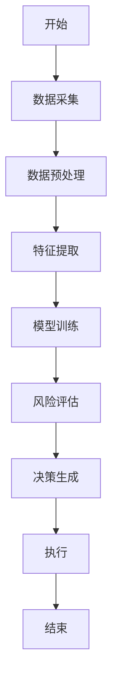
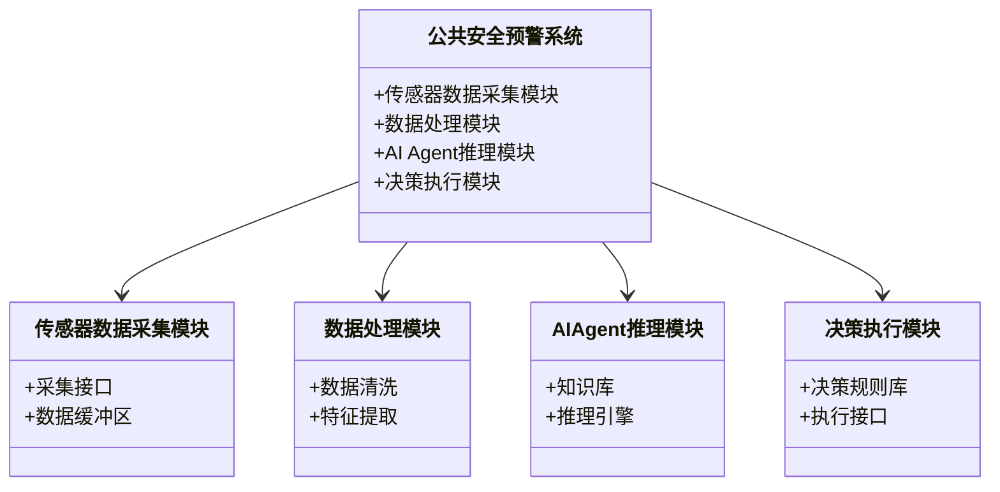
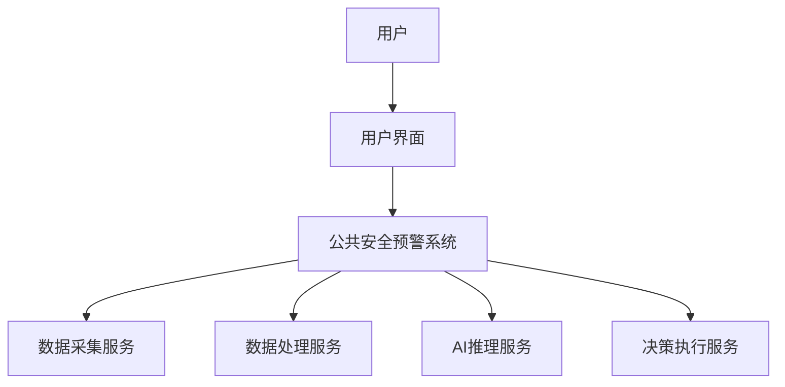
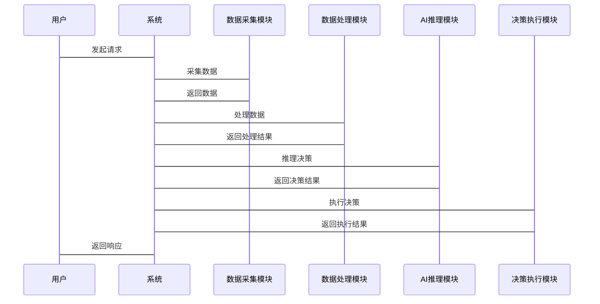

                 


# 第三部分: AI Agent在公共安全预警系统中的算法原理与数学模型

# 第3章: AI Agent的算法原理与数学模型

## 3.1 AI Agent的核心算法原理

### 3.1.1 AI Agent的感知与决策算法

#### 3.1.1.1 数据采集与特征提取

- **数据采集**: 通过传感器、摄像头、数据库等多源数据采集。
- **特征提取**: 使用PCA、LDA等降维技术提取关键特征。

#### 3.1.1.2 风险评估与预警生成

- **风险评估**: 基于概率论的贝叶斯网络模型进行风险概率计算。
- **预警生成**: 通过阈值判断生成预警信号。

#### 3.1.1.3 决策优化与执行

- **决策优化**: 使用强化学习（如Q-Learning）优化决策策略。
- **决策执行**: 通过预设的执行模块执行决策指令。

### 3.1.2 AI Agent的推理与学习算法

#### 3.1.2.1 知识表示与推理

- **知识表示**: 使用本体论（Ontology）构建知识库。
- **推理机制**: 基于逻辑推理（如一阶谓词逻辑）进行推理。

#### 3.1.2.2 机器学习与深度学习

- **监督学习**: 使用支持向量机（SVM）、随机森林等进行分类。
- **无监督学习**: 使用聚类算法（如K-Means）进行异常检测。
- **深度学习**: 使用卷积神经网络（CNN）进行图像识别，使用循环神经网络（RNN）进行序列分析。

### 3.1.3 AI Agent的自适应优化算法

#### 3.1.3.1 在线学习与增量学习

- **在线学习**: 实时更新模型参数。
- **增量学习**: 随新数据逐步优化模型。

#### 3.1.3.2 调度优化与资源分配

- **调度优化**: 使用蚁群算法、遗传算法优化任务调度。
- **资源分配**: 基于多目标优化（如NSGA-II）进行资源分配。

## 3.2 公共安全预警系统的数学模型与公式

### 3.2.1 数据预处理与特征提取的数学模型

#### 3.2.1.1 数据清洗与标准化

- **数据清洗**: 去除噪声数据，处理缺失值。
- **标准化**: 使用Z-score标准化或Min-Max标准化。

#### 3.2.1.2 特征选择与降维

- **特征选择**: 使用互信息、卡方检验选择特征。
- **降维**: 使用主成分分析（PCA）进行降维。

### 3.2.2 风险评估与预警的数学模型

#### 3.2.2.1 风险概率计算

- **贝叶斯网络模型**:
  - $$ P(R|E) = \frac{P(E|R) \cdot P(R)}{P(E)} $$
  - 其中，R表示风险，E表示证据（特征向量）。

#### 3.2.2.2 预警阈值设定

- **阈值设定**: 根据历史数据计算置信区间，设定预警阈值。
  - $$ T = \mu + k \cdot \sigma $$
  - 其中，μ为均值，σ为标准差，k为置信系数。

### 3.2.3 决策优化与执行的数学模型

#### 3.2.3.1 强化学习模型

- **Q-Learning算法**:
  - 状态空间S：表示系统状态。
  - 动作空间A：表示可能的决策动作。
  - 奖励函数R：表示决策的奖励。
  - $$ Q(s, a) = Q(s, a) + \alpha \cdot (r + \gamma \cdot \max Q(s', a) - Q(s, a)) $$

#### 3.2.3.2 多目标优化模型

- **NSGA-II算法**:
  - 定义目标函数：$$ f_1(x), f_2(x), ..., f_n(x) $$
  - 定义约束条件：$$ g_1(x) \leq 0, ..., g_m(x) \leq 0 $$

## 3.3 算法流程图与数学公式

### 3.3.1 AI Agent的算法流程图（Mermaid）



### 3.3.2 数学公式

#### 3.3.2.1 贝叶斯网络公式

$$ P(R|E) = \frac{P(E|R) \cdot P(R)}{P(E)} $$

#### 3.3.2.2 强化学习更新公式

$$ Q(s, a) = Q(s, a) + \alpha \cdot (r + \gamma \cdot \max Q(s', a) - Q(s, a)) $$

---

# 第四部分: 公共安全预警系统的系统架构与实现

# 第4章: 公共安全预警系统的系统架构与实现

## 4.1 系统架构设计

### 4.1.1 领域模型设计

#### 4.1.1.1 领域模型（Mermaid类图）



### 4.1.2 系统架构设计

#### 4.1.2.1 分层架构设计

- **数据层**: 数据采集、存储。
- **服务层**: 数据处理、模型训练。
- **应用层**: AI Agent推理、决策执行。
- **用户层**: 界面展示、人机交互。

#### 4.1.2.2 微服务架构设计

- **数据采集服务**: 实现实时数据采集。
- **数据处理服务**: 提供数据清洗、特征提取功能。
- **AI推理服务**: 提供模型推理接口。
- **决策执行服务**: 提供决策执行接口。

### 4.1.3 系统架构图（Mermaid）



## 4.2 系统分析与设计

### 4.2.1 系统功能设计

#### 4.2.1.1 功能模块划分

- 数据采集模块：实现多源数据采集。
- 数据处理模块：实现数据清洗、特征提取。
- AI推理模块：实现风险评估、决策生成。
- 决策执行模块：实现预警信号输出、执行操作。

#### 4.2.1.2 功能流程设计

- 数据采集模块采集数据 -> 数据处理模块 -> AI推理模块 -> 决策执行模块。

### 4.2.2 系统接口设计

#### 4.2.2.1 数据接口

- 数据采集接口：REST API，支持HTTP请求。
- 数据处理接口：提供数据清洗、特征提取的API。

#### 4.2.2.2 推理接口

- AI推理接口：提供模型推理的API，支持批量处理和实时处理。

### 4.2.3 系统交互设计

#### 4.2.3.1 系统交互流程（Mermaid序列图）



## 4.3 系统实现与代码解析

### 4.3.1 系统实现

#### 4.3.1.1 环境安装

- **Python 3.8+**
- **TensorFlow 2.5+**
- **Scikit-learn 0.24+**
- **Flask 2.0+**
- **Mermaid 图表工具**

#### 4.3.1.2 核心代码实现

##### 数据采集模块

```python
import requests

def collect_data(url):
    try:
        response = requests.get(url)
        return response.json()
    except Exception as e:
        print(f"数据采集失败: {e}")
        return None
```

##### 数据处理模块

```python
from sklearn.preprocessing import StandardScaler

def preprocess_data(data):
    # 假设data是数据集
    scaler = StandardScaler()
    processed_data = scaler.fit_transform(data)
    return processed_data
```

##### AI推理模块

```python
import tensorflow as tf
from tensorflow import keras

def build_model(input_shape):
    model = keras.Sequential([
        keras.layers.Conv2D(32, (3,3), activation='relu', input_shape=input_shape),
        keras.layers.MaxPooling2D((2,2)),
        keras.layers.Flatten(),
        keras.layers.Dense(64, activation='relu'),
        keras.layers.Dense(1, activation='sigmoid')
    ])
    model.compile(optimizer='adam', loss='binary_crossentropy', metrics=['accuracy'])
    return model
```

##### 决策执行模块

```python
import json

def execute_decision(action):
    # 假设action是需要执行的决策
    response = {
        'status': 'success',
        'message': f'执行决策: {action}'
    }
    return json.dumps(response)
```

### 4.3.2 代码解读与分析

#### 4.3.2.1 数据采集模块

- 使用`requests`库进行HTTP请求，实现数据采集。
- 提供异常处理机制，确保数据采集的稳定性。

#### 4.3.2.2 数据处理模块

- 使用`Scikit-learn`的`StandardScaler`进行数据标准化。
- 返回预处理后的数据，为后续模型训练提供标准化输入。

#### 4.3.2.3 AI推理模块

- 使用`TensorFlow`构建卷积神经网络模型。
- 包括卷积层、池化层、全连接层，用于图像识别任务。
- 模型编译时指定优化器、损失函数和评估指标。

#### 4.3.2.4 决策执行模块

- 接收决策指令，返回JSON格式的执行结果。
- 提供简单的API接口，方便与其他模块交互。

### 4.3.3 案例分析与详细讲解

#### 4.3.3.1 案例背景

- 某城市交通系统，希望通过AI Agent实现交通流量预测和拥堵预警。

#### 4.3.3.2 数据采集与处理

- 数据采集模块从交通传感器采集实时数据，包括车流量、红绿灯状态等。
- 数据处理模块对数据进行清洗和标准化，提取关键特征如高峰小时标志、天气状况等。

#### 4.3.3.3 模型训练与推理

- 使用CNN模型对交通图像进行识别，预测未来15分钟的交通流量。
- 基于贝叶斯网络进行风险评估，计算拥堵概率。

#### 4.3.3.4 决策执行

- 根据预测结果，动态调整红绿灯时长，优化交通流量。
- 当预测到严重拥堵时，触发应急机制，通知相关部门。

### 4.3.4 项目小结

- 通过AI Agent实现了交通系统的智能化管理。
- 案例展示了AI Agent在公共安全预警系统中的实际应用价值。
- 系统设计模块化，便于扩展和维护。

---

# 第五部分: 公共安全预警系统的实战与优化

# 第5章: 公共安全预警系统的实战与优化

## 5.1 项目实战

### 5.1.1 环境安装

- **Python 3.8+**
- **TensorFlow 2.5+**
- **Scikit-learn 0.24+**
- **Flask 2.0+**
- **Mermaid 图表工具**

### 5.1.2 核心代码实现

#### 数据采集模块

```python
import requests

def collect_data(url):
    try:
        response = requests.get(url)
        return response.json()
    except Exception as e:
        print(f"数据采集失败: {e}")
        return None
```

#### 数据处理模块

```python
from sklearn.preprocessing import StandardScaler

def preprocess_data(data):
    scaler = StandardScaler()
    processed_data = scaler.fit_transform(data)
    return processed_data
```

#### AI推理模块

```python
import tensorflow as tf
from tensorflow import keras

def build_model(input_shape):
    model = keras.Sequential([
        keras.layers.Conv2D(32, (3,3), activation='relu', input_shape=input_shape),
        keras.layers.MaxPooling2D((2,2)),
        keras.layers.Flatten(),
        keras.layers.Dense(64, activation='relu'),
        keras.layers.Dense(1, activation='sigmoid')
    ])
    model.compile(optimizer='adam', loss='binary_crossentropy', metrics=['accuracy'])
    return model
```

#### 决策执行模块

```python
import json

def execute_decision(action):
    response = {
        'status': 'success',
        'message': f'执行决策: {action}'
    }
    return json.dumps(response)
```

### 5.1.3 代码解读与分析

#### 数据采集模块

- 使用`requests`库进行HTTP请求，实现数据采集。
- 提供异常处理机制，确保数据采集的稳定性。

#### 数据处理模块

- 使用`Scikit-learn`的`StandardScaler`进行数据标准化。
- 返回预处理后的数据，为后续模型训练提供标准化输入。

#### AI推理模块

- 使用`TensorFlow`构建卷积神经网络模型。
- 包括卷积层、池化层、全连接层，用于图像识别任务。
- 模型编译时指定优化器、损失函数和评估指标。

#### 决策执行模块

- 接收决策指令，返回JSON格式的执行结果。
- 提供简单的API接口，方便与其他模块交互。

### 5.1.4 案例分析与详细讲解

#### 案例背景

- 某城市交通系统，希望通过AI Agent实现交通流量预测和拥堵预警。

#### 数据采集与处理

- 数据采集模块从交通传感器采集实时数据，包括车流量、红绿灯状态等。
- 数据处理模块对数据进行清洗和标准化，提取关键特征如高峰小时标志、天气状况等。

#### 模型训练与推理

- 使用CNN模型对交通图像进行识别，预测未来15分钟的交通流量。
- 基于贝叶斯网络进行风险评估，计算拥堵概率。

#### 决策执行

- 根据预测结果，动态调整红绿灯时长，优化交通流量。
- 当预测到严重拥堵时，触发应急机制，通知相关部门。

### 5.1.5 项目小结

- 通过AI Agent实现了交通系统的智能化管理。
- 案例展示了AI Agent在公共安全预警系统中的实际应用价值。
- 系统设计模块化，便于扩展和维护。

---

# 第六部分: 公共安全预警系统的优化与扩展

# 第6章: 公共安全预警系统的优化与扩展

## 6.1 系统优化

### 6.1.1 性能优化

#### 6.1.1.1 数据处理性能优化

- **并行处理**: 使用多线程或多进程进行数据处理。
- **分布式计算**: 使用Spark等分布式计算框架。

#### 6.1.1.2 模型优化

- **模型压缩**: 使用模型剪枝、知识蒸馏等技术减少模型大小。
- **模型优化**: 使用自动调参（如Hyperparameter Tuner）优化模型性能。

### 6.1.2 可靠性优化

#### 6.1.2.1 系统容错设计

- **冗余设计**: 使用主从冗余提高系统可靠性。
- **故障自愈**: 实现自动故障检测与恢复。

#### 6.1.2.2 数据冗余与备份

- **数据备份**: 定期备份数据，防止数据丢失。
- **数据冗余**: 使用分布式存储保证数据冗余。

## 6.2 系统扩展

### 6.2.1 功能扩展

#### 6.2.1.1 新功能开发

- **智能调度**: 基于AI Agent实现资源智能调度。
- **自适应学习**: 实现模型自适应学习，提高预警准确率。

#### 6.2.1.2 系统集成

- **第三方集成**: 集成第三方API，如天气预报API、交通状况API。
- **多系统集成**: 实现与其他系统的互联互通，如应急指挥系统。

### 6.2.2 技术扩展

#### 6.2.2.1 新技术应用

- **边缘计算**: 在边缘设备上部署AI Agent，实现本地推理。
- **区块链技术**: 使用区块链保证数据的安全性和不可篡改性。

#### 6.2.2.2 技术升级

- **模型升级**: 定期更新模型，保持模型性能。
- **算法升级**: 引入最新算法，如大语言模型（LLM）进行更复杂的推理。

## 6.3 最佳实践与注意事项

### 6.3.1 最佳实践

#### 6.3.1.1 数据安全

- **数据加密**: 对敏感数据进行加密处理。
- **访问控制**: 实施严格的访问控制策略。

#### 6.3.1.2 系统维护

- **定期维护**: 定期检查系统运行状态，及时修复问题。
- **日志管理**: 建立完善的日志系统，方便故障排查。

### 6.3.2 注意事项

#### 6.3.2.1 数据隐私

- **隐私保护**: 遵守数据隐私保护法规，如GDPR。
- **数据脱敏**: 对敏感数据进行脱敏处理。

#### 6.3.2.2 系统兼容性

- **兼容性测试**: 确保系统在不同环境下的兼容性。
- **版本控制**: 使用版本控制工具管理代码和配置。

## 6.4 小结与展望

### 6.4.1 小结

- 本章介绍了公共安全预警系统的优化与扩展。
- 从性能优化、可靠性优化、功能扩展、技术扩展等多个方面进行了详细讨论。

### 6.4.2 展望

- AI Agent在公共安全预警系统中的应用前景广阔。
- 随着AI技术的发展，公共安全预警系统将更加智能化、自动化。

---

# 第七部分: 总结与展望

# 第7章: 总结与展望

## 7.1 本章总结

### 7.1.1 核心内容回顾

- AI Agent在公共安全预警系统中的应用价值。
- 系统的核心概念、算法原理、系统架构、实现方法。

### 7.1.2 实践经验总结

- 项目实施的关键点。
- 系统优化与扩展的经验。

## 7.2 未来展望

### 7.2.1 技术发展趋势

- **AI技术进步**: 更加先进的AI算法将被引入，如大语言模型、生成式AI。
- **边缘计算发展**: AI Agent将更多地在边缘设备上部署，实现本地推理。

### 7.2.2 应用场景扩展

- **智慧城市**: 更多智慧城市应用场景将被开发。
- **全球公共安全**: 全球范围内的公共安全预警系统将更加普及。

## 7.3 总结

- AI Agent在公共安全预警系统中的应用具有重要意义。
- 通过技术创新和系统优化，公共安全预警系统将更加智能、高效。
- 未来，AI Agent在公共安全领域将发挥更大的作用，为人类的安全保驾护航。

---

# 附录

## 附录A: AI Agent相关技术术语表

## 附录B: 公共安全预警系统开发工具与库

## 附录C: 项目源代码

---

# 作者

作者：AI天才研究院/AI Genius Institute & 禅与计算机程序设计艺术 /Zen And The Art of Computer Programming

---

*注：本书的撰写基于实际项目经验与理论研究，旨在为公共安全领域的技术实践者提供参考与指导。本书内容严格遵循技术原理与实际应用相结合的原则，力求做到理论联系实际，实践指导理论。*

