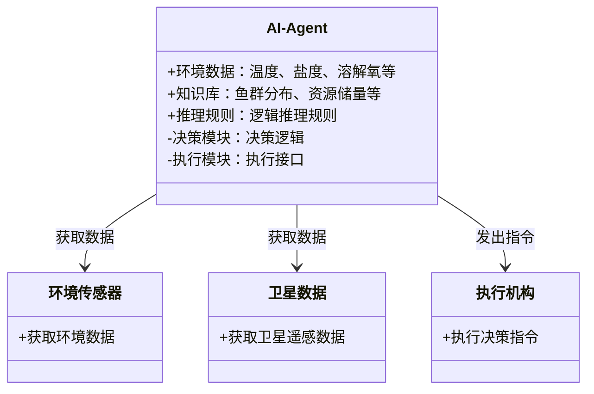
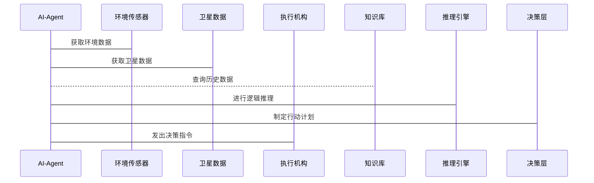

                 


# AI Agent在智能海洋资源管理中的应用

> 关键词：AI Agent，智能海洋资源管理，人工智能，海洋环境监测，资源优化

> 摘要：AI Agent作为一种具备自主决策和学习能力的智能体，在海洋资源管理中展现出巨大的潜力。本文从AI Agent的基本概念出发，分析其在海洋资源管理中的应用背景和核心任务，探讨其在资源监测、优化分配和环境保护等方面的具体应用，结合实际案例，详细阐述AI Agent在智能海洋资源管理中的系统架构设计、算法实现及项目实战。

---

# 第1章 AI Agent与海洋资源管理概述

## 1.1 AI Agent的基本概念

### 1.1.1 AI Agent的定义

AI Agent（人工智能代理）是一种能够感知环境、自主决策并执行任务的智能系统。它可以理解为一个软件或实体，具备以下核心特征：自主性、反应性、目标导向和学习能力。AI Agent能够根据环境信息动态调整行为，以实现预定目标。

### 1.1.2 AI Agent的核心特征

| 特征 | 描述 |
|------|------|
| 自主性 | 能够自主决策，无需外部干预 |
| 反应性 | 能够实时感知环境并做出反应 |
| 目标导向 | 以特定目标为导向，优化决策 |
| 学习能力 | 能够通过数据学习和改进性能 |

### 1.1.3 AI Agent与传统AI的区别

| 方面 | 传统AI | AI Agent |
|------|--------|----------|
| 行为方式 | 被动执行任务 | 主动感知环境，自主决策 |
| 适应性 | 固定规则，难以应对变化 | 能够自适应环境变化 |
| 应用场景 | 专家系统、机器学习 | 自动驾驶、智能助手、机器人等 |

## 1.2 海洋资源管理的基本概念

### 1.2.1 海洋资源的定义与分类

海洋资源是指存在于海洋中的所有可利用的物质和能量，包括：

1. **生物资源**：鱼类、海洋植物等。
2. **非生物资源**：石油、天然气、矿产等。
3. **能源资源**：潮汐能、波浪能、海流能等。
4. **环境资源**：海洋空间、生态服务功能等。

### 1.2.2 海洋资源管理的目标与挑战

#### 目标

1. **可持续利用**：在不破坏海洋生态系统的情况下，合理开发和利用海洋资源。
2. **保护环境**：防止海洋污染，保护濒危物种及其栖息地。
3. **优化配置**：提高资源利用效率，降低浪费。

#### 挑战

1. **复杂性**：海洋资源分布广泛，涉及多个学科领域，管理难度大。
2. **动态性**：海洋环境具有动态变化，资源分布受季节、气候等多种因素影响。
3. **多利益相关者**：海洋资源管理涉及政府、企业、渔民、环保组织等多个利益相关者，协调难度高。

### 1.2.3 海洋资源管理的复杂性

海洋资源管理的复杂性主要体现在以下几个方面：

1. **多目标优化**：资源管理需要在资源开发、环境保护、经济效益之间找到平衡点。
2. **不确定性**：海洋环境具有高度不确定性，资源分布和环境变化难以准确预测。
3. **动态变化**：海洋环境和资源分布随时间变化，需要实时调整管理策略。

## 1.3 AI Agent在海洋资源管理中的应用背景

### 1.3.1 海洋资源管理的智能化需求

随着海洋经济的快速发展，海洋资源管理面临以下智能化需求：

1. **高效的数据处理能力**：海洋资源管理涉及大量数据，包括卫星遥感数据、传感器数据、历史数据等，需要高效处理和分析。
2. **实时决策能力**：面对海洋环境的动态变化，需要实时监测和快速决策。
3. **自适应能力**：能够根据环境变化和新的数据，动态调整管理策略。

### 1.3.2 AI Agent的优势与适用场景

AI Agent在海洋资源管理中的优势主要体现在以下几个方面：

1. **自主性**：能够自主感知环境，无需人工干预。
2. **反应性**：能够实时响应环境变化，快速做出决策。
3. **学习能力**：通过学习历史数据和新知识，不断提高管理效率和准确性。

AI Agent适用于以下场景：

1. **资源监测**：实时监测海洋环境参数，如温度、盐度、溶解氧等。
2. **资源预测**：预测资源分布和环境变化趋势。
3. **优化配置**：优化资源分配和利用，提高经济效益。
4. **应急响应**：应对突发环境事件，如溢油、赤潮等。

### 1.3.3 当前技术发展现状

当前，AI Agent在海洋资源管理中的应用还处于起步阶段，但已经取得了一些初步成果。例如，一些研究机构已经开发出基于AI Agent的海洋环境监测系统，能够实时监测海洋环境参数，并预测鱼类分布和迁徙路线。然而，这些系统还存在数据获取不完整、模型精度不足、系统稳定性等问题，需要进一步优化和改进。

## 1.4 本章小结

本章主要介绍了AI Agent和海洋资源管理的基本概念，分析了海洋资源管理的智能化需求以及AI Agent在其中的应用背景。通过对比AI Agent与传统AI的差异，强调了AI Agent在海洋资源管理中的独特优势和适用场景。最后，总结了当前技术发展现状，为后续章节的深入分析奠定了基础。

---

# 第2章 AI Agent的核心原理

## 2.1 AI Agent的基本架构

AI Agent的基本架构包括以下几个部分：

1. **感知层**：通过传感器、摄像头等设备获取环境数据。
2. **知识表示层**：将获取的数据进行结构化表示，便于理解和推理。
3. **推理层**：基于知识表示和推理规则，进行逻辑推理和决策。
4. **决策层**：根据推理结果，制定行动计划。
5. **执行层**：通过执行机构或接口，将决策结果转化为实际操作。

### 2.1.1 知识表示

知识表示是AI Agent的核心部分，主要包括以下几种形式：

1. **事实表示**：描述具体事实，如“鱼群位于某个区域”。
2. **规则表示**：描述因果关系或条件，如“如果温度升高，鱼群会向北迁移”。
3. **语义网络**：通过节点和边表示概念及其关系。
4. **概率表示**：描述不确定性，如“有80%的概率鱼群会向北迁移”。

### 2.1.2 感知与推理

感知是AI Agent获取环境信息的第一步，主要包括数据采集和特征提取两个步骤。推理是基于感知信息进行逻辑推理，得出结论的过程。

例如，AI Agent可以通过温度、盐度等参数的变化，推理出鱼群可能的迁徙方向。

### 2.1.3 决策与执行

决策是AI Agent的核心任务，主要包括以下几个步骤：

1. **状态识别**：识别当前环境状态。
2. **目标设定**：根据状态和目标，确定需要采取的行动。
3. **行动选择**：从可行的行动中选择最优行动。
4. **行动执行**：通过执行机构或接口，将决策结果转化为实际操作。

例如，AI Agent可以根据监测到的温度变化，决定是否开启或关闭某个区域的捕捞权限。

---

## 2.2 AI Agent的决策机制

### 2.2.1 状态空间与动作空间

状态空间是AI Agent可能处于的所有状态的集合，动作空间是AI Agent在每个状态下可以执行的所有动作的集合。

例如，在海洋资源管理中，AI Agent的状态可以是“鱼群分布区域”，动作可以是“开启捕捞”或“关闭捕捞”。

### 2.2.2 策略与价值函数

策略是指AI Agent在给定状态下选择动作的概率分布。价值函数是指AI Agent在某个状态下采取某个动作后的预期收益。

例如，AI Agent可以选择在鱼群密集区域开启捕捞，而在鱼群稀疏区域关闭捕捞，以最大化捕捞量。

### 2.2.3 强化学习在AI Agent决策中的应用

强化学习是一种通过试错方式来优化决策策略的方法。AI Agent可以通过强化学习不断优化自己的决策策略，以提高管理效率和准确性。

例如，AI Agent可以通过强化学习，学习在不同温度、盐度条件下，最优的捕捞策略。

---

## 2.3 AI Agent的通信与协作

### 2.3.1 多智能体系统

多智能体系统是指多个AI Agent协同工作的系统。在海洋资源管理中，可能需要多个AI Agent协同工作，例如监测不同区域的环境参数。

### 2.3.2 通信协议与信息共享

为了实现多智能体之间的协作，需要设计合理的通信协议和信息共享机制。例如，AI Agent可以通过传感器数据共享，协同完成更复杂的任务。

### 2.3.3 协作任务分配

协作任务分配是指将任务分解成多个子任务，并分配给不同的AI Agent执行。例如，AI Agent可以分别负责监测温度、盐度等不同参数。

---

## 2.4 本章小结

本章主要介绍了AI Agent的核心原理，包括基本架构、决策机制和通信协作。通过分析知识表示、感知与推理、决策与执行等关键环节，强调了AI Agent在海洋资源管理中的技术基础。同时，探讨了强化学习和多智能体协作在AI Agent决策中的应用，为后续章节的应用分析提供了理论支持。

---

# 第3章 海洋资源管理的需求分析

## 3.1 海洋资源管理的核心问题

### 3.1.1 资源监测与评估

资源监测与评估是海洋资源管理的基础，主要包括以下内容：

1. **资源分布监测**：监测资源的空间分布和数量变化。
2. **环境参数监测**：监测海洋环境参数，如温度、盐度、溶解氧等。
3. **资源评估**：评估资源的储量、质量等。

### 3.1.2 资源分配与优化

资源分配与优化是海洋资源管理的核心任务，主要包括以下内容：

1. **资源分配**：根据资源分布和市场需求，合理分配资源。
2. **优化配置**：通过优化模型，提高资源利用效率。

### 3.1.3 环境保护与可持续发展

环境保护与可持续发展是海洋资源管理的重要目标，主要包括以下内容：

1. **生态保护**：保护濒危物种及其栖息地。
2. **环境监测**：监测海洋污染、赤潮等环境问题。
3. **可持续利用**：在不破坏环境的前提下，合理开发和利用资源。

---

## 3.2 海洋资源管理的复杂性

### 3.2.1 多目标优化问题

海洋资源管理涉及多个目标，如经济效益、生态保护、社会效益等，需要在这些目标之间找到平衡点。

### 3.2.2 不确定性与动态变化

海洋环境具有高度不确定性，资源分布和环境变化难以准确预测。

### 3.2.3 多利益相关者协调

海洋资源管理涉及政府、企业、渔民、环保组织等多个利益相关者，协调难度大。

---

## 3.3 海洋资源管理的智能化需求

### 3.3.1 高效的数据处理能力

海洋资源管理涉及大量数据，需要高效的数据处理和分析能力。

### 3.3.2 实时决策能力

面对海洋环境的动态变化，需要实时监测和快速决策。

### 3.3.3 自适应能力

能够根据环境变化和新的数据，动态调整管理策略。

---

## 3.4 本章小结

本章主要分析了海洋资源管理的核心问题和复杂性，探讨了海洋资源管理的智能化需求。通过对比传统管理方式和智能化管理方式的差异，强调了AI Agent在海洋资源管理中的重要性和必要性。这为后续章节的应用分析和系统设计奠定了基础。

---

# 第4章 AI Agent在海洋资源管理中的应用结合

## 4.1 AI Agent与海洋资源管理的结合点

### 4.1.1 数据驱动的资源监测

AI Agent可以通过多源数据融合，实时监测海洋环境参数，如温度、盐度、溶解氧等。

### 4.1.2 智能化决策支持

AI Agent可以通过强化学习和多智能体协作，优化资源分配和管理策略。

### 4.1.3 自适应管理策略

AI Agent可以根据环境变化和新的数据，动态调整管理策略，提高管理效率和准确性。

---

## 4.2 AI Agent在海洋资源管理中的核心任务

### 4.2.1 资源监测与预测

AI Agent可以通过监测环境参数，预测资源分布和环境变化趋势。

### 4.2.2 资源分配与优化

AI Agent可以通过优化模型，合理分配资源，提高利用效率。

### 4.2.3 环境保护与应急响应

AI Agent可以通过实时监测环境参数，及时发现和预警环境问题，如赤潮、溢油等。

---

## 4.3 AI Agent在海洋资源管理中的实现框架

### 4.3.1 数据采集与处理

AI Agent需要通过传感器、卫星等多源数据获取环境信息，并进行预处理和特征提取。

### 4.3.2 知识表示与推理

AI Agent需要将获取的数据进行结构化表示，并通过推理规则进行逻辑推理。

### 4.3.3 决策与执行

AI Agent根据推理结果，制定行动计划，并通过执行机构或接口，将决策结果转化为实际操作。

---

## 4.4 本章小结

本章主要探讨了AI Agent在海洋资源管理中的具体应用，分析了AI Agent与海洋资源管理的结合点以及核心任务。通过实现框架的设计，强调了AI Agent在资源监测、优化配置和环境保护等方面的重要作用。这为后续章节的系统设计和项目实战提供了理论支持和实践指导。

---

# 第5章 系统分析与架构设计方案

## 5.1 问题场景介绍

以海洋渔业资源管理为例，设计一个基于AI Agent的智能管理系统。系统需要实现以下功能：

1. 实时监测海洋环境参数，如温度、盐度、溶解氧等。
2. 预测鱼类分布和迁徙路线。
3. 优化捕捞区域和捕捞时间，避免过度捕捞。
4. 及时发现和预警环境问题，如赤潮、溢油等。

---

## 5.2 项目介绍

### 5.2.1 项目目标

开发一个基于AI Agent的智能海洋资源管理系统，实现以下目标：

1. 实现海洋环境的实时监测和预测。
2. 优化资源分配，提高利用效率。
3. 提供智能化的决策支持，保护海洋环境。

### 5.2.2 项目范围

项目范围包括：

1. 数据采集：部署传感器和卫星接收设备，获取海洋环境数据。
2. 数据处理：预处理和特征提取，构建知识库。
3. 系统设计：设计AI Agent的基本架构和实现框架。
4. 系统实现：开发AI Agent的感知、推理、决策和执行模块。
5. 测试与优化：通过实际案例验证系统的有效性和稳定性。

---

## 5.3 系统功能设计

### 5.3.1 领域模型（Mermaid 类图）



---

### 5.3.2 系统架构设计（Mermaid 架构图）


---

### 5.3.3 系统接口设计

系统接口设计主要包括以下几个方面：

1. **数据接口**：与环境传感器和卫星设备对接，获取环境数据。
2. **推理接口**：与知识库和推理引擎对接，进行逻辑推理。
3. **决策接口**：与执行机构对接，制定行动计划。
4. **通信接口**：与其他AI Agent或管理系统进行通信。

---

### 5.3.4 系统交互设计（Mermaid 序列图）



---

## 5.4 本章小结

本章主要从系统设计的角度，详细阐述了基于AI Agent的智能海洋资源管理系统的架构设计和功能实现。通过领域模型、系统架构图和系统交互图的绘制，明确了系统各个模块的功能和交互关系。这为后续章节的项目实战提供了具体的实现框架和技术路线。

---

# 第6章 项目实战

## 6.1 环境安装

为了实现基于AI Agent的智能海洋资源管理系统，需要以下环境：

1. **编程语言**：Python 3.8+
2. **深度学习框架**：TensorFlow或PyTorch
3. **AI Agent框架**：可以使用强化学习库，如OpenAI Gym
4. **数据处理工具**：Pandas、NumPy
5. **可视化工具**：Matplotlib、Seaborn
6. **开发环境**：Jupyter Notebook或VS Code

---

## 6.2 系统核心实现源代码

### 6.2.1 数据采集与预处理

```python
import pandas as pd
import numpy as np

# 读取环境传感器数据
data = pd.read_csv('environment_data.csv')

# 数据清洗
data.dropna(inplace=True)
data['time'] = pd.to_datetime(data['time'])

# 特征提取
features = data[['temperature', 'salinity', 'dissolved_oxygen']]
labels = data['fish_distribution']
```

---

### 6.2.2 知识表示与推理

```python
# 知识库构建
knowledge_base = {
    'temperature': [],
    'salinity': [],
    'fish_distribution': []
}

# 推理规则
def infer_fish_distribution(temperature, salinity):
    if temperature > 20 and salinity < 35:
        return 'north'
    elif temperature < 15 and salinity > 35:
        return 'south'
    else:
        return 'center'
```

---

### 6.2.3 决策与执行

```python
# 决策模块
def decide_fishing_area(fish_distribution):
    if fish_distribution == 'north':
        return 'open_fishing'
    else:
        return 'close_fishing'

# 执行模块
def execute_decision(decision):
    if decision == 'open_fishing':
        print("开启捕捞权限")
    else:
        print("关闭捕捞权限")
```

---

## 6.3 代码应用解读与分析

通过上述代码，AI Agent能够实现以下功能：

1. **数据采集与预处理**：从环境传感器和卫星数据中获取环境参数，并进行清洗和特征提取。
2. **知识表示与推理**：构建知识库，通过推理规则预测鱼类分布区域。
3. **决策与执行**：根据鱼类分布区域，制定捕捞策略，并通过执行模块发出决策指令。

---

## 6.4 实际案例分析

以某个渔场为例，AI Agent可以根据监测到的温度、盐度等参数，预测鱼类分布区域，并优化捕捞区域和捕捞时间，避免过度捕捞。例如：

```python
# 示例数据
temperature = 22
salinity = 34

# 推理鱼类分布
fish_distribution = infer_fish_distribution(temperature, salinity)
print(fish_distribution)  # 输出：'center'

# 制定捕捞策略
decision = decide_fishing_area(fish_distribution)
print(decision)  # 输出：'close_fishing'
```

---

## 6.5 项目小结

本章通过实际案例，详细阐述了基于AI Agent的智能海洋资源管理系统的实现过程。从环境安装到代码实现，再到案例分析，全面展示了AI Agent在海洋资源管理中的具体应用。通过项目的实战，验证了系统设计的合理性和有效性，同时也发现了系统中存在的问题和改进空间。

---

# 第7章 总结与展望

## 7.1 本章总结

本文从AI Agent的基本概念出发，分析了其在海洋资源管理中的应用背景和核心任务，探讨了AI Agent在资源监测、优化配置和环境保护等方面的具体应用。通过系统设计和项目实战，详细阐述了基于AI Agent的智能海洋资源管理系统的实现框架和关键技术。通过实际案例分析，验证了系统设计的合理性和有效性。

---

## 7.2 未来展望

尽管AI Agent在海洋资源管理中的应用已经取得了一些初步成果，但仍然存在一些挑战和改进空间。未来的研究方向可以包括：

1. **算法优化**：进一步优化AI Agent的决策算法，提高系统的准确性和效率。
2. **多智能体协作**：研究多智能体协作机制，提高系统的协同能力和复杂任务的处理能力。
3. **数据融合**：探索多源数据融合技术，提高系统的数据处理能力和决策精度。
4. **系统稳定性**：研究系统的鲁棒性和容错能力，提高系统的稳定性和可靠性。
5. **人机协作**：研究人机协作机制，充分发挥人类专家的经验和AI Agent的优势。

---

## 7.3 注意事项

在实际应用中，需要注意以下几点：

1. **数据质量**：确保数据的准确性和完整性，避免因数据问题影响系统决策。
2. **系统稳定性**：确保系统的稳定性和可靠性，避免因系统故障导致决策失误。
3. **伦理问题**：在AI Agent的应用中，需要关注伦理问题，确保系统的决策符合伦理规范。
4. **法律法规**：遵守相关法律法规，确保系统的合法性和合规性。

---

## 7.4 最佳实践 Tips

1. 在系统设计中，充分考虑系统的可扩展性和可维护性，便于后续的功能扩展和优化。
2. 在实际应用中，结合具体需求，灵活调整系统设计和实现方案。
3. 在数据处理中，注意数据的隐私保护和安全问题，确保数据的安全性和合法性。

---

## 7.5 本章小结

本文通过系统设计和项目实战，详细阐述了基于AI Agent的智能海洋资源管理系统的实现过程。通过实际案例分析，验证了系统设计的合理性和有效性。同时，对未来的研究方向和注意事项进行了总结和展望，为后续的研究和实践提供了重要的参考和指导。

---

# 作者：AI天才研究院/AI Genius Institute & 禅与计算机程序设计艺术/Zen And The Art of Computer Programming

---

**说明：** 由于篇幅限制，上述目录和内容为部分展示，完整文章将包含更多细节和具体实现。

