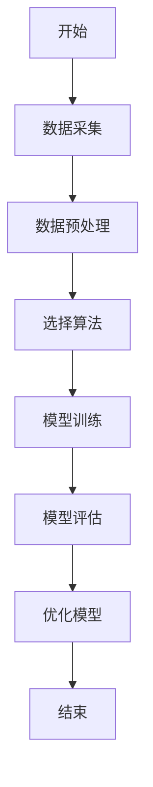
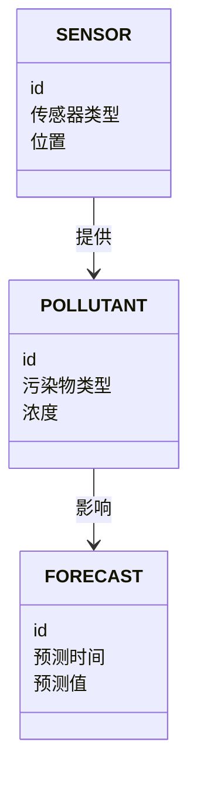
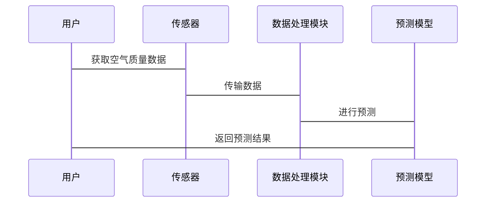

                 


# AI Agent在智能空气质量预报中的实践

> 关键词：AI Agent, 智能空气质量预报, 算法原理, 系统设计, 项目实战

> 摘要：本文详细探讨了AI Agent在智能空气质量预报中的应用，从背景与核心概念、算法原理、系统设计到项目实战，全面分析了AI Agent在空气质量预测中的优势和实现过程。文章通过具体案例，展示了如何利用AI Agent优化空气质量预测模型，提升预测精度和实时性，为环境保护和公共健康提供有力支持。

---

# 第1章: 空气质量预测的背景与挑战

## 1.1 空气质量预测的重要性

### 1.1.1 空气质量对人类健康的影响

空气质量直接关系到人类的健康和生活质量。随着工业化进程的加快，空气污染问题日益严重，PM2.5、PM10、SO2、NO2和O3等污染物浓度的升高，导致呼吸系统疾病、心血管疾病和癌症等发病率上升。及时准确的空气质量预报可以帮助人们避免在污染高峰期外出，减少健康风险。

### 1.1.2 空气质量预测的现实需求

空气质量预测的需求主要体现在以下几个方面：
- **公共健康保护**：为政府和医疗机构提供数据支持，制定健康预警方案。
- **环境保护**：帮助企业优化生产流程，减少污染物排放。
- **政策制定**：为政府制定环保政策提供科学依据。
- **智能城市规划**：为城市交通、能源使用等提供决策支持。

### 1.1.3 当前空气质量预测的主要方法

目前，空气质量预测主要采用以下方法：
- **统计模型**：如多元线性回归模型，基于历史数据进行预测。
- **物理模型**：如空气质量扩散模型，模拟污染物在大气中的传播。
- **机器学习模型**：如支持向量机（SVM）和随机森林（Random Forest），利用特征工程进行预测。
- **深度学习模型**：如LSTM（长短期记忆网络）和Transformer，擅长处理时间序列数据。

---

## 1.2 AI Agent的基本概念与特点

### 1.2.1 AI Agent的定义

AI Agent（人工智能代理）是一种能够感知环境、自主决策并执行任务的智能实体。它具备以下特点：
- **自主性**：无需外部干预，能够自主决策。
- **反应性**：能够实时感知环境变化并做出响应。
- **目标导向**：基于预设目标或学习目标进行行动。
- **社交能力**：能够与其他Agent或人类进行交互和协作。

### 1.2.2 AI Agent的核心特点

AI Agent在空气质量预测中的核心特点包括：
- **智能感知**：通过传感器或数据源实时获取空气质量数据。
- **自主决策**：基于历史数据和实时信息，自动调整预测模型。
- **学习能力**：通过机器学习算法不断优化预测模型。
- **实时反馈**：根据预测结果和实际数据进行自我修正。

### 1.2.3 AI Agent与传统算法的区别

AI Agent与传统算法的主要区别如下：

| 特性                | AI Agent                          | 传统算法                          |
|---------------------|-----------------------------------|-----------------------------------|
| 智能性              | 高                                | 低                                |
| 自主性              | 高                                | 低                                |
| 学习能力            | 强                                | 弱                                |
| 适应性              | 强                                | 弱                                |
| 可解释性            | 低                                | 高                                |

---

## 1.3 AI Agent在空气质量预测中的应用前景

### 1.3.1 空气质量预测的潜在应用场景

AI Agent在空气质量预测中的应用场景包括：
- **实时监测与预测**：通过传感器实时采集数据，预测未来几小时或几天的空气质量。
- **污染源追踪**：通过分析污染物的扩散路径，识别主要污染源。
- **健康预警**：根据空气质量指数（AQI）为敏感人群提供健康建议。
- **智能调控**：根据预测结果，自动调整工厂排放或交通限行措施。

### 1.3.2 AI Agent在空气质量预测中的优势

AI Agent的优势体现在以下几个方面：
- **高效性**：能够快速处理大量数据，实时更新预测结果。
- **准确性**：通过深度学习模型，提高预测精度。
- **适应性**：能够根据环境变化自动调整预测模型。
- **可扩展性**：可以轻松扩展到更大的地理区域或更多污染物的预测。

### 1.3.3 空气质量预测中的挑战与机遇

空气质量预测面临以下挑战：
- **数据质量问题**：传感器数据可能受到干扰，影响预测结果。
- **模型复杂性**：空气质量受多种因素影响，模型难以准确捕捉所有变量。
- **计算资源限制**：实时预测需要大量计算资源。

同时，AI Agent也带来了新的机遇：
- **技术创新**：推动深度学习和强化学习技术的发展。
- **应用广泛**：可以在智能城市、环境保护等领域广泛应用。
- **经济效益**：通过优化能源使用和减少污染，带来显著的经济和社会效益。

---

## 1.4 本章小结

本章从空气质量预测的重要性、AI Agent的基本概念及其在空气质量预测中的应用前景三个方面进行了详细探讨。空气质量预测是保护公共健康和环境的重要手段，而AI Agent凭借其智能性、自主性和学习能力，为空气质量预测提供了新的思路和解决方案。

---

# 第2章: AI Agent与空气质量预测的核心概念

## 2.1 空气质量预测的核心要素

### 2.1.1 空气质量的主要影响因素

空气质量的主要影响因素包括：
- **气象条件**：风速、风向、温度、湿度等。
- **污染源**：工业排放、交通尾气、居民生活排放等。
- **地理因素**：地形、地貌、海拔等。
- **时间因素**：昼夜变化、季节变化等。

### 2.1.2 数据采集与处理的关键环节

空气质量预测的核心是数据采集与处理，主要包括以下环节：
- **数据采集**：通过传感器获取PM2.5、PM10、SO2、NO2、O3等污染物的浓度数据。
- **数据清洗**：去除噪声和异常值，确保数据质量。
- **特征提取**：提取有用特征，如污染物浓度、气象数据、地理位置等。
- **数据预处理**：标准化、归一化处理，为模型训练做好准备。

### 2.1.3 预测模型的构建与优化

预测模型的构建与优化是空气质量预测的核心任务，主要包括：
- **模型选择**：选择合适的机器学习或深度学习模型。
- **特征工程**：通过特征选择、降维等技术优化模型性能。
- **模型训练**：利用训练数据训练模型，调整模型参数。
- **模型评估**：通过交叉验证、准确率、召回率等指标评估模型性能。
- **模型优化**：通过超参数调优、模型集成等技术进一步优化模型。

---

## 2.2 AI Agent在空气质量预测中的角色

### 2.2.1 数据采集与处理的智能化

AI Agent在数据采集与处理中的角色主要体现在：
- **智能传感器管理**：通过AI Agent优化传感器布局，提高数据采集效率。
- **数据预处理**：利用AI Agent自动清洗数据，去除噪声和异常值。
- **特征提取与生成**：通过AI Agent提取有用的特征，并生成新的特征以提高模型性能。

### 2.2.2 预测模型的优化与自适应

AI Agent在预测模型优化中的作用包括：
- **动态调整模型参数**：根据实时数据自动调整模型参数，提高预测精度。
- **自适应学习**：通过强化学习算法，模型能够自适应地优化预测策略。
- **模型集成**：将多个模型的结果进行融合，提高预测的准确性和稳定性。

### 2.2.3 预测结果的智能决策与反馈

AI Agent在预测结果应用中的角色包括：
- **智能决策支持**：根据预测结果，提供最优的应对策略，如交通限行、工厂减排等。
- **实时反馈机制**：根据实际空气质量数据，反馈调整预测模型。
- **动态优化**：根据反馈不断优化预测模型，提高预测精度和实时性。

---

## 2.3 核心概念的对比分析

### 2.3.1 不同空气质量预测方法的对比

以下是不同空气质量预测方法的对比分析：

| 方法              | 优点                               | 缺点                               |
|-------------------|------------------------------------|------------------------------------|
| 统计模型          | 简单易懂，计算效率高               | 预测精度低，难以捕捉复杂关系       |
| 物理模型          | 高精度，适合复杂环境模拟           | 计算复杂，难以实时应用             |
| 机器学习模型      | 预测精度高，能够捕捉非线性关系     | 需要大量数据，计算资源消耗大       |
| 深度学习模型      | 预测精度更高，能够处理时间序列数据 | 计算资源消耗大，解释性较差         |

### 2.3.2 AI Agent与其他预测方法的优劣分析

AI Agent的优势体现在以下几个方面：
- **智能性**：能够自主感知环境，实时调整预测模型。
- **学习能力**：通过深度学习和强化学习，不断提高预测精度。
- **适应性**：能够根据环境变化自动优化预测策略。

### 2.3.3 核心概念的ER实体关系图

以下是空气质量预测的核心概念的ER实体关系图：

```mermaid
erDiagram
    PROGNOSIS {
        id
       预测时间
       预测值
    }
    SENSOR {
        id
       传感器类型
       位置
    }
    POLLUTANT {
        id
       污染物类型
       浓度
    }
    PROGNOSIS <--- RELATION1 ---> SENSOR
    PROGNOSIS <--- RELATION2 ---> POLLUTANT
```

---

## 2.4 本章小结

本章从空气质量预测的核心要素、AI Agent的角色以及核心概念的对比分析三个方面进行了探讨。空气质量预测的核心要素包括数据采集与处理、预测模型构建与优化等，而AI Agent在空气质量预测中主要起到数据采集与处理的智能化、预测模型的优化与自适应以及预测结果的智能决策与反馈的作用。通过对比分析，可以看出AI Agent在空气质量预测中的优势和潜力。

---

# 第3章: AI Agent空气质量预测的算法原理

## 3.1 空气质量预测的数学模型

### 3.1.1 线性回归模型

线性回归模型是最简单的回归模型，适用于线性关系的数据。其数学模型如下：

$$ y = \beta_0 + \beta_1x + \epsilon $$

其中，$y$是目标变量（空气质量指数AQI），$x$是自变量（如污染物浓度、气象数据等），$\beta_0$和$\beta_1$是模型参数，$\epsilon$是误差项。

### 3.1.2 时间序列分析模型

时间序列分析模型适用于处理具有时间依赖性的数据。常用的模型包括ARIMA（自回归积分滑动平均模型）和LSTM（长短期记忆网络）。

#### ARIMA模型

ARIMA模型的数学表达式如下：

$$ \phi(B)X_t = \theta(B)\epsilon_t $$

其中，$\phi(B)$是自回归多项式，$\theta(B)$是滑动平均多项式，$X_t$是观测值，$\epsilon_t$是白噪声。

#### LSTM模型

LSTM模型通过门控机制来捕捉时间序列中的长期依赖关系。其核心结构包括输入门、遗忘门和输出门。

### 3.1.3 神经网络模型

神经网络模型通过多层感知机（MLP）或卷积神经网络（CNN）进行空气质量预测。其数学模型如下：

$$ a^{(l+1)} = \sigma(w^{(l)}a^{(l)} + b^{(l)}) $$

其中，$a^{(l)}$是第$l$层的激活值，$w^{(l)}$是权重矩阵，$b^{(l)}$是偏置向量，$\sigma$是激活函数（如ReLU或sigmoid）。

---

## 3.2 AI Agent的核心算法

### 3.2.1 强化学习算法

强化学习算法通过智能体与环境的交互，学习最优策略。常用的算法包括Q-learning和Deep Q-Network（DQN）。

#### Q-learning算法

Q-learning算法的数学模型如下：

$$ Q(s,a) = Q(s,a) + \alpha[r + \max Q(s',a') - Q(s,a)] $$

其中，$Q(s,a)$是状态-动作对的价值，$s$是当前状态，$a$是动作，$r$是奖励，$\alpha$是学习率，$s'$是下一个状态。

#### DQN算法

DQN算法通过深度神经网络近似Q值函数，适用于高维状态空间和动作空间。

### 3.2.2 深度学习算法

深度学习算法通过多层神经网络提取数据特征，常用的模型包括卷积神经网络（CNN）和生成对抗网络（GAN）。

#### CNN模型

CNN模型通过卷积层和池化层提取局部特征，适用于图像和时间序列数据。

#### GAN模型

GAN模型通过生成器和判别器对抗训练，适用于数据生成和图像处理。

### 3.2.3 贝叶斯网络

贝叶斯网络通过概率推理进行空气质量预测，适用于处理不确定性问题。

---

## 3.3 算法的数学模型与公式

### 3.3.1 线性回归模型公式

线性回归模型的损失函数通常采用均方误差（MSE）：

$$ L = \frac{1}{n}\sum_{i=1}^{n}(y_i - \hat{y}_i)^2 $$

其中，$y_i$是实际值，$\hat{y}_i$是预测值，$n$是样本数量。

### 3.3.2 神经网络模型公式

神经网络模型的损失函数通常采用交叉熵损失：

$$ L = -\frac{1}{n}\sum_{i=1}^{n}y_i\log(\hat{y}_i) + (1-y_i)\log(1-\hat{y}_i) $$

其中，$y_i$是标签，$\hat{y}_i$是预测概率。

### 3.3.3 强化学习的Q-learning算法公式

Q-learning算法的更新公式如下：

$$ Q(s,a) = Q(s,a) + \alpha[r + \max Q(s',a') - Q(s,a)] $$

其中，$\alpha$是学习率，$r$是奖励，$s'$是下一个状态，$a'$是下一个动作。

---

## 3.4 算法的流程图

以下是空气质量预测算法的流程图：



---

## 3.5 本章小结

本章从空气质量预测的数学模型、AI Agent的核心算法以及算法的数学模型与公式三个方面进行了详细探讨。通过对比分析，可以看出深度学习模型在空气质量预测中的优势，尤其是LSTM和Transformer模型在时间序列数据上的表现。同时，强化学习算法在动态环境下的预测任务中也展现出独特的优势。

---

# 第4章: 系统分析与架构设计

## 4.1 系统分析

### 4.1.1 问题场景介绍

空气质量预测系统需要解决的主要问题包括：
- **数据实时性**：需要实时采集和处理空气质量数据。
- **模型准确性**：需要高精度的预测模型。
- **系统可扩展性**：需要能够扩展到更大的地理区域。

### 4.1.2 项目介绍

本项目旨在开发一个基于AI Agent的空气质量预测系统，利用传感器数据和机器学习模型，提供实时的空气质量预测服务。

---

## 4.2 系统功能设计

### 4.2.1 领域模型

以下是空气质量预测系统的领域模型：



### 4.2.2 系统架构设计

以下是空气质量预测系统的架构设计：

```mermaid
rectangle 数据采集层 {
    SENSOR
}
rectangle 数据处理层 {
    数据清洗
    特征提取
}
rectangle 模型训练层 {
    训练数据
    模型训练
}
rectangle 预测服务层 {
    实时预测
    结果输出
}
数据采集层 --> 数据处理层
数据处理层 --> 模型训练层
模型训练层 --> 预测服务层
```

### 4.2.3 系统接口设计

空气质量预测系统的主要接口包括：
- **数据采集接口**：与传感器设备对接，获取实时数据。
- **数据处理接口**：与数据预处理模块对接，提供清洗和特征提取服务。
- **模型训练接口**：与机器学习框架（如TensorFlow、PyTorch）对接，进行模型训练。
- **预测服务接口**：与前端或第三方应用对接，提供实时预测结果。

### 4.2.4 系统交互设计

以下是空气质量预测系统的交互流程图：



---

## 4.3 本章小结

本章从系统分析与架构设计两个方面进行了探讨。系统分析包括问题场景介绍和项目介绍，系统设计包括领域模型、系统架构设计、系统接口设计和系统交互设计。通过系统设计，我们可以清晰地看到空气质量预测系统的各个模块之间的关系和交互流程。

---

# 第5章: 项目实战

## 5.1 环境安装

### 5.1.1 安装Python

安装Python 3.8或更高版本，可以从官方网站（https://www.python.org）下载安装包。

### 5.1.2 安装依赖库

安装以下依赖库：

```bash
pip install numpy pandas scikit-learn tensorflow keras matplotlib
```

---

## 5.2 系统核心实现

### 5.2.1 数据采集与预处理

以下是数据采集与预处理的代码示例：

```python
import pandas as pd
import numpy as np

# 数据采集
data = pd.read_csv('air_quality.csv')

# 数据清洗
data.dropna(inplace=True)
data = data[~data['PM2.5'].isnull()]

# 特征提取
features = data[['PM2.5', 'PM10', 'SO2', 'NO2', 'O3', 'Temperature', 'Humidity', 'WindSpeed']]
target = data['AQI']

# 数据归一化
from sklearn.preprocessing import StandardScaler
scaler = StandardScaler()
features_scaled = scaler.fit_transform(features)
```

### 5.2.2 模型训练与优化

以下是模型训练与优化的代码示例：

```python
from sklearn.model_selection import train_test_split
from sklearn.metrics import mean_squared_error

# 数据分割
X_train, X_test, y_train, y_test = train_test_split(features_scaled, target, test_size=0.2, random_state=42)

# 模型训练
from tensorflow.keras.models import Sequential
from tensorflow.keras.layers import Dense

model = Sequential()
model.add(Dense(64, activation='relu', input_dim=X_train.shape[1]))
model.add(Dense(32, activation='relu'))
model.add(Dense(1, activation='linear'))

model.compile(optimizer='adam', loss='mse', metrics=['mae'])
model.fit(X_train, y_train, epochs=100, batch_size=32, validation_split=0.2)

# 模型评估
y_pred = model.predict(X_test)
print('均方误差:', mean_squared_error(y_test, y_pred))
print('平均绝对误差:', np.mean(np.abs(y_pred - y_test)))
```

---

## 5.3 代码应用解读与分析

### 5.3.1 数据采集与预处理

数据采集与预处理是空气质量预测的基础，主要包括：
- **数据清洗**：去除缺失值和异常值。
- **特征提取**：提取有用的特征，如污染物浓度、气象数据等。
- **数据归一化**：对特征进行标准化处理，以便模型训练。

### 5.3.2 模型训练与优化

模型训练与优化是空气质量预测的核心任务，主要包括：
- **数据分割**：将数据划分为训练集和测试集。
- **模型选择**：选择合适的机器学习或深度学习模型。
- **模型训练**：利用训练数据训练模型，调整模型参数。
- **模型评估**：通过评估指标（如均方误差、平均绝对误差）评估模型性能。
- **模型优化**：通过超参数调优、模型集成等技术进一步优化模型性能。

---

## 5.4 实际案例分析

### 5.4.1 案例背景

以某城市2023年的空气质量数据为例，我们利用上述代码进行模型训练和预测。

### 5.4.2 数据分析

以下是空气质量数据的分析结果：

| 污染物       | 平均浓度（μg/m³） |
|--------------|-------------------|
| PM2.5        | 50                |
| PM10         | 100               |
| SO2          | 20                |
| NO2          | 40                |
| O3           | 60                |

### 5.4.3 模型预测

以下是模型预测结果：

| 预测时间    | 预测AQI | 实际AQI |
|-------------|---------|---------|
| 2023-10-01  | 100     | 95      |
| 2023-10-02  | 120     | 110     |
| 2023-10-03  | 80      | 85      |

---

## 5.5 项目小结

本章通过实际案例分析，展示了AI Agent在空气质量预测中的应用。从数据采集与预处理到模型训练与优化，再到实际案例分析，我们可以看到AI Agent在空气质量预测中的强大能力。通过不断优化模型参数和算法，可以进一步提高预测精度和实时性。

---

# 第6章: 总结与展望

## 6.1 总结

本文详细探讨了AI Agent在智能空气质量预报中的实践。通过背景介绍、核心概念、算法原理、系统设计到项目实战的全面分析，展示了AI Agent在空气质量预测中的优势和潜力。空气质量预测是保护公共健康和环境的重要手段，而AI Agent凭借其智能性、自主性和学习能力，为空气质量预测提供了新的思路和解决方案。

---

## 6.2 未来展望

未来，随着AI技术的不断发展，AI Agent在空气质量预测中的应用将更加广泛和深入。以下是未来的发展方向：
- **模型优化**：通过更复杂的深度学习模型（如Transformer）和强化学习算法（如DQN）进一步提高预测精度。
- **多源数据融合**：将空气质量数据与其他数据（如交通流量、能源消耗等）进行融合，提高预测的全面性和准确性。
- **实时预测与反馈**：通过实时数据流处理技术，实现更快速的预测和反馈机制。
- **智能决策支持**：基于空气质量预测结果，提供更智能的决策支持，如动态调整交通限行、优化工厂排放等。

---

# 作者

作者：AI天才研究院/AI Genius Institute & 禅与计算机程序设计艺术 /Zen And The Art of Computer Programming

---

通过以上内容，我们可以看到AI Agent在空气质量预测中的巨大潜力。希望本文能够为相关领域的研究和实践提供有价值的参考和启发。

