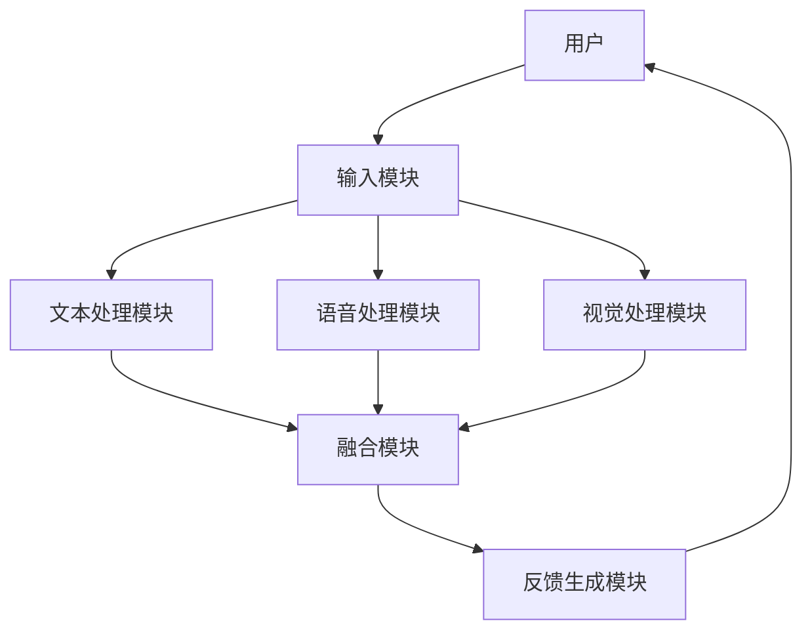

                 


# AI Agent的多模态交互：整合文本、语音和视觉

## 关键词
AI Agent, 多模态交互, 文本处理, 语音识别, 视觉处理, 多模态融合, 注意力机制

## 摘要
随着人工智能技术的快速发展，AI Agent（智能体）在多模态交互中的应用越来越广泛。本文将深入探讨AI Agent如何整合文本、语音和视觉三种模态信息，实现更高效、更自然的交互方式。通过分析多模态交互的核心概念、算法原理、系统架构设计以及实际项目案例，本文为读者提供一个全面的视角，帮助其理解并掌握AI Agent的多模态交互技术。

---

## 第1章: AI Agent与多模态交互概述

### 1.1 AI Agent的基本概念
#### 1.1.1 AI Agent的定义与特点
AI Agent（人工智能代理）是一种能够感知环境、自主决策并执行任务的智能系统。其特点包括：
- **自主性**：能够在没有外部干预的情况下独立运行。
- **反应性**：能够实时感知环境并做出响应。
- **目标导向性**：基于目标驱动行为，优化决策过程。

#### 1.1.2 多模态交互的背景与意义
多模态交互是指通过整合多种信息形式（如文本、语音、视觉等）进行交流和理解的过程。随着技术的进步，单一模态的交互方式已无法满足复杂场景的需求，多模态交互逐渐成为AI Agent的核心能力。其意义在于：
- 提高交互的准确性和效率。
- 模拟人类的自然交互方式。
- 扩展AI Agent的应用场景。

#### 1.1.3 多模态交互的核心要素
多模态交互的核心要素包括：
- **感知能力**：通过多种传感器或接口获取输入信息。
- **理解能力**：对多模态信息进行语义理解和关联分析。
- **表达能力**：通过多种形式输出反馈，如文本、语音、图像等。

### 1.2 多模态交互的背景介绍
#### 1.2.1 问题背景与问题描述
传统的人机交互方式通常依赖单一模态（如文本或语音），这种交互方式在复杂场景中存在以下问题：
- **信息不完整**：单一模态难以覆盖所有信息。
- **理解能力有限**：依赖单一模态可能导致理解偏差。
- **交互效率低下**：单一模态的限制可能导致交互过程冗长。

#### 1.2.2 多模态交互的目标与解决思路
多模态交互的目标是通过整合多种信息形式，提高交互的准确性和自然性。解决思路包括：
- **多模态数据的融合**：将文本、语音和视觉信息进行联合处理。
- **跨模态关联分析**：建立不同模态之间的关联关系，提升理解能力。
- **动态适应性**：根据交互场景动态调整模态的权重和处理方式。

#### 1.2.3 多模态交互的边界与外延
多模态交互的边界在于如何有效整合多种模态信息，同时避免信息冗余和处理复杂度的增加。其外延包括：
- **扩展模态**：如手势、姿态、环境数据等。
- **实时性要求**：多模态交互需要在实时场景中应用。
- **个性化需求**：针对不同用户，提供个性化的交互体验。

#### 1.2.4 多模态交互的概念结构与核心要素组成
多模态交互的概念结构如下：


核心要素包括：
1. **输入模态**：文本、语音、视觉等。
2. **处理模块**：自然语言处理（NLP）、语音识别、图像处理等。
3. **融合模块**：多模态数据的融合与关联分析。
4. **输出模态**：文本、语音、图像等反馈形式。

---

## 第2章: 多模态交互的算法原理

### 2.1 多模态融合算法
#### 2.1.1 多模态融合的基本原理
多模态融合算法的核心思想是将不同模态的信息进行联合处理，提取共同特征并生成统一的语义表示。其基本步骤如下：
1. **特征提取**：分别对文本、语音和视觉信息进行特征提取。
2. **特征对齐**：将不同模态的特征进行对齐，消除模态间的差异。
3. **融合与关联**：通过融合算法将特征进行关联分析，生成统一的语义表示。

#### 2.1.2 多模态融合的数学模型与公式
多模态融合的数学模型可以表示为：
$$
F(x_t, x_v, x_a) = \sigma(W_t x_t + W_v x_v + W_a x_a + b)
$$
其中，$x_t$、$x_v$、$x_a$分别表示文本、视觉和音频特征，$W_t$、$W_v$、$W_a$为对应的权重矩阵，$b$为偏置项，$\sigma$为激活函数。

#### 2.1.3 多模态融合算法的实现步骤
1. 对输入的多模态数据进行预处理，提取特征。
2. 使用对齐算法（如注意力机制）对齐不同模态的特征。
3. 将对齐后的特征输入融合网络，生成融合特征。
4. 根据融合特征进行语义理解和任务目标的预测。

### 2.2 注意力机制在多模态交互中的应用
#### 2.2.1 注意力机制的基本原理
注意力机制是一种模拟人类注意力的机制，用于在多模态数据中关注重要部分。其基本原理如下：
$$
\alpha_i = \frac{\exp(s_i)}{\sum_{j} \exp(s_j)}
$$
其中，$\alpha_i$表示第i个模态的注意力权重，$s_i$是对应的评分。

#### 2.2.2 多模态交互中的注意力机制模型
在多模态交互中，注意力机制可以用于跨模态关联分析。例如，文本和视觉信息可以通过注意力机制进行关联：
$$
\text{Attention}(q, k, v) = \text{softmax}(\frac{q \cdot k}{\|q\| \|k\|}) \cdot v
$$
其中，$q$是查询向量，$k$是键向量，$v$是值向量。

#### 2.2.3 注意力机制的实现代码示例
以下是一个基于注意力机制的多模态融合算法的Python代码示例：
```python
import torch

def attention(q, k, v):
    # 计算注意力权重
    scores = torch.matmul(q, k.transpose(-2, -1)) / torch.sqrt(torch.sum(k**2, dim=-1, keepdim=True))
    scores = torch.softmax(scores, dim=-1)
    # 加权求和
    output = torch.matmul(scores, v)
    return output

# 示例输入
q = torch.randn(1, 10, 64)
k = torch.randn(1, 10, 64)
v = torch.randn(1, 10, 64)
# 计算注意力输出
output = attention(q, k, v)
print(output.shape)
```

---

## 第3章: 多模态交互的系统分析与架构设计

### 3.1 系统分析
#### 3.1.1 问题场景介绍
以一个智能客服系统为例，多模态交互的应用场景包括：
- 用户通过文本输入问题。
- 系统通过语音或图像提供反馈。

#### 3.1.2 项目介绍与目标
项目目标是设计一个支持多模态交互的智能客服系统，实现以下功能：
- 文本和语音输入的联合处理。
- 视觉信息（如图像）的识别与关联分析。
- 多模态信息的融合与反馈生成。

#### 3.1.3 系统功能设计
系统功能包括：
- 用户输入的多模态解析。
- 多模态数据的融合与关联分析。
- 多模态反馈生成与输出。

#### 3.1.4 领域模型类图（Mermaid）
```mermaid
classDiagram
    class User {
        +输入：文本/语音/图像
        -状态：交互状态
        +方法：提交输入()
    }
    class System {
        +状态：处理状态
        +方法：解析输入(), 生成反馈()
    }
    class TextProcessor {
        +方法：文本处理(), 文本生成()
    }
    class VoiceProcessor {
        +方法：语音识别(), 语音合成()
    }
    class VisionProcessor {
        +方法：图像识别(), 图像生成()
    }
    User --> System: 提交输入
    System --> TextProcessor, VoiceProcessor, VisionProcessor
```

### 3.2 系统架构设计
#### 3.2.1 系统架构图（Mermaid）


#### 3.2.2 系统模块划分与功能描述
- **输入模块**：接收用户的多模态输入。
- **文本处理模块**：负责文本的解析与生成。
- **语音处理模块**：负责语音的识别与合成。
- **视觉处理模块**：负责图像的识别与生成。
- **融合模块**：对多模态数据进行关联分析与融合。
- **反馈生成模块**：根据融合结果生成多模态反馈。

#### 3.2.3 系统接口设计
- **输入接口**：支持文本、语音和图像的输入。
- **输出接口**：支持文本、语音和图像的输出。
- **融合接口**：提供多模态数据的关联与融合功能。

#### 3.2.4 系统交互流程图（Mermaid）
```mermaid
sequenceDiagram
    User ->> InputModule: 提交输入
    InputModule ->> TextProcessor, VoiceProcessor, VisionProcessor: 解析输入
    TextProcessor ->> FusionModule: 提交文本特征
    VoiceProcessor ->> FusionModule: 提交语音特征
    VisionProcessor ->> FusionModule: 提交视觉特征
    FusionModule ->> FeedbackModule: 生成融合结果
    FeedbackModule ->> OutputModule: 生成多模态反馈
    OutputModule ->> User: 输出反馈
```

---

## 第4章: 多模态交互的项目实战

### 4.1 项目环境安装与配置
- **Python版本**：3.8以上。
- **依赖库**：TensorFlow、PyTorch、OpenCV、SpeechRecognition、Textblob。
- **安装命令**：
  ```bash
  pip install tensorflow torch opencv-python speechRecognition textblob
  ```

### 4.2 系统核心实现源代码
#### 4.2.1 文本处理模块
```python
import spacy

nlp = spacy.load("en_core_web_sm")

def text_process(text):
    doc = nlp(text)
    return [token.text for token in doc]
```

#### 4.2.2 语音处理模块
```python
import speech_recognition as sr

def voice_process(audio_path):
    r = sr.Recognizer()
    audio_file = sr.AudioFile(audio_path)
    with audio_file as source:
        audio = r.record(source)
    return r.recognize_google(audio)
```

#### 4.2.3 视觉处理模块
```python
import cv2

def vision_process(image_path):
    img = cv2.imread(image_path)
    gray = cv2.cvtColor(img, cv2.COLOR_BGR2GRAY)
    return gray
```

#### 4.2.4 融合模块
```python
import torch

def fusion(text_features, voice_features, vision_features):
    fused = torch.cat([text_features, voice_features, vision_features], dim=1)
    return fused
```

#### 4.2.5 反馈生成模块
```python
def generate_feedback(fused_features):
    return "The system understands your input. Please provide more details."
```

### 4.3 代码应用解读与分析
- **文本处理模块**：使用spaCy进行文本分词和语义分析。
- **语音处理模块**：使用SpeechRecognition库进行语音识别。
- **视觉处理模块**：使用OpenCV进行图像处理。
- **融合模块**：将不同模态的特征向量进行拼接，生成融合特征。
- **反馈生成模块**：根据融合特征生成多模态反馈。

### 4.4 实际案例分析和详细讲解剖析
以一个智能客服系统为例，用户输入文本“我的订单有问题”，系统同时接收语音和图像信息。通过多模态融合，系统能够更准确地理解用户意图，并生成个性化的反馈。

### 4.5 项目小结
通过实际项目的实现，我们可以看到多模态交互的强大能力。整合文本、语音和视觉信息，能够显著提升交互的准确性和用户体验。

---

## 第5章: 总结与展望

### 5.1 总结
本文系统地介绍了AI Agent的多模态交互技术，包括核心概念、算法原理、系统架构设计和实际项目案例。通过多模态交互，AI Agent能够更高效、更自然地与用户进行交流。

### 5.2 未来展望
未来，多模态交互技术将在以下方面进一步发展：
- **扩展更多模态**：如手势、姿态、环境数据等。
- **提升实时性**：优化多模态数据的处理速度。
- **增强个性化**：根据用户需求提供个性化的交互体验。

### 5.3 最佳实践 tips
- 在实际项目中，建议优先选择开源库和框架（如spaCy、OpenCV、TensorFlow）。
- 多模态数据的融合需要考虑模态间的关联性和互补性。
- 在系统设计中，注重模块的可扩展性和可维护性。

---

## 作者
作者：AI天才研究院/AI Genius Institute  
联系邮箱：contact@ai-genius.org  
GitHub：https://github.com/ai-genius-lab

