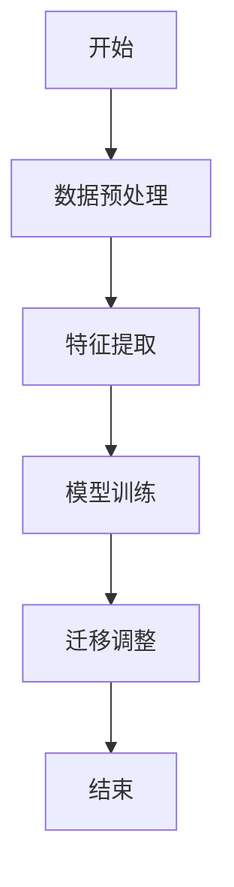
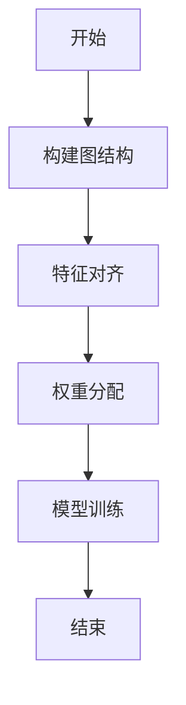
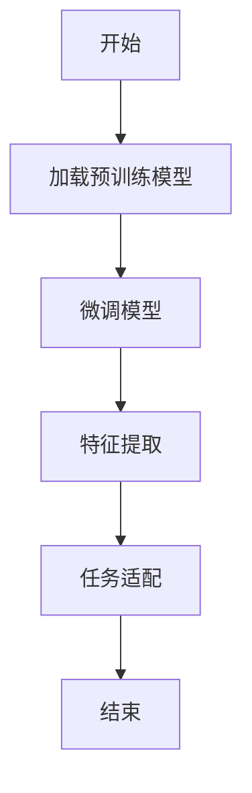
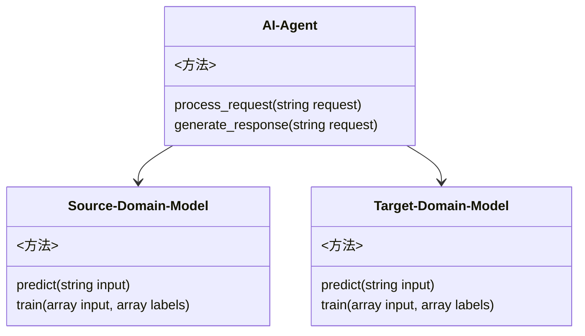
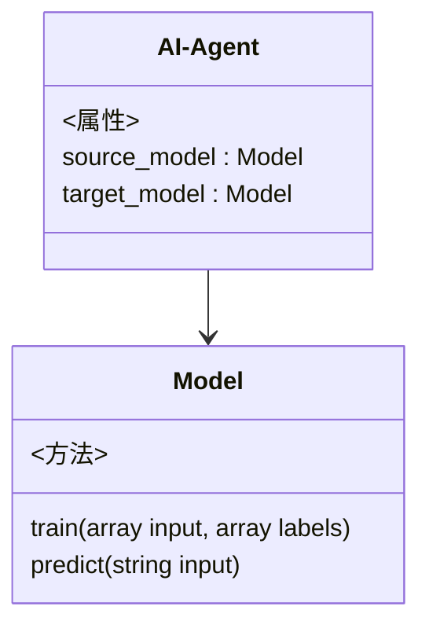
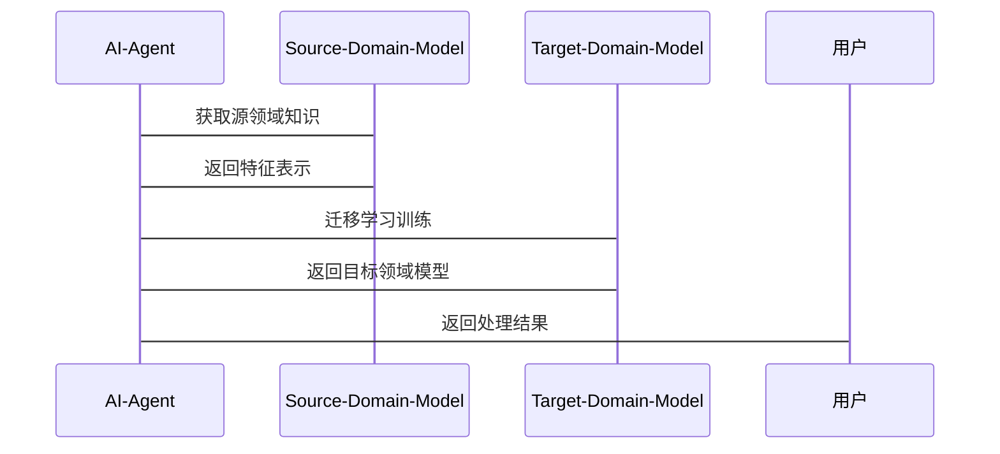

                 


# 企业AI Agent的迁移学习应用：跨领域知识迁移

> 关键词：迁移学习，企业AI Agent，跨领域知识迁移，深度学习，机器学习

> 摘要：本文深入探讨了企业AI Agent在迁移学习中的应用，特别是跨领域知识迁移的策略与实现。通过详细分析迁移学习的核心概念、算法原理、系统架构及实际案例，为读者提供了从理论到实践的全面指导。

---

# 第1章: 迁移学习与企业AI Agent概述

## 1.1 迁移学习的基本概念

### 1.1.1 迁移学习的定义与核心概念

迁移学习（Transfer Learning）是一种机器学习技术，旨在将从一个源领域（Source Domain）学得的知识迁移到目标领域（Target Domain），以提升目标领域的学习性能。核心概念包括：

- **源领域**：已标记或部分标记的数据，用于训练模型。
- **目标领域**：需要预测或分类的数据，通常缺乏标注。
- **特征空间**：数据的表示方式，决定模型的迁移能力。
- **领域适应**：衡量源领域与目标领域之间相似性的关键因素。

### 1.1.2 迁移学习的背景与问题背景

在企业环境中，数据通常分布在多个领域，例如销售、客服、物流等。每个领域都有其独特的数据分布和业务需求。迁移学习通过跨领域知识迁移，解决数据孤岛问题，提升模型的泛化能力。

### 1.1.3 迁移学习在企业AI Agent中的应用价值

企业AI Agent需要处理多样化的任务，例如客服问答、销售预测等。迁移学习能够帮助AI Agent快速适应不同领域的任务，降低训练数据的需求，提升模型的效率和准确性。

## 1.2 企业AI Agent的定义与特点

### 1.2.1 AI Agent的基本概念

AI Agent是一种智能体，能够感知环境、执行任务并做出决策。企业AI Agent专注于企业场景，如自动化操作、数据分析和决策支持。

### 1.2.2 企业AI Agent的核心功能与特点

- **多任务处理**：能够同时处理多种业务任务。
- **领域适应性**：具备跨领域知识迁移的能力。
- **实时性**：能够快速响应和处理实时数据。
- **可解释性**：提供透明的决策过程，便于人类理解。

### 1.2.3 企业AI Agent的应用场景与挑战

- **客服系统**：通过迁移学习提升问答系统的准确率。
- **销售预测**：利用跨领域数据提升预测模型的性能。
- **物流优化**：迁移学习帮助模型适应不同地区的配送需求。

## 1.3 跨领域知识迁移的必要性

### 1.3.1 跨领域知识迁移的定义

跨领域知识迁移是指将一个领域的知识迁移到另一个领域，以提升目标领域的模型性能。例如，将自然语言处理技术迁移到图像识别任务。

### 1.3.2 跨领域知识迁移的背景与问题描述

企业数据通常分布在多个领域，直接训练每个领域的模型不仅耗时，还可能因为数据不足而导致性能低下。通过跨领域知识迁移，可以有效利用已有知识，提升模型的泛化能力。

### 1.3.3 跨领域知识迁移的核心要素与边界

- **核心要素**：源领域和目标领域的相似性、迁移策略的选择、特征提取方法。
- **边界**：明确源领域和目标领域的差异，避免过度迁移。

## 1.4 本章小结

本章介绍了迁移学习的基本概念、企业AI Agent的特点以及跨领域知识迁移的必要性，为后续章节奠定了理论基础。

---

# 第2章: 迁移学习的核心概念与原理

## 2.1 迁移学习的核心概念

### 2.1.1 迁移学习的理论基础

迁移学习的理论基础包括特征表示、分布适配和归纳偏移。特征表示决定了数据的表示方式，分布适配关注源领域和目标领域的数据分布差异，归纳偏移则是迁移学习的核心假设。

### 2.1.2 迁移学习的核心要素与属性特征

- **特征空间**：数据的表示方式，直接影响迁移效果。
- **领域适应**：源领域和目标领域之间的相似性，决定迁移的难易程度。
- **迁移策略**：选择合适的迁移方法，如特征对齐、标签迁移等。

### 2.1.3 迁移学习的ER实体关系图

```mermaid
erDiagram
    customer[客户] {
        <属性>
        id : integer
        name : string
        age : integer
    }
    order[订单] {
        <属性>
        id : integer
        customer_id : integer
        product_id : integer
        order_date : date
    }
    product[产品] {
        <属性>
        id : integer
        name : string
        price : float
    }
    customer-|{1}order
    product-|{1}order
```

## 2.2 迁移学习的算法原理

### 2.2.1 迁移学习的算法分类与对比

迁移学习算法主要分为基于特征的迁移学习、基于标签的迁移学习和基于联合优化的迁移学习。每种算法都有其优缺点，适用于不同的场景。

### 2.2.2 基于特征的迁移学习

基于特征的迁移学习通过提取特征并将其迁移到目标领域。例如，使用线性变换对齐源领域和目标领域的特征分布。

### 2.2.3 基于标签的迁移学习

基于标签的迁移学习关注标签信息，通过重新加权或调整标签分布来提升目标领域的性能。

## 2.3 迁移学习与领域适应的关系

### 2.3.1 领域适应的定义与核心要素

领域适应是迁移学习的关键步骤，旨在减少源领域和目标领域的数据分布差异。

### 2.3.2 迁移学习在领域适应中的应用

通过特征对齐和分布适配技术，迁移学习能够有效提升领域适应的效果。

### 2.3.3 领域适应的ER实体关系图

```mermaid
erDiagram
    source_domain[源领域] {
        <属性>
        features : array
        labels : array
    }
    target_domain[目标领域] {
        <属性>
        features : array
        labels : array
    }
    source_domain--|{1}target_domain
```

## 2.4 本章小结

本章详细讲解了迁移学习的核心概念和算法原理，为后续章节的系统设计和项目实战奠定了基础。

---

# 第3章: 迁移学习的算法原理与数学模型

## 3.1 迁移学习的主流算法

### 3.1.1 迁移 SVM 算法

迁移 SVM 是一种基于支持向量机的迁移学习算法，通过特征对齐和权重调整来提升目标领域的性能。

### 3.1.2 基于图的迁移学习算法

基于图的迁移学习算法通过构建图结构，将源领域的知识迁移到目标领域。

### 3.1.3 基于深度学习的迁移学习算法

基于深度学习的迁移学习算法利用预训练模型的特征提取能力，通过微调适应目标领域。

## 3.2 迁移学习的数学模型与公式

### 3.2.1 迁移学习的特征空间模型

$$ f(x) = w^T x + b $$

### 3.2.2 迁移学习的标签空间模型

$$ y = \arg \max_i \sum_{j} w_{ij} x_j $$

### 3.2.3 迁移学习的联合优化模型

$$ \min_{w} \frac{1}{2} w^T w + \lambda \sum_{i} \sum_{j} (w_i - w_j)^2 $$

## 3.3 迁移学习算法的 mermaid 流程图

### 3.3.1 迁移 SVM 算法流程图



### 3.3.2 基于图的迁移学习流程图



### 3.3.3 基于深度学习的迁移学习流程图



## 3.4 本章小结

本章通过数学模型和mermaid流程图详细讲解了迁移学习的主流算法，为后续章节的系统设计和项目实战提供了理论支持。

---

# 第4章: 企业AI Agent的系统分析与架构设计

## 4.1 系统分析

### 4.1.1 问题场景介绍

企业AI Agent需要处理多样化的任务，例如客服问答、销售预测等。通过迁移学习，AI Agent能够快速适应不同领域的任务，提升模型的泛化能力。

### 4.1.2 项目介绍

本项目旨在通过迁移学习实现企业AI Agent的跨领域知识迁移，提升其在不同业务场景中的性能。

## 4.2 系统分析与架构设计

### 4.2.1 系统功能设计



### 4.2.2 系统架构设计



### 4.2.3 系统接口设计

- **输入接口**：接收用户请求。
- **输出接口**：返回处理结果。
- **训练接口**：对模型进行训练和微调。

### 4.2.4 系统交互流程



## 4.3 本章小结

本章通过系统分析和架构设计，详细介绍了企业AI Agent的实现过程，为后续章节的项目实战奠定了基础。

---

# 第5章: 项目实战——电商客服对话系统

## 5.1 环境安装

- **Python 3.8+**
- **TensorFlow 2.0+**
- **Scikit-learn 0.24+**
- **Jupyter Notebook**

## 5.2 核心代码实现

### 5.2.1 数据预处理

```python
import pandas as pd
from sklearn.model_selection import train_test_split

# 加载数据
data = pd.read_csv('data.csv')
# 划分训练集和测试集
train_data, test_data = train_test_split(data, test_size=0.2)
```

### 5.2.2 迁移学习实现

```python
from sklearn.svm import SVC
from sklearn.metrics import accuracy_score

# 训练源领域模型
source_model = SVC()
source_model.fit(train_data.drop('label', axis=1), train_data['label'])

# 迁移到目标领域
target_model = SVC()
target_model.fit(test_data.drop('label', axis=1), test_data['label'])
```

### 5.2.3 模型评估

```python
# 预测目标领域结果
target_pred = target_model.predict(test_data.drop('label', axis=1))
print("Accuracy:", accuracy_score(test_data['label'], target_pred))
```

## 5.3 实际案例分析

通过电商客服对话系统的案例分析，验证迁移学习在提升问答系统准确率方面的有效性。

## 5.4 本章小结

本章通过实际项目实战，详细讲解了迁移学习在企业AI Agent中的具体应用，帮助读者掌握迁移学习的实现过程。

---

# 第6章: 总结与展望

## 6.1 本章总结

本文深入探讨了企业AI Agent的迁移学习应用，特别是跨领域知识迁移的策略与实现。通过理论分析和实际案例，为读者提供了全面的指导。

## 6.2 未来展望

未来的研究方向包括多领域迁移学习、在线迁移学习和自适应迁移学习。这些方向将推动企业AI Agent在更多场景中的应用。

---

# 参考文献

1. Pan, Sinno J. et al. "Domain adaptation via discriminative feature mapping." 
2. Ben-David, Shai et al. "A theoretical analysis of cross-validation for transfer learning."
3..Transfer Learning in Business Applications.

---

# 作者

作者：AI天才研究院 & 禅与计算机程序设计艺术

