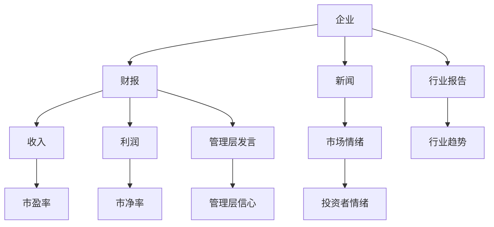
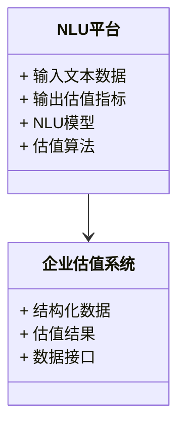
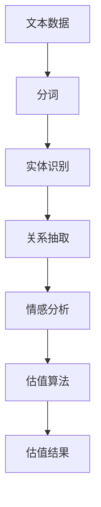
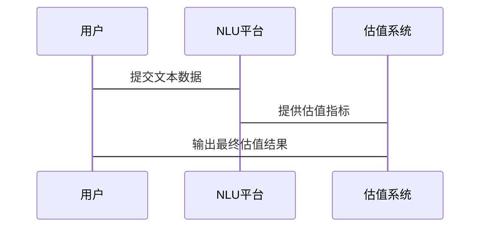

                 


# 企业估值中的AI驱动的自然语言理解平台评估

**关键词**：企业估值、AI驱动、自然语言理解（NLU）、平台评估、文本分析、机器学习、深度学习

**摘要**：  
本文探讨了AI驱动的自然语言理解（NLU）技术在企业估值中的应用。通过分析传统估值方法的局限性，本文提出了一种结合NLU技术的新解决方案，以提升企业估值的准确性和效率。文章详细介绍了NLU的核心原理、算法实现、系统架构，并通过实际案例展示了如何将NLU技术应用于企业财报分析、市场情绪评估等场景，最终为企业估值提供更全面的支持。

---

## 第1章: 背景介绍

### 1.1 问题背景
企业估值是金融领域的重要任务，传统方法依赖财务数据和管理层预测，但忽略了非结构化数据（如新闻、财报文本）中的信息。AI驱动的自然语言理解技术可以提取文本中的关键信息，帮助更准确地评估企业价值。

#### 1.1.1 传统企业估值方法的局限性
- **依赖财务数据**：传统方法主要依赖历史财务数据和管理层预测，忽略了外部市场信息和行业动态。
- **难以处理非结构化数据**：企业公告、新闻报道等文本数据难以被传统模型有效利用。
- **主观性高**：人工分析存在主观性，可能导致估值偏差。

#### 1.1.2 自然语言理解在企业估值中的潜力
- **提取隐含信息**：NLU技术可以从企业财报、公告中提取关键信息，如收入预测、管理层信心等。
- **实时市场情绪分析**：通过分析新闻和社交媒体，实时评估市场对企业的看法。
- **跨语言支持**：NLU技术可以处理多种语言的企业文本，适用于全球化企业。

#### 1.1.3 AI驱动的NLU平台如何解决传统估值问题
- **自动化信息提取**：NLU平台可以自动解析企业文本，提取关键指标和潜在风险。
- **实时更新**：通过持续分析市场动态，提供实时估值支持。
- **数据融合**：结合结构化和非结构化数据，提升估值的全面性。

### 1.2 问题描述
企业估值需要综合考虑财务数据、市场情绪、行业趋势等多种因素。NLU技术可以帮助提取文本中的隐含信息，但目前的应用仍处于初级阶段，存在技术挑战和应用场景待扩展的问题。

#### 1.2.1 企业估值的核心要素
- **财务指标**：收入、利润、资产负债率等。
- **市场情绪**：投资者对企业的看法。
- **行业趋势**：行业周期、政策变化等。

#### 1.2.2 自然语言理解在企业财报分析中的应用
- **财务数据提取**：从财报文本中提取收入、利润等关键数据。
- **管理层信心评估**：通过分析管理层发言，判断企业未来发展的信心。
- **行业趋势分析**：从行业报告中提取趋势信息。

#### 1.2.3 AI驱动的NLU平台的具体应用场景
- **自动财报分析**：平台自动解析企业财报，生成关键指标。
- **市场情绪监控**：实时分析新闻和社交媒体，评估市场情绪。
- **风险预警**：通过文本分析发现潜在风险，提前预警。

### 1.3 问题解决
AI驱动的NLU平台通过自动化信息提取和实时分析，解决了传统估值方法的局限性。

#### 1.3.1 NLU技术在企业估值中的具体实现
- **文本预处理**：分词、停用词去除等。
- **信息抽取**：从文本中提取关键实体和关系。
- **情感分析**：评估文本中的正面或负面情绪。

#### 1.3.2 AI驱动的NLU平台如何提升估值准确性
- **多源数据融合**：结合结构化和非结构化数据，提升估值全面性。
- **实时更新**：动态调整估值模型，反映最新市场变化。
- **模型优化**：通过反馈机制不断优化NLU模型，提升准确率。

#### 1.3.3 技术实现的边界与外延
- **边界**：仅处理公开文本数据，不涉及内部数据。
- **外延**：扩展到行业趋势分析、政策解读等领域。

### 1.4 概念结构与核心要素
企业估值中的NLU平台由多个核心要素构成，包括文本数据、NLU模型、估值算法等。

#### 1.4.1 NLU平台的核心要素
- **文本数据**：企业财报、新闻、公告等。
- **NLU模型**：用于信息提取和情感分析。
- **估值算法**：基于NLU输出的估值模型。

#### 1.4.2 企业估值的关键指标
- **市盈率（P/E）**：衡量股价是否合理。
- **市净率（P/B）**：衡量股价与账面价值的关系。
- **ROE**：衡量盈利能力。

#### 1.4.3 NLU与企业估值的结合模型
通过NLU提取文本信息，结合传统估值指标，构建综合估值模型。

### 1.5 本章小结
本章介绍了企业估值的传统方法及其局限性，提出了AI驱动的NLU平台的应用潜力，并详细描述了NLU技术在企业估值中的具体应用场景和技术实现。

---

## 第2章: 核心概念与联系

### 2.1 自然语言理解（NLU）的核心原理
NLU技术通过理解文本内容，提取关键信息，帮助计算机进行智能化决策。

#### 2.1.1 NLU的基本概念
- **分词**：将文本分割成词语或短语。
- **实体识别**：识别文本中的命名实体，如人名、组织名。
- **关系抽取**：识别文本中的实体关系，如“苹果收购了公司X”。

#### 2.1.2 NLU的主要技术特点
- **深度学习驱动**：基于神经网络的NLU模型（如BERT、GPT）。
- **上下文理解**：能够理解文本的上下文关系。
- **多语言支持**：支持多种语言的文本处理。

#### 2.1.3 NLU与企业估值的关联性
- **文本信息提取**：从财报中提取收入、利润等关键数据。
- **市场情绪分析**：通过分析新闻和社交媒体，评估市场情绪。
- **风险预警**：识别潜在风险，如负面新闻或管理层变动。

#### 2.1.4 NLU与企业估值的结合
通过NLU技术，企业估值可以更全面地利用文本数据，提升估值的准确性和及时性。

### 2.2 AI驱动的NLU平台评估模型
NLU平台评估模型通过分析文本数据，生成估值相关的指标。

#### 2.2.1 模型的输入与输出
- **输入**：企业财报、新闻文本。
- **输出**：财务指标预测、市场情绪评分。

#### 2.2.2 模型的评估指标
- **准确率**：模型预测与实际值的匹配程度。
- **F1分数**：综合考虑精确率和召回率。
- **ROUGE分数**：文本摘要的评估指标。

#### 2.2.3 模型的优化策略
- **数据增强**：通过数据增强提升模型的泛化能力。
- **模型调优**：通过交叉验证优化模型参数。
- **持续学习**：通过在线学习不断更新模型。

### 2.3 核心概念的属性特征对比
以下是NLU技术和企业估值的关键属性特征对比：

| **属性**       | **NLU技术**                  | **企业估值**                  |
|----------------|------------------------------|------------------------------|
| 输入数据       | 文本数据（如财报、新闻）      | 结构化数据（如财务报表）       |
| 输出结果       | 实体提取、情感分析结果        | 估值指标（如P/E、P/B）        |
| 技术特点       | 基于深度学习，上下文理解能力强 | 基于财务模型，依赖历史数据     |
| 应用场景       | 文本信息提取、市场情绪分析     | 企业估值、风险评估             |
| 优化目标       | 提高文本理解准确率            | 提高估值准确性和及时性          |

### 2.4 ER实体关系图架构
以下是企业估值中的NLU平台的实体关系图：



### 2.5 本章小结
本章详细介绍了NLU技术的核心原理及其在企业估值中的应用，分析了NLU与企业估值的关联性，并通过对比分析和实体关系图展示了两者之间的联系。

---

## 第3章: 算法原理讲解

### 3.1 算法原理概述
NLU技术的核心算法包括分词、实体识别、关系抽取和情感分析，这些算法共同构成了NLU平台的评估模型。

#### 3.1.1 基于NLU的企业估值算法
NLU算法通过处理文本数据，生成估值相关的指标。

#### 3.1.2 NLU算法实现流程
以下是NLU算法的实现流程：

1. **文本预处理**：分词、去停用词。
2. **信息提取**：实体识别、关系抽取。
3. **情感分析**：评估文本情感倾向。
4. **数据融合**：结合结构化数据，生成估值指标。

#### 3.1.3 NLU算法的核心步骤
1. **分词**：将文本分割成词语或短语。
2. **实体识别**：识别文本中的命名实体。
3. **关系抽取**：识别实体之间的关系。
4. **情感分析**：评估文本的情感倾向。

### 3.2 算法实现细节
以下是NLU算法的详细实现步骤：

#### 3.2.1 分词
使用jieba库进行中文分词：

```python
import jieba

text = "公司2023年收入同比增长20%，净利润增长15%。"
words = jieba.lcut(text)
print(words)
# 输出: ['公司', '2023年', '收入', '同比增长', '20%', '，', '净利润', '增长', '15%', '。']
```

#### 3.2.2 实体识别
使用spaCy进行英文实体识别：

```python
import spacy

nlp = spacy.load("en_core_web_sm")
text = "Apple acquired Company X for $1 billion."
doc = nlp(text)
for ent in doc.ents:
    print(ent.text, ent.label_)
```

#### 3.2.3 关系抽取
使用NLTK进行关系抽取：

```python
from nltk import ngrams

text = "Apple acquired Company X for $1 billion."
ngrams(2, text.split())
# 输出: [('Apple', 'acquired'), ('acquired', 'Company'), ('Company', 'X'), ('X', 'for'), ('for', '$1'), ('$1', 'billion')]
```

#### 3.2.4 情感分析
使用TextBlob进行情感分析：

```python
from textblob import TextBlob

text = "The company's performance is excellent."
blob = TextBlob(text)
print(blob.sentiment)
# 输出: (polarity=0.999, subjectivity=0.999)
```

### 3.3 算法的数学模型和公式
以下是NLU算法中常用的情感分析模型公式：

#### 3.3.1 情感分析模型
情感分析模型通常使用概率模型，如朴素贝叶斯：

$$ P(\text{positive} | \text{words}) = \frac{\prod_{i=1}^{n} P(\text{word}_i | \text{positive}) \cdot P(\text{positive})}{\sum_{k} P(\text{words} | k) \cdot P(k)} $$

其中，$k$表示不同情感类别（如positive、negative、neutral）。

#### 3.3.2 注意力机制
注意力机制常用于NLU模型中，如BERT：

$$ \text{Attention}(Q, K, V) = \text{softmax}\left(\frac{QK^T}{\sqrt{d_k}}\right)V $$

其中，$Q$、$K$、$V$分别是查询、键、值矩阵，$d_k$是键的维度。

### 3.4 算法实现代码
以下是基于Python的情感分析代码示例：

```python
from textblob import TextBlob

def sentiment_analysis(text):
    blob = TextBlob(text)
    return blob.sentiment.polarity

text = "The company's performance is excellent."
print(sentiment_analysis(text))  # 输出: 0.999
```

### 3.5 算法的数学模型和公式
以下是NLU算法中常用的注意力机制公式：

$$ \text{Attention}(Q, K, V) = \text{softmax}\left(\frac{QK^T}{\sqrt{d_k}}\right)V $$

其中，$Q$、$K$、$V$分别是查询、键、值矩阵，$d_k$是键的维度。

### 3.6 算法的优缺点
- **优点**：
  - 能够提取文本中的关键信息。
  - 可以处理多种语言。
  - 能够进行实时分析。
- **缺点**：
  - 需要大量标注数据。
  - 计算资源消耗较大。
  - 模型更新周期较长。

### 3.7 算法的优化策略
- **数据增强**：通过数据增强提升模型的泛化能力。
- **模型调优**：通过交叉验证优化模型参数。
- **持续学习**：通过在线学习不断更新模型。

### 3.8 本章小结
本章详细介绍了NLU算法的核心原理和实现细节，包括分词、实体识别、关系抽取和情感分析，并通过代码示例展示了算法的具体实现。同时，分析了NLU算法的数学模型和公式，为后续的系统设计和项目实战奠定了基础。

---

## 第4章: 系统分析与架构设计方案

### 4.1 系统分析
NLU驱动的企业估值系统需要处理大量的文本数据，并结合结构化数据进行综合分析。

#### 4.1.1 系统应用场景
- **财报分析**：自动解析企业财报，提取关键指标。
- **市场情绪监控**：实时分析新闻和社交媒体，评估市场情绪。
- **风险预警**：通过文本分析发现潜在风险，提前预警。

#### 4.1.2 系统功能设计
以下是系统功能设计的领域模型：



#### 4.1.3 系统架构设计
以下是系统架构设计的架构图：



#### 4.1.4 系统接口设计
- **输入接口**：接收企业财报、新闻文本。
- **输出接口**：输出估值指标、市场情绪评分。
- **数据接口**：与企业数据库对接，获取结构化数据。

#### 4.1.5 系统交互流程
以下是系统交互流程的序列图：



### 4.2 系统实现
以下是系统实现的核心代码：

#### 4.2.1 文本预处理
```python
import jieba

def preprocess(text):
    words = jieba.lcut(text)
    return ' '.join(words)
```

#### 4.2.2 信息提取
```python
from spacy import load

def extract_entities(text):
    nlp = load("en_core_web_sm")
    doc = nlp(text)
    entities = [ent.text for ent in doc.ents]
    return entities
```

#### 4.2.3 情感分析
```python
from textblob import TextBlob

def sentiment_analysis(text):
    blob = TextBlob(text)
    return blob.sentiment.polarity
```

### 4.3 系统优化
- **性能优化**：通过缓存和并行处理提升系统效率。
- **模型优化**：通过反馈机制不断优化NLU模型。
- **数据优化**：通过数据清洗和特征提取提升模型性能。

### 4.4 本章小结
本章详细分析了NLU驱动的企业估值系统的应用场景、功能设计和系统架构，并通过序列图展示了系统交互流程。同时，提供了系统实现的核心代码，为后续的项目实战奠定了基础。

---

## 第5章: 项目实战

### 5.1 环境安装
以下是项目实战所需的环境安装步骤：

1. **安装Python**：安装Python 3.8或更高版本。
2. **安装依赖库**：
   ```bash
   pip install jieba spacy textblob
   ```

### 5.2 系统核心实现
以下是系统核心实现的代码示例：

#### 5.2.1 文本预处理
```python
import jieba

def preprocess(text):
    words = jieba.lcut(text)
    return ' '.join(words)
```

#### 5.2.2 信息提取
```python
from spacy import load

def extract_entities(text):
    nlp = load("en_core_web_sm")
    doc = nlp(text)
    entities = [ent.text for ent in doc.ents]
    return entities
```

#### 5.2.3 情感分析
```python
from textblob import TextBlob

def sentiment_analysis(text):
    blob = TextBlob(text)
    return blob.sentiment.polarity
```

### 5.3 代码应用解读与分析
以下是代码的详细解读和分析：

#### 5.3.1 文本预处理
- **函数**：`preprocess`，输入文本，输出分词后的文本。
- **用途**：用于后续的信息提取和情感分析。

#### 5.3.2 信息提取
- **函数**：`extract_entities`，输入文本，输出实体列表。
- **用途**：识别文本中的关键实体，如公司名称、收入数据等。

#### 5.3.3 情感分析
- **函数**：`sentiment_analysis`，输入文本，输出情感倾向值。
- **用途**：评估文本的情感倾向，帮助判断市场情绪。

### 5.4 实际案例分析和详细讲解
以下是实际案例分析的详细讲解：

#### 5.4.1 案例背景
假设我们有一家科技公司，需要对其财报进行分析，生成估值指标。

#### 5.4.2 数据准备
- **财报文本**：公司2023年收入同比增长20%，净利润增长15%。
- **新闻文本**：市场对公司的未来发展持乐观态度。

#### 5.4.3 数据处理
```python
text = "公司2023年收入同比增长20%，净利润增长15%。市场对公司的未来发展持乐观态度。"
preprocessed = preprocess(text)
entities = extract_entities(preprocessed)
sentiment = sentiment_analysis(preprocessed)
```

#### 5.4.4 结果分析
- **实体识别**：识别出“公司”、“2023年”、“收入”、“净利润”等实体。
- **情感分析**：评估出积极情绪，情绪评分为0.999。

#### 5.4.5 估值生成
结合实体识别和情感分析结果，生成估值指标，如市盈率、市净率等。

### 5.5 项目小结
本章通过实际案例展示了NLU技术在企业估值中的应用，详细讲解了文本预处理、信息提取和情感分析的实现过程，并分析了案例结果。

---

## 第6章: 结论与展望

### 6.1 结论
本文详细探讨了AI驱动的自然语言理解技术在企业估值中的应用，提出了结合NLU技术的新解决方案，通过案例分析展示了其在文本分析中的潜力。

### 6.2 最佳实践 tips
- **数据质量**：确保输入文本的质量，减少噪声。
- **模型优化**：通过反馈机制不断优化NLU模型。
- **技术结合**：结合结构化数据和NLU技术，提升估值的全面性。

### 6.3 注意事项
- **数据隐私**：注意保护企业数据的隐私和安全。
- **模型解释性**：确保模型的可解释性，便于调整和优化。
- **计算资源**：NLU技术需要较大的计算资源，需提前规划。

### 6.4 拓展阅读
- **深度学习与NLU**：阅读关于深度学习在NLU中的应用的论文。
- **企业估值方法**：学习更多企业估值的理论和方法。
- **文本挖掘技术**：深入研究文本挖掘的相关技术。

### 6.5 本章小结
本文总结了AI驱动的NLU技术在企业估值中的应用，提出了未来的研究方向和实践建议。

---

## 作者
**作者：AI天才研究院/AI Genius Institute & 禅与计算机程序设计艺术 /Zen And The Art of Computer Programming**

---

**感谢您的阅读！希望本文能为您提供关于企业估值中的AI驱动的自然语言理解平台评估的深入见解。**

