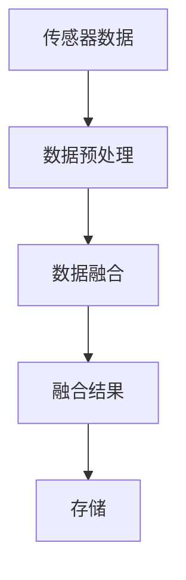
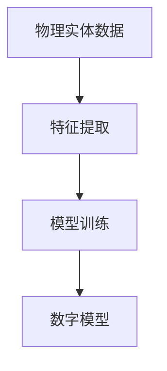
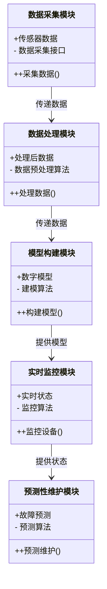
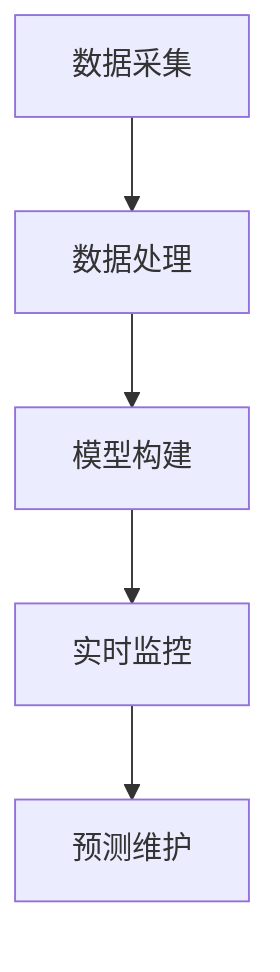

                 


```markdown
# 如何评估企业的数字孪生技术应用

## 关键词
数字孪生, 企业应用, 技术评估, 物理模型, 数据同步

## 摘要
数字孪生技术是一种通过数字化手段在虚拟空间中创建物理对象或系统的实时数字映射的技术。本文将从数字孪生的基本概念、技术原理、系统架构设计、项目实战和最佳实践等多个维度，全面分析如何评估企业在数字孪生技术应用中的成熟度和潜力。通过对数字孪生技术的核心概念、算法原理和系统架构的深入探讨，本文旨在为企业提供一份系统化的评估指南，帮助企业更好地理解和应用数字孪生技术。

---

# 第一部分：数字孪生技术的背景与概念

# 第1章：数字孪生技术的背景介绍

## 1.1 数字孪生的基本概念

### 1.1.1 数字孪生的定义
数字孪生（Digital Twin）是一种通过物理模型、传感器数据和软件算法等技术手段，在虚拟空间中创建对物理对象或系统的实时数字映射的技术。它能够实时反映物理对象的状态、属性和行为。

### 1.1.2 数字孪生的核心要素
数字孪生的核心要素包括：
1. **物理实体**：数字孪生的映射对象，可以是设备、系统或流程。
2. **数据源**：包括传感器数据、系统日志、业务数据等。
3. **虚拟模型**：基于物理实体的数据构建的数字模型，通常包括几何模型、行为模型和性能模型。
4. **实时同步**：通过数据传输和处理，确保虚拟模型与物理实体保持一致。
5. **分析与决策**：基于虚拟模型的分析结果，优化物理实体的运行和管理。

### 1.1.3 数字孪生的演进历程
数字孪生技术的发展经历了以下几个阶段：
1. **概念提出阶段**：2000年代初，数字孪生的概念开始出现，主要用于航空航天和制造业。
2. **技术探索阶段**：2010年代，随着物联网和云计算技术的发展，数字孪生开始应用于多个领域。
3. **广泛应用阶段**：近年来，数字孪生技术逐渐成熟，并在制造业、建筑业、医疗等领域得到广泛应用。

## 1.2 数字孪生的技术背景

### 1.2.1 数字孪生与工业4.0的关系
数字孪生是工业4.0的重要组成部分，它通过数据的实时采集和分析，支持智能制造、预测性维护和优化决策。

### 1.2.2 数字孪生在企业数字化转型中的作用
数字孪生技术能够帮助企业实现物理世界和数字世界的深度融合，支持企业从传统运营模式向智能化、数据驱动的模式转型。

### 1.2.3 数字孪生与物联网（IoT）的结合
数字孪生依赖于物联网技术获取物理实体的实时数据，而物联网则通过数字孪生技术实现对设备和系统的智能化管理。

## 1.3 数字孪生的应用场景

### 1.3.1 制造业中的数字孪生应用
在制造业中，数字孪生技术可以用于设备预测性维护、生产过程优化和产品质量监控。

### 1.3.2 建筑业中的数字孪生应用
在建筑业中，数字孪生技术可以用于建筑物的虚拟建模、设施管理和能源优化。

### 1.3.3 零售业中的数字孪生应用
在零售业中，数字孪生技术可以用于库存管理、客户体验优化和门店运营分析。

## 1.4 数字孪生与相关技术的对比

### 1.4.1 数字孪生与虚拟化技术的区别
数字孪生不仅关注虚拟空间的建模，还强调与物理世界的实时数据同步，而虚拟化技术更多关注虚拟资源的管理。

### 1.4.2 数字孪生与数据可视化的关系
数据可视化是数字孪生的一种表现形式，但数字孪生更强调数据的实时性和与物理世界的关联性。

### 1.4.3 数字孪生与工业仿真技术的联系
数字孪生与工业仿真技术在建模和模拟方面有相似之处，但数字孪生更强调实时数据的驱动和动态更新。

## 1.5 本章小结
本章从数字孪生的基本概念、技术背景和应用场景等方面进行了全面介绍，并将其与相关技术进行了对比分析。

---

# 第二部分：数字孪生的核心概念与技术原理

# 第2章：数字孪生的核心概念与联系

## 2.1 数字孪生的核心原理

### 2.1.1 数据驱动的实时同步
数字孪生通过传感器数据和实时数据传输技术，确保虚拟模型与物理实体的状态同步。

### 2.1.2 多物理量的建模与仿真
数字孪生不仅关注几何建模，还涉及行为建模、性能建模等多个维度。

### 2.1.3 跨平台的互操作性
数字孪生技术支持多种平台和系统的互操作性，能够与企业现有的IT系统无缝集成。

## 2.2 数字孪生的核心要素对比

### 2.2.1 数据源的特征对比
| 数据源类型   | 数据特征               | 数据特点               |
| ------------ | ---------------------- | ---------------------- |
| 传感器数据   | 实时性、准确性         | 数据量大、频率高       |
| 系统日志     | 历史性、可追溯性       | 数据格式多样           |
| 业务数据     | 关联性、业务相关性     | 数据结构复杂           |

### 2.2.2 模型的复杂度对比
| 模型类型     | 复杂度                 | 适用场景               |
| ------------ | ---------------------- | ---------------------- |
| 几何模型     | 中等                   | 设备外形建模           |
| 行为模型     | 高                     | 设备运行状态模拟       |
| 性能模型     | 高                     | 设备性能预测           |

### 2.2.3 应用场景的对比分析
| 应用场景     | 技术需求               | 关键挑战               |
| ------------ | ---------------------- | ---------------------- |
| 制造业       | 预测性维护、生产优化     | 数据实时性、模型精度   |
| 建筑业       | 设施管理、能源优化       | 建模复杂性、数据集成   |
| 零售业       | 库存管理、客户体验优化   | 数据多样性、系统集成   |

## 2.3 数字孪生的ER实体关系图

```mermaid
erDiagram
    actor 用户 {
        +id 用户ID
        +name 用户名
    }
    actor 设备 {
        +id 设备ID
        +type 设备类型
    }
    actor 服务 {
        +id 服务ID
        +name 服务名称
    }
    用户 --> 设备 : 使用
    用户 --> 服务 : 订阅
    设备 --> 服务 : 注册
```

## 2.4 本章小结
本章从数字孪生的核心原理、核心要素和应用场景进行了详细分析，并通过对比表格和ER图展示了其复杂性和系统性。

---

# 第三部分：数字孪生的算法原理

# 第3章：数字孪生的算法原理

## 3.1 数字孪生的核心算法

### 3.1.1 数据融合算法
数据融合算法用于将来自不同数据源的数据进行整合和处理，以提高数据的准确性和完整性。

### 3.1.2 模型建模算法
模型建模算法用于基于物理实体的数据构建数字模型，包括几何建模和行为建模。

### 3.1.3 实时更新算法
实时更新算法用于确保数字模型与物理实体的状态保持一致，包括数据传输和模型调整。

## 3.2 数据融合算法实现

### 3.2.1 数据融合算法流程图



### 3.2.2 数据融合算法的数学模型
$$ y_i = \frac{\sum_{j=1}^{n} w_j x_j}{\sum_{j=1}^{n} w_j} $$
其中，$y_i$ 是融合结果，$w_j$ 是数据源 $j$ 的权重，$x_j$ 是数据源 $j$ 的值。

### 3.2.3 数据融合算法的Python实现

```python
def data_fusion(sensor_data):
    weights = [0.3, 0.3, 0.4]
    fused_data = sum(weights[i] * sensor_data[i] for i in range(len(weights))) / sum(weights)
    return fused_data
```

## 3.3 模型建模算法实现

### 3.3.1 模型建模算法流程图



### 3.3.2 模型建模算法的数学模型
$$ f(x) = w_1 x_1 + w_2 x_2 + \dots + w_n x_n + b $$
其中，$w_i$ 是特征 $x_i$ 的权重，$b$ 是偏置项。

### 3.3.3 模型建模算法的Python实现

```python
import numpy as np
from sklearn.linear_model import LinearRegression

X = np.array([[x1], [x2], ..., [xn]])
y = np.array([y1, y2, ..., yn])
model = LinearRegression().fit(X, y)
```

## 3.4 本章小结
本章详细介绍了数字孪生技术中的核心算法，包括数据融合算法和模型建模算法，并给出了具体的实现示例。

---

# 第四部分：数字孪生的系统架构设计

# 第4章：数字孪生的系统架构设计

## 4.1 问题场景介绍

### 4.1.1 问题背景
企业希望利用数字孪生技术优化其设备的预测性维护和生产效率。

### 4.1.2 问题描述
企业的设备数据分散在多个系统中，缺乏统一的数字模型和实时监控能力。

### 4.1.3 问题解决
通过数字孪生技术，构建统一的数字模型，实现设备的实时监控和预测性维护。

## 4.2 系统功能设计

### 4.2.1 系统功能模块
1. **数据采集模块**：负责采集设备的传感器数据。
2. **数据处理模块**：对采集的数据进行预处理和融合。
3. **模型构建模块**：基于数据构建数字模型。
4. **实时监控模块**：对设备的实时状态进行监控和分析。
5. **预测性维护模块**：基于模型预测设备的故障风险。

### 4.2.2 系统功能的类图



## 4.3 系统架构设计

### 4.3.1 系统架构的分层设计
数字孪生系统的架构通常分为数据层、模型层、应用层和用户层。

### 4.3.2 系统架构的流程图



## 4.4 本章小结
本章从系统架构的角度，详细介绍了数字孪生技术的实现过程，并给出了系统的功能模块和架构设计。

---

# 第五部分：数字孪生的项目实战

# 第5章：数字孪生的项目实战

## 5.1 项目环境安装

### 5.1.1 系统需求
- 操作系统：Windows 10 或更高版本，或 Linux 系统
- Python版本：Python 3.6 或更高版本
- 依赖库：numpy、pandas、scikit-learn、mermaid

### 5.1.2 安装步骤
1. 安装Python和pip。
2. 使用pip安装所需的依赖库：
   ```bash
   pip install numpy pandas scikit-learn mermaid
   ```

## 5.2 项目核心代码实现

### 5.2.1 数据采集模块的实现

```python
import pandas as pd

def collect_data():
    # 模拟传感器数据采集
    data = {'温度': [25, 26, 24, 25], '湿度': [60, 65, 58, 62]}
    return pd.DataFrame(data)
```

### 5.2.2 数据处理模块的实现

```python
import numpy as np

def process_data(data):
    # 数据预处理
    processed_data = data.rolling(2).mean()
    return processed_data
```

### 5.2.3 模型构建模块的实现

```python
from sklearn.linear_model import LinearRegression

def build_model(data):
    # 数据分割
    X = data[['温度', '湿度']]
    y = data['预测值']
    model = LinearRegression().fit(X, y)
    return model
```

### 5.2.4 实时监控模块的实现

```python
import time

def monitor_model(model, data):
    # 实时监控
    while True:
        prediction = model.predict(data)
        print(f'预测值：{prediction}')
        time.sleep(60)
```

## 5.3 项目小结
本章通过一个实际案例，详细介绍了数字孪生技术的实现过程，包括环境安装、数据采集、数据处理、模型构建和实时监控。

---

# 第六部分：数字孪生的最佳实践

# 第6章：数字孪生的最佳实践

## 6.1 评估数字孪生技术的关键点

### 6.1.1 数据质量
数据的准确性和实时性是数字孪生技术的核心，企业需要确保数据源的可靠性和数据传输的稳定性。

### 6.1.2 模型精度
数字模型的精度直接影响数字孪生的实用性，企业需要选择合适的建模算法，并进行模型的持续优化。

### 6.1.3 系统集成
数字孪生技术需要与企业的现有系统进行无缝集成，确保数据的流通和系统的协同运行。

## 6.2 数字孪生技术的注意事项

### 6.2.1 数据隐私
在数字孪生技术的应用中，企业需要重视数据隐私和数据安全，确保敏感数据不被泄露。

### 6.2.2 系统可扩展性
随着业务的发展，数字孪生系统的规模和复杂度可能会不断增加，企业需要设计具有可扩展性的系统架构。

### 6.2.3 用户体验
数字孪生技术的应用需要考虑用户体验，确保界面友好、操作简便，满足用户的需求。

## 6.3 数字孪生技术的扩展阅读

### 6.3.1 数字孪生在不同行业的应用
数字孪生技术在制造业、建筑业、医疗等行业的应用案例和最佳实践。

### 6.3.2 数字孪生技术的未来趋势
数字孪生技术的发展方向，包括人工智能、区块链等新技术的融合应用。

## 6.4 本章小结
本章总结了数字孪生技术在企业应用中的关键点、注意事项和未来发展趋势，为企业更好地应用数字孪生技术提供了指导。

---

# 结语

数字孪生技术作为一种新兴的技术手段，正在为企业数字化转型和智能化发展提供强有力的支持。通过本文的系统介绍，读者可以全面了解数字孪生技术的核心概念、算法原理和系统架构，并通过实际案例和最佳实践，掌握如何评估和应用数字孪生技术。未来，随着技术的不断发展，数字孪生将在更多领域发挥重要作用。

---

# 作者：AI天才研究院 & 禅与计算机程序设计艺术
```

