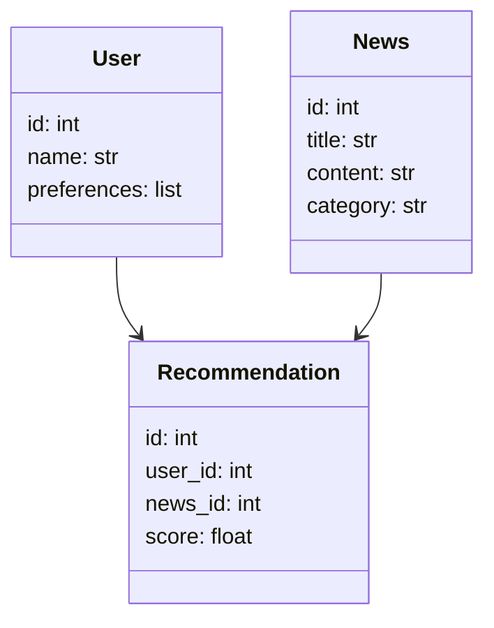
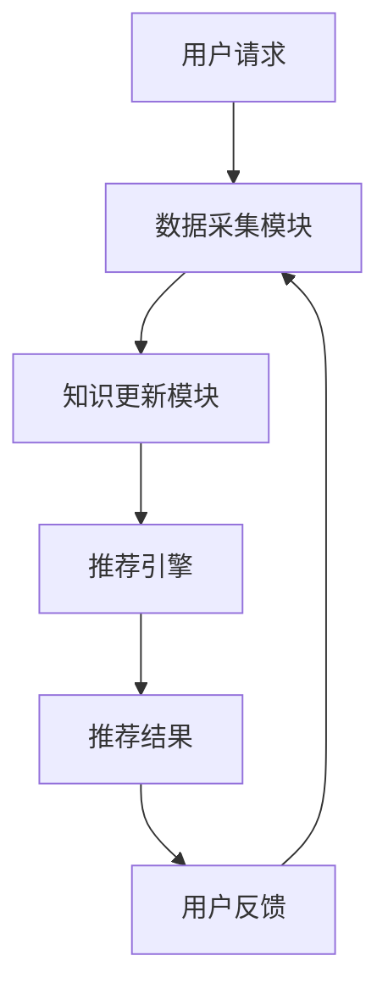
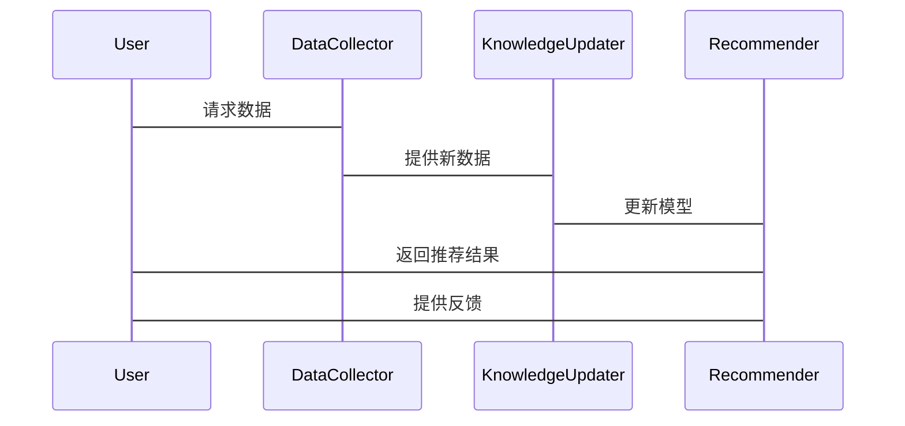

                 


# 构建具有动态知识更新能力的AI Agent

> 关键词：AI Agent、动态知识更新、知识图谱、增量式学习、在线学习、知识融合

> 摘要：本文深入探讨了如何构建一个能够实时更新知识的AI Agent。通过分析动态知识更新的核心概念、算法原理和系统架构，结合实际案例，详细讲解了增量式学习、在线学习、知识图谱更新等关键技术，并提供了完整的实现方案和优化建议。本文适合对AI Agent和动态知识更新感兴趣的开发者和研究人员阅读。

---

# 第一部分: 动态知识更新与AI Agent基础

## 第1章: 动态知识更新与AI Agent概述

### 1.1 动态知识更新的定义与背景

#### 1.1.1 知识更新的定义
动态知识更新是指AI Agent在运行过程中，能够根据新的输入数据或环境变化，实时更新其知识库的过程。这种更新可以是局部的（增量式更新）或全局的（完全重新训练）。

#### 1.1.2 动态知识更新的背景与意义
在当今快速变化的环境中，AI Agent需要能够适应新的数据和任务。动态知识更新是实现这一目标的核心技术。例如，在自然语言处理中，模型需要不断吸收新的语言数据，以保持对最新语义的理解能力。

#### 1.1.3 AI Agent的核心概念与特点
AI Agent是一种智能体，能够感知环境、执行任务并做出决策。动态知识更新能力使其能够在复杂环境中保持高效运作。

### 1.2 动态知识更新的必要性

#### 1.2.1 知识的动态变化特性
知识并非一成不变。例如，新的法律法规出台、新技术的发展都会导致知识库的更新需求。

#### 1.2.2 AI Agent面临的挑战
AI Agent需要在实时环境中做出决策，但其知识库可能过时，导致决策失误。

#### 1.2.3 动态知识更新的优势
通过动态知识更新，AI Agent能够保持知识的准确性，从而提高决策的可靠性和效率。

### 1.3 动态知识更新的实现方式

#### 1.3.1 增量式学习
增量式学习是指在已有模型的基础上，逐步更新模型参数以适应新数据。

#### 1.3.2 在线学习
在线学习是一种实时更新模型的机制，适用于数据流场景。

#### 1.3.3 知识图谱更新
知识图谱是一种结构化的知识表示形式，动态知识更新可以通过图结构的调整来实现。

### 1.4 本章小结
本章介绍了动态知识更新的定义、背景和必要性，以及其实现方式。

---

# 第二部分: 动态知识更新的核心算法

## 第2章: 增量式学习算法

### 2.1 增量式学习的基本原理

#### 2.1.1 增量式学习的定义
增量式学习是一种在已有数据的基础上，逐步添加新数据并更新模型的学习方式。

#### 2.1.2 增量式学习的特点
- 知识库逐步更新
- 计算资源消耗低
- 适用于在线场景

### 2.2 增量式学习的实现算法

#### 2.2.1 梯度下降法
梯度下降法是一种常用的优化算法，适用于线性回归模型的增量式更新。

##### 2.2.1.1 算法步骤
1. 初始化参数$w$。
2. 计算损失函数$L$。
3. 计算梯度$\nabla L$。
4. 更新参数$w = w - \eta \nabla L$。
5. 重复步骤2-4，直到收敛。

##### 2.2.1.2 代码实现
```python
def incremental_gradient_descent(X, y, eta=0.1):
    w = np.zeros(X.shape[1])
    for i in range(len(X)):
        prediction = np.dot(X[i], w)
        error = y[i] - prediction
        gradient = 2 * np.dot(X[i].T, error)
        w += eta * gradient
    return w
```

#### 2.2.2 随机梯度下降法
随机梯度下降法是一种高效的增量式学习算法，适用于大规模数据集。

##### 2.2.2.1 算法步骤
1. 初始化参数$w$。
2. 随机抽取一个样本$(x_i, y_i)$。
3. 计算梯度$\nabla L_i$。
4. 更新参数$w = w - \eta \nabla L_i$。
5. 重复步骤2-4，直到收敛。

##### 2.2.2.2 代码实现
```python
def stochastic_gradient_descent(X, y, eta=0.1, batch_size=1):
    w = np.zeros(X.shape[1])
    for i in range(len(X)):
        idx = np.random.randint(len(X))
        x = X[idx]
        y_true = y[idx]
        prediction = np.dot(x, w)
        error = y_true - prediction
        gradient = 2 * x * error
        w += eta * gradient
    return w
```

#### 2.2.3 增量式支持向量机
增量式支持向量机适用于非线性分类问题。

##### 2.2.3.1 算法步骤
1. 初始化支持向量机模型。
2. 逐步添加新样本。
3. 更新模型参数，以适应新样本。
4. 重复步骤2-3，直到收敛。

##### 2.2.3.2 代码实现
```python
class IncrementalSVM:
    def __init__(self):
        self.model = svm.SVC()

    def fit(self, X, y):
        for x, label in zip(X, y):
            self.model.partial_fit(x.reshape(1, -1), [label])
        return self.model
```

### 2.3 增量式学习的优缺点

#### 2.3.1 增量式学习的优点
- 计算效率高
- 适用于实时场景
- 资源消耗低

#### 2.3.2 增量式学习的缺点
- 对异常数据敏感
- 需要维护历史数据

### 2.4 本章小结
本章详细讲解了增量式学习的基本原理和实现算法，并给出了优缺点分析。

---

## 第3章: 在线学习算法

### 3.1 在线学习的基本原理

#### 3.1.1 在线学习的定义
在线学习是指在数据流不断的情况下，实时更新模型参数的学习方式。

#### 3.1.2 在线学习的特点
- 数据流场景
- 实时更新
- 处理无限数据

### 3.2 在线学习的实现算法

#### 3.2.1 带有遗忘机制的在线学习
遗忘机制用于处理过时数据的影响。

##### 3.2.1.1 算法步骤
1. 初始化模型参数。
2. 接收新样本$(x_i, y_i)$。
3. 更新模型参数，同时考虑遗忘机制。
4. 重复步骤2-3，直到收敛。

##### 3.2.1.2 代码实现
```python
def online_learning_with_forget(X, y, eta=0.1, forget_rate=0.9):
    w = np.zeros(X.shape[1])
    for i in range(len(X)):
        x = X[i]
        y_true = y[i]
        prediction = np.dot(x, w)
        gradient = 2 * x * (y_true - prediction)
        w += eta * gradient
        w *= forget_rate
    return w
```

#### 3.2.2 带有权重更新机制的在线学习
权重更新机制用于动态调整模型参数的重要性。

##### 3.2.2.1 算法步骤
1. 初始化模型参数$w$。
2. 接收新样本$(x_i, y_i)$。
3. 计算权重更新系数。
4. 更新模型参数$w$。
5. 重复步骤2-4，直到收敛。

##### 3.2.2.2 代码实现
```python
def online_learning_with_weight(X, y, eta=0.1, weight_decay=0.01):
    w = np.zeros(X.shape[1])
    for i in range(len(X)):
        x = X[i]
        y_true = y[i]
        prediction = np.dot(x, w)
        loss = np.mean((y_true - prediction)**2)
        gradient = 2 * x * (y_true - prediction)
        w += eta * gradient
        w *= (1 - weight_decay)
    return w
```

#### 3.2.3 带有自适应学习率的在线学习
自适应学习率用于动态调整梯度下降的速度。

##### 3.2.3.1 算法步骤
1. 初始化模型参数$w$和学习率$\eta$。
2. 计算梯度$\nabla L$。
3. 自适应调整学习率$\eta$。
4. 更新模型参数$w$。
5. 重复步骤2-4，直到收敛。

##### 3.2.3.2 代码实现
```python
def online_learning_with_adaptive_rate(X, y, eta=0.1, decay=0.99):
    w = np.zeros(X.shape[1])
    current_eta = eta
    for i in range(len(X)):
        x = X[i]
        y_true = y[i]
        prediction = np.dot(x, w)
        gradient = 2 * x * (y_true - prediction)
        w += current_eta * gradient
        current_eta *= (1 / (1 + i/100))
    return w
```

### 3.3 在线学习的优缺点

#### 3.3.1 在线学习的优点
- 实时性强
- 适用于无限数据流
- 系统资源占用低

#### 3.3.2 在线学习的缺点
- 需要处理噪声数据
- 模型稳定性可能受影响

### 3.4 本章小结
本章详细讲解了在线学习的基本原理和实现算法，并分析了其优缺点。

---

# 第三部分: 知识图谱更新与动态知识管理

## 第4章: 知识图谱的基本概念与构建

### 4.1 知识图谱的定义与特点

#### 4.1.1 知识图谱的定义
知识图谱是一种结构化的知识表示形式，通常以图结构的形式存储。

#### 4.1.2 知识图谱的特点
- 结构化
- 可扩展性
- 高效查询

### 4.2 知识图谱的构建过程

#### 4.2.1 数据采集
从多种数据源（如网页、数据库）中采集数据。

#### 4.2.2 数据清洗
去除噪声数据，确保数据质量。

#### 4.2.3 数据建模
将数据转换为三元组形式（头实体，关系，尾实体）。

#### 4.2.4 数据存储
使用图数据库（如Neo4j）存储知识图谱。

### 4.3 知识图谱的表示方法

#### 4.3.1 三元组表示法
三元组表示法是最常用的表示方法，形式为（头实体，关系，尾实体）。

#### 4.3.2 图结构表示法
图结构表示法通过节点和边的形式表示知识。

#### 4.3.3 矩阵表示法
矩阵表示法适用于大规模知识图谱的表示。

### 4.4 本章小结
本章介绍了知识图谱的定义、构建过程和表示方法。

---

## 第5章: 知识图谱的动态更新

### 5.1 知识图谱动态更新的定义与必要性

#### 5.1.1 动态更新的定义
动态更新是指在知识图谱构建完成后，根据新的数据不断更新知识图谱的过程。

#### 5.1.2 动态更新的必要性
知识图谱需要实时更新，以反映现实世界的变化。

### 5.2 知识图谱动态更新的实现算法

#### 5.2.1 知识融合
知识融合是指将新数据与已有知识图谱进行融合的过程。

##### 5.2.1.1 算法步骤
1. 提取新数据中的实体和关系。
2. 对比已有知识图谱中的实体和关系。
3. 融合新数据到已有知识图谱中。

##### 5.2.1.2 代码实现
```python
def knowledge_fusion(new_data, knowledge_graph):
    for triple in new_data:
        head, relation, tail = triple
        if head not in knowledge_graph.nodes:
            knowledge_graph.add_node(head)
        if relation not in knowledge_graph.relationships:
            knowledge_graph.add_relationship(relation)
        if tail not in knowledge_graph.nodes:
            knowledge_graph.add_node(tail)
        knowledge_graph.add_edge(head, relation, tail)
    return knowledge_graph
```

#### 5.2.2 知识更新
知识更新是指根据新数据对知识图谱进行调整的过程。

##### 5.2.2.1 算法步骤
1. 接收新数据。
2. 提取实体和关系。
3. 更新知识图谱中的实体和关系。

##### 5.2.2.2 代码实现
```python
def knowledge_update(new_data, knowledge_graph):
    for triple in new_data:
        head, relation, tail = triple
        if head in knowledge_graph.nodes:
            knowledge_graph.update_node(head)
        if relation in knowledge_graph.relationships:
            knowledge_graph.update_relationship(relation)
        if tail in knowledge_graph.nodes:
            knowledge_graph.update_node(tail)
        knowledge_graph.add_edge(head, relation, tail)
    return knowledge_graph
```

### 5.3 知识图谱动态更新的优缺点

#### 5.3.1 知识图谱动态更新的优点
- 知识库实时性强
- 适应性强
- 支持复杂查询

#### 5.3.2 知识图谱动态更新的缺点
- 更新复杂
- 需要处理冲突
- 计算资源消耗高

### 5.4 本章小结
本章详细讲解了知识图谱动态更新的实现算法，并分析了其优缺点。

---

# 第四部分: 系统分析与架构设计

## 第6章: 系统功能设计与实现

### 6.1 项目介绍

#### 6.1.1 项目背景
本文将通过构建一个新闻推荐AI Agent来展示动态知识更新的能力。

#### 6.1.2 项目目标
实现一个能够实时更新用户兴趣模型的新闻推荐系统。

### 6.2 系统功能设计

#### 6.2.1 领域模型设计
领域模型是一个新闻推荐系统，包括用户、新闻、推荐结果等实体。

##### 6.2.1.1 领域模型类图


#### 6.2.2 系统架构设计
系统架构采用微服务架构，包括数据采集、知识更新、推荐引擎等模块。

##### 6.2.2.1 系统架构图


#### 6.2.3 系统接口设计
系统接口包括数据接口、模型更新接口和推荐接口。

#### 6.2.4 系统交互流程
系统交互流程包括用户请求、数据采集、知识更新、推荐生成和用户反馈等步骤。

##### 6.2.4.1 系统交互序列图


### 6.3 本章小结
本章详细讲解了新闻推荐AI Agent的系统功能设计与架构设计。

---

## 第7章: 项目实战与优化

### 7.1 环境安装与配置

#### 7.1.1 环境要求
- Python 3.8+
- pip
- Jupyter Notebook
- 图数据库（如Neo4j）

#### 7.1.2 安装依赖
```bash
pip install neo4j sklearn numpy
```

### 7.2 核心代码实现

#### 7.2.1 数据采集模块

##### 7.2.1.1 代码实现
```python
import requests
from bs4 import BeautifulSoup

def scrape_news(url):
    response = requests.get(url)
    soup = BeautifulSoup(response.text, 'html.parser')
    news_list = []
    for article in soup.find_all('article'):
        title = article.find('h2').text
        content = article.find('p').text
        category = article.find('span', class_='category').text
        news_list.append((title, content, category))
    return news_list
```

#### 7.2.2 知识更新模块

##### 7.2.2.1 代码实现
```python
from neo4j import GraphDatabase

class KnowledgeUpdater:
    def __init__(self, uri, user, password):
        self.driver = GraphDatabase.driver(uri, user, password)
    
    def update_knowledge(self, news_list):
        with self.driver.session() as session:
            for title, content, category in news_list:
                session.run(
                    "MERGE (n:News {title: $title}) SET n.content = $content, n.category = $category",
                    title=title, content=content, category=category
                )
        return True
```

#### 7.2.3 推荐引擎实现

##### 7.2.3.1 代码实现
```python
from sklearn.feature_extraction.text import TfidfVectorizer
from sklearn.metrics.pairwise import cosine_similarity

class NewsRecommender:
    def __init__(self):
        self.vectorizer = TfidfVectorizer()
    
    def fit(self, news_list):
        titles = [news[0] for news in news_list]
        self.vectors = self.vectorizer.fit_transform(titles)
    
    def recommend(self, title, top_k=5):
        vec = self.vectorizer.transform([title])
        sims = cosine_similarity(vec, self.vectors)
        top_indices = sims.argsort()[0][-top_k:]
        recommendations = [news_list[i] for i in top_indices]
        return recommendations
```

### 7.3 实际案例分析与实现

#### 7.3.1 案例分析
假设我们有一个新闻网站，每天发布大量新闻。我们需要构建一个新闻推荐系统，能够根据用户阅读历史推荐相关新闻。

#### 7.3.2 代码实现
```python
# 初始化知识更新模块
 updater = KnowledgeUpdater("bolt://localhost:7687", "neo4j", "password")

# 采集新闻数据
news_list = scrape_news("https://example.com/news")

# 更新知识图谱
updater.update_knowledge(news_list)

# 初始化推荐引擎
recommender = NewsRecommender()
recommender.fit(news_list)

# 推荐新闻
recommendations = recommender.recommend(" politics")
print(recommendations)
```

### 7.4 项目小结
本章通过一个新闻推荐系统的案例，详细讲解了动态知识更新AI Agent的实现过程。

---

# 第五部分: 扩展与优化

## 第8章: 系统扩展与优化

### 8.1 知识图谱的扩展

#### 8.1.1 知识图谱的多模态扩展
将图像、视频等多模态数据融入知识图谱。

#### 8.1.2 知识图谱的分布式存储
使用分布式存储技术提升知识图谱的扩展性。

### 8.2 动态知识更新的优化

#### 8.2.1 增量式学习的优化
优化增量式学习的收敛速度和准确率。

#### 8.2.2 在线学习的优化
优化在线学习的稳定性和响应速度。

### 8.3 最佳实践 Tips

#### 8.3.1 知识更新的频率
根据业务需求设置合理的知识更新频率。

#### 8.3.2 数据质量控制
确保数据源的质量，避免噪声数据的影响。

#### 8.3.3 系统监控
实时监控系统运行状态，及时发现和解决问题。

### 8.4 本章小结
本章提供了动态知识更新的优化建议和最佳实践。

---

# 第六部分: 总结与展望

## 第9章: 总结与展望

### 9.1 总结
本文详细讲解了构建具有动态知识更新能力的AI Agent的核心技术，包括增量式学习、在线学习、知识图谱更新等。

### 9.2 展望
未来，动态知识更新技术将在更多领域得到应用，如自动驾驶、智能客服等。同时，如何提高知识更新的效率和准确性仍是一个重要的研究方向。

### 9.3 本章小结
本章总结了全文内容，并展望了未来的研究方向。

---

# 作者：AI天才研究院/AI Genius Institute & 禅与计算机程序设计艺术 /Zen And The Art of Computer Programming

---

通过以上目录结构和内容安排，我们可以看到，构建具有动态知识更新能力的AI Agent需要从基础理论到实际应用的全方位考虑。希望本文能够为相关领域的研究者和开发者提供有价值的参考和指导。

