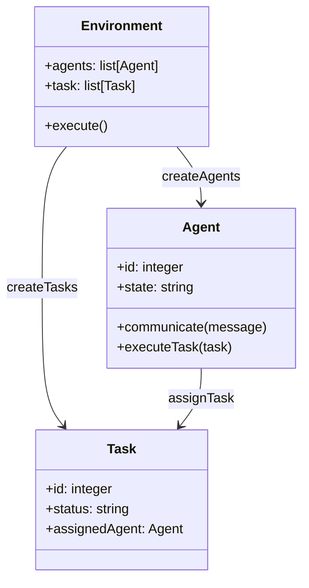

                 


# 构建具有群体智能的多Agent系统

## 关键词：多Agent系统、群体智能、分布式计算、一致性算法、分布式任务分配

## 摘要：  
在现代分布式计算和人工智能领域，多Agent系统（Multi-Agent System, MAS）和群体智能（Swarm Intelligence）正在成为研究和应用的热点。多Agent系统通过多个智能体（Agent）协同工作，能够实现复杂任务的高效解决。而群体智能则通过模拟自然群体的行为，进一步增强了多Agent系统的自组织和自适应能力。本文将从多Agent系统的基本概念出发，深入探讨群体智能的核心原理、算法实现、系统架构以及实际应用。通过结合理论分析和实践案例，本文将帮助读者全面理解如何构建具有群体智能的多Agent系统。

---

# 第1章: 多Agent系统概述

## 1.1 多Agent系统的基本概念

### 1.1.1 Agent的定义与特点
- **定义**: Agent（智能体）是指能够感知环境并采取行动以实现目标的实体。Agent可以是软件程序、机器人或其他智能设备。
- **特点**:
  1. **自主性**: Agent能够在没有外部干预的情况下自主决策。
  2. **反应性**: Agent能够根据环境的变化实时调整行为。
  3. **社会性**: Agent能够与其他Agent或人类进行交互和协作。
  4. **持续性**: Agent能够持续运行，即使在出现问题时也能通过自适应机制恢复。

### 1.1.2 多Agent系统的概念与组成
- **概念**: 多Agent系统是由多个智能体组成的分布式系统，这些智能体通过通信和协作完成复杂的任务。
- **组成**:
  1. **Agent**: 系统的基本单元，负责感知和行动。
  2. **通信机制**: 实现Agent之间的信息交换。
  3. **协作机制**: 实现Agent之间的任务分配和协调。
  4. **环境**: Agent所处的物理或虚拟空间。

### 1.1.3 群体智能的定义与特征
- **定义**: 群体智能是指通过多个简单个体（Agent）的协同行为，实现复杂的智能任务。
- **特征**:
  1. **去中心化**: 群体智能不需要中央控制，个体之间通过局部交互完成全局任务。
  2. **自组织**: 群体能够通过自适应机制动态调整结构和行为。
  3. **涌现性**: 群体智能的结果是单个个体无法实现的复杂行为。

---

## 1.2 多Agent系统的应用场景

### 1.2.1 分布式计算中的多Agent系统
- **案例**: 在分布式计算中，多个Agent可以协同完成数据处理、任务分配和负载均衡。
- **优势**: 通过多Agent系统，可以提高计算资源的利用率和系统的容错性。

### 1.2.2 机器人与自动化控制中的应用
- **案例**: 在工业自动化中，多个机器人Agent可以协同完成装配、搬运等任务。
- **优势**: 多Agent系统能够实现机器人之间的高效协作和任务分配。

### 1.2.3 群体智能在大数据分析中的应用
- **案例**: 在大数据分析中，多个Agent可以协同完成数据采集、处理和分析。
- **优势**: 群体智能能够通过分布式计算提高数据分析的效率和准确性。

---

## 1.3 本章小结

本章介绍了多Agent系统的基本概念、组成以及群体智能的定义和特征。通过实际应用场景的分析，我们看到多Agent系统在分布式计算、机器人控制和大数据分析等领域具有广泛的应用前景。

---

# 第2章: 群体智能的核心概念与联系

## 2.1 群体智能的核心原理

### 2.1.1 分布式计算与协调
- **定义**: 群体智能通过分布式计算实现多个Agent之间的协调和协作。
- **实现**: 通过一致性算法（如Paxos、Raft）实现Agent之间的数据一致性。

### 2.1.2 自组织与自适应机制
- **定义**: 群体智能通过自组织机制实现Agent的动态调整和适应。
- **实现**: 通过自适应算法（如蚁群算法、粒子群优化）实现系统的动态优化。

### 2.1.3 基于Agent的群体行为建模
- **定义**: 群体行为建模是通过Agent的行为规则模拟群体的集体行为。
- **实现**: 通过行为规则和群体动力学模型实现群体行为的建模和仿真。

---

## 2.2 多Agent系统与群体智能的关系

### 2.2.1 多Agent系统的层次结构
- **层次结构**:
  1. **个体层**: 单个Agent的行为。
  2. **群体层**: 多个Agent的协同行为。
  3. **系统层**: 多Agent系统的整体行为。

### 2.2.2 群体智能的实现方式
- **实现方式**:
  1. **基于规则的实现**: 通过简单的规则实现群体行为。
  2. **基于模型的实现**: 通过复杂的模型实现群体行为的仿真。

### 2.2.3 群体智能与分布式系统的关系
- **关系**: 群体智能是分布式系统的一种特殊形式，通过去中心化的结构实现复杂的智能任务。

---

## 2.3 本章小结

本章探讨了群体智能的核心原理和实现方式，并分析了多Agent系统与群体智能的关系。通过层次结构和实现方式的分析，我们看到群体智能是多Agent系统的重要组成部分，通过去中心化的结构实现复杂的智能任务。

---

## 第3章: 多Agent系统中的算法与数学模型

## 3.1 多Agent系统中的典型算法

### 3.1.1 基于一致性算法的协调
- **一致性算法**: 用于实现多个Agent之间的数据一致性。
- **实现**: 通过Paxos、Raft等一致性算法实现分布式系统中的数据一致性。

### 3.1.2 分布式任务分配算法
- **任务分配算法**: 用于实现多个Agent之间的任务分配。
- **实现**: 通过贪心算法、最短路径算法等实现任务的动态分配。

### 3.1.3 群体决策算法
- **群体决策算法**: 用于实现多个Agent的群体决策。
- **实现**: 通过投票算法、共识算法等实现群体决策。

---

## 3.2 群体智能的数学模型

### 3.2.1 Agent行为模型的数学表示
- **行为模型**: 通过数学公式描述Agent的行为规则。
- **公式**: 
  - $f(x) = \sum_{i=1}^{n} w_i x_i$，其中$w_i$是权重，$x_i$是输入变量。

### 3.2.2 群体决策的数学框架
- **群体决策框架**: 通过数学公式描述群体决策的过程。
- **公式**: 
  - $D(x) = \arg\max_{i} \sum_{j=1}^{m} a_{ij} x_j$，其中$a_{ij}$是决策矩阵的元素。

### 3.2.3 一致性算法的数学推导
- **一致性算法**: 通过数学推导实现多个Agent之间的数据一致性。
- **公式**: 
  - $\lambda_i = \lambda_{i-1} + \alpha (\lambda_{\text{propose}} - \lambda_{i-1})$，其中$\alpha$是收敛系数。

---

## 3.3 本章小结

本章介绍了多Agent系统中的典型算法和群体智能的数学模型。通过一致性算法、任务分配算法和群体决策算法的分析，我们看到数学模型在群体智能中的重要性。

---

## 第4章: 多Agent系统中的通信与协作

## 4.1 Agent之间的通信协议

### 4.1.1 通信模型与协议设计
- **通信模型**: 通过消息传递实现Agent之间的通信。
- **协议设计**: 设计通信协议，实现Agent之间的信息交换。

### 4.1.2 基于消息传递的协作机制
- **协作机制**: 通过消息传递实现Agent之间的协作。
- **实现**: 通过消息队列（如RabbitMQ）实现Agent之间的协作。

### 4.1.3 通信中的安全与隐私保护
- **安全保护**: 通过加密通信实现Agent之间的数据安全。
- **隐私保护**: 通过数据匿名化实现Agent之间的隐私保护。

---

## 4.2 分布式任务分配与协作

### 4.2.1 分布式任务分配算法
- **任务分配算法**: 通过一致性算法实现任务的动态分配。
- **实现**: 通过Paxos算法实现任务分配的一致性。

### 4.2.2 基于Agent的协作流程
- **协作流程**: 通过协作流程实现多个Agent的任务分配和执行。
- **实现**: 通过协作协议（如Gossip协议）实现Agent之间的协作。

### 4.2.3 协作中的冲突解决机制
- **冲突解决**: 通过协商机制解决Agent之间的冲突。
- **实现**: 通过冲突检测和恢复算法实现冲突的解决。

---

## 4.3 本章小结

本章介绍了多Agent系统中的通信协议和分布式任务分配机制。通过通信协议和协作机制的分析，我们看到通信与协作是多Agent系统实现复杂任务的关键。

---

## 第5章: 多Agent系统中的群体决策与优化

## 5.1 群体决策的基本原理

### 5.1.1 群体决策的定义与特点
- **定义**: 群体决策是通过多个Agent的协同实现决策的过程。
- **特点**:
  1. **去中心化**: 群体决策不需要中央控制。
  2. **自组织**: 群体决策通过自组织实现决策的优化。

### 5.1.2 群体决策的实现方法
- **实现方法**:
  1. **基于投票的决策**: 通过投票机制实现群体决策。
  2. **基于共识的决策**: 通过共识算法实现群体决策。

---

## 5.2 群体优化算法

### 5.2.1 基于粒子群优化的算法
- **粒子群优化**: 通过粒子群的运动实现优化目标。
- **公式**: 
  - $v_i = v_i + \alpha (p_i - x_i)$，其中$v_i$是速度，$p_i$是粒子的最优位置，$x_i$是当前位置。

### 5.2.2 基于遗传算法的优化
- **遗传算法**: 通过基因的遗传实现优化目标。
- **步骤**: 
  1. 初始化种群。
  2. 选择适应度高的个体。
  3. 通过交叉和变异生成新的个体。
  4. 重复步骤2和3，直到满足终止条件。

### 5.2.3 分布式优化算法的实现
- **分布式优化**: 通过分布式计算实现优化目标。
- **实现**: 通过分布式算法（如MapReduce）实现优化的分布式计算。

---

## 5.3 本章小结

本章介绍了群体决策的基本原理和优化算法。通过粒子群优化和遗传算法的分析，我们看到群体优化在多Agent系统中的重要性。

---

## 第6章: 多Agent系统中的安全与隐私保护

## 6.1 多Agent系统中的安全威胁

### 6.1.1 网络攻击与数据泄露
- **网络攻击**: 通过网络攻击实现多Agent系统的数据泄露。
- **防御**: 通过加密通信实现数据的安全传输。

### 6.1.2 Agent之间的信任问题
- **信任问题**: 通过Agent之间的信任问题实现安全威胁。
- **防御**: 通过信任评估算法实现Agent之间的信任评估。

### 6.1.3 群体智能中的隐私保护
- **隐私保护**: 通过数据匿名化实现群体智能中的隐私保护。
- **实现**: 通过数据加密和匿名化实现隐私保护。

---

## 6.2 安全与隐私保护的实现方法

### 6.2.1 加密通信与数据保护
- **加密通信**: 通过加密算法实现数据的安全传输。
- **实现**: 通过AES、RSA等加密算法实现数据加密。

### 6.2.2 基于信任的访问控制
- **信任控制**: 通过信任评估实现Agent之间的访问控制。
- **实现**: 通过信任评估算法实现基于信任的访问控制。

### 6.2.3 隐私保护算法的设计与实现
- **隐私保护算法**: 通过数据匿名化实现隐私保护。
- **实现**: 通过数据加密和匿名化实现隐私保护。

---

## 6.3 本章小结

本章介绍了多Agent系统中的安全威胁和隐私保护方法。通过加密通信和信任评估的分析，我们看到安全与隐私保护在多Agent系统中的重要性。

---

## 第7章: 多Agent系统中的项目实战

## 7.1 项目背景与需求分析

### 7.1.1 项目目标
- **目标**: 实现一个具有群体智能的多Agent系统，用于解决分布式任务分配问题。

### 7.1.2 系统功能需求
- **功能需求**:
  1. 实现多个Agent的通信与协作。
  2. 实现任务分配与优化。
  3. 实现安全与隐私保护。

### 7.1.3 项目实施计划
- **实施计划**:
  1. 系统设计阶段：完成系统架构设计。
  2. 开发阶段：完成系统功能的实现。
  3. 测试阶段：完成系统的功能测试和性能测试。

---

## 7.2 系统设计与实现

### 7.2.1 系统架构设计



### 7.2.2 系统功能实现

```python
class Agent:
    def __init__(self, id):
        self.id = id
        self.state = "idle"
    
    def communicate(self, message):
        # 实现通信逻辑
        pass
    
    def executeTask(self, task):
        # 实现任务执行逻辑
        pass

class Environment:
    def __init__(self):
        self.agents = []
        self.tasks = []
    
    def createAgents(self, num):
        for i in range(num):
            agent = Agent(i)
            self.agents.append(agent)
    
    def createTasks(self, num):
        for i in range(num):
            task = Task(i)
            self.tasks.append(task)
    
    def execute(self):
        # 实现系统执行逻辑
        pass
```

### 7.2.3 代码实现与测试

```python
class Task:
    def __init__(self, id):
        self.id = id
        self.status = "unassigned"
        self.agent = None

class Agent:
    def __init__(self, id):
        self.id = id
        self.state = "idle"
        self.tasks = []
    
    def communicate(self, message):
        print(f"Agent {self.id} received message: {message}")
    
    def executeTask(self, task):
        print(f"Agent {self.id} is executing task {task.id}")
        self.state = "busy"
        self.tasks.append(task)
        task.status = "assigned"
        task.agent = self

class Environment:
    def __init__(self):
        self.agents = []
        self.tasks = []
    
    def createAgents(self, num):
        for i in range(num):
            agent = Agent(i)
            self.agents.append(agent)
    
    def createTasks(self, num):
        for i in range(num):
            task = Task(i)
            self.tasks.append(task)
    
    def execute(self):
        for agent in self.agents:
            if agent.state == "idle":
                if len(self.tasks) > 0:
                    task = self.tasks[0]
                    agent.executeTask(task)
                    self.tasks.pop(0)
                else:
                    print(f"Agent {agent.id} is idle")
```

### 7.2.4 项目小结

本章通过一个具体的项目案例，展示了多Agent系统的系统设计与实现过程。通过系统的实现，我们看到多Agent系统在实际应用中的复杂性和挑战。

---

## 作者：AI天才研究院/AI Genius Institute & 禅与计算机程序设计艺术 /Zen And The Art of Computer Programming

---

以上是《构建具有群体智能的多Agent系统》的完整内容。通过理论分析和实践案例的结合，我们全面探讨了多Agent系统的核心概念、算法实现、系统架构以及实际应用。希望本文能够为读者提供有价值的参考和启发。

