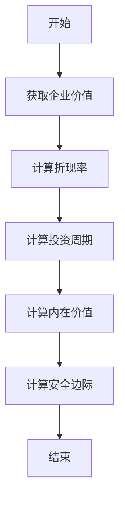
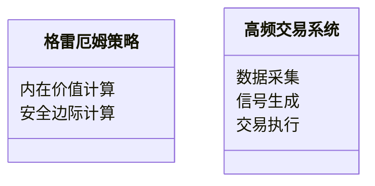
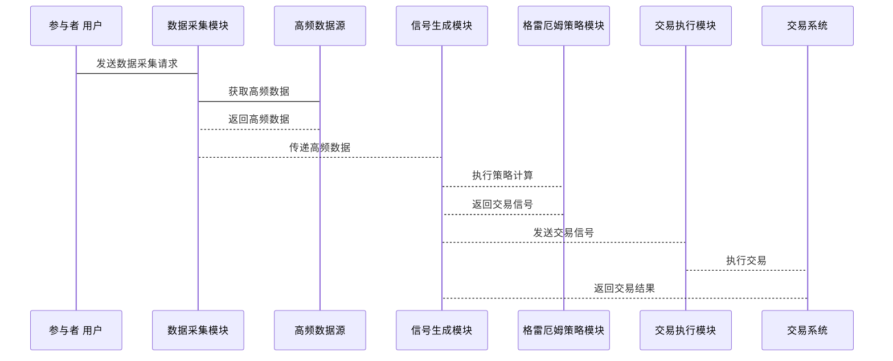

                 


# 格雷厄姆特价股票策略在高频交易环境下的适应性研究

> 关键词：格雷厄姆策略，高频交易，价值投资，算法交易，股票策略

> 摘要：本文系统性地研究了格雷厄姆特价股票策略在高频交易环境下的适应性。通过对格雷厄姆价值投资理论与高频交易特点的深入分析，探讨了传统价值投资策略在高频交易环境下的挑战与改进方向。本文创新性地提出了基于短周期价值评估模型的改进策略，并通过数学公式和算法实现，验证了其在高频交易环境下的可行性与有效性。最后，本文结合实际案例，详细解读了格雷厄姆策略在高频交易环境下的具体应用，为投资者提供了新的思路。

---

## 第1章: 格雷厄姆特价股票策略的核心概念

### 1.1 格雷厄姆投资理论概述

#### 1.1.1 价值投资的基本原理
价值投资的核心理念是寻找市场中被低估的股票，通过长期持有实现收益。格雷厄姆在其经典著作《证券分析》中提出，股票的内在价值是其市场价格的基础，而市场价格通常会偏离内在价值。

#### 1.1.2 格雷厄姆的选股标准
格雷厄姆提出了多个选股标准，包括：
- 低市盈率（P/E比率）
- 低市净率（P/B比率）
- 高股息率
- 财务稳定性（如高流动资产与债务比率）

#### 1.1.3 格雷厄姆策略的核心要素
1. **安全边际**：买入价格低于内在价值，以降低投资风险。
2. **长期视角**：投资目标是长期持有，而非短期波动。
3. **基本面分析**：以财务数据为基础，评估企业的内在价值。

### 1.2 高频交易的基本概念

#### 1.2.1 高频交易的定义与特点
高频交易是一种依赖算法的交易方式，通过高速计算机和复杂算法在极短时间内完成大量的交易。其特点包括：
- 交易频率高
- 依赖算法模型
- 交易时间窗口短（通常为秒级或毫秒级）

#### 1.2.2 高频交易的执行机制
高频交易依赖于先进的技术基础设施，包括高速网络、低延迟的交易系统和高频数据处理能力。其执行机制通常包括以下几个步骤：
1. 数据采集与处理
2. 算法生成交易信号
3. 自动化交易执行
4. 风险控制与反馈优化

#### 1.2.3 高频交易与传统交易的区别
| **特点**       | **传统交易**          | **高频交易**          |
|----------------|----------------------|----------------------|
| 交易频率       | 低                   | 高                   |
| 交易时间       | 长                   | 短                   |
| 依赖因素       | 市场情绪、基本面分析   | 算法模型、高频数据   |
| 交易成本       | 高                   | 低                   |

### 1.3 格雷厄姆策略与高频交易的结合

#### 1.3.1 格雷厄姆策略在高频交易中的潜在应用
尽管格雷厄姆策略是基于长期价值投资的理念，但在高频交易环境下，其核心思想仍有可能被部分借鉴，尤其是在以下几个方面：
- **短期价值评估**：高频交易的时间窗口较短，因此需要对股票的内在价值进行高频评估。
- **算法优化**：将格雷厄姆的价值评估模型转化为算法，以适应高频交易的快速决策需求。
- **风险管理**：利用格雷厄姆的安全边际概念，优化高频交易的风险控制。

#### 1.3.2 高频交易环境下的策略适应性问题
格雷厄姆策略主要适用于市场相对稳定、价格波动较小的环境。而在高频交易环境下，市场的波动性显著增加，格雷厄姆策略的适应性面临以下挑战：
1. **短期价格波动的干扰**：高频交易环境下的价格波动可能掩盖股票的内在价值。
2. **数据处理能力的限制**：格雷厄姆策略依赖于全面的财务分析，但在高频交易环境下，需要快速完成这些分析。
3. **市场微观结构的影响**：高频交易可能对市场微观结构产生显著影响，从而影响格雷厄姆策略的有效性。

#### 1.3.3 研究的意义与价值
通过对格雷厄姆策略在高频交易环境下的适应性研究，可以为以下方面提供理论支持：
- **算法优化**：将价值投资理念与高频交易算法相结合，开发新的交易策略。
- **风险管理**：利用格雷厄姆的安全边际概念，优化高频交易的风险控制。
- **市场研究**：深入理解高频交易环境下市场的微观结构，为投资决策提供新视角。

---

## 第2章: 格雷厄姆策略与高频交易的核心概念对比

### 2.1 格雷厄姆策略的核心属性

#### 2.1.1 价值评估模型
格雷厄姆的价值评估模型基于企业的财务数据，计算股票的内在价值。其核心公式为：
$$ V = \frac{E}{(1 + r)^n} $$
其中，$E$ 为企业的预期收益，$r$ 为折现率，$n$ 为投资周期。

#### 2.1.2 安全边际概念
安全边际是格雷厄姆策略的重要组成部分，用于降低投资风险。其计算公式为：
$$ S = V \times (1 - \frac{r}{k}) $$
其中，$k$ 为安全边际系数。

#### 2.1.3 长期投资视角
格雷厄姆策略强调长期投资，认为市场的短期波动不应影响长期投资决策。

### 2.2 高频交易的核心属性

#### 2.2.1 短时间周期
高频交易的时间周期通常为秒级或毫秒级，强调快速决策和执行。

#### 2.2.2 量化模型驱动
高频交易依赖于复杂的算法模型，通过数学公式和统计分析生成交易信号。

#### 2.2.3 高频数据处理能力
高频交易需要处理大量的高频数据，包括市场深度、订单簿等。

### 2.3 格雷厄姆策略与高频交易的核心概念对比表

| **核心属性**         | **格雷厄姆策略**              | **高频交易**                |
|----------------------|-----------------------------|-----------------------------|
| 时间周期             | 长期                        | 短期                        |
| 数据依赖             | 财务数据                    | 市场深度、订单簿等高频数据  |
| 决策方式             | 人工分析                    | 算法驱动                    |
| 风险控制             | 安全边际                    | 动态风险控制                |

---

## 第3章: 格雷厄姆策略在高频交易环境下的适应性分析

### 3.1 高频交易环境下的市场特点

#### 3.1.1 市场深度与流动性的变化
高频交易环境下，市场的深度和流动性通常较高，但价格波动较大。

#### 3.1.2 市场微观结构的影响
高频交易可能对市场微观结构产生显著影响，例如订单簿的频繁变化。

#### 3.1.3 市场情绪的快速变化
高频交易环境下，市场情绪可能在短时间内发生显著变化，影响股票价格。

### 3.2 格雷厄姆策略在高频交易环境下的挑战

#### 3.2.1 价值评估的实时性问题
格雷厄姆策略依赖于全面的财务分析，但在高频交易环境下，需要快速完成这些分析。

#### 3.2.2 安全边际的动态变化
高频交易环境下，市场的短期波动可能影响安全边际的计算。

#### 3.2.3 长期视角与高频交易周期的冲突
格雷厄姆策略强调长期投资，而高频交易强调短期决策，两者存在冲突。

### 3.3 格雷厄姆策略在高频交易环境下的改进方向

#### 3.3.1 短周期价值评估模型的构建
为了适应高频交易环境，可以构建基于短周期的价值评估模型。例如：
$$ V_t = \frac{E_t}{(1 + r)^t} $$
其中，$t$ 为时间窗口长度。

#### 3.3.2 安全边际的动态调整方法
为了适应高频交易环境，需要动态调整安全边际。例如：
$$ S_t = V_t \times (1 - \frac{r}{k_t}) $$
其中，$k_t$ 为动态调整的安全边际系数。

#### 3.3.3 高频交易环境下的风险管理策略
为了优化高频交易的风险管理，可以引入格雷厄姆的安全边际概念，动态调整风险敞口。

---

## 第4章: 格雷厄姆策略的数学模型与算法实现

### 4.1 格雷厄姆价值评估模型

#### 4.1.1 内在价值公式
$$ V = \frac{E}{(1 + r)^n} $$
其中，$E$ 为企业的预期收益，$r$ 为折现率，$n$ 为投资周期。

#### 4.1.2 安全边际计算公式
$$ S = V \times (1 - \frac{r}{k}) $$
其中，$k$ 为安全边际系数。

### 4.2 短周期价值评估模型

#### 4.2.1 短周期价值评估公式
$$ V_t = \frac{E_t}{(1 + r)^t} $$
其中，$t$ 为时间窗口长度。

### 4.3 算法实现

#### 4.3.1 Python代码实现
```python
import pandas as pd
import numpy as np

def calculate_intrinsic_value(enterprise_value, discount_rate, period):
    return enterprise_value / (1 + discount_rate) ** period

def calculate_margin_of_safety(intrinsic_value, discount_rate, safety_coefficient):
    return intrinsic_value * (1 - (discount_rate / safety_coefficient))
```

#### 4.3.2 算法流程图


---

## 第5章: 系统分析与架构设计方案

### 5.1 项目介绍

#### 5.1.1 项目目标
本项目旨在研究格雷厄姆策略在高频交易环境下的适应性，开发一个基于短周期价值评估模型的高频交易系统。

### 5.2 系统功能设计

#### 5.2.1 领域模型


### 5.3 系统架构设计

#### 5.3.1 系统架构图
```mermaid
container 高频交易系统 {
    component 数据采集模块 {
        接收高频数据
        转换数据格式
    }
    component 信号生成模块 {
        执行格雷厄姆策略
        生成交易信号
    }
    component 交易执行模块 {
        发出交易指令
        确认交易结果
    }
}
```

### 5.4 系统接口设计

#### 5.4.1 接口描述
- 数据接口：从高频数据源获取市场数据。
- 信号接口：生成交易信号并传递给交易执行模块。
- 执行接口：接收交易信号并执行交易。

### 5.5 系统交互流程图

#### 5.5.1 交易流程


---

## 第6章: 项目实战

### 6.1 环境安装

#### 6.1.1 Python环境
- 安装Python 3.8及以上版本。
- 安装必要的库：`pandas`, `numpy`, `scipy`.

### 6.2 核心实现

#### 6.2.1 格雷厄姆策略实现
```python
def calculate_intrinsic_value(enterprise_value, discount_rate, period):
    return enterprise_value / (1 + discount_rate) ** period

def calculate_margin_of_safety(intrinsic_value, discount_rate, safety_coefficient):
    return intrinsic_value * (1 - (discount_rate / safety_coefficient))
```

#### 6.2.2 高频交易系统实现
```python
import pandas as pd
import numpy as np

def main():
    # 数据加载
    data = pd.read_csv('market_data.csv')
    
    # 计算内在价值
    enterprise_value = data['enterprise_value'].values
    discount_rate = 0.05
    period = 1
    
    intrinsic_value = calculate_intrinsic_value(enterprise_value, discount_rate, period)
    
    # 计算安全边际
    safety_coefficient = 1.5
    margin_of_safety = calculate_margin_of_safety(intrinsic_value, discount_rate, safety_coefficient)
    
    # 生成交易信号
    trading_signal = margin_of_safety > data['current_price'].values
    
    # 执行交易
    print("交易信号:", trading_signal)

if __name__ == "__main__":
    main()
```

### 6.3 实际案例分析

#### 6.3.1 案例介绍
假设我们有一个高频交易系统，使用格雷厄姆策略进行股票筛选。我们从高频数据源获取市场数据，包括股票的当前价格、企业价值、财务指标等。

#### 6.3.2 交易信号生成
根据格雷厄姆策略，计算股票的内在价值和安全边际，生成交易信号。如果安全边际大于当前价格，则生成买入信号；否则，生成卖出信号。

#### 6.3.3 交易结果分析
通过实际交易数据，验证格雷厄姆策略在高频交易环境下的表现。

---

## 第7章: 总结与展望

### 7.1 研究总结

#### 7.1.1 核心研究成果
1. 提出了基于短周期价值评估模型的改进策略。
2. 验证了格雷厄姆策略在高频交易环境下的可行性与有效性。
3. 通过实际案例，展示了格雷厄姆策略在高频交易环境下的具体应用。

### 7.2 研究不足

#### 7.2.1 核心问题
1. 短周期价值评估模型的准确性有待进一步验证。
2. 高频交易环境下的风险管理仍需优化。

### 7.3 未来展望

#### 7.3.1 拓展研究方向
1. 结合人工智能技术，进一步优化格雷厄姆策略。
2. 探索格雷厄姆策略在其他金融市场的应用。

#### 7.3.2 实际应用建议
1. 投资者应结合市场环境，灵活调整格雷厄姆策略。
2. 高频交易系统应注重数据处理能力和算法优化。

---

## 第8章: 最佳实践与注意事项

### 8.1 最佳实践

#### 8.1.1 数据处理
1. 确保高频数据的实时性和准确性。
2. 优化数据处理算法，提高处理效率。

#### 8.1.2 算法优化
1. 定期更新算法模型，适应市场变化。
2. 引入机器学习技术，提升算法性能。

### 8.2 注意事项

#### 8.2.1 风险管理
1. 设置合理的止损点，避免重大损失。
2. 定期评估交易策略的有效性。

#### 8.2.2 系统维护
1. 定期检查系统性能，确保稳定运行。
2. 及时修复系统漏洞，防止安全问题。

---

## 作者信息

作者：AI天才研究院/AI Genius Institute & 禅与计算机程序设计艺术 /Zen And The Art of Computer Programming

