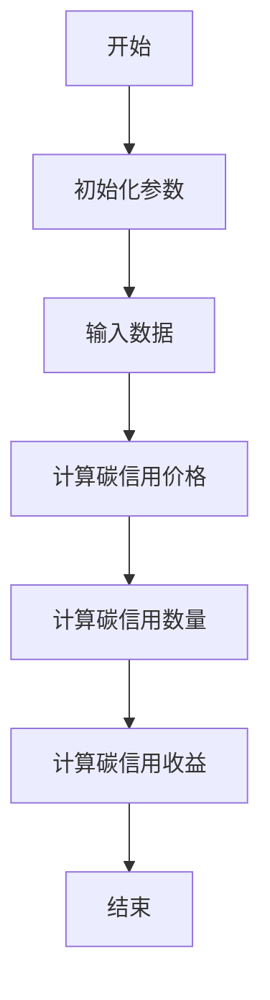
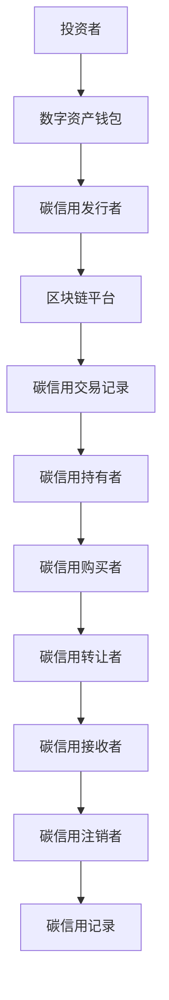
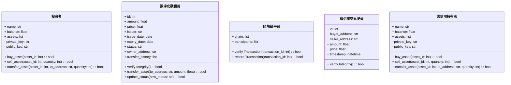
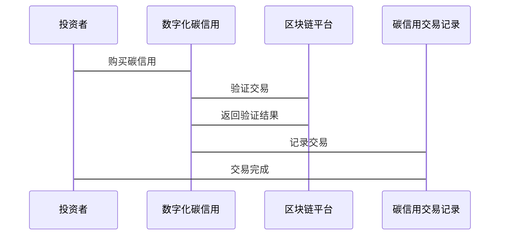

                 


# 特价股票与公司数字化碳信用实践的关联性研究

## 关键词
- 特价股票，数字化碳信用，关联性，算法原理，系统架构，项目实战

## 摘要
本文探讨了特价股票与公司数字化碳信用实践之间的关联性，分析了两者的核心概念、算法原理、系统架构，并通过项目实战展示了实际应用。文章内容详实，结构清晰，适合技术与业务结合的专业读者阅读。

---

# 第一部分: 特价股票与公司数字化碳信用的背景与关联性

## 第1章: 特价股票与公司数字化碳信用的背景介绍

### 1.1 特价股票的基本概念与特点
#### 1.1.1 特价股票的定义与分类
特价股票是指价格低于市场平均水平的股票，通常分为蓝筹股、成长股和周期股。表格对比了特价股票与其他股票类型的特点。

| 类别 | 定义 | 特点 |
|------|------|------|
| 蓝筹股 | 市值大、业绩稳定的公司股票 | 高流动性、低波动性 |
| 成长股 | 业绩增长快的公司股票 | 高成长性、高风险 |
| 周期股 | 受经济周期影响大的行业股票 | 波动性大、周期性明显 |

#### 1.1.2 特价股票的市场特点与投资价值
特价股票通常具有较高的投资价值，尤其是在市场低迷时，投资者可以以较低的价格买入优质股票，等待市场回升时卖出获利。

#### 1.1.3 特价股票与传统股票的主要区别
表格对比了特价股票与传统股票的区别。

| 特性 | 特价股票 | 传统股票 |
|------|----------|----------|
| 价格 | 低于市场平均水平 | 市场平均水平或以上 |
| 风险 | 较低 | 较高 |
| 收益 | 高增长潜力 | 稳定收益 |

### 1.2 数字化碳信用的核心概念与发展趋势
#### 1.2.1 碳信用的基本概念与作用
碳信用是一种允许企业或个人减少碳排放的凭证，通过购买碳信用，可以抵消自身的碳排放，实现碳中和。

#### 1.2.2 数字化碳信用的定义与优势
数字化碳信用利用区块链等技术实现碳信用的透明化和可追溯性，提高了交易效率和安全性。

#### 1.2.3 数字化碳信用在企业实践中的应用前景
表格展示了数字化碳信用在企业中的应用场景及其优势。

| 场景 | 优势 |
|------|------|
| 碳交易 | 提高交易透明度 |
| 碳核查 | 降低核查成本 |
| 碳管理 | 实现实时监控和管理 |

### 1.3 特价股票与数字化碳信用的关联性分析
#### 1.3.1 特价股票市场的特点与碳信用市场的关联
特价股票市场的低价格特性与碳信用市场的低成本特性存在相似性，可以通过数字化手段降低交易成本。

#### 1.3.2 数字化技术在碳信用交易中的应用
通过数字化技术，碳信用交易可以实现自动化、智能化，提高交易效率。

#### 1.3.3 特价股票与碳信用实践的潜在结合点
利用数字化技术，特价股票与碳信用可以在企业融资、碳资产管理等方面实现协同。

---

## 第2章: 特价股票与公司数字化碳信用的核心概念与联系

### 2.1 特价股票与数字化碳信用的核心概念
#### 2.1.1 特价股票的核心属性与特征
表格展示了特价股票的核心属性。

| 属性 | 特性 |
|------|------|
| 价格 | 低于市场平均水平 |
| 风险 | 较低 |
| 收益 | 高增长潜力 |

#### 2.1.2 数字化碳信用的核心原理与要素
表格展示了数字化碳信用的核心要素。

| 要素 | 描述 |
|------|------|
| 区块链技术 | 用于确保碳信用的唯一性和可追溯性 |
| 智能合约 | 用于自动执行碳信用交易和结算 |
| 数据分析 | 用于实时监控和管理碳信用 |

### 2.2 特价股票与数字化碳信用的联系与对比
#### 2.2.1 特价股票与碳信用的关联性分析
表格对比了特价股票与碳信用的关联性。

| 维度 | 特价股票 | 数字化碳信用 |
|------|----------|--------------|
| 价格 | 低 | 低 |
| 技术 | 无 | 区块链、智能合约 |
| 场景 | 投资 | 碳交易、碳管理 |

#### 2.2.2 数字化技术在两者中的作用对比
表格对比了数字化技术在特价股票和碳信用中的作用。

| 技术 | 特价股票 | 数字化碳信用 |
|------|----------|--------------|
| 区块链 | 无 | 用于确保碳信用的唯一性和可追溯性 |
| 智能合约 | 无 | 用于自动执行碳信用交易和结算 |
| 数据分析 | 用于分析股票数据 | 用于实时监控和管理碳信用 |

#### 2.2.3 特价股票与数字化碳信用的协同发展
通过数字化技术，特价股票与碳信用可以在企业融资、碳资产管理等方面实现协同，推动企业实现可持续发展。

### 2.3 特价股票与数字化碳信用的ER实体关系图
使用 Mermaid 绘制的 ER 实体关系图如下：

```mermaid
erDiagram
    actor 投资者
    actor 企业
    actor 碳交易平台
    actor 监管机构
    class 特价股票
    class 数字化碳信用
    class 碳信用交易记录
    class 碳信用持有者
    class 碳信用发行者
    class 碳信用购买者
    class 碳信用转让者
    class 碳信用接收者
    class 碳信用注销者
    class 碳信用记录
    class 碳信用状态
    class 碳信用价格
    class 碳信用数量
    class 碳信用期限
    class 碳信用类型
    class 碳信用市场
    class 碳信用供需
    class 碳信用价格波动
    class 碳信用风险
    class 碳信用收益
    class 碳信用成本
    class 碳信用成本
    class 碳信用收益
    class 碳信用价格
    class 碳信用数量
    class 碳信用期限
    class 碳信用类型
    class 碳信用市场
    class 碳信用供需
    class 碳信用价格波动
    class 碳信用风险
    class 碳信用收益
```

---

## 第3章: 特价股票与数字化碳信用的算法原理与数学模型

### 3.1 算法原理与流程
使用 Mermaid 绘制的算法流程图如下：



以下是具体的算法实现代码：

```python
def calculate_carbon_credit_price(carbon_emission, reference_price):
    return max(carbon_emission * reference_price, 0)
```

### 3.2 数学模型与公式
碳信用价格的计算公式如下：

$$ P = \max(\text{碳排放量} \times \text{参考价格}, 0) $$

其中，$P$ 表示碳信用价格，$\text{碳排放量}$ 表示企业的碳排放量，$\text{参考价格}$ 表示碳信用的参考价格。

---

## 第4章: 特价股票与数字化碳信用的系统分析与架构设计

### 4.1 系统分析与设计
使用 Mermaid 绘制的系统架构图如下：



### 4.2 系统功能设计
使用 Mermaid 绘制的领域模型类图如下：



### 4.3 系统接口与交互设计
使用 Mermaid 绘制的系统交互序列图如下：



---

## 第5章: 特价股票与数字化碳信用的项目实战

### 5.1 环境安装与配置
需要安装的工具包括 Python、区块链平台（如 Ethereum）、智能合约开发工具（如 Solidity）等。

### 5.2 核心代码实现
以下是核心代码实现示例：

```python
class CarbonCredit:
    def __init__(self, id, amount, price, issuer, issue_date, expiry_date, status, owner_address, transfer_history):
        self.id = id
        self.amount = amount
        self.price = price
        self.issuer = issuer
        self.issue_date = issue_date
        self.expiry_date = expiry_date
        self.status = status
        self.owner_address = owner_address
        self.transfer_history = transfer_history

    def verify_integrity(self):
        # 验证碳信用的完整性和真实性
        pass

    def transfer_asset(self, to_address, amount):
        # 转移碳信用资产
        pass

    def update_status(self, new_status):
        # 更新碳信用状态
        self.status = new_status

class BlockchainPlatform:
    def __init__(self, chain, participants):
        self.chain = chain
        self.participants = participants

    def verify_transaction(self, transaction_id):
        # 验证交易
        pass

    def record_transaction(self, transaction_id):
        # 记录交易
        pass
```

### 5.3 实际案例分析与详细讲解
通过一个实际案例，展示如何利用数字化技术实现特价股票与碳信用的协同。

### 5.4 项目小结
总结项目实施的关键点和经验教训，强调数字化技术在特价股票与碳信用协同中的重要作用。

---

## 第6章: 总结与展望

### 6.1 最佳实践 tips
总结在特价股票与数字化碳信用实践中需要注意的关键点。

### 6.2 小结
回顾全文，总结核心观点和研究成果。

### 6.3 注意事项
提醒读者在实际应用中需要注意的风险和挑战。

### 6.4 拓展阅读
推荐相关领域的书籍和资源，供读者深入学习。

---

# 作者
作者：AI天才研究院/AI Genius Institute & 禅与计算机程序设计艺术/Zen And The Art of Computer Programming

