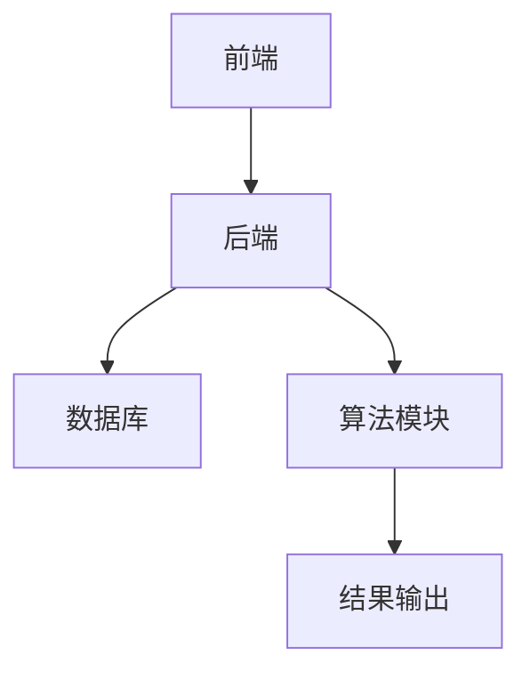
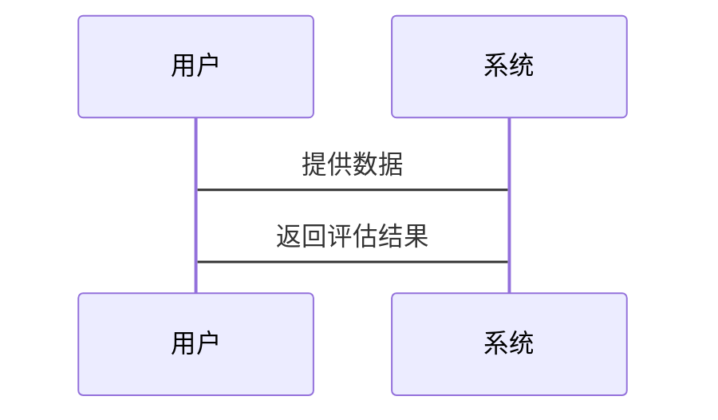

                 


# 股市估值对跨境数字营销效果评估的影响

> 关键词：股市估值，跨境数字营销，效果评估，数据驱动，算法分析

> 摘要：本文探讨了股市估值与跨境数字营销效果评估之间的关系，分析了股市波动对数字营销预算、消费者行为和营销策略的影响，提出了基于回归分析和时间序列分析的算法模型，用于评估和优化数字营销效果。

---

# 第一章: 股市估值与跨境数字营销概述

## 1.1 股市估值的基本概念

### 1.1.1 股市估值的定义
股市估值是通过对公司财务数据、行业状况和市场趋势的分析，来确定股票的内在价值和市场价值的过程。

### 1.1.2 股市估值的核心要素
- **市盈率（P/E）**：衡量股票价格是否合理。
- **市净率（P/B）**：反映股票价格与账面价值的关系。
- **股息率**：衡量股票的收益能力。

### 1.1.3 股市估值的计算方法
- 基本分析法：基于公司财务报表进行估值。
- 技术分析法：通过价格走势预测未来趋势。
- 行为金融学：考虑投资者心理对市场的短期影响。

## 1.2 跨境数字营销的基本概念

### 1.2.1 跨境数字营销的定义
跨境数字营销是指通过数字渠道（如网站、社交媒体、搜索引擎等）向不同国家和地区的消费者推广产品或服务。

### 1.2.2 跨境数字营销的主要模式
- **搜索引擎营销（SEM）**：通过搜索引擎广告推广。
- **社交媒体营销（SMM）**：利用社交媒体平台进行推广。
- **内容营销**：通过高质量内容吸引目标客户。

### 1.2.3 跨境数字营销的核心要素
- **目标市场分析**：了解目标市场的文化、语言和消费习惯。
- **内容本地化**：根据目标市场调整内容。
- **技术适配**：确保技术平台支持多语言和多时区。

## 1.3 股市估值与跨境数字营销的关系

### 1.3.1 股市估值对数字营销的影响
- **营销预算**：股市波动会影响公司的资金分配。
- **消费者信心**：股市上涨可能提升消费者信心，增加购买意愿。

### 1.3.2 跨境数字营销对股市的影响
- **品牌价值**：有效的数字营销可以提升品牌形象，进而影响股价。
- **投资者行为**：数字营销活动可能影响投资者对公司前景的看法。

### 1.3.3 两者的相互作用机制
- 数据驱动的分析模型：通过数据挖掘和机器学习，分析股市波动对数字营销效果的影响。
- 股市与营销数据的关联性：利用大数据技术，建立两者之间的关联模型。

## 1.4 本章小结
本章介绍了股市估值和跨境数字营销的基本概念，并探讨了两者之间的相互影响。理解这种关系对于优化数字营销策略和提升企业价值具有重要意义。

---

# 第二章: 股市估值的理论基础

## 2.1 股市估值的基本理论

### 2.1.1 基本分析法
基本分析法通过分析公司的财务报表（收入、利润、现金流）来评估其内在价值。

### 2.1.2 技术分析法
技术分析法通过分析股票价格的历史走势，预测未来的价格趋势。

### 2.1.3 行为金融学视角
行为金融学认为，投资者的心理和情绪对市场走势有重要影响。

## 2.2 股市估值的关键影响因素

### 2.2.1 宏观经济因素
- **GDP增长**：影响整体市场表现。
- **利率水平**：影响企业的融资成本。

### 2.2.2 行业因素
- **行业周期**：行业处于上升期或衰退期会影响股票估值。
- **竞争格局**：行业内的竞争程度影响企业的盈利能力。

### 2.2.3 公司基本面因素
- **盈利能力**：净利润率、ROE等指标。
- **财务状况**：资产负债表中的资产和负债情况。

---

# 第三章: 跨境数字营销的理论基础

## 3.1 数字营销的核心理论

### 3.1.1 数字营销的4P理论
- **产品（Product）**：提供符合目标市场需求的产品。
- **价格（Price）**：制定合理的定价策略。
- **渠道（Place）**：选择合适的销售渠道。
- **推广（Promotion）**：通过多种渠道进行推广。

### 3.1.2 数字营销的用户行为分析
- **用户画像**：分析目标客户的年龄、性别、兴趣等特征。
- **用户旅程**：了解用户从接触到购买的全过程。

### 3.1.3 数字营销的效果评估指标
- **点击率（CTR）**：广告点击次数与展示次数的比率。
- **转化率（CR）**：广告点击后转化为实际购买的比例。
- **投资回报率（ROI）**：营销支出与收益的比率。

## 3.2 跨境数字营销的独特性

### 3.2.1 跨境营销的地域差异
- **文化差异**：不同国家有不同的消费习惯和文化背景。
- **语言差异**：需要进行内容本地化。

### 3.2.2 跨境营销的文化适应性
- **内容本地化**：根据目标市场调整内容。
- **法律合规**：遵守目标市场的法律法规。

### 3.2.3 跨境营销的技术挑战
- **数据隐私**：遵守不同国家的数据保护法规。
- **技术适配**：确保技术平台支持多语言和多时区。

---

# 第四章: 股市估值与跨境数字营销的关联性分析

## 4.1 股市波动对数字营销的影响

### 4.1.1 股市波动如何影响营销预算
- **股市上涨**：企业可能增加营销预算。
- **股市下跌**：企业可能减少营销支出。

### 4.1.2 股市波动对消费者信心的影响
- **股市上涨**：消费者信心增强，购买意愿提升。
- **股市下跌**：消费者信心下降，购买意愿减弱。

### 4.1.3 股市波动对数字营销效果的间接影响
- **广告点击率**：股市波动可能影响广告的点击率。
- **转化率**：股市波动可能影响广告的转化率。

## 4.2 跨境数字营销对股市的影响

### 4.2.1 数字营销如何提升公司股价
- **品牌价值提升**：有效的数字营销可以提升品牌价值。
- **市场扩展**：通过数字营销进入新市场，增加收入。

### 4.2.2 数字营销对投资者行为的影响
- **投资者信心**：成功的数字营销可以增强投资者对公司的信心。
- **股价波动**：数字营销活动可能影响短期股价波动。

### 4.2.3 数字营销对股市流动性的影响
- **市场活跃度**：数字营销可以提高市场的活跃度，增加股市流动性。

## 4.3 两者的相互作用机制

### 4.3.1 数据驱动的分析模型
- **数据挖掘**：通过大数据技术分析股市和数字营销数据。
- **机器学习**：利用机器学习算法预测股市波动对数字营销效果的影响。

### 4.3.2 股市与营销数据的关联性
- **相关性分析**：通过统计方法分析股市数据与数字营销数据的相关性。
- **因果关系分析**：通过因果分析确定股市波动对数字营销效果的影响。

### 4.3.3 股市波动对数字营销策略的启示
- **动态调整**：根据股市波动动态调整数字营销策略。
- **风险管理**：通过风险管理技术降低股市波动对数字营销的影响。

---

# 第五章: 算法原理讲解

## 5.1 回归分析

### 5.1.1 回归分析的原理
回归分析是一种统计学方法，用于分析变量之间的关系。

### 5.1.2 回归分析的实现步骤
1. **数据收集**：收集相关数据。
2. **数据预处理**：对数据进行清洗和转换。
3. **模型建立**：建立回归模型。
4. **模型训练**：使用训练数据训练模型。
5. **模型评估**：评估模型的准确性。

### 5.1.3 回归分析的Python代码实现

```python
import numpy as np
import pandas as pd
from sklearn.linear_model import LinearRegression

# 数据加载
data = pd.read_csv('data.csv')

# 特征和目标变量分离
X = data[['feature1', 'feature2']]
y = data['target']

# 模型训练
model = LinearRegression()
model.fit(X, y)

# 模型预测
predictions = model.predict(X)
```

### 5.1.4 回归分析的数学模型
$$ y = \beta_0 + \beta_1 x_1 + \beta_2 x_2 + \epsilon $$

---

## 5.2 时间序列分析

### 5.2.1 时间序列分析的原理
时间序列分析是一种分析数据随时间变化的方法。

### 5.2.2 时间序列分析的实现步骤
1. **数据收集**：收集时间序列数据。
2. **数据预处理**：对数据进行清洗和转换。
3. **模型建立**：建立时间序列模型。
4. **模型训练**：使用训练数据训练模型。
5. **模型评估**：评估模型的准确性。

### 5.2.3 时间序列分析的Python代码实现

```python
import pandas as pd
from statsmodels.tsa.arima_model import ARIMA

# 数据加载
data = pd.read_csv('time_series_data.csv')

# 建立模型
model = ARIMA(data, order=(5,1,0))
model_fit = model.fit()

# 预测未来值
forecast = model_fit.forecast(steps=5)
```

### 5.2.4 时间序列分析的数学模型
$$ y_t = \phi_1 y_{t-1} + \phi_2 y_{t-2} + \epsilon_t $$

---

# 第六章: 数学模型与公式

## 6.1 线性回归模型

### 6.1.1 线性回归模型的公式
$$ y = \beta_0 + \beta_1 x + \epsilon $$

### 6.1.2 线性回归模型的实现步骤
1. **数据收集**：收集相关数据。
2. **数据预处理**：对数据进行清洗和转换。
3. **模型建立**：建立线性回归模型。
4. **模型训练**：使用训练数据训练模型。
5. **模型评估**：评估模型的准确性。

## 6.2 时间序列模型

### 6.2.1 时间序列模型的公式
$$ y_t = \alpha + \beta y_{t-1} + \epsilon_t $$

### 6.2.2 时间序列模型的实现步骤
1. **数据收集**：收集时间序列数据。
2. **数据预处理**：对数据进行清洗和转换。
3. **模型建立**：建立时间序列模型。
4. **模型训练**：使用训练数据训练模型。
5. **模型评估**：评估模型的准确性。

---

# 第七章: 系统分析与架构设计方案

## 7.1 问题场景介绍

### 7.1.1 问题描述
分析股市波动对跨境数字营销效果的影响。

### 7.1.2 项目介绍
设计一个数据驱动的系统，用于评估和优化跨境数字营销效果。

## 7.2 系统功能设计

### 7.2.1 领域模型


## 7.3 系统架构设计

### 7.3.1 系统架构图


### 7.3.2 接口设计
- **输入接口**：接收股市数据和数字营销数据。
- **输出接口**：输出评估结果和优化建议。

### 7.3.3 交互设计


---

# 第八章: 项目实战

## 8.1 环境安装

### 8.1.1 安装Python
```bash
python --version
pip install numpy pandas scikit-learn
```

## 8.2 核心功能实现

### 8.2.1 数据预处理
```python
import pandas as pd

data = pd.read_csv('data.csv')
data.dropna(inplace=True)
data['date'] = pd.to_datetime(data['date'])
```

### 8.2.2 模型训练
```python
from sklearn.linear_model import LinearRegression

model = LinearRegression()
model.fit(X_train, y_train)
```

### 8.2.3 模型评估
```python
from sklearn.metrics import mean_squared_error

y_pred = model.predict(X_test)
mse = mean_squared_error(y_test, y_pred)
print('均方误差:', mse)
```

## 8.3 案例分析与解读

### 8.3.1 案例分析
分析某公司的数字营销数据和股市数据，评估股市波动对数字营销效果的影响。

### 8.3.2 结果解读
根据模型预测结果，调整数字营销策略，优化营销效果。

## 8.4 项目小结
总结项目经验，提出改进建议，为后续研究提供参考。

---

# 第九章: 最佳实践与总结

## 9.1 最佳实践

### 9.1.1 数据驱动的决策
利用数据驱动的方法，优化数字营销策略。

### 9.1.2 技术适配
确保技术平台支持多语言和多时区。

### 9.1.3 风险管理
通过风险管理技术，降低股市波动对数字营销的影响。

## 9.2 小结

### 9.2.1 核心内容回顾
回顾本文的核心内容，强调股市估值与跨境数字营销的相互影响。

### 9.2.2 关键结论
总结本文的主要结论，提出未来研究方向。

## 9.3 注意事项

### 9.3.1 数据隐私
遵守不同国家的数据保护法规。

### 9.3.2 技术适配
确保技术平台支持多语言和多时区。

### 9.3.3 风险管理
通过风险管理技术，降低股市波动对数字营销的影响。

## 9.4 拓展阅读

### 9.4.1 推荐书籍
- 《股市分析与投资策略》
- 《数字营销实战手册》

### 9.4.2 推荐网站
- [投资研究网站](www.investor.com)
- [数字营销资源网站](www.digitmarketing.com)

---

# 结论

本文通过分析股市估值与跨境数字营销的关系，提出了基于数据驱动的分析模型，为优化数字营销效果提供了理论依据和实践指导。

---

# 作者

作者：AI天才研究院/AI Genius Institute & 禅与计算机程序设计艺术/Zen And The Art of Computer Programming

