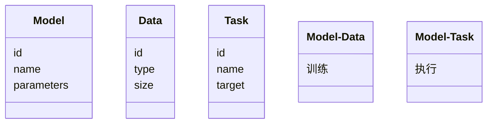

                 


# 选择适合企业的LLM大模型：考虑因素与决策框架

## 关键词：企业LLM大模型，选型决策框架，自然语言处理，人工智能系统，模型训练与部署

## 摘要：  
随着大语言模型（LLM，Large Language Model）在企业中的广泛应用，选择适合企业需求的LLM大模型成为一项关键任务。本文从背景、核心概念、算法原理、系统架构、项目实战等多个维度，全面分析企业在选择LLM大模型时需要考虑的因素，并提供系统的决策框架。通过对比分析和实际案例，帮助企业在技术选型中做出明智决策，最大化LLM大模型的应用价值。

---

# 第一部分：选择适合企业的LLM大模型背景与核心概念

## 第1章：选择适合企业的LLM大模型概述

### 1.1 问题背景与问题描述

#### 1.1.1 企业级AI应用的现状与挑战  
随着人工智能技术的快速发展，企业开始广泛采用AI技术来优化业务流程、提升用户体验和实现智能化决策。然而，企业在实际应用中面临以下挑战：  
1. **数据隐私与安全**：企业数据往往涉及商业机密，如何在模型训练中保护数据隐私是一个难题。  
2. **模型性能与成本**：大规模模型的训练和推理成本较高，企业需要在性能和成本之间找到平衡。  
3. **模型适用性**：不同行业和业务场景对模型的需求不同，通用模型可能无法满足特定场景的需求。  

#### 1.1.2 LLM大模型的崛起与应用潜力  
大语言模型（如GPT系列、BERT系列等）凭借其强大的自然语言处理能力，已经在多个领域展现出巨大的应用潜力。企业可以利用LLM大模型进行：  
1. **智能客服**：自动化处理客户咨询和问题解答。  
2. **文档分析**：自动抽取文档中的关键信息。  
3. **内容生成**：自动生成报告、营销文案等。  

#### 1.1.3 企业选择LLM大模型的核心问题  
企业在选择LLM大模型时需要回答以下核心问题：  
- **目标是什么？**：模型需要解决的具体问题是什么？  
- **数据是什么？**：企业有多少可用数据，数据的质量如何？  
- **预算是多少？**：企业的预算限制是什么？  
- **技术能力如何？**：企业是否有足够的技术能力进行模型训练和部署？  

### 1.2 问题解决与边界定义

#### 1.2.1 企业选择LLM大模型的目标与范围  
企业在选择LLM大模型时，需要明确目标和范围：  
1. **目标**：例如，提高客户满意度、降低人工成本等。  
2. **范围**：例如，仅用于客服系统，还是应用于多个业务部门。  

#### 1.2.2 解决方案的边界与外延  
解决方案的边界需要清晰定义：  
1. **边界**：例如，仅在内部网络中使用模型，不对外开放接口。  
2. **外延**：例如，后续可能扩展到多语言支持或更复杂的任务。  

#### 1.2.3 核心要素与关键成功因素  
选择LLM大模型的核心要素包括：  
1. **模型性能**：包括准确率、响应速度等。  
2. **数据质量**：包括数据的完整性和代表性。  
3. **技术能力**：包括企业的技术团队能力。  
4. **成本效益**：包括模型训练和部署的总成本。  

### 1.3 核心概念与架构

#### 1.3.1 LLM大模型的基本概念与定义  
大语言模型是一种基于深度学习的自然语言处理模型，通常使用Transformer架构，能够处理长文本序列，并通过大量的数据进行预训练。  

#### 1.3.2 核心概念的属性特征对比表  
以下是几种常见LLM大模型的对比表：  

| 模型名称 | 参数数量（亿） | 训练数据规模（TB） | 主要应用场景 | 开源 |
|----------|----------------|--------------------|--------------|------|
| GPT-3    | 175            | 530                | 文本生成     | 是   |
| BERT      | 110            | 330                | 文本理解     | 是   |
| Llama-2  | 70             | 190                | 文本生成     | 是   |
| PaLM      | 63             | 200                | 多语言处理   | 否   |

#### 1.3.3 实体关系图（ER图）架构  
以下是LLM大模型的核心实体关系图：  

```mermaid
er
    entity(模型) {
        id
        名称
        参数数量
    }
    entity(数据) {
        id
        类型
        数据量
    }
    entity(任务) {
        id
        名称
        目标
    }
    model - 数据: 训练
    model - 任务: 执行
```

---

## 第2章：LLM大模型的核心概念与联系

### 2.1 LLM大模型的基本原理

#### 2.1.1 大语言模型的训练与推理机制  
1. **训练**：模型通过监督学习或无监督学习方式，利用大规模数据进行预训练。  
2. **推理**：模型根据输入的文本，生成对应的输出结果。  

#### 2.1.2 模型的参数空间与表示能力  
模型的参数空间决定了其表示能力。参数越多，模型的表示能力越强，但训练和推理成本也越高。  

#### 2.1.3 模型的可解释性与不确定性  
模型的可解释性是企业在选择模型时需要考虑的重要因素，尤其是在需要透明性和责任追究的场景中。  

### 2.2 核心概念的属性特征对比

#### 2.2.1 模型规模对比（参数数量）  
以下是几种常见LLM大模型的参数数量对比：  

| 模型名称 | 参数数量（亿） |
|----------|----------------|
| GPT-3    | 175            |
| BERT      | 110            |
| Llama-2  | 70             |
| PaLM      | 63             |

#### 2.2.2 训练数据来源对比  
以下是几种常见LLM大模型的训练数据来源对比：  

| 模型名称 | 数据来源         |
|----------|------------------|
| GPT-3    | 英文文本         |
| BERT      | 多语言文本       |
| Llama-2  | 英文文本         |
| PaLM      | 多语言文本       |

#### 2.2.3 模型推理速度对比  
以下是几种常见LLM大模型的推理速度对比：  

| 模型名称 | 推理速度（tokens/秒） |
|----------|----------------------|
| GPT-3    | 100                  |
| BERT      | 50                   |
| Llama-2  | 150                  |
| PaLM      | 80                   |

### 2.3 实体关系图（ER图）架构

#### 2.3.1 模型、数据、任务的关系  
以下是模型、数据、任务的关系图：  

```mermaid
er
    entity(模型) {
        id
        名称
        参数数量
    }
    entity(数据) {
        id
        类型
        数据量
    }
    entity(任务) {
        id
        名称
        目标
    }
    model - 数据: 训练
    model - 任务: 执行
```

#### 2.3.2 企业需求与模型能力的匹配关系  
以下是企业需求与模型能力的匹配关系图：  

```mermaid
er
    entity(企业需求) {
        id
        名称
        目标
    }
    entity(模型能力) {
        id
        名称
        参数数量
    }
    企业需求 - 模型能力: 匹配
```

#### 2.3.3 模型性能与应用场景的关系  
以下是模型性能与应用场景的关系图：  

```mermaid
er
    entity(模型性能) {
        id
        名称
        参数数量
    }
    entity(应用场景) {
        id
        名称
        目标
    }
    模型性能 - 应用场景: 适应
```

---

## 第3章：LLM大模型的算法原理

### 3.1 大模型的训练流程

#### 3.1.1 正向传播流程  
正向传播流程如下：  

```mermaid
graph LR
    input -> embedding
    embedding -> attention
    attention -> feed-forward
    feed-forward -> output
```

#### 3.1.2 反向传播流程  
反向传播流程如下：  

```mermaid
graph LR
    loss -> gradient
    gradient -> optimizer
    optimizer -> update_parameters
```

#### 3.1.3 梯度计算与优化算法  
以下是梯度计算与优化算法的流程图：  

```mermaid
graph LR
    input -> forward
    forward -> loss
    loss -> backward
    backward -> gradient
    gradient -> optimizer
    optimizer -> update
```

### 3.2 模型推理流程

#### 3.2.1 输入处理流程  
输入处理流程如下：  

```mermaid
graph LR
    input -> tokenize
    tokenize -> embedding
    embedding -> attention
    attention -> feed-forward
    feed-forward -> output
```

#### 3.2.2 解码过程  
解码过程如下：  

```mermaid
graph LR
    input -> decode_step_1
    decode_step_1 -> decode_step_2
    decode_step_2 -> decode_step_3
    ... -> output
```

#### 3.2.3 输出结果生成  
输出结果生成流程如下：  

```mermaid
graph LR
    input -> generate_tokens
    generate_tokens -> output
```

### 3.3 数学模型与公式

#### 3.3.1 损失函数公式  
交叉熵损失函数的公式如下：  
$$\text{Loss} = -\sum_{i=1}^{n} y_i \log(p_i)$$  

#### 3.3.2 梯度下降算法  
梯度下降算法的公式如下：  
$$\theta = \theta - \eta \cdot \nabla_{\theta} \text{Loss}$$  

#### 3.3.3 解码过程中的概率计算公式  
解码过程中的概率计算公式如下：  
$$p(y|x) = \frac{\exp(s)}{\sum_{k} \exp(s_k)}$$  

---

## 第4章：系统分析与架构设计

### 4.1 问题场景介绍

#### 4.1.1 企业需求分析  
企业需求分析需要考虑以下因素：  
1. **业务目标**：例如，提高客户满意度。  
2. **数据资源**：例如，可用数据的规模和质量。  
3. **技术能力**：例如，是否有足够的技术团队支持模型部署。  

#### 4.1.2 场景描述与目标  
场景描述与目标需要明确：  
1. **场景**：例如，智能客服系统。  
2. **目标**：例如，提高客户咨询的响应速度。  

#### 4.1.3 系统功能设计  
系统功能设计需要包括：  
1. **输入处理**：例如，接收客户咨询。  
2. **模型推理**：例如，生成回复内容。  
3. **输出展示**：例如，展示回复内容。  

### 4.2 系统架构设计

#### 4.2.1 领域模型类图  
以下是领域模型类图：  



#### 4.2.2 系统架构设计图  
以下是系统架构设计图：  

```mermaid
graph LR
    Client --> API Gateway
    API Gateway --> Load Balancer
    Load Balancer --> Model Server
    Model Server --> Database
```

#### 4.2.3 系统接口设计  
系统接口设计需要包括：  
1. **输入接口**：例如，HTTP请求。  
2. **输出接口**：例如，HTTP响应。  

#### 4.2.4 系统交互设计  
系统交互设计需要包括：  
1. **客户咨询**：客户发送咨询请求。  
2. **模型推理**：系统调用模型生成回复。  
3. **结果展示**：系统展示回复内容。  

---

## 第5章：项目实战

### 5.1 环境安装

#### 5.1.1 安装Python  
安装Python的命令如下：  
```
python --version
```

#### 5.1.2 安装依赖  
安装依赖的命令如下：  
```
pip install -r requirements.txt
```

### 5.2 系统核心实现源代码

#### 5.2.1 模型训练代码  
以下是模型训练代码：  

```python
import torch
import torch.nn as nn

class Model(nn.Module):
    def __init__(self):
        super(Model, self).__init__()
        self.embedding = nn.Embedding(...)
        self.attention = nn.MultiheadAttention(...)
        self.feed_forward = nn.Sequential(...)

    def forward(self, x):
        x = self.embedding(x)
        x, _ = self.attention(x, x, x)
        x = self.feed_forward(x)
        return x

model = Model()
criterion = nn.CrossEntropyLoss()
optimizer = torch.optim.Adam(model.parameters(), lr=0.001)
```

#### 5.2.2 推理代码  
以下是推理代码：  

```python
def generate_response(prompt):
    with torch.no_grad():
        inputs = tokenize(prompt)
        outputs = model.generate(inputs)
        return decode(outputs)
```

### 5.3 代码应用解读与分析

#### 5.3.1 模型训练代码解读  
模型训练代码解读：  
1. **模型定义**：定义模型结构。  
2. **损失函数**：定义损失函数。  
3. **优化器**：定义优化器。  

#### 5.3.2 推理代码解读  
推理代码解读：  
1. **输入处理**：对输入文本进行分词。  
2. **模型推理**：生成回复内容。  
3. **结果输出**：返回生成的回复。  

### 5.4 实际案例分析与详细讲解剖析

#### 5.4.1 案例分析  
以下是案例分析：  
1. **场景**：智能客服系统。  
2. **输入**：客户咨询：“我的订单在哪里？”  
3. **输出**：系统生成回复：“您的订单号为12345，预计将在3-5个工作日送达。”  

#### 5.4.2 详细讲解剖析  
详细讲解剖析：  
1. **输入处理**：客户咨询经过分词处理。  
2. **模型推理**：模型生成回复内容。  
3. **结果展示**：系统展示回复内容。  

### 5.5 项目小结

#### 5.5.1 项目成果  
项目成果包括：  
1. **模型训练**：完成模型训练。  
2. **系统部署**：完成系统部署。  

#### 5.5.2 经验总结  
经验总结包括：  
1. **数据质量**：数据质量对模型性能影响重大。  
2. **模型调优**：模型调优可以显著提升性能。  

---

## 第6章：最佳实践与小结

### 6.1 最佳实践 tips

#### 6.1.1 数据隐私与安全  
数据隐私与安全是企业在选择LLM大模型时需要考虑的重要因素。  

#### 6.1.2 模型性能与成本平衡  
企业在选择模型时需要在性能和成本之间找到平衡。  

### 6.2 小结

#### 6.2.1 全文总结  
全文总结：选择适合企业的LLM大模型需要考虑多个因素，包括数据隐私与安全、模型性能与成本平衡等。  

#### 6.2.2 选型建议  
选型建议：企业在选择模型时需要根据自身需求和预算进行综合考虑。  

### 6.3 注意事项

#### 6.3.1 技术能力评估  
技术能力评估：企业在选择模型时需要评估自身的技术能力。  

#### 6.3.2 数据准备与处理  
数据准备与处理：企业在选择模型时需要充分准备和处理数据。  

### 6.4 拓展阅读

#### 6.4.1 相关技术领域  
相关技术领域包括：自然语言处理、深度学习等。  

#### 6.4.2 推荐书籍与资源  
推荐书籍与资源：  
1. 《深度学习》—— Ian Goodfellow  
2. 《自然语言处理入门》—— 李航  

---

## 作者：AI天才研究院/AI Genius Institute & 禅与计算机程序设计艺术/Zen And The Art of Computer Programming

