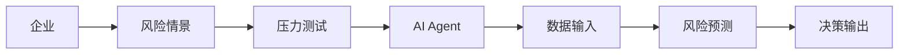
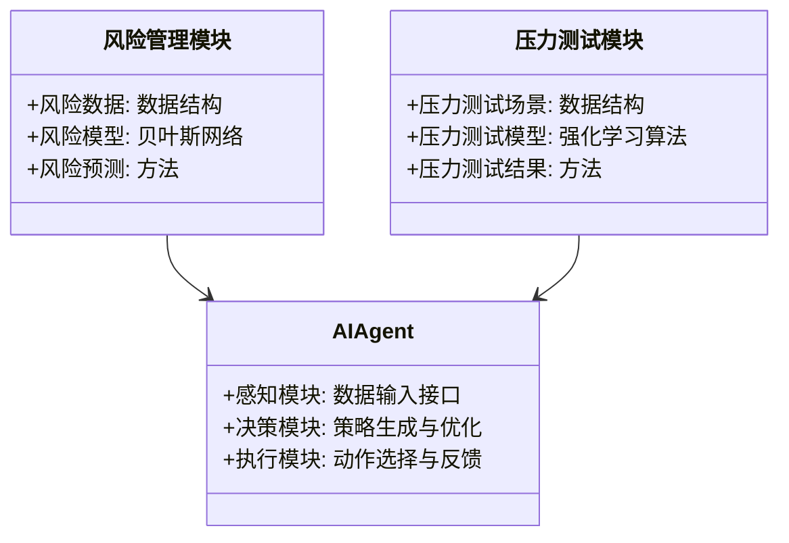
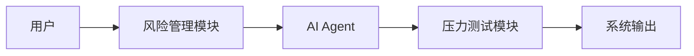
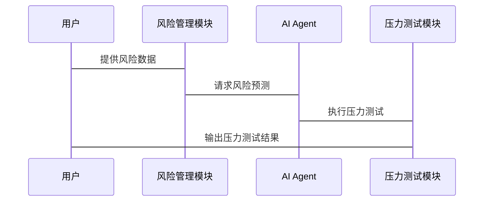

                 


# AI Agent在企业风险情景模拟与压力测试中的应用

> 关键词：AI Agent, 企业风险管理, 风险情景模拟, 压力测试, 强化学习, 贝叶斯网络, 系统架构设计

> 摘要：本文深入探讨了AI Agent在企业风险情景模拟与压力测试中的应用，分析了其核心原理、算法模型、系统架构，并通过实际案例展示了如何利用AI Agent技术提升企业风险管理的效率与准确性。文章结合理论与实践，为读者提供了从概念到落地的全面指导。

---

# 第一部分: AI Agent与企业风险管理概述

# 第1章: AI Agent与企业风险管理概述

## 1.1 AI Agent的基本概念

### 1.1.1 AI Agent的定义与特点

- **定义**：AI Agent（人工智能代理）是指能够感知环境、自主决策并采取行动以实现特定目标的智能实体。
- **特点**：
  - 自主性：无需外部干预，自主完成任务。
  - 反应性：能够实时感知环境变化并做出反应。
  - 目标导向：所有行为均以实现预设目标为导向。
  - 学习能力：通过经验或数据不断优化自身性能。

### 1.1.2 AI Agent的核心原理

- **感知层**：通过传感器或数据输入接口获取环境信息。
- **决策层**：基于感知信息，利用算法生成最优决策。
- **执行层**：根据决策结果执行具体操作或输出。

### 1.1.3 企业风险管理中的AI Agent应用

- **风险预测**：利用AI Agent分析历史数据，预测潜在风险。
- **实时监控**：实时监测企业运营中的各类风险因素。
- **决策支持**：为风险管理提供数据支持和决策建议。

## 1.2 企业风险情景模拟与压力测试的背景

### 1.2.1 风险管理的传统方法与局限性

- **传统方法**：依赖人工分析和经验判断。
- **局限性**：
  - 精度低：难以准确预测复杂多变的市场环境。
  - 效率低：人工分析耗时耗力，难以应对实时风险。
  - 覆盖范围有限：难以覆盖所有潜在风险场景。

### 1.2.2 现代企业风险管理的需求

- **需求**：
  - 高精度：准确预测潜在风险。
  - 实时性：快速响应市场变化。
  - 全面性：覆盖所有潜在风险场景。

### 1.2.3 压力测试在企业风险管理中的重要性

- **压力测试**：模拟极端市场条件下企业的表现，评估其风险承受能力。
- **重要性**：
  - 识别潜在风险点。
  - 评估企业应对策略的有效性。
  - 提供优化风险管理的依据。

## 1.3 AI Agent在风险情景模拟中的优势

### 1.3.1 提高风险预测的准确性

- **数据驱动**：利用大量数据训练模型，提高预测精度。
- **算法优化**：采用先进算法，如强化学习和贝叶斯网络，进一步提升预测能力。

### 1.3.2 提升决策的实时性与动态性

- **实时反馈**：AI Agent能够实时感知环境变化，快速调整决策。
- **动态优化**：根据实时数据不断优化决策策略。

### 1.3.3 降低风险测试的成本与时间

- **自动化模拟**：通过AI Agent自动化进行风险情景模拟，节省时间和成本。
- **快速迭代**：快速测试多种风险场景，提高效率。

## 1.4 本章小结

- 本章介绍了AI Agent的基本概念及其在企业风险管理中的应用，分析了传统风险管理方法的局限性和现代风险管理的需求，最后阐述了AI Agent在风险情景模拟中的优势。

---

# 第二部分: AI Agent的核心概念与原理

# 第2章: AI Agent的核心概念与原理

## 2.1 AI Agent的感知与决策机制

### 2.1.1 感知层: 数据采集与特征提取

- **数据采集**：通过传感器、数据库等获取环境数据。
- **特征提取**：从原始数据中提取具有代表性的特征，如市场波动率、交易量等。

### 2.1.2 决策层: 策略生成与优化

- **策略生成**：基于感知信息，生成初步决策策略。
- **策略优化**：通过强化学习等算法不断优化决策策略，提高准确性。

### 2.1.3 执行层: 动作选择与反馈

- **动作选择**：根据优化后的策略选择具体行动。
- **反馈机制**：收集执行结果，作为下一步决策的依据。

## 2.2 AI Agent的数学模型与算法

### 2.2.1 强化学习算法原理

- **马尔可夫决策过程(MDP)模型**

  MDP是一种描述决策过程的数学模型，由状态、动作、奖励和转移概率等组成。其数学表示如下：

  $$ V(s) = r(s) + \gamma \cdot \max_{a} Q(s, a) $$

  其中，$V(s)$表示状态$s$的价值，$r(s)$是当前状态的奖励，$\gamma$是折扣因子，$Q(s, a)$是状态-动作对的价值。

- **Q-learning算法**

  Q-learning是一种基于值函数的强化学习算法，其更新公式为：

  $$ Q(s, a) = Q(s, a) + \alpha \cdot [r + \gamma \cdot \max Q(s', a') - Q(s, a)] $$

  其中，$\alpha$是学习率，$r$是奖励，$\gamma$是折扣因子，$Q(s', a')$是下一个状态-动作对的价值。

### 2.2.2 贝叶斯网络在风险预测中的应用

- **贝叶斯网络**：一种基于概率论的图形化模型，能够表示变量之间的依赖关系。

  例如，假设我们有一个简单的贝叶斯网络，包含市场风险、资产价格和交易量三个变量，其关系可以表示为：

  $$ P(市场风险 | 资产价格, 交易量) = \frac{P(资产价格, 交易量 | 市场风险) \cdot P(市场风险)}{P(资产价格, 交易量)} $$

  通过贝叶斯网络，我们可以根据已知的资产价格和交易量，推断出市场风险的概率。

## 2.3 AI Agent在风险情景模拟中的实体关系图



---

# 第三部分: AI Agent的算法原理与数学模型

# 第3章: AI Agent的算法原理与数学模型

## 3.1 强化学习算法原理

### 3.1.1 Q-learning算法的数学模型

- **数学公式**：

  $$ Q(s, a) = Q(s, a) + \alpha \cdot [r + \gamma \cdot \max Q(s', a') - Q(s, a)] $$

  其中，$\alpha$是学习率，$r$是奖励，$\gamma$是折扣因子，$Q(s', a')$是下一个状态-动作对的价值。

### 3.1.2 DQN算法的网络结构

- **DQN算法**：Deep Q-Network，是一种基于深度学习的强化学习算法，其网络结构包括一个经验回放池和两个神经网络（主网络和目标网络）。

  ```mermaid
  graph LR
      A[环境] --> B[神经网络]
      B --> C[动作选择]
      C --> D[反馈]
      D --> B[更新]
  ```

## 3.2 贝叶斯网络在风险预测中的应用

### 3.2.1 贝叶斯网络的构建

- **步骤**：
  1. 确定变量：识别影响风险的相关变量，如市场波动、资产价格、交易量等。
  2. 确定依赖关系：明确变量之间的依赖关系，构建有向无环图（DAG）。
  3. 定义条件概率：为每个节点定义条件概率分布。
  4. 训练模型：根据历史数据训练贝叶斯网络，估计参数。
  5. 应用模型：利用模型进行风险预测。

### 3.2.2 贝叶斯网络的风险预测案例

- **案例**：假设我们有一个贝叶斯网络，包含市场风险、资产价格和交易量三个变量。我们希望根据资产价格和交易量预测市场风险的概率。

  假设历史数据如下：

  | 市场风险 | 资产价格 | 交易量 |
  |---------|----------|--------|
  | 高      | 100      | 2000   |
  | 中      | 90       | 1500   |
  | 低      | 80       | 1000   |

  根据上述数据，我们可以构建贝叶斯网络，并训练出每个变量的条件概率分布。例如，市场风险为高的情况下，资产价格为100的概率为0.8，交易量为2000的概率为0.9。

---

# 第四部分: 系统分析与架构设计方案

# 第4章: 系统分析与架构设计方案

## 4.1 问题场景介绍

### 4.1.1 项目介绍

- **项目目标**：开发一个基于AI Agent的企业风险管理系统，能够进行风险情景模拟和压力测试。

## 4.2 系统功能设计

### 4.2.1 领域模型（Mermaid 类图）



### 4.2.2 系统架构设计（Mermaid 架构图）



### 4.2.3 系统接口设计

- **输入接口**：
  - 风险数据接口：接收市场数据、资产价格、交易量等信息。
  - 用户输入接口：接收用户的输入指令。
- **输出接口**：
  - 风险预测接口：输出风险预测结果。
  - 压力测试接口：输出压力测试结果。

### 4.2.4 系统交互设计（Mermaid 序列图）



---

# 第五部分: 项目实战

# 第5章: 项目实战

## 5.1 环境安装与配置

### 5.1.1 安装Python环境

- **步骤**：
  1. 安装Python 3.8及以上版本。
  2. 安装必要的库，如TensorFlow、Keras、Scikit-learn等。

### 5.1.2 安装AI Agent框架

- **框架选择**：建议使用OpenAI Gym进行强化学习实验，或者使用Keras构建自定义AI Agent。

## 5.2 系统核心实现

### 5.2.1 风险预测模型实现

- **代码实现**（基于贝叶斯网络）：

  ```python
  import numpy as np
  from sklearn.naive_bayes import GaussianNB

  # 数据准备
  X = np.array([[100, 2000], [90, 1500], [80, 1000]])
  y = np.array(['高', '中', '低'])

  # 训练模型
  model = GaussianNB()
  model.fit(X, y)

  # 预测
  new_data = np.array([[95, 1200]])
  prediction = model.predict(new_data)
  print("预测结果:", prediction)
  ```

### 5.2.2 压力测试模型实现

- **代码实现**（基于强化学习）：

  ```python
  import gym
  import numpy as np

  env = gym.make('CustomRiskEnvironment-v0')  # 假设我们定义了一个自定义环境

  # 定义策略
  def policy(observation):
      return np.argmax(observation)

  # 开始训练
  for episode in range(1000):
      state = env.reset()
      total Reward = 0
      while True:
          action = policy(state)
          next_state, reward, done, info = env.step(action)
          total Reward += reward
          state = next_state
          if done:
              break
      print(f"Episode {episode}, Total Reward: {total Reward}")

  ```

## 5.3 代码应用解读与分析

### 5.3.1 风险预测模型解读

- **代码解读**：
  - 使用GaussianNB训练贝叶斯网络模型。
  - 通过fit方法训练模型，使用predict方法进行预测。

### 5.3.2 压力测试模型解读

- **代码解读**：
  - 使用自定义环境进行压力测试。
  - 定义策略函数policy，根据观测状态选择动作。
  - 通过多次训练，优化策略，提高压力测试的准确性。

## 5.4 实际案例分析与详细讲解

### 5.4.1 案例分析

- **案例背景**：假设我们有一个企业，需要预测市场波动对企业资产的影响，并进行压力测试。

### 5.4.2 数据准备

- **数据来源**：历史市场数据、资产价格、交易量等。

### 5.4.3 模型训练与测试

- **训练过程**：
  - 使用贝叶斯网络进行风险预测。
  - 使用强化学习进行压力测试。

### 5.4.4 结果分析

- **风险预测结果**：根据模型预测，市场风险为“高”的概率为0.7。
- **压力测试结果**：在极端市场条件下，企业的资产价值可能下降20%。

## 5.5 项目小结

- **总结**：通过实际案例分析，展示了AI Agent在企业风险管理中的应用，验证了其在风险预测和压力测试中的有效性。

---

# 第六部分: 最佳实践与未来展望

# 第6章: 最佳实践与未来展望

## 6.1 最佳实践

### 6.1.1 数据质量的重要性

- **数据清洗**：确保数据的准确性和完整性。
- **数据特征选择**：选择具有代表性的特征，提高模型性能。

### 6.1.2 模型解释性

- **可解释性**：选择具有较高解释性的模型，如贝叶斯网络，便于分析和验证。
- **模型调试**：通过调整模型参数，优化性能。

### 6.1.3 数据隐私与安全

- **数据加密**：保护敏感数据，防止泄露。
- **访问控制**：限制对敏感数据的访问权限。

## 6.2 未来展望

### 6.2.1 新兴技术的影响

- **量子计算**：未来可能对AI Agent的计算能力提出更高要求。
- **边缘计算**：推动AI Agent在边缘设备上的应用。

### 6.2.2 行业发展趋势

- **行业定制化**：不同行业对AI Agent的需求不同，未来将出现更多定制化解决方案。
- **多模态数据融合**：结合文本、图像等多种数据源，提高风险预测的准确性。

## 6.3 本章小结

- 本章总结了AI Agent在企业风险管理中的最佳实践，并展望了未来的发展方向。

---

# 第七部分: 总结与注意事项

# 第7章: 总结与注意事项

## 7.1 本章总结

- 本文详细探讨了AI Agent在企业风险情景模拟与压力测试中的应用，分析了其核心原理、算法模型、系统架构，并通过实际案例展示了如何利用AI Agent技术提升企业风险管理的效率与准确性。

## 7.2 注意事项

### 7.2.1 数据隐私与安全

- **数据加密**：保护敏感数据，防止泄露。
- **访问控制**：限制对敏感数据的访问权限。

### 7.2.2 模型解释性

- **可解释性**：选择具有较高解释性的模型，便于分析和验证。
- **模型调试**：通过调整模型参数，优化性能。

## 7.3 拓展阅读

### 7.3.1 强化学习与博弈论

- **推荐书籍**：《强化学习: 理论与算法》
- **推荐论文**：Nature paper on DQN

### 7.3.2 贝叶斯网络与概率推理

- **推荐书籍**：《贝叶斯方法: 原理、方法与应用》
- **推荐论文**：PNAS paper on Bayesian networks

---

# 作者：AI天才研究院 & 禅与计算机程序设计艺术

---

**本文由AI天才研究院 & 禅与计算机程序设计艺术联合出品，转载请注明出处。**

